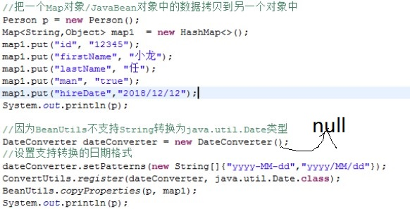
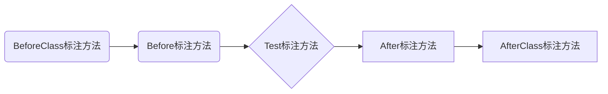
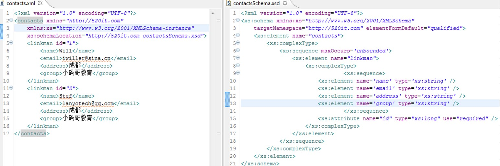
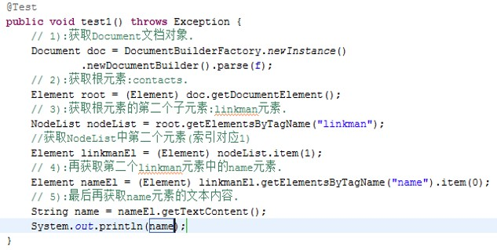
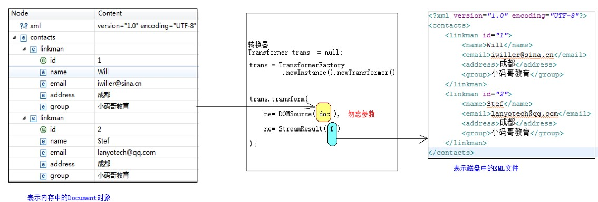
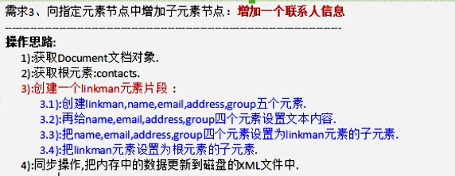
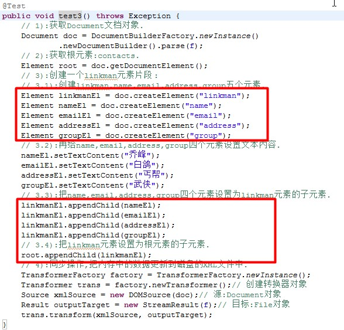
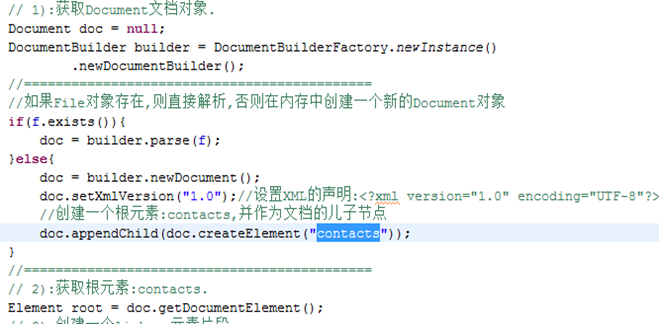

# 基础加强

## 反射和加载资源回顾

02、03

```java
public class MotherBoard {

	private static Properties p = new Properties();
	//存储安装的外设
	private static Map<String,USB> usb = new HashMap<>();
	
	static {
		try {
			ClassLoader loader = Thread.currentThread().getContextClassLoader();
			InputStream is = loader.getResourceAsStream("usb.properties");
			p.load(is);
			//初始化
			init();
		} catch (Exception e) {
			// TODO Auto-generated catch block
			e.printStackTrace();
		}
	}
	/**
	 * 创建usb.properties中配置的插件对象，并将其存储起来
	 * @throws Exception
	 */
	private static void init() throws Exception {
		Set<Object> keys = p.keySet();
		for (Object key : keys) {
			String name = (String)key;
			String className = p.getProperty(name);
			//反射创建对象，保证有公共无参构造器
			Object obj = Class.forName(className).newInstance();
			//判断当前对象是否实现了USB规范
			if (!(obj instanceof USB)) {
				throw new RuntimeException(name + "没有遵循USB规范");
			}
			usb.put(name, (USB)obj);
		}
	}
	
	//让主板上的USB外设工作
	public static void work() {
		for (USB u : usb.values()) {
			u.swapData();
		}
	}
}
```

```java
public interface USB {

	/**
	 * 交换数据
	 */
	public void swapData();
}
```

```java
public class App {
	public static void main(String[] args) {
		MotherBoard.work();
	}
}
```

```properties
mouse=aw.Mouse
keyboard=aw.Keyboard
```

## 内省机制(Introspector)

06

获取和操作JavaBean中的属性

操作JavaBean的属性

1. 获取属性相关信息，属性名，属性类型
2. 给属性设置数据，调用setter方法
3. 获取属性数据，调用getter方法

```java
public class User {
	private Long id;
	private String firstName;
	private String lastName;
	private boolean man;

	public void setId(Long id) {
		this.id = id;
	}

	public String getFirstName() {
		return firstName;
	}

	public void setFirstName(String firstName) {
		this.firstName = firstName;
	}

	public String getLastName() {
		return lastName;
	}

	public void setLastName(String lastName) {
		this.lastName = lastName;
	}

	public boolean isMan() {
		return isMan;
	}
}
/* 注意：去除了getId和setMan方法 */
```

```java
/* 核心 */
public class IntrospectorDemo {
	public static void main(String[] args) throws Exception {
		//获取字节码文件的JavaBean对象
		BeanInfo beanInfo = Introspector.getBeanInfo(User.class,Object.class);
		//返回JavaBean对象中所有属性的描述器
		PropertyDescriptor[] pds = beanInfo.getPropertyDescriptors();
		for (PropertyDescriptor pd : pds) {
			//属性的名称和类型
			System.out.println(pd.getName() + "," + pd.getPropertyType());
			Method setter = pd.getWriteMethod();
			Method getter = pd.getReadMethod();
			System.out.println("setter:" + setter);
			System.out.println("getter:" + getter);
			System.out.println("-------------------------------------------------------");
		}
	}
}
/*
firstName,class java.lang.String
setter:public void _02javabean.User.setFirstName(java.lang.String)
getter:public java.lang.String _02javabean.User.getFirstName()
----------------------------------------------------------------
id,class java.lang.Long
setter:public void _02javabean.User.setId(java.lang.Long)
getter:null
----------------------------------------------------------------
lastName,class java.lang.String
setter:public void _02javabean.User.setLastName(java.lang.String)
getter:public java.lang.String _02javabean.User.getLastName()
----------------------------------------------------------------
man,boolean
setter:null
getter:public boolean _02javabean.User.isMan()
----------------------------------------------------------------
*/
```

## JavaBean和Map相互转换

07

```java
public class BeanUtil {
	/**
	 * 把JavaBean转换成Map对象
	 * @param bean
	 * @return
	 * @throws Exception 
	 */
	public static Map<String,Object> bean2map(Object bean) throws Exception {
		Map<String,Object> map = new HashMap<>();
		BeanInfo beanInfo = Introspector.getBeanInfo(bean.getClass(),Object.class);
		PropertyDescriptor[] pds = beanInfo.getPropertyDescriptors();
		for (PropertyDescriptor pd : pds) {
			String propertyName = pd.getName();//属性名
			Object propertyValue = pd.getReadMethod().invoke(bean);//调用get方法
			map.put(propertyName, propertyValue);
		}
		return map;
	}
	
	/**
	 * 把Map对象转换成JavaBean
	 * @param beanMap
	 * @param beanType
	 * @return
	 * @throws Exception 
	 */
	public static <T> T map2bean(Map<String,Object> beanMap,Class<T> beanType) throws Exception {
		T t = beanType.newInstance();
		BeanInfo beanInfo = Introspector.getBeanInfo(beanType,Object.class);
		PropertyDescriptor[] pds = beanInfo.getPropertyDescriptors();
		for (PropertyDescriptor pd : pds) {
			String propertyName = pd.getName();//属性名
			Object propertyValue = beanMap.get(propertyName);//属性值
			//调用set方法
			pd.getWriteMethod().invoke(t,propertyValue);
		}
		return t;
	}
	/* 测试 */
	public static void main(String[] args) throws Exception {
		Person p = new Person(12L,"aw",true);
		Map<String, Object> map = bean2map(p);
		System.out.println(map);
		
		Person p2 = map2bean(map,Person.class);
		System.out.println(p2);
	}
}
/*
{name=aw, id=12, man=true}
Person [id=12, name=aw, man=true]
*/
```

## Apache组织的commons项目下的常用组件

07、08

commons-beanutils提供了操作JavaBean的很多工具类

把一个Map对象/JavaBean对象中的数据拷贝到另一个对象中

```java
BeanUtils.copyProperties(dest,orig);//dest目标对象，orig原对象
```

```java
BeanUtils.copyProperty(Object bean,String name,Object value);
```

获取指定对象中指定属性值

```java
BeanUtils.getProperty(Object bean,String name);
```

ConverterUtils能将数据在字符串和指定类型的实例之间进行转换

日期格式转换



```java
ConvertUtils.rigister(DateConverter dateConverter,Class clazz)
```

## Java中的元数据 Annotation(注解)

09

注解、标签、Annotation

所有的Annotation都是<font color=blue>java.lang.annotation.Annotation接口的子接口</font>。

**使用注解需要注意：必须有三方参与才有意义**

* 注解标签
* 被贴的程序元素
* 由第三方的程序(使用反射的手段)来赋予注解特殊的功能

## JDK自带的注解

10

Java5提供

|                   |               功能               |
| :---------------: | :------------------------------: |
|     @Override     |         限定覆写父类方法         |
|    @Deprecated    |            标记已过时            |
| @SuppressWarnings | 抑制编译器的警告(自欺欺人的做法) |

Java7提供

|              |                             功能                             |
| :----------: | :----------------------------------------------------------: |
| @safeVarargs | 抑制<font color=blue>堆污染</font>警告(方法使用可变参数和泛型参数，可能导致堆污染) |

## JDK中的四大元注解

11

描述注解的注解

* @Retention

	> 描述注解可以保存到哪个代码时期
	>
	> 源文件时期 -编译-> 字节码时期 -运行-> 运行时期(JVM)
	>
	> | RetentionPolicy枚举 |                   描述                    |
	> | :-----------------: | :---------------------------------------: |
	> |  CLASS(默认，缺省)  | 存在于源文件和字节码文件中，进入JVM中消失 |
	> |       RUNTIME       |      存在于源文件、字节码文件和JVM中      |
	> |       SOURCE        |        存在于源文件中，编译后消失         |

* @Target

	> 描述注解可以贴在哪些位置
	>
	> 位置常量封装在<font color=red>ElementType</font>中
	>
	> 常用位置常量
	>
	> * FIELD 				允许修饰字段
	> * METHOD           允许修饰方法
	> * PARAMETER    允许修饰参数
	> * TYPE                  允许修饰类、接口、枚举

* @Documented

	> 使用此注解标注的注解会保存到API文档中

* @Inherited

	> 使用此注解标注的注解可以被子类继承

## 注解的定义和使用

12

### 定义注解

使用`@Interface`

`@Retention`设置注解存在时期、`@Target`设置注解贴在哪些元素上

在注解中合法的属性类型

* 基本数据类型
* String
* Class
* annotation
* 枚举
* 以上类型的数组

```java
@Target({ ElementType.TYPE, ElementType.FIELD })
@Retention(RetentionPolicy.RUNTIME)
public @interface VIP {
	/* 抽象方法 */
	String value();

	int age() default 18;

	String[] favs() default { "java", "python", "go" };
}
```

```java
@VIP(value = "A", age = 15, favs = { "java", "aw" })
class Employee {

}

public class VIPDemo {
	public static void main(String[] args) {
		// 获取Employee类上的所有注解
		Annotation[] as = Employee.class.getAnnotations();
		System.out.println(as.length);

		// 获取Employee类上的VIP注解
		if (Employee.class.isAnnotationPresent(VIP.class)) {
			VIP vip = Employee.class.getAnnotation(VIP.class);
			String value = vip.value();
			int age = vip.age();
			String[] favs = vip.favs();
			System.out.println(value + ":" + age);
			for (String fav : favs) {
				System.out.println(fav);
			}
		} else {
			System.out.println(false);
		}
	}
}
/*
1
A:15
java
aw
*/
```

## 模拟Junit4功能

13

### Junit4

存在Before、Test、After标注

**执行特点**

   @BeforeClass标签:在所有的Before方法之前执行,只在最初执行一次. 只能修饰静态方法

   @AfterClass标签:在所有的After方法之后执行,只在最后执行一次.  只能修饰静态方法



```java
/**
 * EmployeeDao的测试类
 * 
 * @author aw
 */
public class EmployeeDaoTest {
	@MyBefore
	public void init() throws Exception {
		System.out.println("init...");
	}
	
	@MyAfter
	public void destroy() throws Exception {
		System.out.println("destroy...");
	}
	
	/* 测试保存 */
	@MyTest
	public void testSave() throws Exception {
		System.out.println("save...");
	}
	
	/* 测试删除 */
	@MyTest
	public void testDelete() throws Exception {
		System.out.println("delete...");
	}
	
	/* 测试更新 */
	@MyTest
	public void testUpdate() throws Exception {
		System.out.println("update...");
	}

}
```

```java
/**
 * 赋予@MyBefore,@MyTest,@MyAfter功能
 * @author aw
 */
public class JunitMock {

	/*
	 * 1>先找到测试类的字节码EmployeeDaoTest
	 * 2>获取EmployeeDaoTest类中所有的公共方法
	 * 3>迭代出每一个Method对象
	 * 4>边迭代边判断，哪一些方法使用了@Before/@Test/@After标签
	 * 	beforeList	储存使用了@Before标签的方法对象
	 * 	testList	储存使用了@Test标签的方法对象
	 * 	afterList	储存使用了@After标签的方法对象
	 * 5>控制方法执行的流程
	 * 		执行beforeList中的方法
	 * 6>迭代出testList集合中的每一个方法对象并执行
	 * 		执行afterList中的方法
	 */
	public static void main(String[] args) throws Exception {
		// 1>先找到测试类的字节码EmployeeDaoTest
		Class clazz = EmployeeDaoTest.class;

		Object obj = clazz.newInstance();
		// 2>获取EmployeeDaoTest类中所有的公共方法
		Method[] ms = clazz.getMethods();
		// 3>迭代出每一个Method对象
		// 4>边迭代边判断，哪一些方法使用了@Before/@Test/@After标签
		List<Method> beforeList = new ArrayList<>();
		List<Method> testList = new ArrayList<>();
		List<Method> afterList = new ArrayList<>();
		for (Method m : ms) {
			if (m.isAnnotationPresent(MyBefore.class))
				beforeList.add(m);
			else if (m.isAnnotationPresent(MyTest.class))
				testList.add(m);
			else if (m.isAnnotationPresent(MyAfter.class))
				afterList.add(m);
		}
		// 5>控制方法执行的流程
		for (Method tm : testList) {
			for (Method bm : beforeList) {
				// 执行beforeList中的方法
				bm.invoke(obj);
			}
			// 6>迭代出testList集合中的每一个方法对象并执行
			tm.invoke(obj);
			for (Method am : afterList) {
				// 执行afterList中的方法
				am.invoke(obj);
			}
		}
	}
}
```

## XML文件、约束

05、06

之前使用的**properties**文件，为什么得使用XML文件？

> properties格式文件,结构很简单,只能表示key=value的结构形式.
>
> 比如:我现在想表示:中国所有的省份,每个省份所有的城市,如何表示?

### XML有两个编码：要保证两个编码相同,都为UTF-8

内容编码

文件本身的编码

### XML的约束文件

* dtd格式

	> 

* schema格式

	> 

 约束文件的结构约束某一个属性值的类型以及取值范围等

## 获取Document对象

08

1. 创建DocumentBuilderFactory对象

	```java
	DocumentBuilderFactory dbs = DocumentBuilderFactory.newInstance();
	```

2. 通过DocumentBuilderFactory创建DocumentBuilder对象

	```java
	DocumentBuilder db = dbs.newDocumentBuilder();
	```

3. 通过DocumentBuilder创建Document对象

	```java
	Document d = db.parse(new File("aw.xml"));
	```

	`Document d2 = db.newDocument();`在内存中创建新的Document对象，和XML文件无关联，<font color=red>同步</font>操作的时候会用到此方法

```java
Document d = DocumentBuilderFactory.newInstance().newDocumentBuilder().parse(new File("aw.xml"));
```

## DOM操作 获取第二个联系人名称

09



## DOM操作 修改第一个联系人的邮箱

10


```java
File f = new File("aw.xml");
TransformerFactory.newInstance().newTransformer()
    .transform(new DOMSource(docInmemory), new StreamResult(f));
```



## DOM操作 保存一个联系人

11





## DOM操作 设置和获取属性

12


## DOM操作 在内存中创建Document对象

14


