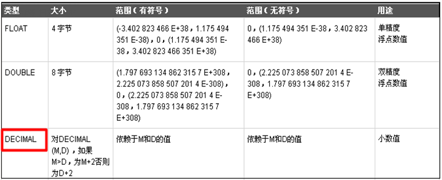
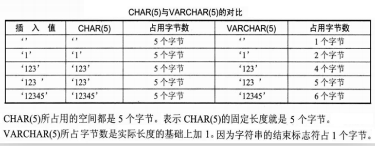

# MySQL

## MySQL概述

01

1. **层次数据库和网状数据库技术阶段**

	使用指针来表示数据之间的联系

2. **关系数据库技术阶段**

	经典的里程碑阶段

	代表DBMS:Oracle、DB2、**MySQL**、SQL Server、SyBase等

3. **后关系数据库技术阶段**

	关系型数据库存在数据模型，性能，拓展伸缩性的缺点，出现了：

	ORDBMS：面向对象数据库技术

	NoSQL ：结构化数据库技术

常见的NoSQL数据库

|                |                                 |
| :------------: | :-----------------------------: |
| 键值存储数据库 |   Oracle、BDB、Redis、BeansDB   |
|  列存储数据库  |     HBase、Cassandra、Riak      |
|  文档型数据库  |        MongoDB、CouchDB         |
|   图形数据库   | Neo4J、InfoGrid、Infinite Graph |

## MySQL安装和配置

03

**存储引擎**

* InnoDB: 支持事务,支持外键,但是性能相对较低

* MyISAM: 不支持事务,不支持外键,但是性能相对较高

## 数据库操作和存储引擎

05

数据库分两种：

1. **系统数据库（系统自带的数据库）**：不能修改

	* information_schema:存储数据库对象信息，如：用户表信息，列信息，权限，字符，分区等信息。

	* performance_schema:存储数据库服务器性能参数信息。

	* mysql:存储数据库用户权限信息。

	* test:任何用户都可以使用的测试数据库。

2. 用户数据库（用户自定义的数据库）：一般的，一个项目一个用户数据库。

## MySQL列常用类型

06

**常用整数类型**

- INT/INTEGER

- BIGINT


**常用小数类型**

* FLOAT[(s,p)]

* DOUBLE[(s,p)] 

小数类型，可存放实型和整型 ,精度(p)和范围(s)



**常用字符类型**

* char(size)  定长字符，0 - 255字节，size指N个字符数，若插入字符数超过设定长度，会被截取并警告。

* varchar(size)  变长字符，0 - 255字节，从MySQL5开始支持65535个字节，若插入字符数超过设定长度，会被截取并警告。

在MySQL中，字符使用<font color=red>单引号</font>引起来。 相当于Java中字符串(String,StringBuilder/StringBuffer);  



**日期类型**

日期和时间类型为DATETIME、DATE、TIMESTAMP、TIME和YEAR。

注意:在MySQL中，日期时间值使用单引号引起来。 相当于Java中Date，Calender。

## 简单查询

09、10

**设置列名的别名**

1. 改变列的标题头

2. 用于表示计算结果的含义

3. 作为列的别名

4. 如果别名中使用特殊字符，或者是强制大小写敏感，或有空格时，都需加单引号

<font color=red>不建议列的别名使用单引号,因为一旦使用,该列就不能再排序了</font>

AS**可以省略**

## 分页查询

14

**假分页**/逻辑分页/内存分页

> 一次性查询出所有的数据,存放在内存中(List集合),每次翻页的时候,都从内存中取出指定的条数.
>
> 特点:翻页比较快,如果数据量过大,可能造成内存溢出.

**真分页**/物理分页/数据库分页(推荐)

> 每次翻页都从数据库中截取指定的条数,假设每页10条数据,第一页:查询0~9条数据,第二页:查询10~19条数据.
>
> 特点:翻页比较慢,不会造成内存溢出.

## 外键约束

17

一般的,我们在定义外键的时候,习惯这样来起名:

> 引用表名(缩写)_引用列名.
>
> product /productdir表的外键列:dir_id

在开发中,我们有时候为了提高性能会故意删除外键约束,此时我们可以通过Java代码来控制数据的合理性.

## 增删改操作

19

**插入多条数据记录**（MySQL特有）

```mysql
INSERT INTO productdir (dirName,parent_id) VALUES('办公鼠标1',1),('办公鼠标2',1),('办公鼠标2',1);
```

