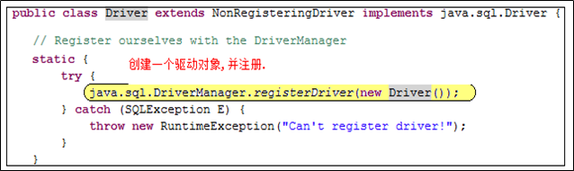
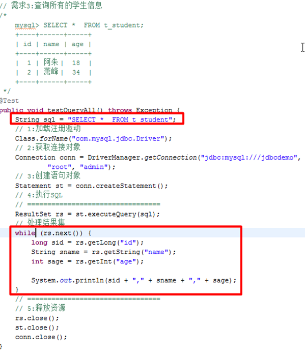
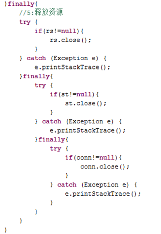
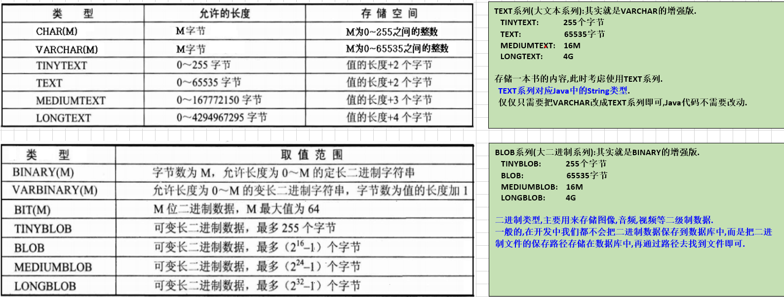
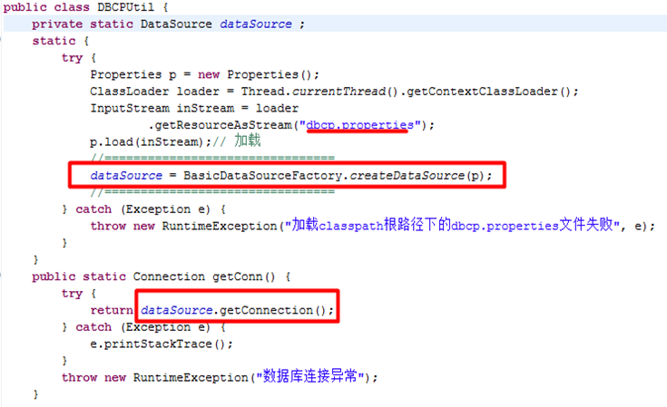

# JDBC

## JDBC概述

01

持久化(persistence)

JPA:JavaEE的规范，Java persistence api

JDBC:Java DataBase Connectivity

> Java.util包

## 获取数据库连接对象

02

1. 加载注册驱动

	```java
	Class.forName("com.mysql.jdbc.Driver");
	/*
	1):把com.mysql.jdbc.Driver这份字节码文件加载进JVM.
	2):把字节码加载进JVM之后,就会立刻执行该类的静态代码块.
	   源代码如下
	*/
	```

	

2. 获取连接对象，通过DriverManager的静态方法(getConnection)

	```java
	Connection conn = DriverManager.getConnection(String url,String username,String password);
	```

<font color=red>从Java6(JDBC4.0)开始,可以不再加载注册驱动</font>，直接通过DriverManager获取连接对象

> 为啥不再需要加载注册驱动了
>
> 从Java6开始,规范要求每一个JDBC驱动的包,都必须带有META-INF/services/java.sql.Driver文件
>
> 开发建议:<font color=blue>依然还是建议手动的加载注册驱动. 如此,可以兼容之前的JDK版本,在JavaWeb中必须手动加载</font>

## 创建表操作

03

### Connection接口的常用方法

`Statement createStatement() `创建一个 Statement 对象来将 SQL 语句发送到数据库

`PreparedStatement prepareStatement(String sql)` :获取预编译语句对象

  参数:sql,并不是一个静态SQL,而是带有占位符的SQL(**?**)

### Statement接口的常用方法

用于执行**静态 SQL** (**写死的SQL**,可以执行运行的*SQL)语句并返回它所生成结果的对象 

`int executeUpdate(String sql)`:可以执行DML(增删改)和DDL语句,如果是执行DDL什么都不返回,执行DML返回受影响的行数

`ResultSet executeQuery(String sql)` :执行给定的 DQL语句，该语句执行之后返回一个 ResultSet 对象

## DQL操作 查询多条语句

07



## DAO的思想和设计分析

09

什么是DAO

> 主要就包括CRUD(增删改查操作)
> 
> DAO(Data Access Object)是一个数据访问接口，数据访问：顾名思义就是与数据库打交道。夹在业务逻辑与数据库资源中间

## DAO的get和list方法

12



## Jdbc代码重构 - 抽取出JdbcUtil类

16

在静态代码块中去加载和注册数据库驱动，只会执行一次

Connection对象需要保证线程安全，所以不能放在静态代码块中


在JdbcUtil类中提供close方法用于关闭三个资源对象


## Jdbc代码重构 - 抽取出db.properties文件

17

把数据库的连接信息存放到属性文件中(db.properties)

```properties
#key=value
driverClassName=com.mysql.jdbc.Driver
url=jdbc:mysql://localhost:3306/jdbcDemo
username=root
password=admin
```

JdbcUtil对应代码更改，反射机制


## PreparedStatement基本使用

18

### Statement和PreparedStatement的区别
PreparedStatement 的优点

1. PreparedStatement 代码的可读性和可维护性(SQL模板,使用占位符表示参数)

	> 设置占位符参数(告诉SQL中的?到底表示哪一个值):
	> `void  setXxx(int parameterIndex, Xxx value)`
	>
	> xxx														数据类型,比如:String,int,Long等.
	> parameterIndex								设置第几个占位符?(从1开始).
	> value													需要设置的参数值.

2. PreparedStatement 能最大可能提高性能(预编译),MySQL不支持PreparedStatement的性能优化

3. PreparedStatement 能保证安全性

可以防止SQL注入:演示登陆操作
选择:使用PreparedStatement

## JDBC的事务管理

22

1. 默认情况下,在JDBC中执行DML操作就会自动提交事务,此时我们得设置事务的手动提交机制(取消事务的自动提交)
2. 查询操作,不涉及数据的更改,所以不需要事务

3. MySQL中InnoDB存储引擎支持事务,MyISAM不支持

操作事务的模板:

```java
try{
	//取消事务自动提交:
	Connection对象.setAutoCommit(false);
	操作1
	操作2
	操作3     
	//提交事务
	Connection对象.commit();
} catch(Exception e) {
	//处理异常
	//回滚事务
	Connection对象.rollback();
} finally {
	//释放资源
}
```

## JDBC的批量操作

23

JDBC的批量处理语句包括下面两个方法

> `addBatch(String sql)`	添加需要批量处理的SQL语句
>
> `addBatch()`	用于PreparedStatement添加需要批量处理的SQL语句
>
> `executeBatch()`	执行批量处理
>
> `clearParameters()`	用于PreparedStatement清除占位符参数
>
> `clearBatch()`	清除批处理

**MySQL服务器既不支持PreparedStatement的性能优化,也不支持JDBC中的批量操作**.
但是,在<font color=red>新的JDBC驱动</font>中,我们可以通过设置参数`rewriteBatchedStatements=true`来优化.

```properties
url=jdbc:mysql://localhost:3306/jdbcdemo?rewriteBatchedStatements=true
```

## BLOB和TEXT类型处理

24



## 为什么需要获取自动生成的主键

25

### 如何在JDBC中保存数据的时候获取自动生成的主键呢

**Statement**

`int executeUpdate(String sql,int autoGeneratedKeys)`

> 参数:autoGeneratedKeys,是否需要返回自动生成的主键
>
> 常量值:`Statement.RETURN_GENERATED_KEYS`
>
> `ResultSet getGeneratedKeys()`:获取自动生成的主键

**PreparedStatement**

`PreparedStatement prepareStatement(String sql, int autoGeneratedKeys)`

> 创建PreparedStatement对象,并指定是否需要返回生成的主键
>
> 参数的常量值:Statement.RETURN_GENERATED_KEYS

<font color=blue>Hibernate中可以自动返回</font>

## 连接池概述

29

### 连接池概述
在Java中,连接池使用javax.sql.DataSource接口来表示连接池/数据源

> DataSource和JDBC一样仅仅只是一个接口,由各大服务器厂商来实现(Tomcat,JBoss等)

### 常用的DataSource的实现

* C3P0:  Hibernate推荐的,但是该连接池在07年之后就不再更新了,不建议使用:性能太太差了
* DBCP:  Apache组织的项目,Spring推荐的.  真心不错
* Druid:  阿里巴巴的项目(德鲁伊),世界上最好连接池

DataSource(数据源)和连接池(Connection Pool)是同一个

### 使用连接池和不使用连接池的区别在哪里?
如何获取连接对象

> 没有连接池: 通过DriverManager来获取,直接和DBMS连接.
> 存在连接池:  直接通过连接池来获取连接对象.
> 						`Connection conn = DataSource对象.getConnection();`

释放连接对象:

> 没有连接池: conn.close():和数据库服务器(DBMS)断开连接.
> 存在连接池: conn.close():把Connection对象归还给连接池,并没有和DBMS断开.

## DBCP的基本使用

30

DBCP连接池:
---------------------------------------------------
环境准备

* commons-dbcp.jar

* commons-pool.jar

参考文档

* \commons-dbcp-1.3-src\doc\BasicDataSourceExample.java



## Druid连接池使用

32

Druid连接池(德鲁伊),阿里巴巴的连接池,号称世界上最好的连接池.
https://github.com/alibaba/druid/wiki
Java语言领域性能最好的数据库连接池
类似于DBCP连接池.

准备环境

* druid-1.0.15.jar

Druid和DBCP的连接属性是完全相同的,创建连接池的对象不同.


## JdbcTemplate的DML(增删改)操作模板

33

```java
public static int update(String sql,Object... args) {
    Conncetion conn = null;
    PreparedStatement ps = null;
    try {
        conn = getCon();
        ps = conn.prepareStatement(sql);
        //设置占位符参数
        if (args.length > 0) {
            for (int i = 0; i < args.length; i++)
                ps.setObject(i + 1, args[i]);
        }
        ps.executeUpdate();
    } catch (SQLException e) {
        e.printStackTrace();
    } finally {
        close(conn,ps,null);
    }
}
```

### execute()和executeUpdate()

相同点

* 都可以执行增删改操作

不同点

* execute()可以执行查询，executeUpdate()不可以

* execute()返回boolean类型

	* true	执行的是查询
	* false   执行的是增删改

	executeUpdate()返回int类型，表示多少数据受到了影响

## JdbcTemplate的DQL(查询)操作模板

37

内省机制

**必须要制定的规范**

1. <font color=red>保证表中的列名和JavaBean中的属性相同</font>

2. 保证表中的列的类型 和 JavaBean中属性的类型要对应

	VARCHAR--->String/DECIMAL--->BigDecimal

结果集处理接口

```java
/* 指定结果集处理器的规范 */
public interface ResultSetHandler<T> {
    /* 处理结果集 */
    public T handle(ResultSet rs) throws Exception;
}
```

单个查询结果集处理

```java
public class BeanHandler<T> implements ResultSetHandler<T> {
    /* T实体的JavaBean对象类型 */
    private Class<T> classType;
    
    public BeanHandler(Class<T> classType) {
        this.classType = classType;
    }
    
    @Override
    public T handle(ResultSet rs) {
        if (rs.next()) {
            //创建T实例
            T t = classType.newInstance();           
			//获取字节码文件的JavaBean对象
			BeanInfo beanInfo = Introspector.getBeanInfo(classType,Object.class);
			//返回JavaBean对象中所有属性的描述器
			PropertyDescriptor[] pds = beanInfo.getPropertyDescriptors();
			for (PropertyDescriptor pd : pds) {
                String propName = pd.getName();//属性名称
                //调用set方法，设置t实例的属性
                pd.getWriteMethod().invoke(t,rs.getObject(propName));
            }
            return t;
        }
        return null;
    }
}
```

List查询结果集处理

```java
public class BeanListHandler<T> implements ResultSetHandler<List<T>> {
    /* T实体的JavaBean对象类型 */
    private Class<T> classType;
    
    public BeanHandler(Class<T> classType) {
        this.classType = classType;
    }
    
    @Override
    public List<T> handle(ResultSet rs) {
        List<T> list = new ArrayList<>();
        while (rs.next()) {
            //创建T实例
            T t = classType.newInstance();           
			//获取字节码文件的JavaBean对象
			BeanInfo beanInfo = Introspector.getBeanInfo(classType,Object.class);
			//返回JavaBean对象中所有属性的描述器
			PropertyDescriptor[] pds = beanInfo.getPropertyDescriptors();
			for (PropertyDescriptor pd : pds) {
                String propName = pd.getName();//属性名称
                //调用set方法，设置t实例的属性
                pd.getWriteMethod().invoke(t,rs.getObject(propName));
            }
            list.add(t);
        }
        return list;
    }
}
```

主查询

```java
public static <T> T query(String sql,ResultSetHandler<T> h,Object... args) {
    Conncetion conn = null;
    PreparedStatement ps = null;
    ResultSet rs = null;
    try {
        conn = getCon();
        ps = conn.prepareStatement(sql);
        //设置占位符参数
        if (args.length > 0) {
            for (int i = 0; i < args.length; i++)
                ps.setObject(i + 1, args[i]);
        }
        rs = ps.executeQuery();
        return h.handle(rs);
    } catch (SQLException e) {
        e.printStackTrace();
    } finally {
        close(conn,ps,null);
    }
    return null;
}
```

