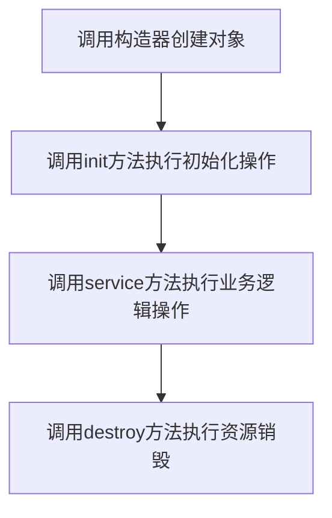
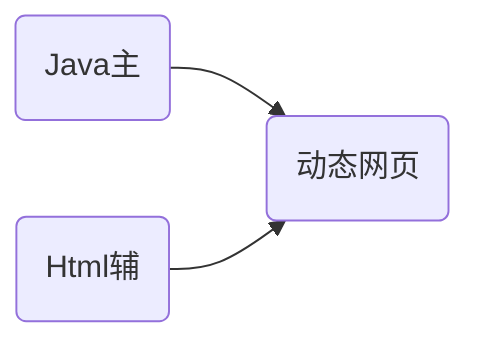
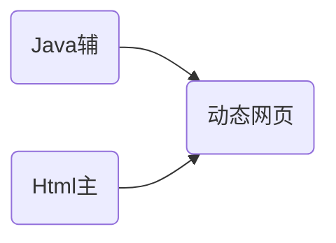
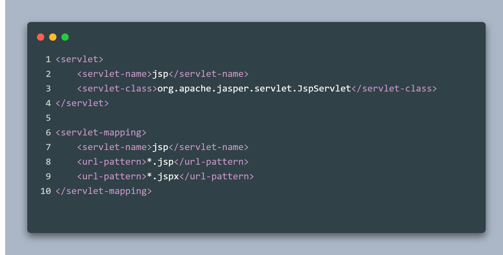
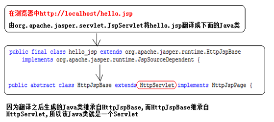
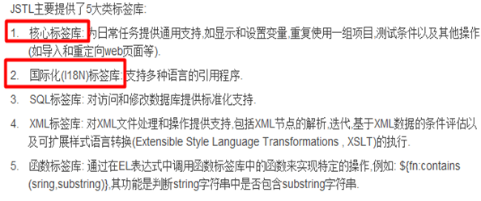
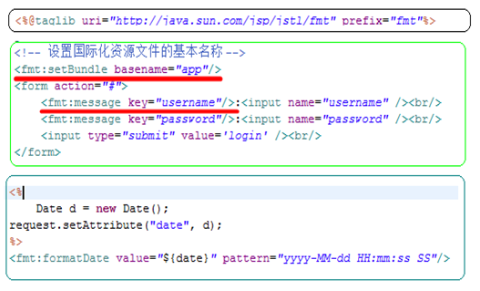
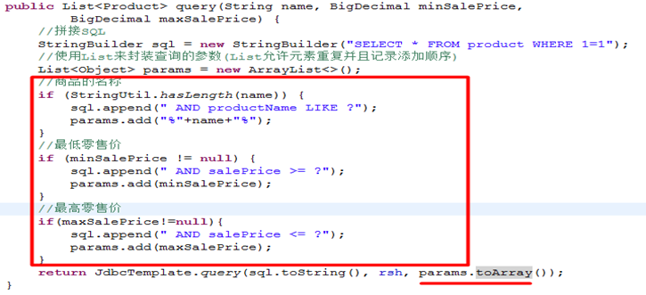
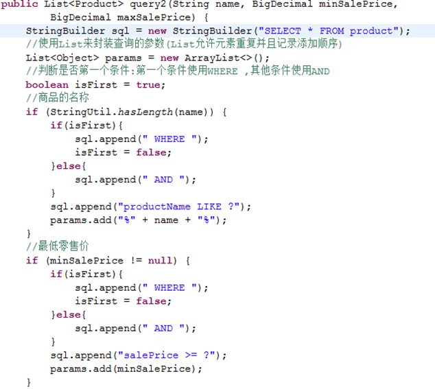
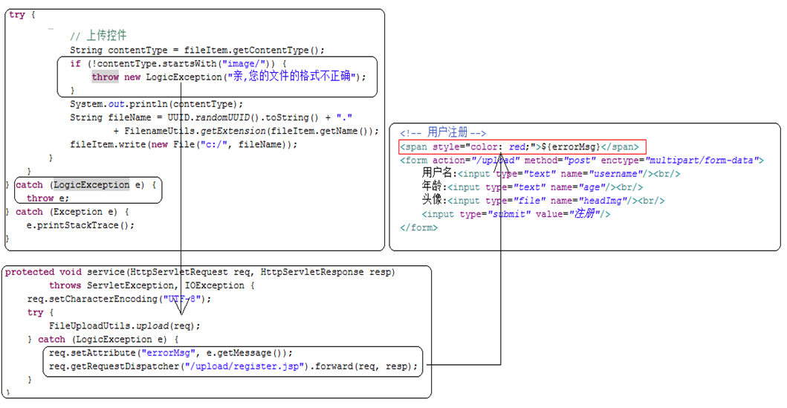

# JavaWeb

## Tomcat服务器的安装

01_04

### Tomcat根下的目录

* bin:存放了启动/关闭Tomcat的等工具

* conf:存放了Tomcat软件的一些配置文件

* lib:存放了Tomcat软件启动运行的依赖jar文件

* logs:存放Tomcat日志记录(成功,失败)

* temp:临时目录,比如把上传的大文件存放于临时目录

* webapps:里面存放需要部署的javaweb项目

* work:工作目录,存放了jsp翻译成Servlet的java文件以及字节码文件

## 项目部署

01_10

* 直接把应用的根目录,拷贝到Tomcat根/webapps下
  > 这是MyEclipse默认的部署方式
  >
  > 缺点:该目录下的应用将会越来越多,启动Tomcat就变慢了.若其中有一个应用有问题,Tomcat就会启动失败.
  
* 从Tomcat5.5开始推荐使用另外的一种方式来部署项目
  找到Tomcat根/conf/server.xml
  底部Host标签加入
  
  ```java
   <Context docBase="D:/JavaPros/项目名称/webapp"/ path="/path">
  ```
  
  docBase	项目文件地址
  
  path			Tomcat访问地址

## Servlet的生命周期方法

02_03

### 生命周期方法

* `void init(ServletConfig config)`  :初始化当前的Servlet对象,在第一次请求的时候执行

* `void service(ServletRequest req, ServletResponse res)`  :服务方法,在每次请求的时候执行,处理请求的操作都在该方法中处理

* `void destroy()`  :资源销毁方法,在服务器正常关闭的时候执行,就是说该不一定会执行,所以通常不将关闭资源的操作放在该方法中

### 执行顺序




1. 构造器在第一次请求的时候执行对象的创建(在Servlet中必须保留一个公共的无参数的构造器)

2. init方法在第一次请求的时候执行

3. service方法在每次请求都会执行

4. destroy方法在正常关闭服务器的时候执行

## Servlet的请求流程分析

02_04

1. 从浏览器发起请求(http://localhost:80/day03/hello)

2. 服务器接收到请求处理请求

	http:协议

	localhost:ip地址,确定访问的主机

	80:端口号,确定访问的程序,Tomcat

	day03:上下文路径,确定访问的项目的跟路径

	hello:资源名称,确定访问项目中的哪一个资源

3. 根据day03去tomcat/conf/server.xml文件中找到相关的配置,根据上下文路径找到项目的跟路径

	如果找不到day03的上下文路径,返回404

4. 根据资源名称去项目中的web.xml文件中找相关的配置,找到配置中的\<url-pattern>

5. 如果找不到hello的资源名称,返回404

6. 跟据资源名称找到Servlet的全限定名,找不到在启动服务器的时候报错

7. 根据找到的全限定名创建对象
	在创建对象之前需要判断是否是第一次请求
	使用Tomcat中使用Servlet实例缓存池来实现

	```java
	Map<String,Servlet> cache = ...;
	Servlet s = cache.get("aw.HelloServlet");
	if (s == null)
	    //第一次请求
	    s = Class.forName("aw.HelloServlet").newInstance();
	else
	    //非第一次
	    //Go To 9
	```

8. 先创建ServletConfig对象，调用init方法初始化

	```java
	s.init(config);
	```

9. 创建request,response对象，执行service方法

	```java
	s.service();
	```

10. 使用response对象给浏览器响应信息

## HttpServletRequest中常用的方法

02_08

### 常用的方法

|              方法               |                    描述                     |
| :-----------------------------: | :-----------------------------------------: |
|    `String getContextPath()`    |          获取当前项目的上下文路径           |
| `String getHeader(String name)` |          获取指定名称的请求头信息           |
|      `String getMethod()`       |               获取请求的方法                |
|    `String getQueryString()`    |            获取请求参数的字符串             |
|    `String getRequestURI()`     |  获取请求的资源的路径  上下文路径+资源名称  |
|    `String getRequestURL()`     | 获取请求的资源的全路径  上下文路径+资源名称 |

### 获取请求参数的方法

|                                            |                                        |
| :----------------------------------------: | :------------------------------------: |
|     `String getParameter(String name)`     | 根据指定的名称获取请求参数的值(单个值) |
|          `Map getParameterMap()`           | 获取所有的请求参数,并且封装到Map集合中 |
|     `Enumeration getParameterNames()`      |         获取所有的请求参数名称         |
| `String[] getParameterValues(String name)` |       获取指定名称的参数(多个值)       |

`Map getParameterMap()`注意：Map\<String,String[]>键值对中值为数组

## 处理请求参数乱码问题

02_09

### 原因

Tomcat默认处理请求参数的编码为ISO-8859-1,所有在中文处理上就会出现乱码

### 解决方案

1. 先解码在编码

2. 方式一能够实现乱码的解决,但是如果有多个参数需要解决,那么就太麻烦了....
   修改配置(在server.xml文件中的修改端口的元素中)
   <font color=red>注意:这种方式只支持get方式的请求</font>

   ```xml
   <Connector connectionTimeout="20000" 
              port="8088" protocol="HTTP/1.1" 
              redirectPort="8443" 
              URIEncoding="UTF-8"/>
   ```
   
3. 在Servlet中直接设置请求参数的编码(<font color=red>推荐</font>)
   <font color=red>注意:这种方式只支持post方式的请求</font>

   ```java
   request.setCharacterEncoding("UTF-8");
   ```


如果两种方式都要处理,方式2和方式3结合使用

## HttpServletResponse中常用的方法

02_11

### 常用方法
`PrintWriter getWriter()` :在浏览输出响应信息
`ServletOutputStream getOutputStream()` :获取字节输出流(专门用来做文件下载)

<font color=red>以上两个方法不能共存</font>

### 响应信息的乱码的问题

```java
response.setContentType("text/html");//设置响应的MIME类型(文件内容类型)
response.setCharacterEncoding("UTF-8");//设置响应数据的编码
```

以上两行代码可以合并为一行

```java
response.setContentType("text/html;charset=UTF-8");
```

## Servlet的细节

03_02

* 一个Servlet可以有多个\<url-pattern>(可以使用多个资源名称找到当前的Servlet)

* 配置Servlet可以使用通配符(*)

	\*表示任意字符

	* /\*,可以使用任意的字符访问当前的Servlet
	* /xxx/\*,xxx表示一个模块,/system/(登陆验证)
	* \*.xxx,如:\*.520it

* <font color=red>自定义的Servlet的\<servlet-name>不能够为default</font>,使用它会造成项目下面的静态资源找不到
	在Tomcat/conf/web.xml文件中有一个名字为default的Servlet,该Servlet在负责访问项目下的静态资源

	```xml
	<servlet>
		<servlet-name>default</servlet-name>
		<servlet-class>org.apache.catalina.servlets.DefaultServlet</servlet-class>
		<init-param>
			<param-name>debug</param-name>
			<param-value>0</param-value>
		</init-param>
		<init-param>
			<param-name>listings</param-name>
			<param-value>false</param-value>
		</init-param>
		<load-on-startup>1</load-on-startup>
	</servlet>
	
	<servlet-mapping>
		<servlet-name>default</servlet-name>
	    <url-pattern>/</url-pattern>
	</servlet-mapping>
	```

* 之前,执行Servlet的init()操作,如果init()操作非常的耗时,那么第一个请求的用户的用户体验就非常差

	解决思路:将init()操作向前移,在服务器启动的时候执行Servlet的初始化

	```xml
	<servlet>
		<servlet>default</servlet>
	    <servlet-class>Servlet全限定名</servlet-class>
	    <!-- 
		配置Servlet初始化init()的时机
		内容：数字，数字越小越先执行
	 	-->
	    <load-on-startup>1</load-on-startup>
	</servlet>
	```

## Servlet3.0新特性-注解配置

03_03

### 使用注解配置Servlet的步骤

1. 在Servlet类上贴`@WebServlet`注解
2. 在web.xml文件中web-app标签头进行如下的配置
	 metadata-complete="true":忽略Servlet上面的注解
	metadata-complete="false":不忽略Servlet上面的注解,缺省值

```java
@WebServlet(value={"/anno","/anno2"},
           loadOnStartup=1,
           initParams={@WebInitParam(name="encoding",value="UTF-8")})
public class AnnoServlet extends HttpServlet {
    
}
```

## Servlet线程安全问题

03_04

Servlet在整个应用中最多只有一个对象

### 造成线程不安全的原因

> 多线程并发访问(修改),在操作同一份成员变量

### 解决方案
1.自定义的Servlet都去实现`SingleThreadModel`接口,表示当前的Servlet只能同时被一个线程访问

2.建议不使用成员变量(<font color=red>推荐</font>)

## HTTP协议无状态问题

03_05

### 会话

> 在打开浏览器,和服务器可以进行多次交流(请求-响应)
>
> 在一次会话中可以有多次请求,和接受多次响应

HTTP是无状态协议，也就是没有记忆力，每个请求之间无法共享数据。这就无法知道会话什么时候开始，什么时候结束，也无法确定发出请求的用户身份。
在一个会话中共享数据即<font color=red>会话跟踪技术</font>。

Http协议无状态带来的问题——在请求之间无法实现数据的共享

 ### 解决方案

1. **使用参数传递机制**

    > 03_05
    >
    > 将参数拼接在请求的URL后面,实现数据的传递,如:/param/list?username=neld
    >
    > 可以解决数据共享的问题,但是这种方式会将参数暴露在地址栏中,<font color=red>不安全</font>

2. **Cookie**

      03_08

      > **添加Cookie，共享数据**
      > 
      > ```java
      > String username = request.getParamter("username");
      > Cookie c = new Cookie("username",username);
      > response.addCookie(c);
      > ```
      >
      > 一个Cookie只能存储一个字符串类型的数据,不能存储其他类型的数据
      >
      >**获取请求中的Cookie信息**
      > 
      >
      >```java
      > Cookie[] cs = request.getCookies();
      > for(Cookie c : cs){
      > 	if(“username”.equals(c.getName())){
      > 		String value = c.getValue();
      > 	}
      > }
      > ```
      > 
      >**操作Cookie的生命周期**
      >
      > 03_09
      >
      >默认是在关闭浏览器的时候销毁
      >
      >`void setMaxAge(int expiry)`
      >
      >expiry>0:设置Cookie能够存活expiry秒,即使关闭浏览器,不影响Cookie的中的共享数据
      >
      >比如一个月:setMaxAge(60\*60\*24\*30);
      >
      >**expiry=0:立即删除当前的Cookie信息**
      >
      >expiry<0:缺省值,关闭浏览器的时候销毁
      >
      >**Cookie中的key、value不支持中文**
      > 
      > 存储时先对中文字符串编码
      > 
      > ```java
      >String username = request.getParamter("username");
      > Cookie c = new Cookie("username",URLEncoder.encode(username,"UTF-8"));
      > response.addCokkie(c);
      > ```
      > 
      > 获取时解码
      >
      > ```java
      >Cookie[] cs = request.getCookies();
      > for(Cookie c : cs){
      > 	if(“username”.equals(c.getName())){
      > 		String value = c.getValue();
      >   		username = URLEncoder.decode(value,"UTF-8");
      > 	}
      >    }
      > ```
      > 
      > **Cookie的路径和域范围**
      > 
      > 03_10
      > 
      > **Cookie的路径**
      >
      > Cookie在创建的时候,会根据当前的Servlet的相对路径来设置自己的路径
      >
      > Servlet的相对路径(url-pattern最后的/前面的路径)
      >
      > 比如Servlet的url-pattern为/cookie/login,相对路径:/cookie/
      >
      > 手动设置Cookie的路径——`void setPath(String URI) `
      >
      > **域范围**
      >
      > 在多个应用之间实现数据共享,那么需要设置域范围——`void setDomain(String pattern)`,比如:
      >
      > news.baidu.com、map.baidu.com
      >
      > Cookie对象.setDomain(“baidu.com”);
      >
      > *Cookie的缺陷*
      > 
      > 获取Cookie的信息很麻烦
      > 
      > Cookie不支持中文
      >
      > 只能存储字符串类型的数据
      >
      > 在浏览器中有数量的限制
      >
      > * 一个浏览器对一个站点最多存储20条Cookie信息
      >* 一个浏览器最多只能存储300个Cookie
      > 
      > 共享数据时保存在浏览器中，容易造成数据的泄露  
      
3. **Session**

      > 03_11、12
      >
      > 会话——从浏览器打开开始，浏览器关闭结束
      >
      > <font color=red>底层就是Cookie</font>
      >
      > ```java
      > String username = request.getParamter("username");
      > //获取Session对象
      > HttpSession s = request.getSession();
      > //设置共享数据
      > s.setAttribute("username",username);
      > ```
      >
      > ```java
      > //获取Session
      > Stirng username = (String)request.getSession.getAttribute("username");
      > ```
      >
      > **获取Session对象**默认true
      >
      > ```java
      > request.getSession(true);//获取Session对象,如果没有Session对象,直接创建一个新的返回
      > ```
      >
      > ```java
      > request.getSession(false);//获取Session对象,如果没有返回null
      > ```
      >
      > **删除Session中的共享数据**
      >
      > ```java
      > session.removeAttribute("username");
      > ```
      >
      > **销毁Session**
      >
      > ```java
      > session.invalidate();
      > ```
      >
      > **Session中的共享数据的属性名命名规范**
      >
      > XXX_IN_SESSION   见明知意
      >
      > **序列化和反序列化**
      > <font color=blue>Session中存储的对象通常需要实现序列化接口Serializable</font>
      >
      > 在网络之间传输的数据格式为二进制数据
      > 序列化——将对象转换成二进制数据
      > 反序列化——将二进制数据转换成对象
      >
      > **URL重写**(在url后面拼接jsessionid,解决浏览器禁用Cookie)
      >
      > *问题*
      >
      > * 当浏览器禁用Cookie之后,那么我们的jsessionid就不能在浏览器中保存,那么后面的请求中就不会将jsessionid发送到服务器,服务器这面就找不到数据
      >
      > *解决方案*
      >
      > * 在url后手动的拼接上jsessionid(<font color=red>注意用分号拼接</font>)
      >
      > 	```java
      > 	String jsessionid = session.getId();
      > 	out.print("<a href='/list;jsessionid=" + jsessionid + "'>收件箱</a>");
      > 	```
      >
      > * 使用响应对象中的encodeURL(String path)实现jsessionid的自动拼接
      >
      > 	```java
      > 	String path = response.encodeURL("/list");
      > 	out.print("<a href='" + path + "'>收件箱</a>");
      > 	```

## 请求转发的实现

### 跳转方式

* **请求转发**(forward)

  > 04_02
  >
  > 1.获取请求分发器
  >
  > ​	`RequestDispather getRequestDispather(String path)`
  >
  > ​	path：跳转到的资源路径——上下文路径/资源路径
  >
  > 2.`forward(ServletRequest request,ServletReponse response)`
  >
  > ```java
  > request.getRequestDispather("/b").forward(request,response);
  > ```

* URL重定向(redirect)

	> `void sendRedirect(String location)`
	>
	> ```java
	> response.sendRedirect("/b");
	> ```

* 请求包含(include)

	> 参见JSP中的三大指令include

## 请求转发的特点分析(重要)

04_03

forward特点

* <font color=blue>地址栏中的地址不会改变</font>

* 只有一个请求

* 可以共享请求中的数据

* <font color=blue>最终的响应由转发到的Servlet决定</font>

* <font color=blue>可以访问WEB-INF下的资源</font>

	```java
	request.getRequestDispather("/WEB-INF/index.html").forward(request,response);
	```

* 请求转发<font color=blue>不能跨域</font>

04_04

redirect特点

相当于将重定向的资源路径复制到浏览器，重新发送请求

* <font color=blue>地址栏中的地址会改变</font>
* 有两个请求
* 不能共享数据
* <font color=blue>最终的响应由转发到的Servlet决定</font>
* <font color=blue>不能访问WEB-INF下的资源</font>
* <font color=blue>可以跨域</font>

|          |             forward             |             redirect             |
| :------: | :-----------------------------: | :------------------------------: |
|  地址栏  |             不改变              |               改变               |
| 请求数量 |              一个               |               两个               |
| WEB-INF  |             能访问              |             不能访问             |
|   跨域   |              不能               |                能                |
|          | <font color=red>request.</font> | <font color=red>response.</font> |

## Servlet的三大作用域(重要)

04_05

### 作用域(Scope)作用

实现多个web组件(Servlet/JSP)之间的<font color=red>数据共享</font>

### 三大作用域

|    名称     |        类型        |                             描述                             |
| :---------: | :----------------: | :----------------------------------------------------------: |
|   request   | HttpSerlvetRequest | 将数据放在请求作用域中，在一次请求中实现数据的共享，比如请求转发 |
|   session   |    HttpSession     |   将数据放在当前的会话作用域中，只要浏览器不关闭，都能共享   |
| application |   ServletContext   | 将数据放在当前应用作用域中，应用在服务器启动时创建，关闭时销毁 |

### 操作作用域中的共享数据

#### 设置共享数据

`void setAttribute(String name,Object o)`

name 		参数名称

o		  	   参数值

#### 获取共享数据

`Object getAttribute(String name)`

#### 修改共享数据

重新设置同名的共享数据

#### 删除共享数据

`void removeAttribute(String name)`

## ServletContext-全局初始化参数

04_07

### 获取当前应用对象

* Servlet类中

	> 直接调用ServletConfig中的getServletContext()

* 其它类中

	> 古老:`request.getSession().getServletContext();`
	>
	> Servlet3.0:`request.getServletContext();`

### 常用方法

`String getContextPath()` :获取上下文路径,在请求对象中也提供了该方法  

`String getRealPath(String path)` :根据给定的资源的相对路径获取绝对路径  

```java
request.getServletContext().getRealPath("/WEB-INF/index.html");
```

### 配置初始化参数(重要)

之前在Servlet可以配置初始化参数,但是这个初始化参数只是针对当前的Servlet生效

```xml
<servlet>
	<servlet-name>DispatcherServlet</servlet-name>
	<servlet-class>org.springframework.web.servlet.DispatcherServlet
	</servlet-class>
	<init-param>
		<param-name>contextConfigLocation</param-name>
		<param-value>classpath:config/springmvc/springmvc.xml</param-value>
	</init-param>
	<load-on-startup>1</load-on-startup>
</servlet>
```

解决方案:使用初始化参数(在整个应用只生效)

```xml
<context-param>
	<param-name>encoding</param-name>
    <param-value>utf-8</param-value>
</context-param>
```

注意:现在不能够再使用ServletConfig对象来获取

在ServletContext中提供以下两个方法来获取全局初始化参数
`String getInitParameter(String name)`
`Enumeration getInitParameterNames()`

### ServletConfig和ServletContext提供的获取初始化参数的方法的区别

ServletConfig:
            String getInitParameter(String name)     //获取当前会话的初始化参数        

​            Enumeration getInitParameterNames()  

ServletContext:
            String getInitParameter(String name)      //获取全局的初始化参数   在服务器中         

​            Enumeration getInitParameterNames()  

## Servlet对比JSP(为什么学习JSP)

04_09

### Servlet的作用

动态输出一个网页

### Servlet的职责

* 获取请求参数
* 调用业务方法处理请求
* 控制页面跳转

### Servlet的缺陷

* 输出网页麻烦
* 没有体现责任分离的原则

### 动态输出网页

**Servlet**



**JSP**实质上就是一个Servlet



## JSP的基本原理(重要)

04_10



上图是Tomcat中conf/web.xml中的部分内容，org.apache.jasper.servlet.JspServlet负责将JSP翻译为Servlet




## JSP中的三大指令

04_12

### 标准指令

设定JSP网页的整体配置信息

**特点**

* 并不向客户端产生任何输出
* 在JSP整个文件范围内有效
* 为翻译阶段提供了全局信息

### 指令语法

```jsp
<%@ 指令名称 属性名=属性值 属性名=属性值 %>
```

### 三大指令(重要)

page

> 定义JSP页面的各种属性

include

> 静态包含，<font color=red>开发中能用静的不用动的</font>
>
> ```jsp
> <%@include file="" %>
> ```
>
> 动态包含
>
> ```jsp
> <jsp:include page=""/>
> ```

taglib

> 引入外部的标签
>
> 例：引入C名称空间
>
> ```jsp
> <%@ taglib uri="http://java.sun.com/jsp/jstl/core" prefix="c"%>
> ```

### JSP中的错误页面配置

04_13

#### 局部配置

**error.jsp**

设置了`isErrorPage=true`之后，页面会生成exception对象

```jsp
<%@ page language="java" contentType="text/html; charset=utf-8"
    pageEncoding="utf-8" isErrorPage="true" %>
我们正在殴打程序员
<%= exception %>
```

在可能会发生错误的页面page指令配置属性`errorPage="error.jsp"`

#### 全局配置

web.xml中配置如下

```xml
<!-- 根据异常类型 -->
<error-page>
	<exception-type>java.lang.ArithmeticException</exception-type>
    <location>/error.jsp</location>
</error-page>

<!-- 根据Http错误状态码 -->
<error-page>
	<error-code>404</error-code>
    <location>/404.jsp</location>
</error-page>
```

## JSP中的九大内置对象和四大作用域(重要)

04_15

### 内置对象

|    名称     |        类型         |                        描述                         |
| :---------: | :-----------------: | :-------------------------------------------------: |
| pageContext |     PageContext     |                    当前的JSP对象                    |
|   request   | HttpServletRequest  |                    一次请求对象                     |
|   session   |     HttpSession     | 一次会话对象，<font color=red>session="true"</font> |
| application |   ServletContext    |                    当前应用对象                     |
|  response   | HttpServletResponse |                    一次响应对象                     |
|  exception  |      Throwable      | 异常对象，<font color=red>isErrorPage="true"</font> |
|   config    |    ServletConfig    |                  当前JSP的配置对象                  |
|     out     |      JspWriter      |                   一个输出流对象                    |
|    page     |       Object        |                      当前页面                       |

### 作用域

|    名称     |        类型        |                        描述                         |
| :---------: | :----------------: | :-------------------------------------------------: |
| pageContext |    PageContext     |                    当前的JSP对象                    |
|   request   | HttpServletRequest |                    一次请求对象                     |
|   session   |    HttpSession     | 一次会话对象，<font color=red>session="true"</font> |
| application |   ServletContext   |                    当前应用对象                     |

## 静态包含和动态包含的区别(重要)

04_17

### 静态包含

`<%@include file="被包含的页面的路径"%>`

**包含的时机**

> 在JSP文件被翻译的时候合并在一起
>
> 最终翻译得到一个java文件

### 动态包含

`<jsp:include page="被包含页面的路径"></jsp:include>`
**包含的时机**

> 在运行阶段合并代码
> 
> 最终得到两个java文件

### 动态包含和静态包含的选择

如果被包含的页面是静态页面,那么使用静态包含

如果被包含的页面是动态页面,那么使用动态包含

在实际开始中通常将被包含的jsp页面的后缀名设置为<font color=red>jspf</font>

## 使用EL表达式访问对象中的属性

05_02

在PageContext中提供了下面的方法

`Object findAttribute(String name)` :获取共享数据

从page,request,session,application作用域中按顺序搜索,如果找到立即返回,反之,返回null

### EL的特点

1. 从作用域中获取共享数据

2. 从page,request,session,application作用域中按顺序搜索

3. 如果共享数据为null,就输出空字符串


## JSTL的基本使用

05_04

### JSTL的作用

消除JSP中的Java代码

### 在JSP中使用JSTL的步骤

1. 引入入jar包：在Tomcat中的实例项目examples中找到对应的两个jar包
   standard-1.1.2.jar
   jstl-1.1.2.jar
2. 在对应的JSP页面中引入要使用的标签库,比如引入核心标签库
   <%@taglib uri="http://java.sun.com/jsp/jstl/core" prefix="c"%>



## 核心标签库 - 逻辑判断标签

05_05

### if

test:判断的条件表达式

var:将表达式的结果赋给指定的变量

scope:将变量放在哪一个作用域中

```jsp
<c:if test=”checkCondition” [var=”varName”] [scope=”page|request|session|application”]>
       body content
</c:if>
```

### choose-when-otherwise

```jsp
<c:choose>
	<c:when test="${age>=80}">
    	你太老了
    </c:when>
    <c:when test="${age<18}">
    	你太小了
    </c:when>
    <c:otherwise>
    	你可以的
    </c:otherwise>
</c:choose>
```

### foreach

05_06

var : 也就是保存在items集合类中的对象名称.默认是放在pageScope作用域中

items : 将要迭代的集合类名.

```jsp
<c:forEach items=”items” var=”item” [varstatus=”varStatusName”] [begin=”begin”] [end=”end”] [step=”step”]>
       Body content
</c:forEach>
```

begin、end指定起始数字

step指定每次加多少


## 国际化标签库

05_07

### 作用

根据不同的语言和地域,在网页中显示不用的文本
### 操作步骤
1. 创建两个资源文件,文件的格式(基本名称_语言_国家的简称.properties)

   app_zh_CN.properties、app_en_US.properties

2. 在JSP中引入国际化标签库,再JSP中使用对应的标签实现文本的引入



## 关联关系设计

06_01、02




## 解决WHERE 1=1的问题

06_06

**问题**：

在上述代码中在拼接SQL的时候,为了解决判断是否第第一个条件使用WHERE,其他条件使用AND的问题,我们使用了WHERE 1=1,其他的条件全部都使用AND来连接.
这本身没有什么问题,但是<font color=red>使用WHERE 1=1 之后,就不能使用索引</font>了,**从MySQL5.7开始,会自动默认取消掉SQL中第一个为true的条件**.

**解决方案**：

```java
boolean isFirst = true;
```



06_07

**问题**：

如果查询参数比较多,此时query方法的参数列表又出现爆炸式增长

**解决方案**：

把查询信息封装在一个对象中:ProductQueryObject/ProductQuery,查询对象存放于query包中

```java
@Data
public class ProductQueryObject {
    private Stirng name;
    private BigDecimal minSalePrice;
    private BigDecimal maxSalePrice;
}
```

**问题**：

从责任分离上来分析,DAO是不清楚查询信息的,DAO只负责做接受SQL,接受参数,执行

**解决方案**：

在封装的ProductQueryObject中加入拼接sql方法，并将params提升为成员变量

**问题**：

isFirst代码太多

**解决方案**：

获取参数先存List集合，之后再判断

```java
@Data
public class ProductQueryObject {
    private Stirng name;
    private BigDecimal minSalePrice;
    private BigDecimal maxSalePrice;
    //SELECT * FROM product WHERE productName LIKE ? AND salePrice>=?
    private List<String> conditions = new ArrayList<>();//存储"name LIKE ?"、"salePrice>?"、"salePrice<?"
    private List<Object> paramters = new ArrayList<>();//存储"%"+name+"%"、minSalePrice、maxSalePrice
    
    public String getQuery() {
        StringBuilder sql = new StringBuilder(200);
        if (StringUtil.hasLength(name)) {
            conditions.add("productName LIKE ?");
            paramters.add("%" + name + "%");
        }
        if (StringUtil.hasLength(minSalePrice)) {
            conditions.add("salePrice >= ?");
            paramters.add(minSalePrice);
        }
        if (StringUtil.hasLength(maxSalePrice)) {
            conditions.add("salePrice <= ?");
            paramters.add(maxSalePrice);
        }
        
        for (int i = 0; i < conditions.size(); i++) {
            if (i == 0)
                sql.append(" WHERE ");
            else
                sql.append(" AND ");
            sql.append(conditions.get(i));
        }
        return sql.toString();
    }
    
    public List<Object> getParamters() {
        return this.paramsters;
    }
}
```

## 抽取出公共的查询基类QueryObject(思想)

06_11


## 封装分页结果对象 - PageResult

06_19

```java
@Getter//只生成get方法
public class PageResult {
    private List listData;//当前页结果集，SQL查询
    private Integer totalCount;//结果总记录数，SQL查询
    private Integer currentPage = 1;//当前页码，用户翻页，默认1
    private Integer pageSize = 10;//每页记录数，用户可改变，默认10
    private Integer beginPage = 1;//首页，不可改变
    private Integer prePage;//上一页
    private Integer nextPage;//下一页
    private Integer totalPage;//总页数/末页
    
    public PageResult(List listData,Integer totalCount,Integer currentPage,Integer pageSize) {
        this.listData = listData;
        this.totalCount = totalCount;
        this.currentPage = currentPage;
        this.pageSize = pageSize;
        
        this.totalPage = this.totalCount % this.pageSize == 0 ? this.totalCount / this.pageSize : this.totalCount / this.pageSize + 1;
        this.prePage = this.currentPage == 1 ? 1 : this.currentPage - 1;
        this.nextPage = this.currentPage == this.totalPage ? this.totalPage : this.currentPage + 1;
    }
}
```

## 文件上传的准备工作

07_02

1. 在表单中必须有一个上传的控件

   ```html
   <input type="file" name="headImg"/>
   ```

2. get方式的请求有大小的限制,在文件上传的时候get方式不能满足要求,所有表单的提交方式必须是post

     ```html
     <form action="/upload" method="post">
     ```

3. 表单的编码方式应该修改为multipart/form-data,以二进制的形式进行数据的传输

     ```html
     <form action="/upload" method="post" enctype="multipart/form-data">
     ```

     注意:此时,Servlet中就不能再使用`request.getParameter(String name)`获取请求参数

## 文件上传的基本操作

07_03

### 使用基于Apache FileUpload上传组件实现文件的上传:
使用步骤:

1. 将jar包导入到项目中
	commons-fileupload-1.2.2.jar    commons-io-1.4.jar
2. 参考commons-fileupload-1.2.2/site/using.html用户指南

```java
//验证是否是post请求，enctype是否以multipart/打头
boolean isMultipart = ServletFileUpload.isMultipartContent(request);
if (!isMultipart)
    return;

try {
    //创建FileItem工厂类，FileItem实际上就是表单中的每一个表单元素封装
	DiskFileItemFactory fif = new DiskFileItemFactory();
	//创建文件上传处理器(装饰设计模式)
	ServletFileUpload upload = new ServletFileUpload(fif);
	//解析request
	List<FileItem> items = upload.parseRequest(request);
    
    for (FileItem item : items) {
        //判断是否是普通控件
        if (item.isFormField()) {
//            System.out.println(item.getFieldName());
//            System.out.println(item.getSize());
//            System.out.println(item.getString());
        } else {
            item.write(new File("c:/","aw.jpg"));
        }
    }
} catch (Exception e) {
    e.printStackTrace();
}

```

## 解决上传文件的名称重复问题

07_04

### 问题

如果A用户上传了一个文件名叫做小黄人,B用户上传了一个文件也叫做小黄人,此时后面的文件会将前面的文件覆盖掉

### 解决方案

使用UUID来生成一个随机的而且不重复字符串作为文件的名称

获取真实文件的名称,使用FilenameUtils这个工具类来获取它的后缀名

```java
String fileName = UUID.randomUUID().toString() + "." + FilenameUtils.getExtension(item.getName());
```

## 上传文件的缓存大小和临时目录

07_05

### 问题

在上传文件的时候,如果文件过大,而且是将文件放在缓存中,就可能造成内存溢出

### 解决方案

将操作缓存大小的文件放在服务器的磁盘(临时目录)中,在文件的大小超过设定的缓存大小的时候就会使用到临时目录

> 缓存大小的默认值是10kb
> 临时目录的默认值是:tomcat/temp

```java
DiskFileItemFactory fif = new DiskFileItemFactory();
fif.setSizeThreshold(1024*500);//设置缓存大小500kb
fif.setRepository(new File("d:/temp"));//设置临时目录
```

## 上传文件类型约束

07_07



## 上传文件大小限制

07_08

### 单个文件数据过大:在表单中只有一个上传控件

```java
upload.setFileSizeMax(1024 * 500);//单个文件大小不能超过500kb
```

### 一次请求数据过大:在整个请求中的数据的大小

```java
upload.setSizeMax(1024 * 750);//整个请求文件大小不能超过750kb
```

## 下载文件

07_11

### 设置响应报头

contentType:application/x-msdownload

```java
response.setContentType("application/x-msdownload");
```

Content-Disposition:attachment

```java
response.setHeader("Content-Disposition","attachment;filename=建议保存名称");
```

### 解决下载文件名乱码问题

IE

```java
response.setHeader("Content-Disposition","attachment;filename=" + URLEncoder.encode(filename,"utf-8"));
```

非IE

```java
response.setHeader("Content-Disposition","attachment;filename=" + newString(filename.getBytes("utf-8"),"ISO8859-1"));
```

v

## 表单重复提交的问题

08_10、11

<font color=red>没有完整的进行一次请求页面->提交页面的过程而完成数据提交 </font>

### 造成重复提交的原因

* 由于服务器缓慢或网络延迟的原因,重复点击提交按钮

* 已经提交成功,刷新成功页面(forward)

* 已经提交成功,通过回退,再次点击提交按钮

**注意**:
回退后,刷新表单页面,再次提交这时不是重复提交,而是发送新的请求

在Firefox下，重复提交到同一地址无效

**能用URL重定向就使用URL重定向**

### 表单重复提交的问题的实质
没有先请求页面,就直接在提交数据

### 解决方案:令牌机制

在后台先生成一串随机数,然后将随机数放到Session,同时在JSP页面中使用EL表达式将Session中的数据放在表单的隐藏域中

/login的serlvet

```java
//生成随机数
String token = UUID.randomUUID().toString();
//放入session
request.getSession().setAttribute("TOKEN_IN_SESSION",token);
```

```jsp
<form action="/product" method="post">
    <input type="hidden" name="token" value="${ sessionScope.TOKEN_IN_SESSION }"/>
</form>
```

/product的servlet

```java
String token = request.getParamter("token");
String sessionToken = (String)request.getSession().getAttribute("TOKEN_IN_SESSION");

if (StringUtil.haslength(token)) {
    if (token.equals(sessionToken)) {
        request.getSession.removeAttribute("TOKEN_IN_SESSION");
    } else {
        System.out.println("手贱...");
        return;
    }
}
```

## 过滤器的作用

09_02

* 以常规的方式调用资源(Servlet/JSP)

* 利用修改过的请求信息调用资源

* 调用资源之后,但在响应到客户端之前,对响应做出修改

* 阻止当前资源调用,代之转到其他资源

Filter可以完成对请求和响应的拦截/过滤操作:

问题:为什么非得使用过滤器,我直接在Servlet中判断不行吗?

**开发遵循原则**

1. DRY原则,Don't  Repeat  Yourself.  不要重复你自己. 重复意味着维护的成本很高.

2. 责任分离原则,谁最擅长最什么功能,就做什么功能.

## 过滤器的开发流程

09_03

定义类实现javax.servlet.Filter接口,并覆盖该接口中的方法

在doFilter方法中编写处理过滤请求和过滤响应的代码

```java
public class HelloFilter implements Filter {
    @Override
    public void destroy() {}
    
    @Override
    public void doFilter(ServletRequest req,ServletResponse resp,FilterChain chain) throws IOException,ServletException {
        System.out.println("Hello");
        chain.doFilter(req,resp);//放行
    }
    
    @Override
    public void init(FilterConfig config) throws ServletException {
        
    }
}
```

在web.xml中,配置Filter,告诉Tomcat来管理当前的Filter

```xml
<filter>
	<filter-name>HelloFilter</filter-name>
    <filter-class>com.quanx.HelloFilter</filter-class>
</filter>
<filter-mapping>
	<filter-name>HelloFilter</filter-name>
    <url-pattern>/*</url-pattern>
</filter-mapping>
```

## Filter的实现细节

09_04

1. 在启动服务器的时候,就创建了Filter对象并执行了初始化方法init.

   Fitler优先于Servlet存在于服务端.

2. 在应用中允许存在多个Filter,那么到底哪一个Filter现在执行,哪一个后执行

	讨论多个Filter共存时候,执行的先后顺序由在web.xml中配置的\<filter-mapping>的先后顺序决定

3. 一个Filter可以配置多个\<url-pattern>,也可以对指定的Servlet做过滤,注意,该Servlet的名称有\<servlet-name>决定

4. 默认情况下,Filter只会对新的请求(包括URL重定向)做拦截,如果是请求转发,则不会过滤

	

5. Filte可以使用注解进行配置
   > 如果使用注解配置过滤器,Filter的执行顺序有Filter的类名的字母的顺序来决定
   > 
   > 比如:AFilter     BFilter   这两个过滤器先执行AFilter再执行BFilter
