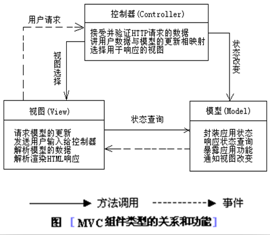
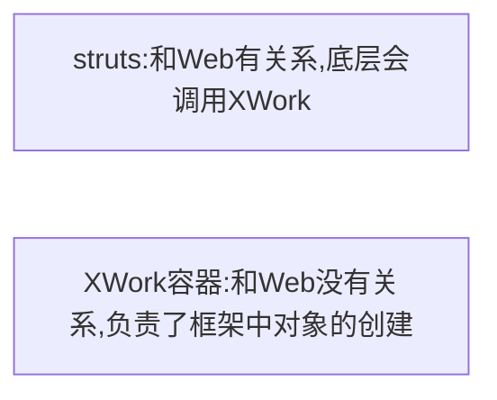
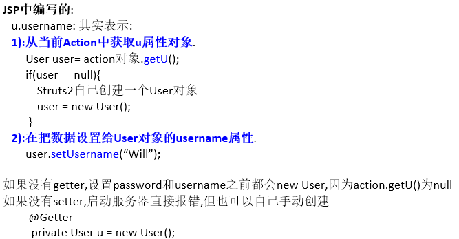
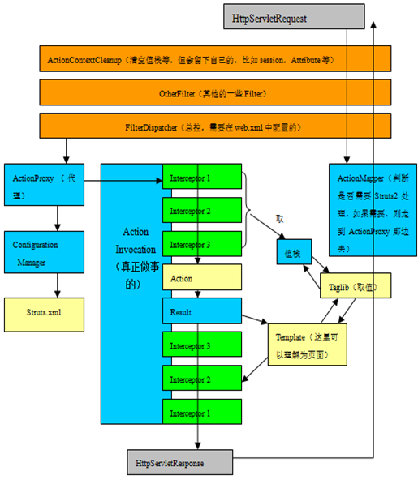
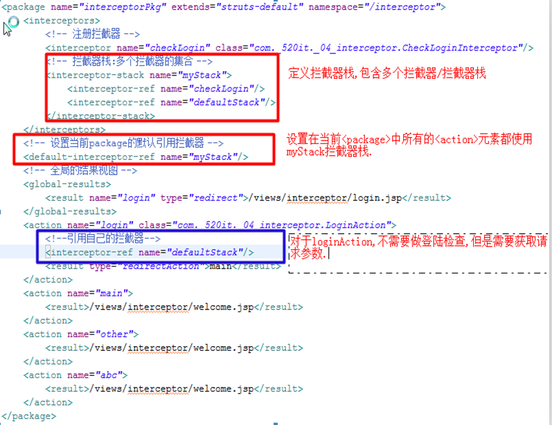
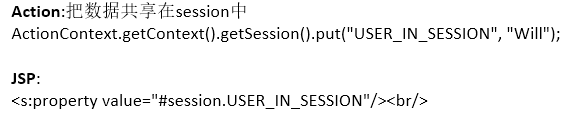
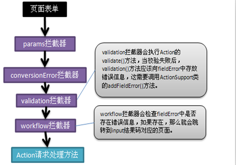
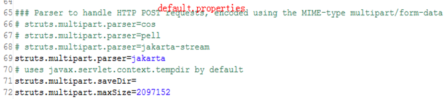
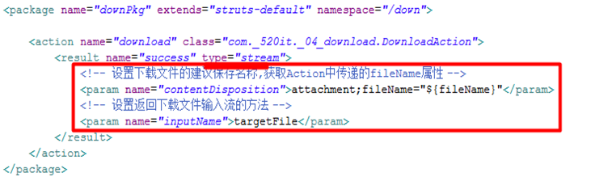

# Struts2

## 什么是框架

01_01

### 框架

是一系列jar包，其本质是对JDK功能的扩展

> JDK只能开发JavaSE的东西，讲解JavaWeb的时候还得依赖JavaEE相关的jar包
>
> **jar包**：多份字节码文件的打包，程序需要运行只需要字节码即可

是一组程序的集合，包含了一系列的<font color=blue>最佳实践</font>，作用是解决某一个领域的问题

> 框架不是万能的，框架是死的，需要配置框架才拥有功能

### 最佳实践

实际上是无数程序员经历过无数次尝试之后总结出来的处理特定问题的特定方法

如果把程序员的自由发挥看作是一条通往成功的途径，<font color=red>最佳实践就是其中的最短路径，能极大地解放生产力(提高效率)</font>

**最佳实践三要素**：可读性、可维护性、可扩展性

> 简单就是美
>
> * 消除重复
> * 化繁为简
> * 简单必须可读，简单必须可拓展
> * 减少依赖，消除耦合

### Web开发中的最佳实践

分层开发模式(技术层面的“分而治之”)

<font color=red>JavaEE开发根据职责的纵向划分</font>：表现层、业务层、持久层

* 表现层

	> 负责处理与界面交互的相关操作
	>
	> Struts2/Spring：MVC框架

* 业务层

	> 负责复杂的业务逻辑计算和判断
	>
	> Spring

* 持久层

	> 负责将业务逻辑数据进行持久化存储
	>
	> Hibernate/MyBatis

## MVC设计思想

01_02



## 前端控制器

01_03

Front Controller模式要求<font color=red>在WEB应用系统的前端（Front）设置一个入口控制器（Controller），所有的request请求都被发往该控制器统一处理</font>
Front Controller一般可以用来**做一个共同处理比如认证，页面导航，Session管理，国际化或本地化处理等**
**MVC框架都有前端控制器**:都得在web.xml中配置.

### 使用MVC框架做开发

1. 拷贝框架依赖的jar
2. 在web.xml中配置前端控制器

## 参数处理(ActionContext和ThreadLocal)

01_06

Action是线程安全的，但Action中的ActionContext不安全，所以用ThreadLocal

```java
/* 封装request和response，负责担当action和servlet的桥梁 */
public class ActionContext {
    private HttpServletRequest request;
    private HttpServletResponse response;
    
    private static ThreadLocal<ActionContext> threadLocal = new ThreadLocal<>();
    
    public static void setContext(ActionContext context) {
        threadLocal.set(context);
    }
    public static ActionContext getContext() {
        return threadLocal.get();
    }
    
    public ActionContext(HttpServletRequest request,HttpServletResponse response) {
        this.request = request;
        this.response = response;
    }
    
    public HttpServletRequest getRequest() {
        return this.request;
    }
    public HttpServletResponse getResponse() {
        return this.response;
    }
}
```

## Struts2简介

01_08

Struts2框架

* Struts2
* XWork

Struts2框架的核心两层(Struts+XWork)



## Struts2开发步骤

01_09

### 配置环境搭建

1. 拷贝jar包到lib目录下，并添加到build path

2. 在web.xml中配置前端控制器StrutsPrepareAndExecuteFilter

	```xml
	<filter>
	    <filter-name>struts2</filter-name>
	    <filter-class>org.apache.struts2.dispatcher.filter.StrutsPrepareAndExecuteFilter</filter-class>
	</filter>
	
	<filter-mapping>
	    <filter-name>struts2</filter-name>
	    <url-pattern>/*</url-pattern>
	</filter-mapping>
	```

3. 在resource目录下创建struts.xml

	```xml
	<?xml version="1.0" encoding="UTF-8" ?>
	<!DOCTYPE struts PUBLIC
	        "-//Apache Software Foundation//DTD Struts Configuration 2.5//EN"
	        "http://struts.apache.org/dtds/struts-2.5.dtd">
	<struts>
		
	</struts>
	```

### 尝试开发

定义HelloAction

```java
package aw._01_hello;

public class HelloAction {
	public String sayHello() {
		System.out.println("Hello Struts2...");
		return "will";//逻辑视图路径
	}
}
```

在struts.xml中，配置HelloAction(把HelloAction交给Struts2框架管理)

```xml
<struts>
	<package name="helloPkg" extends="struts-default" namespace="/crm">
		<action name="hello" class="aw._01_hello.HelloAction" method="sayHello">
			<result name="will" type="dispatcher">
                <!-- 物理视图路径 -->
				<param name="location">/views/hello/welcome.jsp</param>
			</result>
		</action>
	</package>
</struts>
```

建立welcome.jsp

```jsp
<%@ page language="java" contentType="text/html;charset=UTF-8"
    pageEncoding="UTF-8"%>
<!DOCTYPE html>
<html>
<head>
<meta charset="UTF-8">
<title></title>
</head>
<body>
	阿伟死了
</body>
</html>
```

### 访问Action
格式:**http://ip:port/contextPath/namespaceName/actionName[.action]**
本例中为http://ip:port/contextPath/crm/hello[.action]

## 常见常量配置

01_12

<font color=red>指定默认编码集</font>,作用于HttpServletRequest的setCharacterEncoding方法 和freemarker 、velocity的输出

```xml
<constant name="struts.i18n.encoding" value="UTF-8"/>
```

该属性<font color=red>指定需要Struts2处理的请求后缀</font>，该属性的默认值是action，即所有匹配*.action的请求都由Struts2处理

如果用户需要指定多个请求后缀，则多个后缀之间以英文逗号（,）隔开

```xml
<constant name="struts.action.extension" value="action,,"/>
```

设置浏览器是否缓存静态内容,默认值为true(生产环境下使用),开发阶段最好关闭 

```xml
<constant name="struts.serve.static.browserCache" value="false"/>
```

当struts的配置文件修改后,系统是否自动重新加载该文件,默认值为false(生产环境下使用),开发阶段最好打开

```xml
<constant name="struts.configuration.xml.reload" value="true"/>
```

<font color=red>开发模式下使用,这样可以打印出更详细的错误信息</font>,修改struts.xml之后,不用重启Tomcat

```xml
<constant name="struts.devMode" value="true" />
```

默认的视图主题 

```xml
<constant name="struts.ui.theme" value="xhtml" />
```

是否支持动态方法调用

```xml
<constant name="struts.enable.DynamicMethodInvocation" value="false"/>
```

## package元素配置细节

01_13

### \<package>元素

是`<struts>`根元素的子元素

```xml
<package name="" extends="" namespace="" abstract=""></package>
```

用来对多个`<action>`元素分类管理,和Java中的package没有关系
### 常见的属性

* name

	> 表示`<package>`的名字,但是要保证不同的`<package>`元素的name不同. 可以通过该名字被其他的包所指代

* extends

	> 表示当前`<package>`继承哪一个`<package>`,一般都是:struts-default
	>
	> 而struts-default其实就是struts-default.xml中`<package>`元素的名字
	>
	> 继承struts-default之后,就拥有了该`<package>`定义的所有资源.(结果返回类型,拦截器..)

* namespace

	> 表示命名空间,一般的以"/"打头.,命名一般以模块名.如: /crm, /oa
	>
	> 和`<action>`的name决定了一个Action类的访问路径

* abstract

	> 抽象的,缺省值是false
	>
	> 若一个`<package>`的abstract="true",那么该`<package>`中就不能再定义`<action>`元素,只能用来继承
	
	```xml
	<package name="basePkg" extends="struts-default" abstract="true">
		<!-- 多个模块之间共同的配置 -->
	</package>
	<package name="oaPkg" extends="basePkg" namespace="/oa">
		<!-- 包含自己的配置 -->
	</package>
	<package name="crmPkg" extends="basePkg" namespace="/crm">
		<!-- 包含自己的配置 -->
	</package>
	```

## action元素配置细节

01_14

### \<action>元素

是`<package>`元素的子元素
专门用来配置Action对象/Action类的,理论上一个Action类匹配一个`<action>`元素

```xml
<action name="" class="" method=""/>
```

### 常见的属性
* name

	> action的名称,在同一个`<package>`中,action的名字必须唯一
	>
	> 和`<package>`的namespace共同决定了一个Action类的访问路径
	>
	> <font color=blue>注意:action的name值不能以"/"打头</font>

* class

	> 一个Action类的全限定名
	>
	> 缺省值:com.opensymphony.xwork2.ActionSupport类

* method

	> 当前Action动作访问的方法
	>
	> 缺省值:execute

## result元素配置细节

01_15

### \<result>元素

配置结果视图

```xml
<result name="" type="">   </result>
```

* 局部结果视图

	> `<result>`定义在`<action>`中,只能是当前action跳转的结果视图.

* 全局结果视图

	> `<result>`定义在`<global-results>`中,而`<global-results>`在`<package>`中,当前`<package>`中所有的action都可以跳转的结果视图.

寻找规则:先找局部结果视图,找到就跳转,找不到再找全局结果视图,找到跳转,找不到报错

### 常见的属性

* name

	> Action方法返回的逻辑视图名称
	>
	> 缺省值:success

* type

	> 结果的跳转类型.该类型的值在struts-default.xml中已经预定义好了
	>
	> 缺省值:dispatcher
	>
	> 常见的type值(结果类型)
	>
	> * dispatcher      表示从Action请求转发到页面(JSP)
	>
	> * redirect          表示从Action重定向到页面(JSP)
	>
	> * chain              表示从Action请求转发到另一个Action
	>
	> * redirectAction 表示从Action重定向到另一个Action
	>
	> 	```xml
	> 	<action name="other">
	> 	    <result type="redirectAction">
	> 	        <param name="namesapce">/crm</param>
	> 	        <param name="actionName">hello</param>
	> 	    </result>
	> 	</action>
	> 	```
	>
	> * stream         表示返回流. 文件下载时使用

`<param name="">`表示参数:name缺省值:location(地址).

## 编写Action

01_16

定义一个类,继承于com.opensymphony.xwork2.ActionSupport类(<font color=red>推荐</font>)

ActionSupport已经实现了Action,Validateable, ValidationAware, TextProvider, LocaleProvider, Serializable这些接口 

真实开发中,我们却往往再提供一个BaseAction类

> ActionSupport
>
> * BaseAction(自定义Action基类)
> 	* AAction
> 	* BAction

## Action中多方法调用

01_17

### DMI:动态方法调用

官方不推荐
格式:  action名称!方法名
比如:  emp!edit    emp!list
在Struts2新的版本中,默认的关闭了DMI

若我们需要使用DMI,就需要配置常量,启用动态方法调用

此时:`<action>`元素不需要指定method属性值

```xml
<constant name="struts.enable.DynamicMethodInvocation" value="true"/>
```

### 使用通配符的方式类配置:

通配符:\*,可以表示任意字符

```xml
<action name="*_*" class="com._520it.manymethod.{1}Action" method="{2}">
```

Action名字:Action类名_Action方法

比如:Employee_list,表示调用的EmployeeAction中的list方法

比如:Department_edit,表示调用DepartmentAction中的edit方法.

## Action访问Servlet API

02_02

### 三种方式

* 让Action类实现感知接口

	> 02_03
	>
	> 此时项目依赖servlet-api.jar
	>
	> ServletRequestAware：感知HttpServletRequest对象
	>
	> ServletResponseAware：感知HttpServletResponse对象
	>
	> ServletSessionAware：感知HttpSession对象
	>
	> <font color=blue>和Servlet API耦合严重</font>

	```java
	public class AwAction extends ActionSupport implements ServletRequestAware {
	    private static final long serialVersionUID = 1L;
	    private HttpServletRequest request;
	    @Override
	    public void setServletRequest(HttpServletRequest request) {
	        this.request = request;
	    }
	    @Override
	    public String execute() throws Exception {
	        System.out.println("awsl");
	        return NONE;
	    }
	}
	```

* 使用ServletActionContext类，该类提供了很多静态方法可以返回Servlet API对象

	> 02_04
	>
	> ServletActionContext就是Servlet API的工具类
	>
	> static HttpServletRequest getRequest():返回HttpServletRequest对象
	> static HttpServletResponse getResponse():返回HttpServletResponse对象
	> static ServletContext getServletContext() :返回ServletContext对象
	>
	> <font color=blue>简单易用，使用较频繁</font>

	```java
	public class AwAction extends ActionSupport {
	    private static final long serialVersionUID = 1L;
	    
	    @Override
	    public String execute() throws Exception {
		 ServletActionContext.getRequest().setAttribute("requestName","requestValue");
	     return NONE;
	    }
	}
	```

* 使用ActionContext类，本身是Struts2对Servlet API的封装(<font color=red>推荐使用</font>)

	> 02_05
	>
	> Action的环境对象,每一次请求都是一个新的Action对象,一个ActionContext对象封装了这一次请求的相关数据
	>
	> ActionContext使用了ThreadLocal模式,所以说是线程安全的
	>
	> **创建ActionContext对象**
	>
	> ```java
	> ActionContext ctx = ActionContext.getContext();
	> ```
	>
	> **获取请求参数**
	>
	> Map<String,Object) getParameters()
	>
	> **操作request作用域对象**
	>
	> ```java
	> /* 设置数据 */
	> ActionContext.getContext().put(String name,Object value);
	> 
	> /* 获取数据 */
	> ActionContext.getContext().get(String name);
	> ```
	>
	> **操作session作用域对象**
	>
	> `Map<String,Object> sessionMap = ActionContext.getContext().getSession();`
	>
	> ```java
	> /* 设置数据 */
	> ActionContext.getContext().getSession().put(String name,Object value);
	> 
	> /* 获取数据 */
	> ActionContext.getContext().getSession().get(String name);
	> ```
	>
	> **操作application作用域对象**
	>
	> ```java
	> /* 设置数据 */
	> ActionContext.getContext().getApplication().put(String name,Object value);
	> 
	> /* 获取数据 */
	> ActionContext.getContext().getApplication().get(String name);
	> ```

## Action获取请求参数的三种方式

02_06

## 问题

> MVC思想
>
> * M:数据对象(封装数据/封装功能)
>
> * V:JSP:呈现界面给用用户看
>
> * C:StrutsPrepareAndExecuteFilter(前端控制器)

Action到底充当什么角色?

### Action获取请求参数三种方式

* Action本身作为Model对象，通过setter方法封装(属性注入)

  > 02_07
  >
  > Action中加入如下
  >
  > ```java
  > @Setter
  > private String username;
  > @Setter
  > private String password;
  > ```

* 创建独立Model对象，页面通过ognl表达式封装(属性注入)

	> 02_08
	>
	> User类中要提供getter和setter
	>
	> Action中加入如下
	>
	> ```java
	> @Getter
	> @Setter
	> private User u;
	> 
	> public String execute() throws Exception {
	>     Sstem.out.println(u);
	> }
	> ```
	>
	> 
	>
	> JSP中
	>
	> ```jsp
	> 账号：<input type="text" name="u.username" /><br/>
	> 密码：<input type="password" name="u.password" /><br/>
	> ```

* 使用ModelDriven接口，对请求数据进行封装(模型驱动)

	> 02_09
	>
	> 该方式也很简单,但是仅仅只能把参数数据封装到一种对象中去
	>
	> Action中加入`implements ModelDriven\<User>`
	>
	> ```java
	> private User u = new User();//注意这里不能用@Setter代替
	> @Override
	> public User getModel() {
	>     return u;
	> }
	> ```
	>
	> JSP中
	>
	> ```jsp
	> 账号：<input type="text" name="username" /><br/>
	> 密码：<input type="password" name="password" /><br/>
	> ```

### 三种方式的选择

三种方式的选择问题:

* 如果参数较少,且没有建立Model对象,使用方式1
* 更多选用方式2
* 也会出现方式1+方式2/方式1+方式3

## Struts2的执行流程(重要)

02_12



1. 客户端发送请求

2. 该请求经过一系列的**过滤器(Filter)**：其中可选过滤器ActionContextCleanUp，帮助Struts2和其他框架集成。例如：SiteMesh Plugin

3. 接着FilterDispatcher被调用，FilterDispatcher询问**ActionMapper**，来决定该请求是否需要调用某个Action

4. 若ActionMapper决定需要调用某个Action，FilterDispatcher把**请求的处理交给ActionProxy**

5. ActionProxy通过Configuration Manager询问框架的配置文件，找到需要调用的Action类

6. ActionProxy创建一个**ActionInvocation的实例**

7. ActionInvocation实例调用Action的前后，涉及到相关拦截器(Intercepter)的调用

8. 一旦Action执行完毕，ActionInvocation负责根据struts.xml中的配置找到对应的返回结果。返回结果是一个JSP或其他页面(也可以是其他的Action链)。 JSP页面展现可使用Struts2框架中的标签(该过程会涉及ActionMapper)

在上述过程中所有的对象(Action、Interceptors、Results等)都由**xwork容器中的ObjectFactory创建**

## 自定义拦截器CheckLoginInterceptor

02_15

### 步骤

1. 定义拦截器类
   * 实现com.opensymphony.xwork2.interceptor.Interceptor接口
   * 继承com.opensymphony.xwork2.interceptor.AbstractInterceptor类(推荐)
2. 在struts.xml中配置拦截器
   1. 先在\<package>中声明拦截器**CheckLoginInterceptor**
   2. 在\<action>中引用**CheckLoginInterceptor**拦截器

```java
/* 登陆检查拦截器 */
public class CheckLoginInterceptor extends AbstractInterceptor {
    private static final long serialVersionUID = 1L;
    /* 拦截操作 */
    public String intercept(ActionInvocation invocation) throws Exception {
        //获取session数据
        Map<String,Object> sessionMap = invocation.getInvocationContext().getSession();
        Object obj = sessionMap.get("USER_IN_SESSION");
        if (obj == null)
            return "login";//返回login逻辑视图，在struts.xml中配置全局result重定向到login.jsp
        return invocation.invoke();//放行
    }
}
```

```xml
<interceptors>
	<!-- 注册拦截器 -->
    <interceptor name="checkLogin" class="aw.CheckLoginInterceptor" />
</interceptors>

<!-- 全局结果视图 -->
<global-results>
	<result name="login" type="redirect">/views/login.jsp</result>
</global-results>

<!-- 缺省值class -->
<action name="main" class="com.opensymphony.xwork2.ActionSupport">
	<!-- 引用拦截器 -->
    <interceptor-ref name="checkLogin"></interceptor-ref>
    <result name="success" type="dispatcher">/views/welcome.jsp</result>
</action>
```

## 拦截器栈

02_16



## ValueStack概述和获取

03_01

### 什么是OGNL

OGNL是Object Graphic Navigation Language（对象图导航语言[负责:对象和页面之间数据传输]）的缩写，它是一个开源项目

<font color=blue>Struts2框架使用OGNL作为默认的表达式语言</font>

EL(表达式语言),OGNL就是EL的升级版

作用:Action和视图(JSP)之间数据交互的桥梁

讲解OGNL之前,先得学习**ValueStack**

### 什么是ValueStack

值栈是对应每一个请求对象的轻量级的内存数据中心

<font color=red>每一次请求的时候,都会创建一个新的ValueStack对象,该ValueStack对象封装了这一次请求相关的数据信息</font>

1. ValueStack实际是一个接口,在Struts2中利用OGNL时,实际上使用的是实现了该接口的<font color=blue>OgnlValueStack</font>类,这个类是Struts2利用OGNL的基础

2. <font color=blue>ValueStack贯穿整个Action的生命周期(一次请求)</font>

   > 每个Action类的实例都拥有一个ValueStack对象
   >
   > ValueStack相当于数据的中转站，在其中保存该次请求和当前Action对象和其他相关对象信息。
   > 一次请求,--->一个新的Action对象,---->一个新的ValueStack对象

3. Struts2框架把ValueStack对象保存在名为`struts.valueStack`的request属性中

   > **底层操作**
   >
   > 每当存在一次新的请求
   >
   > ```java
   > ValueStack vs = new .....;
   > request.setSttribute("struts.valueStack",vs);
   > ```

### 获取ValueStack

* request.getAttribute

```java
ValueStack vs = request.getAttribute("struts.valueStack");
```

* ServletActionContext.getRequest()先获取request

```java
ValueStack vs = ServletActionContext.getRequest().getAttribute("struts.valueStack");
```

* ServletActionContext.STRUTS_VALUESTACK_KEY常量，值为"struts.valueStack"

```java
ValueStack vs = ServletActionContext.getRequest().getAttribute(ServletActionContext.STRUTS_VALUESTACK_KEY);
```

* <font color=blue>通过ActionContext对象的方法获取</font>

```java
ValueStack vs = ActionContext.getContext().getValueStack();
```

## ValueStack内部结构分析

03_02

### ValueStack内部结构

ValueStack对象中有两个很重要的属性,这两个属性就是ValueStack的主要内部结构

root

> 类型: CompoundRoot extends ArrayList
>
> 表示了栈的数据结构
>
> 主要存储Action对象相关的数据信息

context

> 类型: Map
>
> 上下文
>
> 主要存储映射关系数据(key-value)
>
> context中还存在**root**、request、session、application、attr、parameters对象的引用。 
> 获取到context,就可以获取ValueStack中所有的数据


在JSP页面中

1. 先引入Struts2的标签:

   ```jsp
   <%@ taglib uri="/struts-tags" prefix="s"%>
   ```

2. 使用\<s:debug/>标签,用来分析和观察数据在root区域还是在context区域

   \<s:dbug/>:数据在root区域和在context区域,获取方式是不同的

* 从root中获取数据

  > 直接使用属性名获取
  >
  > <s:property value="属性名/位置"/>

* 从context中获取数据

  > [[key]]
  >
  > <s:property value="[[key]]"/>

## 操作ValueStack的root区域

03_04

### 把数据放入root区域

ValueStack对象 = ActionContext.getContext().getValueStack();

* ValueStack对象.getRoot().add(0, Obejct val);//把数据压入栈顶

* ValueStack对象.getRoot().push(Object val):等价于valueStack对象.getRoot().add(0, Obejct val);

* ValueStack对象.set(String propertyName,Object value);

* 在Action中提供一个可访问的属性(getter方法)

  > **使用方式4的目的**
  >
  > 保证Action在栈顶,如果Action在栈顶,我们可以轻松获取栈顶对象中的数据
  >
  > <font color=blue>一般的,如果是多条数据(集合),我们不建议存储在root区域,建议存储在context区域</font>

### JSP从root区域取出数据

引入Struts2的标签库

```jsp
<%@ taglib url="/struts-tags" prefix="s" %>
```

访问方式

```jsp
<s:property value="OGNL表达式"/>
<!-- 
下述两方法等价
[0]表示root
top表示栈顶
-->
<s:property value="xyz"/><br/> 直接获取栈顶对象中的xyz属性值.
<s:property value="[0].top.xyz"/><br/>
```

## 操作ValueStack的context区域

03_05

### 把数据放入context区域

ValueStack对象 = ActionContext.getContext().getValueStack();

* ValueStack对象.getContext().put(String key,Object value); 
* ActionContext.getContext().put(String key,Object value);

### JSP从context区域取出数据

```jsp
<s:property value="[[key]]"/>
```

**For example**



## 简单的校验

03_07



Action中

* **要继承ActionSupport**

* 重写Validateable接口中的validate()方法 ,在该方法中完成验证

  步骤如下:

  * validate()方法在其他的业务方法之前执行

  * 验证出错转向的页面

    struts.xml配置\<result name="input">/validate/login.jsp\</result> 

    其中input转向是在action中已经定义好的

    public static final String INPUT = "input";

  * 什么时候表示验证出错(转向input所指向的页面)

    * super.addFieldError("字段名称", "错误信息");
    * 当集合不为空时,转向错误页面.
    * 若校验失败,不会再执行Action中的业务方法

## 输入校验的细节

03_08

### 问题1：为什么在执行input方法之前,没有执行validate方法

在defaultStack拦截器栈中观察得知,

validation和workflow拦截器会排除input,back,cancel,browse

也就说,当我们请求的是input,back,cancel,browse这四个方法,

不会先做校验操作(不会调用校验方法)

源代码如下

```xml
<interceptor-ref name="validation">
	<param name="excludeMethods">input,back,cancel,browse</param>
</interceptor-ref>
<interceptor-ref name="workflow">
	<param name="excludeMethods">input,back,cancel,browse</param>
</interceptor-ref>
```

### 问题2：Action中某些方法不需要校验,却也执行了validate方法,如何避免问题

在不需要校验的方法上使用`@SkipValidation`标签即可

```java
/*
AnnotationValidationInterceptor源代码

判断当前请求的方法上是否有SkipValidation标签，如果有，直接放行
*/
Method method = getActionMethod(action.getClass(),invocation.getProxy().getMethod());
Collection<Method> annotatedMethods = AnnotationUtils.getAnnotatedMethods(action.getClass(),SkipValidation.class);
if (annotatedMethods.contains(method))
    return invocation.invoke();
```

### 问题3：为什么校验失败，默认跳转到input结果试图

* validation

  判断该方法执行之前是否需要校验,如果需要校验,把校验的错误信息存储起来(`Map<String, List<String>> fieldErrors`)

* workflow

  判断如果fieldErrors集合有错误信息,决定了应该跳转到哪一个结果视图.


### 问题4：修改校验失败的结果视图

在<font color=red>被校验的方法</font>上添加@InputConfig标签

@InputConfig(resultname="校验失败的结果视图")

@InputConfig(methodName="校验失败的方法")

### 问题5：开发中，校验的方法是少数，大多数都添加@SkipValidation？

validateXxx()方法只会对xxx()方法校验

## 文件上传操作

03_09


## 文件上传的细节

03_10

### default.properties

* struts.multipart.parser=jakarta设置在Struts2中使用哪一种上传组件

* struts.multipart.saveDir=    设置临时文件的保存路径(不要设置),默认就在Tomcat下

* struts.multipart.maxSize=2097152设置一次请求的最大值,单位字节. 默认是2M



### 修改上传文件的类型和单个文件的大小:

在Struts2中处理文件上传的功能存储在: 

```xml
<interceptor name="fileUpload" class="org.apache.struts2.interceptor.FileUploadInterceptor"/>
```

在FileUploadInterceptor拦截器中存在两个属性(setter):

* maximumSize	设置单个上传文件的最大字节

* allowedExtensions    设置允许上传的问题拓展名

类型不匹配,超过大小,都会进入input视图

<font color=red>覆盖defaultStack中的fileUpload时，fileUpload必须注册在defaultStack之前</font>

```xml
<!-- 注册拦截器 -->
<intercpetors>
	<interceptor-stack name="myStack">
        <!-- 修改默认的文件上传的拦截器参数 -->
		<interceptor-ref name="fileUpload">            
        	<param name="allowedExtensions">png,jpeg,jpg,gif</param>
            <param name="maximumSize">104876</param>
        </interceptor-ref>
        <interceptor-ref name="defaultStack"></interceptor-ref>
	</interceptor-stack>
</intercpetors>
```

### 上传提示信息国际化

在struts.xml中引用资源文件

```xml
<constant name="struts.custom.i18n.resources" value="fileuploadMsg"/>
```

fileuploadMsg.properties

```properties
struts.message.error.uploading=\u9519\u8BEF\u7684\u4E0A\u4F20:{0}
struts.message.error.file.too.large=...
struts.message.error.content.type.not.allowed=...
struts.message.error.file.extension.not.allowed=...
struts.message.upload.error.SizeLimitExceededException=...
```

## 文件下载

03_11

struts2提供了stream结果类型，该结果类型就是专门用于支持文件下载功能的

(阅读stream结果集代码)

指定stream结果类型

> 需要指定一个 inputName参数，该参数指定一个输入流，提供被下载文件的入口

XML所需配置

<font color=red>在Action中提供了fileName的get方法，所以在xml中能用`${fileName}`获取</font>




## Struts2标签库介绍

03_12

### 为什么得使用Struts2提供的标签库

表单标签将在HTML文档里被呈现为一个表单元素

**使用表单标签的优点**

* 支持表单回显
* 对页面进行布局和排版

### Struts2标签

* 通用标签
  * 控制标签/数据标签
* 表单标签

### 常用标签

* 选择标签

  03_13

  ```jsp
  <%
  	request.setAttribute("num",5);
  %>
  <s:if test="[[request]].num > 5">
      awsl，大于5
  </s:if>
  <s:elseif test="[[request]].num < 5">
  	awsl，小于5
  </s:elseif>
  <s:else>
  	awsl，等于5
  </s:else>
  ```

* 迭代标签

  03_14

  

* 数据标签

  03_15

  property

  ```jsp
  <!--
  default 默认值
  escapeHtml 解析Html标签 缺省为false，不解析
  -->
  <s:property value="[[request]].info" default="awsl" escapeHtml="true"></s:property>
  ```

  url、a

  ```jsp
  <!--
  url 拼接好的字符串，自带上下文路径
  value 本url的唯一名字，供a标签使用
  -->
  <s:url namespace="/down" action="download" var="myUrl">
  	<s:param name="fileName" value="%{aw.rar}"></s:param>
  </s:url>
  
  <!--
  href的值为上述url
  -->
  <s:a href="[[myUrl]]">好东西</s:a>
  ```

* 表单标签

  ```jsp
  <!--
  OGNL构建List对象：{'a','b','c'}
  	构建Map对象：#{'key1':'value1','key2':'value2','key3':'value3'}
  -->
  性别：<s:radio list="{'男','女','保密'}" name="gender1" value="${'男'}"/>
  性别：<s:radio list="#{'1':'男','2':'女','0':'保密'}" name="gender2" value="${1}"/>
  
  取向：<s:checkboxlist list="#{'1':'男','2':'女','0':'保密'}" name="hobbies"/>
  
  城市：<s:select list="#{'nc':'南昌','cd':'成都','gz':'广州'}" name="city" value="${1}" headerKey="-1" headerValue="--请选择--"/>
  ```


## Strut2中的三个符号$/%/#

**#**

在页面上从值栈中的context中获取数据

**$**

在配置文件中获取值栈中的数据

**%**

OGNL和String之间的转换
