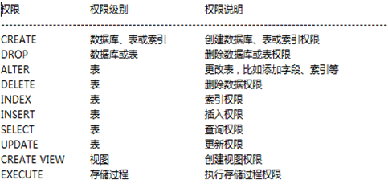

# MySQL基础加强

## 数据库基础回顾

01

### 关系型数据库的三范式

减少数据库中数据冗余的过程

* 第一范式（1NF）是对关系模式的基本要求，不满足第一范式（1NF）的数据库就不是关系数据库

  > 数据库表的每一列都是不可分割的基本数据项，同一列中不能有多个值

* 第二范式（2NF）

  > 要求数据库表中的每个实例或行必须可以被惟一地区分(主键)

* 第三范式（3NF）

  > 要求一个数据库表中不包含已在其它表中已包含的非主关键字信息
  >
  > (<font color=red>开发中为了性能,打破第三范式</font>)

### NOSQL

泛指非关系型的数据库

#### 分类

* **键值(Key-Value)存储**数据库

  > 这一类数据库主要会使用到一个哈希表，这个表中有一个特定的键和一个指针指向特定的数据

* **列存储**数据库

  > 这部分数据库通常是用来应对分布式存储的海量数据。键仍然存在，但是它们的特点是指向了多个列

* **文档型**数据库

  > 同第一种键值存储相类似。该类型的数据模型是版本化的文档，半结构化的文档以特定的格式存储

* **图形(Graph)**数据库

  > 使用图模型存储

#### 常见NoSQL数据库

* MongoDB

  > 文档型数据库；功能丰富；查询语言强大；并发效率不高，查询效率不算高

* Hbase

  > 高可靠性、高性能、面向列、可伸缩的分布式存储系统

* Redis

  > key-value存储系统（主要面对内存数据库，也可持久化）
  >
  > 安全性；主从复制；运行异常快，支持事务，丰富类型的key类型；

## MySQL数据库结构

02

### MySQL安装文件夹结构

* bin

  > MySQL相关二进制文件存储目录，存放了很多MySQL提供的系统工具
  >
  > mysql；mysqld；mysqldump

* data

  > MySQL默认的数据存放目录，一般不会存放在这里
  > 
  > 如:C:\ProgramData\MySQL\MySQL Server 5.5\data

* include

  > 包含一些头文件，提供其他程序连接mysql的API接口

* lib

  > MySQL依赖的库；

* share

  > 存放几个初始表文件和每种语言的errmsg.sys错误日志

* mysql-test

  > mysql测试套件

* scripts

  > 这个Perl脚本的作用是创建mysql最初需要的几个系统表，它的建表sql文件在share目录中

* sql-bench

  > 对数据库进行压力测试的工具
* my.ini

  > MySQL的基础配置文件

### my.ini

是MySQL服务的配置文件，MySQL的启动可以通过配置文件，也可以直接通过命令行参数

**一些比较常见的配置项**

* port：启动端口

* basedir：MySQL的主目录

* datadir：MySQL数据文件存放的位置，默认就是在MySQL主目录的data文件夹下；一般会进行调整

* character-set-server：默认的字符编码

* default-storage-engine：默认的存储引擎

* max_connections：最大允许连接数	

### MySQL数据文件简介

**数据文件存放格式**

* MyISAM
* InnoDB

**常见的文件类型**

* .frm

  与表相关的元数据（meta）信息，比如表结构定义

  所有表都需要这个文件

* .MYD(MyISAM Data)

  MyISAM 存储引擎专用，存放MyISAM 表的数据

* .MYI(MyISAM Index)

  MyISAM 存储引擎专用，主要存放MyISAM 表的索引相关信息；

* .ibd和ibdata

  存放InnoDB数据

* ibdata1

  **共享存储空间**，相当于所有InnoDB的数据都存放在公共的这个ibdata1文件中

  .ibd

  **独享存储空间**，相当于每一个表的数据还是保存在自己独立的文件中

  可以通过innodb_file_per_table=1参数来设置，但是独立表空间和共享表空间不能同时存在

* db.opt

  该数据库的默认配置

## MySQL权限操作

03

### 权限分布：针对不同的对象能够设置哪些权限

* 全局：  针对于所有的数据库都有效.

* 数据库：只针对于当前数据库有效,其他数据库无效.

* 表权限：'Select', 'Insert', 'Update', 'Delete', 'Create', 'Drop', 'Grant', 'References', 'Index', 'Alter'

* 列权限：'Select', 'Insert', 'Update', 'References'

* 过程权限：'Execute', 'Alter Routine', 'Grant'

### MySQL中权限的设置也是存储在数据库中的

* mysql.user：用户表，包括用户名，密码，主机，**全局权限**，性能限制
* mysql.db：**数据库权限**设置
* mysql.table_priv：**表权限**设置
* mysql.column_priv：**列权限**设置



## 权限操作命令

04

### 授权语法

```mysql
GRANT 权限(columns)
ON 数据库对象
TO 用户 IDENTIFIED BY "密码"
WITH GRANT OPTION;
```

**For Example**

```mysql
GRANT ALL PRIVILEGES 
ON *.* 
TO will@'localhost' IDENTIFIED BY '1234'
WITH GRANT OPTION;
```

其中：

**ALL PRIVILEGES**：所有权限(默认不包括授权权限)

**\*.***：所有数据库对象；普通格式为db.table

**will@'localhost' IDENTIFIED BY '1234'**：

> *用户账户*
>
> 包括user@host
>
> *host*
>
> * %：从任意地址访问
> * 10.250.7.%：只能从指定网段访问
> * 192.168.1.2：只能从某个IP访问
>
> *IDENTIFIED BY*
>
> 用户不存在就根据提供的密码创建并授权

**WITH GRANT OPTION**：是否允许用户继续授权（注意，这个用户能够授权只能是该用户的权限子集）

### 查看权限

* 当前用户

  ```mysql
  show grants;
  ```

* 特定用户

  ```mysql
  show grants for user@host;
  ```

### 回收权限

```mysql
REVOKE 权限
ON 数据库对象
FROM user@host;
```

<font color=blue>使用REVOKE撤销全部权限,操作者必须拥有MySQLl数据库的全局CREATE USER权限或UPDATE权限</font>

### 删除用户

```mysql
DROP USER user@host;
```

## 单表查询

06、07

### 消除重复

`DISTINCT`放在查询内容前

```mysql
SELECT DISTINCT job
FROM emp;
```

### 空值判断

IS NULL

<font color=red>注意：不是`!= NULL`</font>

IFNULL()函数

### 限定查询

字符串大小写不敏感，需要添加`binary`关键字

日期值是格式敏感的，可以参与比较运算

## MySQL查询函数

08

* 单行函数

  > 单进单出
  >
  > 

* 多行函数/聚合函数/分组函数

  > 多进多出
  >
  > COUNT()：查询表中的数据记录
  > AVG()：求出平均值
  > SUM()：求和
  > MAX()：求出最大值
  > MIN()：求出最小值

### 单行函数

09

**字符函数**

* LOWER/UPPER：大小写转换

* CONCAT：连接字符串，参数不限

  ```mysql
  SELECT CONCAT(1,'1');
  /*
  2
  MySQL会自动转换'1'为数字
  */
  ```

* CHAR_LENGTH/LENGTH：字符串长度(字符单位)/(字节单位)

* LPAD/RPAD：

  > LPAD(str,len,padstr)返回str，左边由padstr填充到len字符长度
  >
  > 如果str的长度大于len，则会被缩短至len字符
  
  ```mysql
  SELECT LPAD('hi',4,'??');
  /* '??hi' */
  
  SELECT LPAD('hi',1,'??');
  /* 'h' */
  ```
  
* LTRIM/RTRIM/TRIM：消除空格

* REPLACE：替换

  > REPLACE(str,from_str,to_str)
  
* SUBSTRING：截取

  > str,pos
  >
  > str FROM pos
  >
  > str,pos,len
  >
  > str FROM pos FOR len

**数字函数**

* ABS：绝对值

  MOD：取模

  POW：次方

* CEIL(X)：返回不小于X的最小整数<font color=red>向上取整</font>

  FLOOR(X)：向下取整

* ROUND

  > ROUND(X)：四舍五入X
  >
  > ROUND(X,Y)：小数X保留Y位

**日期函数**

* NOW()：当前时间

* DATE_ADD加/DATE_SUB减

  > DATE_ADD(date,INTERVAL expr type)/DATE_SUB(date,INTERVAL expr type)
  >
  > date：起始时间
  >
  > expr：表达式，时间间隔值
  >
  > type：关键词
  >
  > 部分type值
  >
  > | type值  | 预期的expr格式 |
  > | :-----: | :------------: |
  > | SECOND  |    SECONDS     |
  > | MINUTE  |    MINUTES     |
  > |  HOUR   |     HOURS      |
  > |   DAY   |      DAYS      |
  > |  WEEK   |     WEEKS      |
  > |  MONTH  |     MONTHs     |
  > | QUARTER |    QUARTERS    |
  > |  YEAR   |     YEARS      |

* CURRENT_DATE()/CURRENT_TIME()

* DATEDIFF(expr,expr2)：计算时间间隔

* 获取日期时间中的某个段

  DAY/HOUR/MINUTE/MONTH/YEAR/LAST_DAY

**转换函数**

* 数字和字符串

  FORMAT(X,D)：四舍五入的方式保留小数X小数点后D位，以字符串返回并添加逗号

* 日期和字符串

  DATE_FORMAT(DATE,'%Y年%m月%d日');

  STR_TO_DATE

## 分组查询

12、13

1. <font color=red>出现在SELECT列表中的字段，如果出现的位置不是在组函数(聚合函数)中，那么必须出现在GROUP BY子句中</font>
2. 在GROUP BY 子句中出现的字段，可以不出现在SELECT列表中 

3. 如果没有GROUP BY子句SELECT列表中的任何列或表达式不能使用统计函数

**组(聚合)函数的错误用法**

1. 不能在 WHERE 子句中限制组

2. 限制组必须使用 HAVING 子句

3. 不能在 WHERE 子句中使用组函数

### 使用HAVING子句对分组的结果进行限制

SELECT [DISTINCT] *|分组字段1 [别名] [,分组字段2 [别名] ,…] | 统计函数

FROM 表名称 [别名], [表名称 [别名] ,…]

[WHERE 条件(s)]

[GROUP BY 分组字段1 [,分组字段2 ,…]]

<font color=blue>[HAVING 分组后的过滤条件（可以使用统计函数）]</font>

[ORDER BY 排序字段 ASC | DESC [,排序字段 ASC | DESC]];

### 注意点：WHERE和HAVING的区别

* WHERE：是在执行GROUP BY操作之前进行的过滤，表示从全部数据之中筛选出部分的数据，在WHERE之中不能使用统计函数；
* HAVING：是在GROUP BY分组之后的再次过滤，可以在HAVING子句中使用统计函数；

## 显式连接查询

16

### 显式内连接

xx INNER JOIN yy ON()

INNER可以省略

做等值连接的两张表的字段相同时，可以将`ON(e.depno=d.depno)`改成`USING(depno)`

```mysql
SELECT ...
FROM ...
FROM table1 INNER JOIN table2
ON(table1.column_name = table2.column_name);
```

### 外连接查询

(左外,右外,全外): 根据表在JOIN左边还是右边来区分

左外连接:查询出JOIN左边表的全部数据查询出来,JOIN右边的表不匹配的数据使用NULL来填充数据

右外连接:查询出JOIN右边表的全部数据查询出来,JOIN左边的表不匹配的数据使用NULL来填充数据

> MYSQL中暂时不支持全连接
>
> 可以通过union +左右连接来完成

## 子查询和UNION查询

17

### 子查询

* 单行单列子查询

  > 只包含一个字段的查询，返回的查询结果也只包含一行数据, **看做是一个值**
  >
  > 使用在`WHERE`之后
  >
  > 运算符	=；>；>=；<；<=；<>

* 多行单列子查询

  > 只包含了一个字段，但返回的查询结果可能多行或者零行,**看做是多个值**
  >
  > 使用在`WHERE`之后
  >
  > **运算符**
  >
  > `IN`：与列表中的任意一个值相等
  > `ANY`：与子查询返回的任意一个值比较
  >
  > * = ANY:此时和IN操作符相同
  >
  > * \> ANY:**大于子查询中最小**的数据
  >
  > * < ANY:**大于子查询中最大**的数据
  >
  > `ALL`：与子查询返回的每一个值比较
  >
  > * \> ALL:**大于子查询中最大**的数据
  >
  > * < ALL:**小于子查询中最小**的数据

* 多列子查询

  > 包含多个字段的返回，查询结构可能是单行或者多行,**看做是临时表**
  >
  > 使用在`FROM`之后
  >
  > **减少笛卡尔积的数量**

### UNION查询

`JOIN`是用于把表横向连接

`UNION`/`UNION ALL`是用于把表纵向连接(一般用于做查询的临时表)

`UNION`操作符用于合并两个或多个 SELECT 语句的结果集

**注意**

* UNION 内部的 SELECT 语句必须拥有相同数量的列
* 列也必须拥有兼容的数据类型
* 每条 SELECT 语句中的列的顺序必须相同
* UNION 结果集中的列名总是等于 UNION 中第一个 SELECT 语句中的列名
* UNION 操作符选取不同的值。如果允许重复的值，请使用 UNION ALL(性能高)

## 事务的基本操作

18

### 事务的ACID

* 原子性
* 一致性
* 隔离性
* 持久性

### 事务的控制语言

* begin

  > shiwu开启一个新的事务空间

* commit

  > 提交事务

* rollback

  > 回滚事务

## 事务的并发问题

19

### 存在五种并发问题

脏读、不可重复读、幻读、第一类丢失更新、第二类丢失更新

为了解决上述的问题,我们提出了隔离级别的概念,不同的隔离级别可以处理的并发问题是不一样的

使用不同的隔离级别就可以阻止自己所期望的并发问题


### 使用锁机制

* 悲观锁

  > SELECT ... FOR UPDATE
  >
  > FOR UPDATE 其他事务想要查询必须等待本事务提交或回滚才行

* 乐观锁

  > 使用版本控制机制

## 数据库的对象

20

### 索引

一个数据库对象，用来加速对表的查询

通过使用快速路径访问方法快速定位数据,减少了磁盘的I/O

与表独立存放

由数据库自动维护

**创建索引**

```mysql
CREATE INDEX index ON table (column[, column]...);
```

### 视图

虚表，实际上视图就是一个命名的查询，用于改变基表数据的显示

> **可以限制对数据的访问**
>
> **可以使复杂的查询变的简单**
>
> 提供了数据的独立性
>
> 提供了对相同数据的不同显示

**语法**

在CREATE VIEW语句后加入子查询

```mysql
CREATE [OR REPLACE] VIEW view
[(alias[, alias]...)] 
AS subquery
[WITH READ ONLY];
```

**创建视图**

```mysql
CREATE OR REPLACE VIEW emp_v_30
AS 
SELECT  empno, ename, sal
FROM    emp
WHERE   deptno =30;
```