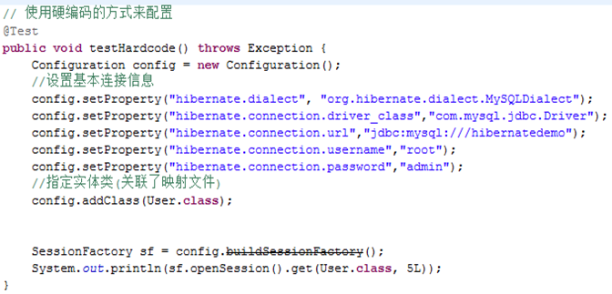
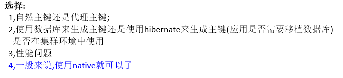
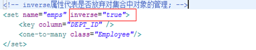
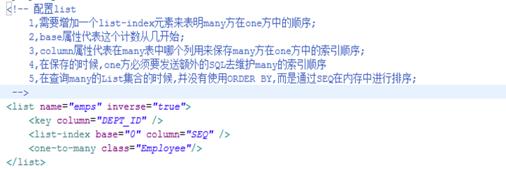
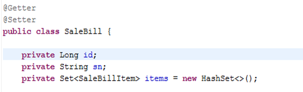
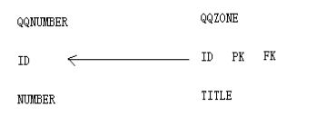
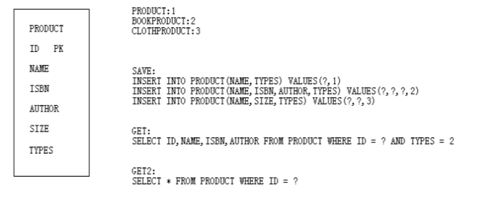
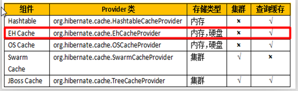
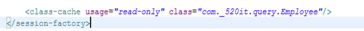

## Hibernate概述

01_03

**Hibernate目录结构**

documentation:开发文档和API

lib:核心jar包和依赖/相关的jar包

project:hibernate源码以及配置文件等

## Hibernate的CRUD的配置文件

01_05

Hibernate的应用中主要包含两种配置文件

* 主配置文件(包含连**接数据库的基本要素**:驱动类名,URL,账号,密码,方言,包含映射文件)

* 每一个Domain对象的映射文件(**处理对象和表中的映射关系**)

### 映射文件配置

映射文件(*domainName*.hbm.xml,如User.hbm.xml),一般存放在和domain相同目录结构

```xml
<?xml version="1.0"?>
<!DOCTYPE hibernate-mapping PUBLIC
	"-//Hibernate/Hibernate Mapping DTD 3.0//EN"
	"http://www.hibernate.org/dtd/hibernate-mapping-3.0.dtd">
<hibernate-mapping package="aw._01_hello.domain" default-access="field">
	<class name="User" table="t_user">
		<id name="id"  column="uid">
			<generator class="native" />
		</id>
		<property name="name" column="uname" />
		<property name="salary" column="usalary" />
		<property name="hiredate" column="uhiredate" />
	</class>
</hibernate-mapping>
```

### 主配置文件

阅读hibernate.properties文件，找到连接数据库的基本要素

```properties
## MySQL
[[hibernate]].dialect org.hibernate.dialect.MySQL5Dialect
[[hibernate]].dialect org.hibernate.dialect.MySQLInnoDBDialect
[[hibernate]].dialect org.hibernate.dialect.MySQLMyISAMDialect
[[hibernate]].connection.driver_class com.mysql.jdbc.Driver
[[hibernate]].connection.url jdbc:mysql:///test
[[hibernate]].connection.username gavin
[[hibernate]].connection.password
```

配置在hibernate.cfg.xml中

```xml
<hibernate-configuration>
	<session-factory>
		<!-- 连接数据库服务器5大要素 -->
		<property name="hibernate.connection.driver_class">com.mysql.jdbc.Driver</property>
		<property name="hibernate.connection.url">jdbc:mysql://localhost:3306/jdbcdemo?useUnicode=true&amp;characterEncoding=utf-8</property>
		<property name="hibernate.connection.username">root</property>
		<property name="hibernate.connection.password"></property>
		<property name="hibernate.dialect">org.hibernate.dialect.MySQLDialect</property>
		<!-- 关联映射文件 -->
		<mapping resource="aw/_01_hello/domain/User.hbm.xml" />
	</session-factory>
</hibernate-configuration>
```

## DQL

01_06

### 操作步骤

1. 创建配置对象
2. 读取配置文件
3. 创建SessionFactory
4. 获取Session
5. 具体的查询操作
6. 关闭Session
7. 关闭SessionFactory

### For Example

```java
@Override
public User get(Long id) {
    // 创建配置对象
    Configuration config = new Configuration();
    // 读取配置文件
    config.configure("/hibernate.cfg.xml");
    // 创建SessionFactory，即DataSource
    SessionFactory sf = config.buildSessionFactory();
    // 获取Session对象，即Connection
    Session session = sf.openSession();
    // 具体的查询操作
    User u = session.get(User.class, id);
    // 关闭Session
    session.close();
    // 关闭SessionFactory
    sf.close();
    return u;
}

@Override
public List<User> listAll() {
    // 创建配置对象
    Configuration config = new Configuration();
    // 读取配置文件
    config.configure("/hibernate.cfg.xml");
    // 创建SessionFactory，即DataSource
    SessionFactory sf = config.buildSessionFactory();
    // 获取Session对象，即Connection
    Session session = sf.openSession();
    // 具体的查询操作
    String hql = "SELECT u FROM User u";
    Query<User> query = session.createQuery(hql);//创建查询对象
    List<User> list = query.list();
    // 关闭Session
    session.close();
    // 关闭SessionFactory
    sf.close();
    return list;
}

/*
核心！！！
String hql = "SELECT u FROM User u";
Query<User> query = session.createQuery(hql);//创建查询对象
List<User> list = query.list();
*/
```

## DML

01_07

### 操作步骤

1. 创建配置对象
2. 读取配置文件
3. 创建SessionFactory
4. 获取Session
5. <font color=red>打开事务</font>
6. 具体的DML操作
7. 提交/回滚事务
8. 关闭Session
9. 关闭SessionFactory

### For Example

```java
// 创建配置对象,读取配置文件
Configuration config = new Configuration().configure("/hibernate.cfg.xml");
// 创建SessionFactory
SessionFactory sf = config.buildSessionFactory();
// 获取Session对象
Session session = sf.openSession();
// 打开事务
session.getTransaction().begin();//或者session.beginTransaction();
// 具体的查询操作
/*
session.save(u);
session.update(u);
session.delete(u);
*/
session.save(u);
//提交事务
session.getTransaction().commit();
// 关闭Session
session.close();
// 关闭SessionFactory
sf.close();
```

## save和get方法分析以及Hibernate操作常见错误

01_08

### 分析保存操作:session.save(user);

**SQL**:INSERT  INTO  表名   (列名) VALUES(?)

1. 获取对象的类型(**user.getClass()**)------->找到对应的映射文件

2. 找到该类对应的表名:t_user

3. 使用内省机制,获取user对象中的所有属性: id,name,salary,hiredate

4. 通过映射文件可以找到对应的列名:uid,uname,usalary,uhiredate

5. 拼接成SQL:  **INSERT  INTO  t_user   (uname,usalary,uhiredate) VALUES(?,?,?);**

6. 设置占位符参数:**Object[] arr = {user.getName(),user.getSalary(),user.getHiredate()}**

7. 执行SQL语句

8. <font color=blue>把当前自增的主键值,设置到id属性中</font>

   `user.setId(789L);`

9. 返回受影响的行数

### 分析查询操作:User u = session.get(User.class,1L);

**SQL**:SELECT * FROM t_user WHERE uid = ?

1. 获取对象的类:User.class------->找到对应的映射文件

2. 找到该类对应的表名:t_user

3. 使用内省机制,获取user对象中的所有属性: id,name,salary,hiredate

4. 通过映射文件可以找到对应的列名uname,usalary,uhiredate

5. 通过解析映射文件:读取`<id>`元素,再获取对应的列:uid

6. 拼接SQL:  **SELECT *  FROM t_user WHERE uid = ?**

7. 设置占位符参数: 1L

8. 处理结果集,针对光标所在的行,创建一个User对象,并设置属性值

   > User  u = User.class.newInstance();
   > u.setId(1L);
   > u.setName(rs.getString(“uname”));
   > u.setSalary(rs.getBigDecimal(“usalary”));
   > u.setHiredate(rs.getDate(“uhiredate”));

9. 返回User对象即可

### 常见错误操作

* 操作数据库,必须<font color=red>先拷贝数据库对应的驱动包</font>

* hibernate.cfg.xml中的`<property>`配置不能出现空格

* 不要忘记调用`configure()`方法

  正确写法:`Configuration cfg = new Configuration().configure("xx.xml");`

* **org.hibernate.PropertyNotFoundException**

  找不到对象中指定的属性名(属性property由getter/setter决定,而不是字段Field决定)

* 实体类(Entity)必须存在无参构造器(private/public都可以)

  ```java
  Constructor con = Class对象.getConstructor();
  con.setAccessable(true);//设置访问标识，访问private成员
  Object obj = con.newInstance();
  ```

* Hibernate并不要求持久化类必须实现java.io.Serializable接口

  但对于**RMI或JavaEE分布式结构**的Java应用,必须实现该接口

## Hibernate的API介绍

### Configuration对象

01_09

hibernate的配置对象,主要用于解析Hibernate配置文件和持久化映射文件中的信息

**最重要的功能,是用来创建SessionFactory对象**(配置文件都要存放在CLASSPATH根路径)

**Hibernate3.x方式**

```java
Configuration config = new Configuration().configure("/hibernate.cfg.xml");
SessionFactory sf = config.buildSessionFactory();
```

**Hibernate4.x方式**

<font color=red>必须将数据库连接的5大配置写在hibernate.properties中，写在hibernate.cfg.xml无效</font>

```java
Configuration config = new Configuration().configure("/hibernate.cfg.xml");
SessionFactory sf = config.buildSessionFactory(new StandardServiceRegistryBuilder().build());
```

在hibernate中,可以**直接使用代码完成所有的配置**,不一定必须要hibernate.cfg.xml文件(<font color=blue>Spring集成Hibernate采用该方式</font>)



### SessionFactory对象

01_10

负责创建Session对象

数据库的**连接信息**是配置SessionFactory

SessionFactory是线程安全的(**DataSource**)

> SessionFactory的创建需要很大的系统开销,实际上,在创建sessionFactory的时候才会去连接数据库,一般的,针对一个应用,一个数据库服务器,只需要一个SessionFactory实例就够了

抽取Hibernate工具类:HibernateUtil

SessionFactory的重要方法:使用银行转账案例,说明openSession和getCurrentSession

### openSession和getCurrentSession

**openSession**:这个方法代表,开启一个全新的Session(<font color=red>测试环境</font>)

> 全新的连接(Connection)
>
> 全新的事务
>
> 全新的一级缓存

**getCurrentSession**:得到当前上下文中的session,**绑定到当前线程**(<font color=red>开发环境</font>)

> 如果当前上下文中存在session,则使用该session
>
> 如果当前上下文中不存在session,则使用opensession创建一个新的session
>
> **要使用getCurrentSessoin,必须在hibernate.cfg.xml中配置**
>
> ```xml
> <property name="hibernate.current_session_context_class">thread</property>
> ```
>
> getCurrentSession得到的session是和事务绑定的(Spring集成Hibernate的方式);
> <font color=red>无论是DML还是DQL，都必须开启事务</font>
> <font color=red>当事务提交的时候，session就跟着关闭了</font>，此时不需要人为的调用`session.close()`

### Session对象

01_11

* session不是线程安全的(好比Connection对象)

* session中有一个缓存，称为一级缓存，存**放当前工作单元加载的对象**

  > 在一个session的生命周期之内,连续拿相同类型,相同ID的对象,只需要发送一次SQL

* session加载出来的对象,都存放于一级缓存中进行管理

* 控制一级缓存的方法

  > clear():清空一级缓存所有对象
  > 
  > evict(Object o):从一级缓存中清除指定的对象

### Transaction对象

01_12

`session.beginTransaction()`**该方法不是开启事务，是激活事务**

`session.getTransaction()`得到当前session上面已经激活的事务对象

> 注意,在操作Transaction方法之前必须调用beginTransaction()方法;(该方法得到的对象永远不会为空)

`commit()`提交相关联的session实例

`rollback()`撤销事务操作

**标准的处理事务模板代码**

```java
Session s = null;
try {
    s = HibernateUtil.getSession();
    s.beginTransaction();//设置事务的活动状态
    /*
    具体的操作...
    */
    s.getTransaction().commit();//提交事务
} catch (Exception e) {
    if (s != null && s.getTransaction.isActive())//session不为null，且事务被激活
        s.getTransaction().rollback();
} finally {
    if (s != null && s.isOpen())//session不为null，且没有被close()
        s.close();
}
```

```java
/* HibernateUtil */
public class HibernateUtil {
	public static SessionFactory sessionFactory;
	
	static {
		Configuration cfg = new Configuration().configure("/hibernate.cfg.xml");
		sessionFactory = cfg.buildSessionFactory();
	}
	
	public static Session openSession() {
		return sessionFactory.openSession();
	}
}
```

### Query和Criteria对象

01_13

* Query不仅可以使用QBC,QBE,HQL,原生SQL查询数据,而且支持绑定参数,限制查询记录,批处理等操作

* Criteria与Query接口非常相似,运行创建并执行面向对象方式的查询

#### 查询名字中有test，且id在1-10之间的记录

**Query**

设置占位符参数<font color=red>从0开始</font>

只有JDBC和JPA从1开始

```java
Session s = HibernateUtil.getSession();

String hql = "SELECT u FROM User u WHERE u.name LIKE ? AND u.id BETWEEN ? AND ?";
Query query = s.createQuery(hql);
query.setString(0,"%test%").setLong(1,1L).setLong(2,10L);

List<User> list = query.list();
session.close();
for (User u : list)
    System.out.println(u);
```

**Criteria**

```java
Session s = HibernateUtil.getSession();

Criteria criteria = s.createCriteria(User.class);
criteria.add(Restrictions.like("name","test",MatchMode.ANYWHERE));
criteria.add(Restrictions.between("id",1L,10L));

List<User> list = criteria.list();
session.close();
for (User u : list)
    System.out.println(u);
```

## 配置文件细节

02_02

### hibernate.properties

现在hibernate.cfg.xml只做映射文件的关联

在hibernate.properties文件中做配置

**配置和数据库服务器的连接信息**

```properties
# Mysql5.0之后要改成MySQL5Dialect
hibernate.dialect=org.hibernate.dialect.MySQL5Dialect
hibernate.connection.driver_class=com.mysql.jdbc.Driver
hibernate.connection.url=jdbc:mysql://localhost:3306/jdbcdemo?useUnicode=true&characterEncoding=utf-8
hibernate.connection.username=admin
hibernate.connection.password=
```

**配置显示和格式化SQL**(观察生成的SQL)

```properties
hibernate.show_sql=true
hibernate.format_sql=true
```

**自动生成数据库表**

```properties
# 删除并创建表,关闭SessionFactory时,删除数据库表
hibernate.hbm2ddl.auto=create-drop
```

```properties
# 删除并创建表
hibernate.hbm2ddl.auto=create
```

```properties
# 更新表结构
hibernate.hbm2ddl.auto=update
```

```properties
# 验证表结构:如果表结构和映射文件不匹配,hibernate启动失败
hibernate.hbm2ddl.auto=validate
```

## 映射文件细节

02_03

* package是可以不写的,如果不写package,其中所有的类都必须有全限定名

* class元素的table属性是可以省略的,如果不写table,对应table的名称和类的名称一模一样(大小写一样)

* property元素对应的是对象的属性,而不是字段:fullName

  > 什么是属性:由一对符合命名规范的getter和setter构成的
  >
  > **hibernate找的是getter和setter**

* 可以通过修改property元素的access属性来改变访问策略

  ```xml
  <property name="bornDate" access="field"/>
  ```

* property元素的type属性可以为对象的属性添加指定的映射类型
  > **type里面写的类型,不是数据库的类型,是hibernate定义的一种中间类型**
  >
  > JAVA类型-中间类型-数据表类型
  >
  > 
  >
  > 
  
* 控制属性的可变性

   insert属性决定该列是否出现在INSERT语句中,有值就出现在SQL语句,没有值就不出现

   ```xml
   <property name="" insert="true">
   ```

   该类所有属性都要设置可变的话,可以配置class元素的dynamic-insert

   ```xml
   <class name="User" dynamic-insert="true">
   ```

* **auto-import:自动导入,hibernate为其中的对象自动的起一个别名(默认就是类的名称,用于查询)**

   ```xml
   <hibernate-mapping auto-import="false">
   <!-- 自己为类起别名 -->
   <import class="com._520it.day1._03_config.Person" rename="Person2"/>
   ```

## OID概述

02_04

> 自然主键:主键具有业务含义,比如身份证号码,必须要手动输入
>
> 代理主键:主键没有业务含义,仅仅起唯一标识,一般由数据库服务器自动生成(**推荐**)

> 单字段主键:在一张表中使用某一列作为主键(**推荐**)
>
> 复合主键:在一张表中使用多列一起,联合作为主键

**OID的重要作用**:OID在Hibernate中唯一标识了一个对象

> 在一级缓存中,Type+OID唯一标识了一级缓存中相同的数据 
>
> 一般情况,在domain当中,需要用OID属性来重写equals和hashcode方法

**id元素都有一个generator子元素,规定了主键的生成策略**


## 主键生成策略

03_05

**uuid**

> 使用uuid作为主键值 ,**要求类型必须是String的**

**increment**

> **hibernate生成主键**
>
> 先查询当前表id最大值,自增1后作为当前对象的id
>
> 主键类型可以递增
>
> **不能在集群(多个hibernate实例使用同一个数据库)的情况下使用**

**identity**

> 使用数据库本身的id生成策略:MySQL:auto_increment
> 
> 数据库本身必须支持id生成策略,Oracle不能使用

**sequence**

> 使用序列生成id,如果只配置sequence,会创建一个默认的序列hibernate_sequence;
>
> ```xml
> <generator class="sequence">
>     <param name="sequence">IDDOMAIN_SEQ</param>
> </generator>
> ```
>
> 可以通过sequence参数来指定表对应的序列生成器的名字
>
> 数据库本身必须支持序列

**native**

> 使用数据库本地的主键生成策略
> 
> 对于mysql:auto_increment
> 
> 对于oracle:使用默认的hibernate_sequence

**org.hibernate.id.enhanced.TableGenerator**

> **相当于序列生成器,hibernate使用一张hibernate_seqences这样的表来模拟序列生成器**
>
> 如果只配置org.hibernate.id.enhanced.TableGenerator,相当于所有的表都使用default这一个序列生成器
>
> ```xml
> <generator class="org.hibernate.id.enhanced.TableGenerator">
>     <param name="segment_value">IDDOMAIN_SEQ</param>
> </generator>
> ```
>
> **会造成很多额外的SQL**



## Session中常用方法

02_06

### 常用方法(已学)

Transaction beginTransaction():设置事务的活动状态

Transaction getTransaction():获取一个事务

Serializable save(Object o):保存一个对象

void update(Object o):修改一个对象

void delete(Object o):删除一个对象

Object get(Class type,Serializable id):根据主键查询指定类型的对象

Query createQuery(String hql):根据hql创建一个查询对象

void close():关闭Session

void clear():清除一级缓存所有对象

void evict(Object o):清除一级缓存中指定的对象

### 事务相关

session.beginTransaction()：标记打开当前session绑定的事务对象

session.getTransaction()：得到和当前session绑定的事务对象

### 一级缓存相关

session.clear()：清除一级缓存中所有的对象

boolean contains(Object entity)：判断一级缓存中是否有给定的对象

session.evict(Object entity)：从一级缓存中清除指定的对象

session.flush()：<font color=red>把一级缓存中的<font color=blue>脏数据</font>同步到数据库中</font>

session.refresh(Objectentity)：强制重新查询对象，相当于把数据库中的数据同步到一级缓存中

### 持久化操作相关

* session.save(Objectentity)：保存一个对象

  session.persist(Objectentity)：保存一个对象(同步JPA的接口方法)

  **在没有事务环境下，save方法会发送INSERT SQL，persist不会**

* session.saveOrUpdate(Objectentity)：如果对象不在库中，则保存，如果存在，则更新

  session.merge(Objectentity)：等同于saveOrUpdate方法(同步JPA的接口方法)

  **在没有事务环境下，saveOrUpdate方法会发送INSERT SQL，merge不会**

* session.get(ClassentityType,Serializableid)：根据主键查询一个对象

  session.load(ClassentityType,Serializableid)：根据主键加载一个对象

  > 02_07
  >
  > **get**
  >
  > 返回的总是持久化状态的对象
  >
  > get方法立刻发送一条SELECT语句,结果可以用null来判断
  >
  > **load**
  >
  > 如果对象没有被加载过,则发送一条SELECT语句,去加载对象,再返回属性值
  >
  > load方法返回的对象永远不可能为空,所以不能使用ifnull来判断,如果load了一个不存在的id的对象,在使用的时候报错
  >
  > load方法返回的对象是持久化对象
  >
  > load方法也会从一级缓存中获取数据
  >
  > #### load实现原理
  >
  > 使用动态代理，Hibernate框架的中的**javassist组件创建了代理类以及对象(使用继承方式)**，为load的domain动态创建了一个子类，在这个子类中，复写所有非主键调用方法，在这些方法中，去发送
  >
  > 该对象存在是否加载完毕的状态,访问属性是先判断对象是否加载完毕,如是直接返回该属性值,否则发送SQL查询该对象
  >
  > #### get load 区别总结
  >
  > 1. 发送SQL的时机不同
  >
  >    get:立刻发送
  >    
  >    load:使用该对象的非OID属性,才发送(延迟加载)
  >    
  > 2. 返回结果是否为null
  >
  >    get:如果OID存在,则返回不为null,否则返回null
  >    
  >    load:因为返回的是一个代理对象,永远不为null,如果OID不存在会报错
  >    
  > 3. 是否创建代理对象
  >
  >    get:不会
  >    
  >    load:创建
  >
  > 源码对比
  >
  > 
  >
  > load是框架内使用的,我们使用get即可

### 其他

session.doWork(Work work)：Hibernate提供给程序员直接使用JDBC的一个途径

session.doReturningWork(ReturningWork work):Hibernate提供给程序员直接使用JDBC的一种途径

serializablesession.getIdentifier(Objectentity)：得到一个对象的主键值

## 持久化对象生命周期

02_07、08、09、10

### 通过三个问题,引出对象状态

1. 主键生成策略不同,save操作时发送INSERT语句的时机不同
   * native: 执行save方法的时候就立刻发送INSERT语句
   * increment:执行save方法的时候没有发送INSERT语句,而是在提交事务时发送

2. 删除对象的时候,没有立刻发生DELETE语句,而是在提交事务的时候发送的

3. 事务环境下,通过get方法得到的对象,只要修改了属性值,会发送UPDATE语句

### 结论

在Hibernate中,session的方法其实和SQL没有关系

也就是说不能从发送SQL的角度去理解Hibernate的执行流程,只能从对象的状态上去分析

**那么**,session的方法到底在做什么事情,Hibernate对SQL又如何处理?

### 对象的四种状态

Session中的方法的作用是<font color=red>用来改变对象的状态的,而不是发送SQL的</font>

* **临时状态/瞬时态(transient)**：刚刚用new语句创建，没有被持久化，不处于session中

  **特点**:没有oid,不在session当中

* **持久化状态(persistent)**：已经被持久化，加入到session的缓存中

  **特点**:有oid,在session当中
  
* **脱管态/游离状态(detached)**：已经被持久化，但不处于session中

  **特点**:有oid,不在session当中
  
* **删除状态(removed)**：对象有关联的ID，并且在Session管理下，但是已经计划被删除

  **特点**:有oid,在session当中,最终的效果是被删除

**判断规则**

1. 对象是否有OID
2. 判断对象是否被Session所管理(在一级缓存中)

### 解决开始的问题

1. 主键生成策略不同,save操作时发送INSERT语句的时机不同

   * native:  在保存对象时,发送SQL
   * increment:在提交事务时,发送SQL

   > save方法：临时-->持久化状态，需要获取OID
   >
   > 
   >
   > native方式,**是数据库自增的方式**,只有执行INSERT语句,才能获取自动生成的主键(OID)
   >
   > increment方式:是Hibernate的自增方式,会先发送SELECT MAX(主键) FROM 表,递增1之后,就是这一次保存的OID值
   >
   > 此时不需要执行INSERT语句就可以获取OID,所以并没有立刻发送INSERT语句
   >
   > INSERT语句是提交事务的时候,才发送的

2. 删除对象的时候,没有立刻发生DELETE语句,而是在提交事务的时候发送的

   > 因为delete方法仅仅只是把游离对象或持久化对象变成删除状态,并不负责发送SQL

3. 事务环境下,通过get方法得到的对象,只要修改了属性值,会发送UPDATE语句

   > 

### 发送SQL的时机

默认情况下,**在事务提交时**,会自动去数据库同步这一次对象变化对应的SQL

**事务提交的时候,到底发送了什么SQL**?

1:临时状态-->持久化状态:**发送INSERT**

2:持久化状态/游离状态--->删除状态:发送DELETE

3:游离状态-->持久化状态:发送SQL(可能是INSERT或UPDATE)

4:**<font color=red>脏的持久化对象同步到数据库(session快照)</font>**

5:**session.flush()方法可以手动同步数据库**

**总结**

由session的持久化方法修改对象的状态,在同步session数据的时候(**默认是提交事务,也可以是flush**),session再同步脏数据到数据库,完成内存对象和数据库的同步

**<font color=red>session方法负责改变状态,事务负责同步数据</font>**

## 对象之间的关系

02_11

**依赖关系**

> 如果A对象离开了B对象,A对象就不能正常编译,则A对象依赖B对象

**关联关系**

> A对象依赖B对象,并且把B对象作为A对象的一个属性,则A和B是关联关系(特殊的依赖)
>
> **按照多重性分**:
>
> ​    1).一对一:一个A对象属于一个B对象,一个B对象属于一个A对象.
>
> ​           **QQNumber --->  QQZone**
>
> ​    2).一对多:一个A对象包含多个B对象.外键在**many方**.
>
> ​          **Department --->Employee**
>
> ​    3).多对一:多个A对象属于一个B对象,并且每个A对象只能属于一个B对象.
>
> ​    4).多对多:一个A对象属于多个B对象,一个B对象属于多个A对象.
>
> ​          **Student** **和** **Teacher**.
>
>  **按照导航性分**:如果通过A对象中的某一个属性可以访问该属性对应的B对象,则说A可以导航到B.
>
> ​    1).单向:只能从A通过属性导航到B,B不能导航到A.
>
> ​    2).双向:A可以通过属性导航到B,B也可以通过属性导航到A.

**聚合关系**

> 表示整体和部分的关系,整体和部分之间可以相互独立存在,一定是有两个模块来分别管理整体和部分

**组合关系**

> 强聚合关系,但是整体和部分不能独立存在,一定是在一个模块中同时管理整体和部分,生命周期必须相同

**泛化关系**

> 其实就是继承关系

## 单向many2one

03_03

### 实现

**domain**

```java
/* Department */
@Getter @Setter
public class Department {
	private Long id;
	private String name;
	@Override
	public String toString() {
		return "Department [id=" + id + ", name=" + name + "]";
	}
}

/* Employee */
@Getter @Setter
public class Employee {
	private Long id;
	private String name;
	
	private Department dept;

	@Override
	public String toString() {
		return "Employee [id=" + id + ", name=" + name + "]";
	}
}
```

**映射配置文件**

```xml
<hibernate-mapping package="aw.many2one.domain" default-access="field">
	<class name="Employee">
		<id name="id">
			<generator class="native" />
		</id>
		<property name="name" />
        <!-- 重点 -->
		<many-to-one name="dept" column="DEPT_ID"></many-to-one>
	</class>

	<class name="Department">
		<id name="id">
			<generator class="native" />
		</id>
		<property name="name" />
	</class>
</hibernate-mapping>
```

### 细节

03_04、05

**映射说明**

在many方中使用`<many-to-one>`元素来映射

其中name代表在many方中对应one方的属性名称

column代表在many方表中对应one方的外键名称

**简单分析many方的保存流程**

INSERT employee(name,DEPT_ID) VALUES(?,?) [getName(),getDept().getId()]

1. 解析class-->table

2. 解析id--->因为id是native,所以在insert语句中忽略

3. 解析所有的property--->按照普通属性保存方式处理

4. <font color=red>解析一个many2one标签</font>;hibernate立刻意识到这是一个many2one的关系的映射

   因为当前是save方法,所以hibernate得知当前应该在many方的表的对应one方的外键列中插入对应one方的主键值

   解析到column---->one方在many方的外键列

   根据name属性--->找到表示这个关系的属性的名字---->找到Department类型---->department.hbm.xml--->找主键是哪个属性

**进一步研究get**<font color=red>从many方得到one方使用的是延迟加载!!!</font>

**我们能否通过Ifnull来判断一个many方是否有one方关联**

> 能够使用Ifnull来判断
>
> 如果many方没有关联one方,那么one方已经为null,从many去one找才会调用load

如果要访问one方,就必须在session关闭之前去手动初始化one方

可以使用Hibernate.initialize()方法去初始化延迟加载对象

**进一步研究save**

先保存one方,再保存many方---->2条SQL

先保存many方,在保存one方---->3条SQL

```
Hibernate: insert into Employee (name, DEPT_ID) values (?, ?)
Hibernate: insert into Department (name) values (?)
Hibernate: update Employee set name=?, DEPT_ID=? where id=?
```

> **为什么**
>
> 在保存many方的时候,many方关联的one方处于临时状态
>
> 当保存了one方之后,one方从临时状态变成了持久化状态,导致many对象变成了脏数据
>
> 所以在提交事务之前,需要去同步脏对象
>
> 所以发送了额外的一条UPDATE语句去同步many方对象

## 单向one2many

03_06

### 实现

**domain**

```java
/* Department */
@Getter @Setter
public class Department {
	private Long id;
	private String name;
    
    private Set<Employee> emps = new HashSet<>();
    
	@Override
	public String toString() {
		return "Department [id=" + id + ", name=" + name + "]";
	}
}

/* Employee */
@Getter @Setter
public class Employee {
	private Long id;
	private String name;
	
	@Override
	public String toString() {
		return "Employee [id=" + id + ", name=" + name + "]";
	}
}
```

**映射配置文件**

```xml
<hibernate-mapping package="aw.one2many.domain" default-access="field">
	<class name="Employee">
		<id name="id">
			<generator class="native" />
		</id>
		<property name="name" />
    </class>

	<class name="Department">
		<id name="id">
			<generator class="native" />
		</id>
		<property name="name" />
        <!-- 重点 -->
        <set name="emps">
            <key coulumn="DEPT_ID"/>
        	<one2many class="Employee"/>
        </set>
	</class>
</hibernate-mapping>
```

### 细节

03_07

**映射说明**

在映射one2many的时候使用`<set>`、`<one-to-many>`来映射

* `<set name="">`元素代表name对应的属性是一个set集合

* 在`<set>`中一定要有两个元素
  * `<key column="">`代表在many方的表中哪个外键对应这个one2many的关系
  * `<one-to-many class="">`代表当前的关系是one2many的关系,class代表的是many方的对象类型

**简单分析SQL**

最后,需要用额外的SQL去更新外键的值

> 这些SQL是one方发出来的
>
> 因为现在在对象中,关系的维护是由one方在维护
>
> many方根本不知道one方的存在,所有在many方表中代表one2many关系的外键值,只能由one方来修改

UPDATE EMPLOYEE SET DEPT_ID = ? WHERE ID = ?

DEPT_ID:外键列的值,想要去维护这个关系的one方的主键值

ID:many方的主键值

**进一步研究get**

* **当从one方拿many方的时候,还是使用延迟加载!!**

* **这时候的延迟加载并不是使用继承的方式,而是直接实现了Set接口**

* 在one方中many方的集合只能使用接口(Set/List)

* 不能使用ifnull来判定one方中是否有many方存在(获取many方的时候发送的SQL语句取不到集合，只能放个代理对象在这)

  在集合中,更多的是使用size()方法来判断

* 在session关闭之后不能访问没有初始化的many方集合

**进一步研究save**

无论是先保存one方,还是先保存many方

这时候,关系都是由one方在维护

所以,不管怎么样,one方都会发送额外的SQL去维护和many方的外键关系,所以,SQL是相同的

## 双向many2one2many+inverse

03_08

### 对于save操作

不管怎么调整保存的顺序,因为one方要管理关系,所以,一定会有额外的SQL产生

目标:减少SQL的条数;减少的是one方产生的额外的维护many方关系的SQL

### 让one方放弃对many方的管理(重要)

在集合元素上面有一个inverse属性,这个属性代表是否放弃对集合中对象的管理

可以使用inverse来减少额外的SQL产生,默认情况下inverse=false代表要维护集合中对象的关系

修改为true即可



## 对象的删除

03_09

### 对于单向的many2one

* 删除many方:直接使用session.delete可以正常删除

* 删除one方:不能直接使用session.delete删除,外键冲突

  怎么删除?

  把这个部门下的所有员工查询出来,设置这些员工的部门为NULL,然后再删除这个部门;

  想办法执行一条SQL: UPDATE employee SET DEPT_ID = NULL WHERE DEPT_ID = ?(HQL中的批量修改中会讲)

### 对于单向的one2many

* 删除many方:直接使用session.delete可以正常删除

* 删除one方:直接使用session.delete可以正常删除

  在删除one方对象之前,hibernate会首先打破one方和many之间的关系

  > Hibernate: update Employee set DEPT_ID=null where DEPT_ID=?
  >
  > Hibernate: delete from Department where id=?

### 对于双向的one2many2many

* 删除many方:直接使用sesison.delete可以正常删除

* 删除one方: 如果在one方配置inverse=false,可以正常删除

  如果在one方配置inverse=true,就不能正常删除

## hibernate中的集合

<div id="aw"></div>

03_10

hibernate中使用集合只能使用接口

重点介绍Set和List集合的使用

### List

使用`<list>`元素映射List类型的集合

在上面的name,inverse,key,one-to-many都是和set一样的

<font color=red>需要增加list-index元素来表明many在one方中的顺序</font>

<font color=red>无论inverse是flase还是true，保存one方时many方都会去维护many集合中的list-index</font>



### Bag

仅仅把List集合作为一个普通集合而已,不要求里面的添加顺序

<font color=red>bag元素只允许映射List接口</font>


### 选择

1. 如果集合中使用set,就使用set映射

2. 如果集合中使用List,普通情况下,都可以使用bag来映射

3. 除非必须要求添加的顺序,才使用list (后面有时间给大家介绍一种<font color=blue>更有性能的list</font>方式)

## 级联对象及操作

03_11、12

**domain**




### 选择

单向的one2many,单向的many2one,双向的many2one2many,实际的开发中应该怎么选择呢?

1. 90%的情况使用单向的many2one

2. 8%的情况使用双向的many2one2many

   * 组合关系

   * 树状结构

3. 2%的情况使用单向的one2many

   (使用2个单向的one2many来实现many2many)

## auto-import

03_13

防止重名

```xml
<!-- 取消自动设置别名 -->
<hibernate-mapping package="aw._01_hello" auto-import="false">
    <!-- 手动设置别名 -->
	<import class="aw._01_hello.Employee" rename="Employee2"/>
</hibernate-mapping>
```

## one2one

04_02、03

**domain**

```java
/* QQNumber */
@Getter @Setter
public class QQNumber {
	private Long id;
	private String number;
    private QQZone zone;
    
	@Override
	public String toString() {
		return "QQNumber [id=" + id + ", number=" + number + "]";
	}
}

/* QQZone */
@Getter @Setter
public class QQZone {
	private Long id;
	private String title;
    private QQNumber number;
	
	@Override
	public String toString() {
		return "QQZone [id=" + id + ", title=" + title + "]";
	}
}
```

### 方式一 many2one模拟one2one

唯一约束,就是给这一列添加一个类型为Unique的索引

使用many2one来模拟one2one只需要在many方的外键列加上一个唯一索引即可

在hibernate中,针对使用many2one来模拟one2one的映射比较难以理解,而且<font color=red>在实际项目中使用较少</font>(扩展视频)

### 方式二 主键外键



可以把唯一和外键这两个条件直接放到QQZONE的主键上

这种情况下,QQNUMBER可以没有QQZONE和他对应,但是一旦有QQZONE和他对应,对应的QQZONE的id一定等于QQNUMBER的id

#### 映射文件

```xml
<class name="QQNumber">
	<id name="id">
    	<generator class="native"/>
    </id>
    <property name="number" />
    <property name="zone" />
</class>

<class name="QQZone">
	<id name="id">
        <!-- 规定id参考number的主键 -->
        <generator class="foreign">
        	<param name="property">number</param>
        </generator>
    </id>
    <property name="title" />
    <!-- 添加外键约束 -->
    <property name="number"  constrained="true" />
</class>
```

在qqnumber(主对象)中直接使用`<one-to-one>`元素映射

在qqzone(从对象)中也直接使用`<one-to-one>`元素映射

在从对象那边,如果要**让hibernate生成主键的外键约束**,就需要添加一个**constrained=true**;

从对象的主键映射方式:

* 使用foreign的主键生成策略

* 在foreign要配置一个property参数,这个参数代表:从对象的主键参照从对象中哪个属性对应的对象的主键来生成

#### 关于保存

无论先保存主对象

还是先保存从对象

甚至不保存主对象,直接保存从对象

hibernate都会先保存主对象,再保存从对象!!

#### 关于获取

**从主对象拿从对象**

select qqnumber.id , qqnumber.number, qqzone.id , qqzone.title from QQNumber qqnumber left outer join QQZone qqzone on qqnumber.id=qqzone.id where qqnumber.id=?

结论：

从主对象拿从对象,hibernate使用一条SQL直接把主对象和从对象一块查询出来了,根本不存在延迟加载

思考：

为什么从主对象拿从对象,hibernate不使用延迟加载?是不想,还是不能?为什么?

**从从对象拿主对象**

使用延迟加载:

> 使用一条SQL查询出QQZone
>
> 再使用select qqnumber.id , qqnumber.number, qqzone.id , qqzone.title from QQNumber qqnumber left outer join QQZone qqzone on qqnumber.id=qqzone.id where qqnumber.id=?查询出主对象;

在session关闭之前必须要初始化对象

思考:

为什么从从对象拿主对象,有可以使用延迟加载了呢?

### 两种方式的区别与选择

**区别**

* 对于many2one模拟one2one的情况,允许one2one的双方都可以先单独存在

* 对于主键外键的形式,就必须要求一定要先有主对象,再有从对象

**选择**

在实际开发中,很少使用one2one,大部分需要使用one2one的时候,我们都是使用双向many2one+业务逻辑来完成的

如果真的需要one2one的关系,我们建议使用主键外键的方式完成

## many2many

04_03

**domain**


**映射**


```xml
<class name="Teacher">
	<id name="id">
    	<generator class="native"/>
    </id>
    <property name="number" />
    <set name="stus" table="TEACHER_STUDENT">
    	<key column="TEACHER_ID"/>
        <many-to-many class="Student" column="STUDENT_ID"/>
    </set>
</class>

<class name="Student">
	<id name="id">
        <generator class="native"/>
    </id>
    <property name="name" />
    <!-- 其中一方放弃管理 -->
    <set name="teas" table="TEACHER_STUDENT" inverse="true">
    	<key column="STUDENT_ID"/>
        <many-to-many class="Teacher" column="TEACHER_ID"/>
    </set>
</class>
```

1. 在teacher这边,使用set来映射many-to-many

   > 在set上有**table属性代表中间表的名称**
   >
   > **set中的key代表中间表中关联到自己的外键列的名称**
   > 
   > set中使用many-to-many代表many2many的关系,**class必写,column代表中间表中关联到对方的外键列的名称**

2. 在student这边,同样使用set来映射many2many,映射内容相反

3. hibernate为set生成中间的表的时候,**会自动的把中间表中的两个外键创建为一个复合主键**;原因(set中不能有重复的对象);**必须让一边放弃对关系的管理(inverse=true)**;

4. get使用延迟加载
   只能使用size方法来判断是否有many方对应
   记得在session关闭之前初始化

**实际开发中**

一般使用单向的many2many

关系写在那边?写在在页面上,由谁配置这个关系,关系就由哪个对象来控制

**实例**

员工和项目是一个多对多的关系

在页面中,是由项目去选择参与项目的员工,所以这个关系交给项目管理更合适


## 泛化(继承)关系-方式一：one-table

04_04

**domain**


**映射**



```xml
<class name="Product" discriminator-value="1">
    <id name="id">
        <generator class="native"/>
    </id>
    <!-- 定义鉴别器 -->
    <discriminator column="TYPES" type="int"/> 
    <property name="name"/>
    <subclass name="BookProduct" discriminator-value="2">
        <property name="isbn"/>
        <property name="anthor"/>
    </subclass>
    <subclass name="ClothProduct" discriminator-value="3">
        <property name="size"/>
    </subclass>
</class>
```

映射说明

* 在hibernate中,继承只需要映射一个类就可以了,映射是整个继承体系的根类

* 使用一张表完成继承映射,我们把这种映射方式称为**ONE-TABLE**

* 子类都是使用`<subclass>`直接映射在根类的映射元素中

* 子类不需要映射父类已经拥有的属性(不要再去映射id)

* 子类的自己的属性就是直接映射在自己的subclass之中

* **需要声明一个鉴别器(discriminator),定义鉴别器列的类型和名称**;

* **在每一个类上,要配置一个鉴别器的值**

### one-table映射继承的优劣势

**优点**

> 非常简单
>
> 多态查询非常快

**缺点**

> 表极其不稳定
>
> 数据分布不好
>
> 空值较多
>
> 没法实现一些非空的约束

## 泛化(继承)关系-方式二：pre-table

04_05

**映射**


```xml
<class name="Product">
	<id name="id">
    	<generator class="increment"/>
    </id>    
    <property name="name"/>
    
    <union-subclass name="BookProduct" table="BOOKPRODUCT">
    	<property name="isbn"/>
        <property name="anthor"/>
    </union-subclass>
    <union-subclass name="ClothProduct" table="CLOTHPRODUCT">
        <property name="size"/>
    </union-subclass>
</class>
```

映射说明

* 使用per-table的方式,最重要的是要注意根对象的主键生成策略,**一定是需要hibernate来管理的主键生成策略**

* 所有的子类使用union-subclass来映射

* 在union-subclass上使用table属性为每一个子类指定对应的表名称

### pre-table映射继承的优劣势

和one-table刚好相反

### 关于继承的选择

在实际的项目开发中,一般很少使用继承的方式

如果**真的需要使用到继承,请使用PER TABLE的方式**

其实,在真实项目中,**如果有继承的需要,也是使用many2one,或者one2one来完成**的;使用组合来代替继承

## 映射枚举类型

03_06

### 枚举的两种映射类型

* 在数据库中使用`int`来映射

  > `Sex.MALE.ordinal()`--->得到这个枚举实例在枚举类型中的位置
  >
  > 保存的时候,直接使用Sex.MALE.ordinal()的值保存到数据库里面
  >
  > **取对象的时候**
  >
  > * 需要告知对应的枚举类型
  > * 0--->`Sex.values()`方法可以列出Sex这个枚举的所有枚举实例的数组,这个数组的索引号-->`Sex.values()[0]`

* 在数据库中使用`varchar`来映射

  > `Sex.MALE.name()`---->得到这个枚举的名字 
  >
  > 保存的时候,直接使用Sex.MALE.name的值保存到数据库里面
  >
  > **取对象的时候**
  >
  > * 告知对应的枚举类型
  > * `Sex.valueOf("MALE")`---->Sex.MALE

**映射文件**


映射说明

org.hibernate.type.EnumType

* 把type属性打开,一定**配置EnumType**来处理Java中的枚举类型到数据库类型的转化

* enumClass:指定枚举的类型必须要用类的全限定名

* useNamed:如果为true使用枚举名称的方式,如果为false使用枚举索引的方式

## Hibernate中的查询

04_07、08

### 怎么根据数据表结构创建对象

1. 创建模型主要关注表的结构;

2. 在表结构中看到外键---->many2one(private XXX xxx);

3. 在表结构中看到中间表-->many2many(private Set<XX> xxx;

4. id作为外键--->one2one;

### Hibernate中查询的分类

**HQL**:使用hibernate query language 来完成查询

> HQL的学习方法
>
> 所有的HQL,先用SQL来写,然后把SQL中所有的关系类型的东西全部换成面向对象的
>
> HQL本身需要经过hibernate帮我们翻译成SQL进行执行,所以HQL的执行性能难以控制
>
> 一般使用HQL只执行一般的普通查询;稍微复杂一点的查询,我们可以直接使用SQL来查

**SQL**:直接在hibernate中使用SQL进行查询

> hibernate把SQL查询的结果包装成了一个**`Object[]`**的列表
>
> 每一个Object[]代表查询的一行内容
>
> SQL查询性能容易控制
>
> 

**Criteria**:完全面向对象的查询方式

> ```java
> Session s = HibernateUtil.getSession();
> 
> Criteria criteria = s.createCriteria(User.class);
> criteria.add(Restrictions.like("name","test",MatchMode.ANYWHERE));
> criteria.add(Restrictions.between("id",1L,10L));
> 
> List<User> list = criteria.list();
> session.close();
> for (User u : list)
>     System.out.println(u);
> ```

### 选择

**普通**的查询直接用HQL查询

**稍微复杂**的查询使用SQL查询

如果系统对**性能要求很高,放弃hibernate**!!!

## 分页查询

04_09

**hibernate中的分页**

* pageSize
* currentPage
* 查询-->总条数(totalCount)，当前页的内容

**当前页内容**

```java
int pageSize = 3;
int currentPage = 1;
Session session = HibernateUtil.openSession();
String hql = "SELECT e FROM Employee e WHERE e.name LIKE ?";
List<Employee> list = session.createQuery(hql).setParameter(0,"%a%")
    .setFirstResult((currentPage - 1) * pageSize)//设置当前页的起始位置
    .setMaxResult(pageSize)//设置每页最多条数
    .list();
for (Employee e : list)
    System.out.println(e);
session.close();
```

**总条数**

使用`uniqueResult()`方法来执行查询

只会返回一个对象结果，使用该方法必须保证查询只能返回一行数据

```java
Session session = HibernateUtil.openSession();
String hql = "SELECT COUNT(e) FROM Employee e WHERE e.name LIKE ?";
Long totalCount = session.createQuery(hql).setParameter(0,"%a%")
    .uniqueResult();
System.out.println(totalCount);
session.close();
```

## HQL中的参数占位符

05_01

### ?占位符(位置占位符)

> 使用`Query.setParameter(index,value)`来设置值
>
> 索引位置从0开始
>
> 不灵活

### 名称占位符

> 使用`Query.setParameter(name,value)`来设置值
>
> ```java
> String hql = "SELECT e FROM Employee e WHERE e.name LIKE :name AND e.salary BETWEEN :min AND :max";
> List<Employee> es = session.createQuery(hql)
>     .setParamter("name","%a%")
>     .setParamter("min","4000")
>     .setParamter("max","5000")
>     .list();
> ```
>
> 相同名称的参数设置一次，多次使用
>
> **可以直接使用参数集合，用于in条件的设置**
>
> ```java
> String hql = "SELECT e FROM Employee e WHERE  e.salary in (:salaries)";
> List<Employee> es = session.createQuery(hql)
>     .setParameterList("salaries",
>                      new BigDecimal[] {
>                          new BigDecimal("5000"),
>                          new BigDecimal("6000"),
>                          new BigDecimal("7000"),
>                          new BigDecimal("8000")
>                      })
>     .list();
> ```

### 设置对象

> 如果比较的是实体对象,可以直接使用对象的比较,hibernate会自动的翻译为外键和主键的比较
>
> 使用`setEntity(index,value)`或`setEntity(name,value)`设置值

```java
Department d = new Department();
d.setId(1L);

String hql = "SELECT e FROM Employee e WHERE  e.dept = :dept";
List<Employee> es = session.createQuery(hql)
    .setEntity("dept",d)
    .list();
```

## HQL中的查询结果

05_02

* 直接查询实体对象

  得到的结果是实体对象的列表,并且,这个**列表中的实体对象都是持久化的**

* 查询一个属性

   如果查询的属性是一个实体属性,得到的结果就是这个实体类型的List,并且,**列表中的对象也是持久化对象**

* 查询多个属性

  hibernate会把查询结果包装成Object[]的集合

  在HQL中,可以使用任意的.去访问查询的对象关联的对象的任意属性

  在HQL中,使用`.`连接到的对象,都**使用内连接来连接**

  如果查询多个属性,这些属性中有实体对象,那么,在查询结果的Object[]中对应的位置得到的就是这些实体对象;并且,**这些实体对象也是持久化的**

## HQL查询结果的封装

05_03

默认情况下,hibernate会把多个查询属性包装成一个Object[];这是最不好使用的方式

* 把结果包装成List

  ```java
  String hql = "SELECT NEW LIST(e.id,e.name.e.salary,e.dept.id,e.dept.name) FROM Employee e";
  List<List<Object>> es = session.createQuery(hql).list();
  ```

* 把结果包装成Map

  > 如果在查询的时候没有别名,hibernate会默认的把查询的索引号作为map的key
  >
  > 如果想自己设置map的key,使用别名

  ```java
  String hql = "SELECT NEW Map(e.id as eid,e.name as ename.e.salary as salary,e.dept.id as did,e.dept.name as dname) FROM Employee e";
  List<Map<Object,Object>> es = session.createQuery(hql).list();
  ```

* 把结果包装成VO(value object)对象

  > 创建一个VO对象,包含要查询的所有数据,并且必须要提供一个构造器,并且构造器中的参数必须和查询的值一一对应
  >
  > ```java
  > @Getter @Setter @AllConstructor
  > public class EmployeeVO {
  >     private Long eid;
  >     private String ename;
  >     private BigDecimal salary;
  >     private Long did;
  >     private String dname;
  > }
  > ```
  >
  > 可以使用手动Import来为VO对象起别名
  >
  > ```xml
  > <import class="aw._01_hello.EmployeeVO" rename="EmployeeVO"/>
  > ```
  >
  > ```java
  > String hql = "SELECT NEW EmployeeVO(e.id,e.name.e.salary,e.dept.id,e.dept.name) FROM Employee e";
  > List<EmployeeVO> es = session.createQuery(hql).list();
  > ```

## HQL的集合、连接查询

05_05

**集合**

查询有员工参与开发的项目

```mysql
SEELCT  p.*  
FROM project p
WHERE(
	SELECT	COUNT(*)  
    FROM project_employee pe 
    WHERE p.id = pe.project_id
) > 0
```

SELECT p FROM Project p WHERE p.emps.size > 0

SELECT p FROM Project p WHERE  size(p.emps) > 0

查询出没有员工参与的项目【对集合使用size/is empty】

SELECT p FROM Project p WHERE p.emps.size = 0

SELECT p FROM Project p WHERE p.emps IS EMPTY

查询出项目信息，按照项目的参与者总数排序【使用函数排序】

SELECT p FROM Project p ORDER BY p.emps.size DESC

**连接**

查询所有的员工,包括没有部门的员工【**LEFT JOIN**】

SELECT e.name,d.name FROM Employee e LEFT JOIN e.dept d

## HQL的聚合、子查询

05_06

**聚集函数**

1. 查询出各个部门员工的平均工资和最高工资【使用聚集函数】

   SELECT e.dept,AVG(e.salary),MAX(e.salary) FROM Employee e GROUP BY e.dept

2. 查询出各个项目和该项目参与人数

   * SELECT p.name,p.emps.size FROM Project p

   * SELECT p.name,COUNT(e) FROM Project p LEFT JOIN p.emps e GROUP BY p

   下面第二种效率高，mysql中子查询效率最低

**子查询**

查询出大于平均工资的员工信息

SELECT e FROM Employee e WHERE e.salary > ( SELECT AVG(se.salary) FROM Employee se)

## HQL的命名查询

05_07

### 原因

HQL的执行都是需要hibernate先翻译成SQL,然后再执行

这个翻译过程是比较消耗CPU的性能,但是如果一天,这个翻译过程被执行了百万次,对CPU的压力就非常大了

如果这个HQL比较复杂,这个消耗会非常大

### 解决方案：命名查询

引入了一个叫做NamedQuery

这个NamedQuery,可以在hibernate启动的时候,就把某一些HQL提前翻译成SQL,那之后我们在使用的时候,就可以跳过翻译的过程

在xml文件中配置`<query>`元素

```xml
<query name="queryEmployeeByCity">
	<!-- CDATA中的内容不会被XML作为元素翻译的，直接作为文本(避免"＞"、"＜"符号的转义) -->
    <![CDATA[SELECT e FROM Employee e WHERE e.dept.city IN (:cities)]]>
</query>
```

在使用的时候,使用session.getNamedQuery直接获取这个配置好的NamedQuery

```java
List<Employee> es = session.getNamedQuery("queryEmployeeByCity")
    .setParameter("cities",new String[]{
        "成都","广州"
    }).list();
```

### 注意

1. 使用NamedQuery在hibernate启动的时候就完成了HQL的翻译

2. **能够使用NamedQuery的查询,一定是静态的,不变的查询**

## Hibernate中的二级缓存

05_08、09、10、11、12

### 概念、特点

生命周期为整个应用的缓存（二级缓存是sessionFactory上的缓存，能提供整个应用中所有的session使用,可以在不同的请求之间共享缓存的数据）

所有的get,load方法，总是先查一级缓存，再查二级缓存，如果都没有，再去数据库里面查询

### 原理

二级缓存其实就是个缓存

> 什么是缓存?其实简单理解就是一个Map
>
> 既然二级缓存是一个Map;就会有相关的操作
>
> 往二级缓存中添加一个对象;--->session保存一个对象,查询:get/load/query的实体对象
>
> 从二级缓存中删除一个对象;-->session.delete
>
> 修改二级缓存中的对象;-->session.update
>
> * 调用session.update方法的时候,删除二级缓存中的这个对象
>
> * 直接替换掉二级缓存中对应的对象

使用二级缓存有什么限制?**不是所有的对象都适合放到二级缓存中**

* 占用内存

* 如果一个对象的读和写操作是差不多的,使用到二级缓存的几率很小,并且反而二级缓存的操作会带来额外的开销;

* 一般是（读>>>写）

二级缓存有一些性能的指标

* 命中率（总的从二级缓存中取得的数量/总的取的数量）

* 最大对象数量

* 最大空闲时间

* 移除数据策略;FIFO  FILO  LRU

* 二级缓存实际上就是一个缓存，所以，hibernate并没有实现自己的二级缓存框架，而是用的开源的缓存框架

### 常见的开源的二级缓存的使用(了解)



### 配置

1. 到lib/optional/ehcache拷贝相关jar包

2. 拷贝ehcache.xml配置文件

3. hibernate.properties中配置好二级缓存实现类

   ```properties
   # hibernate中默认情况二级缓存是开启的，下面这行配置其实没必要写
   hibernate.cache.use_second_level_cache=true
   # 为hibernate二级缓存配置实现类
   hibernate.cache.region.factory_class=org.hibernate.cache.ehcache.EhCacheRegionFactory
   ```

4. 指定哪些实体对象需要二级缓存

   * 在映射的class中添加

     

   * 在hibernate.cfg.xml中的session-factory配置

     

   **建议使用第二种，便于维护**

#### usage的作用

usage代表对象缓存策略;怎么使用二级缓存

* usage="read-only" ：放到二级缓存里面的对象是只读,不能被直接修改（性能最高）

* usage="read-write"：允许读写(对并发支持较好)

* usage="nonstrict-read-write":允许读写，但是在并发事务情况下会产生脏数据

* usage="transactional" :允许读写，并且支持全事务（只能在ApplicationServer环境下有用）

#### ehcache自定义缓存区块配置

在对应的\<class-cache>上添加region属性

```xml
<class-cache usage="read-only" class="com._520it.query.Employee" region="EMPLOYEE"/>
```

hibernate.properties配置hibernate二级缓存区块前缀

```properties
# 配置二级缓存区块名称前缀
hibernate.cache.region_prefix=hibernate
```

配置ehcache.xml中对应的区块

```xml
<cache name="hibernate.EMPLOYEE"
       maxElementsInMemory="100"
       eternal="true"
       timeToIdleSeconds="300"
       timeToLiveSeconds="600"
       overflowToDisk="true"
       />
```

* maxElementsInMemory：该缓存池放在内存中最大的缓存对象个数

* eternal：是否永久有效，如果设置为true，内存中对象永不过期

* timeToIdleSeconds：缓存对象最大空闲时间，单位：秒

* timeToLiveSeconds：缓存对象最大生存时间，单位：秒

* overflowToDisk：当内存中对象超过最大值，是否临时保存到磁盘

* maxElementsOnDisk：能保存到磁盘上最大对象数量

* diskExpiryThreadIntervalSeconds:磁盘失效线程运行时间间隔，默认是120秒

* memoryStoreEvictionPolicy：当达到maxElementsInMemory限制时，Ehcache将会根据指定的策略去清理内存

  默认策略是LRU（最近最少使用），可以设置为FIFO（先进先出）或是LFU（较少使用）

## 二级缓存中的查询缓存

05_13

极少情况下，使用查询缓存可以极高的提高系统性能

### 特点

* HQL不能变

* 查询参数不能变

* **查询缓存结果类型中，如果有其他的事务（线程）更新过相同的类型，那么所有关于这个类型的查询缓存全部失效**


## 使用

1. 默认关闭，在hibernate.properties中手动开启

   ```properties
   hibernate.cache.use_query_cache=true
   ```

2. 在需要加入缓存的查询的时候

   ```java
   List<Employee> es = session.createQuery("FROM Employee").setCacheable(true).list();
   ```

[^慎用]: 慎用查询缓存

## Hibernate中的乐观锁

05_15

借鉴的是对象序列化的版本控制机制


**使用步骤**

1. 在对象中添加一个private int version属性,最好把setter/getter设置为private;

2. 在映射文件中添加

   ```xml
   <class name="Account">
   	<id name="id">
       	<generator class="native"/>
       </id>
       <property name="balance"/>
       <version name="version"/>
   </class>
   ```

3. 正常update即可

