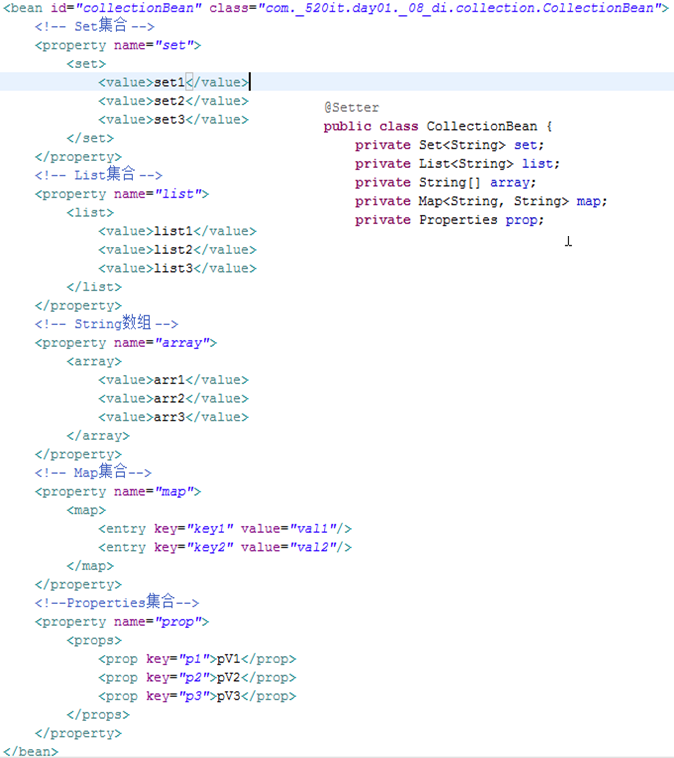
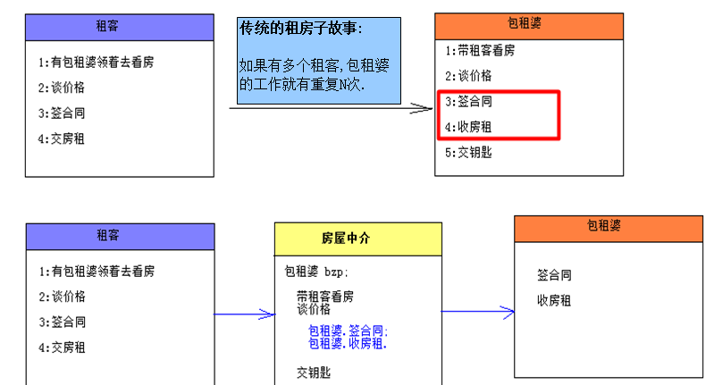
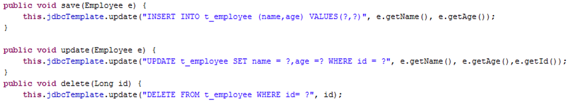
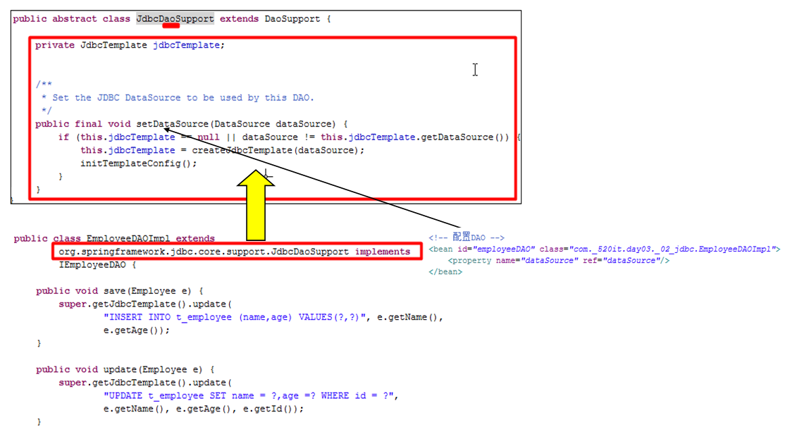

# IoC和DI介绍

01_03

## IoC：Inverse of Control（控制反转）

读作“反转控制”，更好理解，不是什么技术，而是一种设计思想，好比于MVC。**就是将原本在程序中手动创建对象的控制权，交由Spring框架来管理**。

正控：若调用者需要使用某个对象，其**自身就得负责该对象的创建**。

反控：**调用者只管负责从Spring容器中获取需要使用的对象，不关心对象的创建过程**，也就是把创建对象的控制权反转给了Spring框架。

在这里完美地体现了好莱坞法则（Don’t call me ,I’ll call you）。

## DI：Dependency Injection（依赖注入）

从字面上分析：

IoC：指将对象的创建权，反转给了Spring容器；

DI ：指Spring创建对象的过程中，将对象依赖属性（简单值，集合，对象）通过配置设值给该对象。


IoC和DI其实是同一个概念的不同角度描述，DI相对IoC而言，明确描述了“**被注入对象依赖IoC容器配置依赖对象**”。

## Container

容器，在生活中容器就是一种盛放东西的器皿，从程序设计角度看作是装对象的对象，因为存在对对象的存入、取出等操作，所以容器还要管理对象的生命周期(**对象的创建,初始化,操作,销毁等**)。

# Spring的HelloWorld程序

01_04

## 步骤

1. 准备jar包

   spring-beans-4.1.2.RELEASE.jar

   spring-core-4.1.2.RELEASE.jar

   报错再添加：com.springsource.org.apache.commons.logging-1.1.1.jar

2. 开发HelloWorld程序

   ```java
   public class HelloWorld {
   	@Setter
   	private String username;
   
   	public void sayHello() {
   		System.out.println("Hello World," + username);
   	}
   }
   ```

3. 在applicationContext.xml中完成配置

   ```xml
   <?xml version="1.0" encoding="UTF-8"?>
   <beans xmlns="http://www.springframework.org/schema/beans"
       xmlns:xsi="http://www.w3.org/2001/XMLSchema-instance"
       xmlns:util="http://www.springframework.org/schema/util" xsi:schemaLocation="
           http://www.springframework.org/schema/beans http://www.springframework.org/schema/beans/spring-beans.xsd
           http://www.springframework.org/schema/util http://www.springframework.org/schema/util/spring-util.xsd"> <!-- bean definitions here -->
   
   	<bean id="helloWorld" class="aw._01hello.HelloWorld">
   		<property name="username" value="aw"/>
   	</bean>
   </beans>
   ```

4. 启动容器

5. 从容器中得到bean

6. 调用bean响应的方法

```java
//IoC:把创建对象的权力交给Spring容器
@Test
public void testNew() throws Exception {
    //从classpath路径寻找指定资源文件
    Resource resource = new ClassPathResource("applicationContext.xml");
    //根据资源文件对象，创建Spring容器(BeanFactory)
    BeanFactory beanFactory = new XmlBeanFactory(resource);
    //从Spring容器中获取指定名称的bean对象
    HelloWorld world = (HelloWorld)beanFactory.getBean("helloWorld");
    world.sayHello();
}
```

# getBean方法的三种签名

01_05

## 什么是BeanFactory

Spring最基本的接口，表示Spring容器——生产bean对象的工厂，负责配置，创建和管理bean。

[^备注]: bean是Spring管理的单位，在Spring中一切都是bean(一个bean元素配置,一个对象,一个类).

## 深入Spring管理bean的原理

1、通过Resource对象加载配置文件

2、解析配置文件，得到指定名称的bean

3、解析bean元素，id作为bean的名字，class用于反射得到bean的实例

注意：这种配置下，**所有的bean保证有一个无参数构造器**(和访问权限无关)

4、调用getBean方法的时候，从容器中返回对象实例

**结论：就是把代码从JAVA文件中转移到了XML中**

## getBean的其中三种方式

一共5种

### 按照类型拿bean

```java
HelloWorld world=factory.getBean(HelloWorld.class);
```

要求在Spring中只配置一个这种类型的实例

### 按照bean的名字拿bean

 ```java
HelloWorld world=(HelloWorld)factory.getBean("hello"); 
 ```

按照名字拿bean不太安全

### 按照名字和类型(推荐)

```java
HelloWorld world=factory.getBean("hello", HelloWorld.class);
```

# Spring的基本配置(id和name属性以及import元素)

01_07

## 在Spring配置中，id和name属性都可以定义bean元素的名称

id属性

> **遵守XML语法的ID约束(唯一)**。必须以字母开始，可以使用字母、数字、连字符、下划线、句话、冒号，不能以“/”开头

name属性

> 就可以使用很多特殊字符，比如在Spring和Struts1或Spring MVC的整合中，就得使用name属性来的定义bean的名称。
>
> ```xml
> <bean name="/login" class="com._520it.pss.web.action.LoginAction" />
> ```

 **注意：从Spring3.1开始，id属性不再是ID类型了，而是String类型，也就是说id属性也可以使用“/”开头了**，而bean元素的id的唯一性由容器负责检查。

```xml
<bean id="/login" class="com._520it.pss.web.action.LoginAction" /> 
```

当然也使用name属性为`<bean/>`元素起多个别名，多个别名之间使用逗号或空格隔开，在代码中依然使用BeanFactory对象.getBean(...)方法获取。

```xml
<bean name="hello,hi" class="com._520it.day1._01_hello.HelloWorld"/>
```

或则

```xml
<bean name="hello hi" class="com._520it.day1._01_hello.HelloWorld"/>
```

## 引入其他配置文件(import)

**使用import元素引入其他的配置文件**：

```xml
<import resource="classpath:com/_520it/day1/_01_hello/hello.xml"/>
```

**默认情况下，从classpath的根路径寻找**

可以使用前缀来定位文件的基础位置

* **[classpath:]**：后面的文件从classpath路径开始找(推荐)[注意classloader的问题。]

* **[file:]**：后面的文件使用文件系统的路径开始找；

注意：**只有当框架中实现了Resource接口才能够识别上述的前缀标识符**

# Spring的测试

01_08


## Spring测试依赖jar

Spring4.x需要依赖的单元测试得是最新的junit4.12，Eclipse自带的junit4.8不支持，同时从Spring4.x开始，还得依赖AOP包的支持

junit-4.12.jar

hamcrest-core-1.3.jar

spring-test-4.1.2.RELEASE.jar

spring-context-4.1.2.RELEASE.jar

spring-aop-4.1.2.RELEASE.jar

spring-expression-4.1.2.RELEASE.jar

## 代码示例

```java
//告诉JVM，要在JVM上运行Spring容器
@RunWith(SpringJUnit4ClassRunner.class)
//从哪里去找配置文件
@ContextConfiguration("classpath:aw/_02SpringTest/SpringTest-context.xml")
public class SpringTest {
	//自动注入bean对象
	@Autowired
	private SomeBean someBean;

	@Test
	public void test() throws Exception {
		someBean.sayHello();
	}
}
```

把@ContextConfiguration("classpath:applicationContext.xml") 写成@ContextConfiguration

默认去找的当前测试类名-context.xml配置文件,如:HelloWorldTest-context.xml

# BeanFactory和ApplicationContext以及bean的创建时机

01_09

## IoC容器

**BeanFactory**：是Spring中最底层的接口，**只提供了最简单的IoC功能,负责配置，创建和管理bean**

在应用中，一般不使用BeanFactory，而推荐使用**ApplicationContext（应用上下文）**，原因如下。

## BeanFactory和ApplicationContext的区别

1、ApplicationContext继承了BeanFactory，拥有了基本的IoC功能

2、除此之外，ApplicationContext还提供了以下的功能

* 支持国际化

* 支持消息机制

* 支持统一的资源加载

* 支持AOP功能

## ApplicationContext常见实现类

**ClassPathXmlApplicationContext**:读取classpath中的资源

```java
ApplicationContext ctx = new ClassPathXmlApplicationContext("applicationContext.xml");
```

**FileSystemXmlApplicationContext**:读取指定路径的资源

```java
ApplicationContext ac = new FileSystemXmlApplicationContext("c:/applicationContext.xml");
```

**XmlWebApplicationContext**:需要在Web的环境下才可以运行

```java
XmlWebApplicationContext ac = new XmlWebApplicationContext(); // 这时并没有初始化容器
ac.setServletContext(servletContext); // 需要指定ServletContext对象
ac.setConfigLocation("/WEB-INF/applicationContext.xml"); // 指定配置文件路径，开头的斜线表示Web应用的根目录
ac.refresh(); // 初始化容器
```

## bean的创建时机

* ApplicationContext在加载的时候就会创建所有的bean（Web应用建议）

* BeanFactory需要等到拿bean的时候才会创建bean（桌面程序）

### 手动控制是否延迟加载

**针对于当前xml中所有的bean**

```xml
<beans default-lazy-init="default | false | true">
```

**针对于指定的bean**

```xml
<bean lazy-init="default | false | true">
```

# bean的四种实例化方式

01_10

## 构造器实例化(无参构造器)

最标准，使用最多

```java
public class SomeBean1 {
    public SomeBean1() {}
}
```

## 静态工厂方法实例化

解决系统遗留问题

```java
public class SomeBean2 {}

public class SomeBean2Factory {
    public static SomeBean2 getSomeBean2() {
        return new SomeBean2();
    }
}
```

```xml
<bean id="someBean2" class="aw.SomeBean2Factory" factory-method="getSomeBean2" />
```

class:静态工厂类名

factory-method:静态工厂类中的静态方法，返回SomeBean2对象

## 实例工厂方法实例化

解决系统遗留问题

```java
public class SomeBean3 {}

public class SomeBean3Factory {
    public SomeBean3 getSomeBean3() {
        return new SomeBean3();
    }
}
```

```xml
<bean id="someBean3Factory" class="aw.SomeBean3Factory" />
<bean id="someBean3" factory-bean="someBean2Factory" factory-method="getSomeBean3" />
```

## 实现FactoryBean接口实例化

实例工厂变种：集成其他框架使用：**LocalSessionFactoryBean**

```java
public class SomeBean4 {}

public class SomeBean4FactoryBean implements FactoryBean<SomeBean4>{
    @Override
    public SomeBean4 getObject() throws Exception {
        return new SomeBean4();
    }
    @Override
    public Class<?> getObjectType() {
        return SomeBean4.class;
    }
    @Override
    public boolean isSingleton() {
        return true;
    }
}
```

```xml
<bean id="someBean4" class="aw.SomeBeanFactoryBean"/>
```

# bean的生命周期(作用域、初始化以及销毁)

01_11

## 作用域

```xml
<bean id="" class="" scope="作用域"/>
```

- **singleton**: 单例 ，在Spring IoC容器中仅存在一个Bean实例 （默认的scope）

- **prototype**: 多例 ，每次从容器中调用Bean时，都返回一个新的实例，即每次调用getBean()时 ，相当于执行new XxxBean()：不会在容器启动时创建对象

- **request**: 用于web开发，将Bean放入request范围 ，request.setAttribute("xxx") ， 在同一个request 获得同一个Bean

- **session**: 用于web开发，将Bean 放入Session范围，在同一个Session 获得同一个Bean 

- **globalSession**: 一般用于Porlet应用环境 , 分布式系统存在全局session概念（单点登录），如果不是porlet环境，globalSession 等同于Session 

在开发中主要使用singleton、prototype

> 对于MVC中的Action使用prototype类型，其他使用singleton
>
> Spring容器会管理Action对象的创建,此时把Action的作用域设置为prototype.

## 初始化和销毁

```xml
<!--
init-method		指明当前管理Bean类中的初始化方法
destroy-method	指明当前管理Bean类中的销毁方法
-->
<bean id="" class="" init-method="" destroy-method="" />
```

**比如DataSource,SessionFactory最终都需要关闭资源:在Bean销毁之前,都要调用close方法**.

如果**bean的scope="prototype",那么容器只负责创建和初始化，它并不会被spring容器管理**

交给用户自己调用

## DI介绍和XML的自动装配

01_12

## DI

**Dependency Injection: 依赖注入**

从字面上分析

IoC：指将对象的创建权，反转到Spring容器

DI ：指Spring创建对象的过程中，将对象依赖属性通过配置进行注入 

其实它们是同一个概念的不同角度描述。DI相对IoC而言，明确描述了“被注入对象依赖IoC容器配置依赖对象”

## XML自动装配

设置：`<bean/>`元素的autowire属性

```xml
<bean id="somebean" class="SomeBean全限定名" autowire="byType"/>
```

autowire属性:让spring按照一定的方式自己去找合适的对象,并完成DI

- default:不要自动注入

- no:不要自动注入

- byName:按照名字注入(按照属性的名字在spring中找bean) factory.getBean("属性的名字")

- byType:按照依赖对象的类型注入(factory.getBean(属性的类型))

- constructor:按照对象的构造器上面的参数类型注入

 **注意**

1. 如果按照byName自动注入,要求所有的属性名字和id的名字必须保证一种规范的命名方式

2. 如果按照byType注入,如果spring中同一个类型有多个实例-->报bean不是唯一类型错误

# DI的属性注入

01_13

**使用setter注入(属性注入)**：

使用bean元素的`<property/>`子元素设置

- 简单类型值，直接使用**value**赋值

- 引用类型，使用ref赋值

- 集合类型，直接使用对应的集合类型元素即可

spring通过属性的setter方法注入值

在配置文件中配置的值都是string，spring可以自动的完成类型的转换

属性的设置值是在init方法执行之前完成的

改进spring的测试，直接在测试类里面注入需要测试的对象



# DI的构造注入

01_14


# 属性占位符(property placeholder)

01_15

引入context命名空间

```xml
<beans xmlns:xsi="http://www.w3.org/2001/XMLSchema-instance"
	xmlns="http://www.springframework.org/schema/beans"
	xmlns:context="http://www.springframework.org/schema/context"
	xsi:schemaLocation="
		http://www.springframework.org/schema/beans 
		http://www.springframework.org/schema/beans/spring-beans.xsd
		http://www.springframework.org/schema/context
		http://www.springframework.org/schema/context/spring-context.xsd
		">
</beans>
```

提供db.properties

```properties
jdbc.driverClassName=com.mysql.jdbc.Driver
jdbc.url=jdbc:mysql:///spring
jdbc.username=root
jdbc.password=
jdbc.maxActive=5
```

设置

```xml
<!-- 引入db.properties -->
<context:property-placeholder location="classpath:db.properties" />

<!-- 配置Druid连接池 -->
<bean id="dataSource" class="com.alibaba.druid.pool.DruidDataSource" init-method="init" destroy-method="close">
	<property name="driverClassName" value="${jdbc.driverClassName}" />
    <property name="url" value="${jdbc.url}" />
    <property name="username" value="${jdbc.username}" />
    <property name="password" value="${jdbc.password}" />
   	<property name="maxActive" value="${jdbc.maxActive}" />
</bean>
```

# bean元素的继承

02_01


# 自动装配 - Spring标签

02_02

## Autowired和Qualifier标签

* 第三方程序：Spring3.0之前，需要手动配置@Autowired解析注解程序，Spring就会自动的加入针对@Autowired标签的解析程序。从Spring3.0开始，可以不再需要改配置了

  **如果不在Spring的测试环境中,也找到@Autowired的解析代码,此时也必须配置**

  ```xml
  <!-- 让Spring加入针对@Autowired标签的解析程序 -->
  <context:annotation-config/>
  ```

  

* @Autowired标签贴在**字段**或者**setter方法**上；贴在setter上的时候可以同时为一个属性注入多个对象

* **默认情况下@Autowired标签必须要能找到对应的对象，否则报错**。不过，可使用required=false来避免该问题

  ```java
  @Autowired(required=false)
  ```

## @Autowired找bean的方式

1. 首先按照**依赖对象的类型**找，如果找到则使用setter方法或者字段直接注入；

2. 如果在Spring上下文中找到多个匹配的类型，再按照名字去找，如果没有匹配则报错；

3. 可以通过使用**@Qualifier**("otherBean")标签来规定依赖对象按照bean的id+类型去找；

# 自动装配 - JavaEE标签

02_03

## Rescouce标签

* @Resource标签是JavaEE规范的标签
* `<context:annotation-config>`既引入了@Autowired标签的解析器,也引入了@Resource的解析器

## @Resource找bean的方式

1. 首先按照名字去找,如果找到,就使用setter或者字段注入

2. 如果按照名字找不到,再按照类型去找,但如果找到多个匹配类型,报错

3. 可以直接使用name属性指定bean的名称;但是,如果指定的name,就只能按照name去找,如果找不到,就不会再按照类型去找

## 与@Autowired的比较

* @Autowired:是Spring定义的标签,所以可能不太稳定,并且对象和spring框架关联(Spring对我们的代码有侵入)

* @Resouce:是J2EE的规范,所以稳定,在J2EE规范容器中也能正常使用

# 使用标签简化IoC

02_04

**使用标签来完成IoC,就必须有IoC标签的解析器**

> 使用context:component-scan来扫描spring需要管理的bean
>
> base-package就告诉spring,去哪些包及其子包里去扫描bean,如果有多个包需要被扫描;只需要用逗号隔开多个包即可
>
> ```xml
> <context:component-scan base-package="aw.dao,aw.service" />
> ```

**标注Bean的注解：@Component**

> 默认情况,直接使用类的名字(首字母小写作为bean的名字)
>
> 如果要修改bean的名称;直接使用value属性来重新定义bean的名称
>
> ```java
> @Component("otherbean")
> public class OtherBean {}
> ```

**使用@Component的限制**

> 不能运用到静态工厂方法和实例工厂方法,但是可以使用到FactoryBean
>
> 对于没有源代码的类(框架内部的预定义类),只能用XML配置

**bean组件版型**

> @Service用于标注业务层组件
>
> @Controller用于标注控制层组件（如struts中的action）
>
> @Repository用于标注数据访问组件，即DAO组件
>
> @Component泛指组件，当组件不好归类的时候，我们可以使用这个注解进行标注

**指定bean的作用域**

> ```java
> @Scope("prototype")
> ```

**初始化和销毁方法**

> ```java
> @PostConstruct//相当于<bean init-method="init" />
> public void init() { }
> @PreDestroy//相当于<bean destroy-method="destory" />
> public void destory() { }
> ```

## 对比XML

- Annotation:使用方便,XML文件很小,但是,依赖关系又重新回到了代码当中

- XML:使用稍微复杂,但是,代码很干净,代码不会很任何框架产生关系;XML安全

 两种方式都必须掌握

# 案例分析

02_06

**在我们的业务层中每一个业务方法都得处理事务**(繁琐的try-catch)

 在设计上存在两个很严重问题

- **责任不分离**.业务方法只需要关心如何完成该业务功能,不需要去关系事务管理/日志管理/权限管理等等

- **代码结构重复**.在开发中不要重复代码,重复就意味着维护成本增大



## 使用装饰设计模式

02_07


确实可以解决问题

但是会暴露真实对象——不安全

## 静态代理模式

02_08

静态代理(proxy)：在程序运行前就已经存在**代理类**的字节码文件，代理对象和真实对象的关系在程序运行前就确定了。


代理对象的某个接口只服务于某一种类型的对象，也就是说每一个真实对象都得创建一个代理对象

如果需要代理的方法很多，则要为每一种方法都进行代理处理

如果接口增加一个方法，除了所有实现类需要实现这个方法外，所有代理类也需要实现此方法。增加了代码维护的复杂度

## JDK动态代理机制

02_09

**动态代理类**是在程序运行期间由JVM通过反射等机制动态的生成的，所以不存在代理类的字节码文件。代理对象和真实对象的关系是在程序运行事情才确定的

### JDK动态代理API分析

#### java.lang.reflect.Proxy 类

Java 动态代理机制生成的所有动态代理类的父类，它提供了一组静态方法来为一组接口动态地生成代理类及其对象

主要方法：

```java
public static Object newProxyInstance(ClassLoader loader, Class<?>[] interfaces,InvocationHandler hanlder)
```

方法职责：为指定类加载器、一组接口及调用处理器生成动态代理类实例

**参数**

  loader				   类加载器778776

  interfaces			模拟的接口

  hanlder				 代理执行处理器

**返回**

动态生成的代理对象

#### java.lang.reflect.InvocationHandler接口

```java
public Object invoke(Object proxy, Method method, Object[] args)
```

方法职责：负责集中处理动态代理类上的所有方法调用

**参数**

  proxy				生成的代理对象

  method			当前调用的真实方法对象

  args				  当前调用方法的实参

**返回**

真实方法的返回结果

### 实例


```java
//事务增强操作的类
public class TransactionManagerHandler 
    implements java.lang.reflect.InvocationHandler {
    @Setter
    private Object target;//被代理对象
    @Setter
    private TransactionManager txManager;
    
    //创建代理对象
    public <T> T getProxyObject() {
        Object obj = Proxy.newProxyInstance(
            target.getClass().getClassLoader(),//类加载器
            target.getClass().getInterfaces(),//被代理对象实现的接口s
            this);//增强对象
        return (T) obj;
    }
    
    @Override
    public Object invoke(Object proxy,Method method,Object[] args) 
        throws Throwable {
        txManager.begin();
        Object ret = null;
        try {
            ret = method.invoke(target,args);
            txManager.commit();
        } catch (Exception e) {
            txManager.rollback();
        }
        return ret;
    }
}
```

## JDK动态代理存在的问题

- 代理的对象必须要**实现一个接口**

- 需要为每个对象创建代理对象

- 动态代理的最小单位是类(所有类中的方法都会被处理)

# CGLIB动态代理机制

02_10

原理是对指定的目标类**生成一个子类**，并覆盖其中方法实现增强，但因为**采用的是继承，所以不能对final修饰的类进行代理**

```java
//事务增强操作的类
public class TransactionManagerHandler 
    implements org.springframework.cglib.proxy.InvocationHandler {
    @Setter
    private Object target;//被代理对象
    @Setter
    private TransactionManager txManager;

    //创建代理对象
    public <T> T getProxyObject() {
        //创建增强对象
        Enhancer enhancer = new Enhancer();
        enhancer.setSuperClass(target.getClass());//设置对那个类生成子类
        enhancer.setCallBack(this);//增强对象
        return (T) enhancer.create();//创建代理对象
    }

    @Override
    public Object invoke(Object proxy,Method method,Object[] args) 
        throws Throwable {
        txManager.begin();
        Object ret = null;
        try {
            ret = method.invoke(target,args);
            txManager.commit();
        } catch (Exception e) {
            txManager.rollback();
        }
        return ret;
    }
}
```

## CGLIB动态代理存在的问题

* CGLIB可以生成目标类的子类，并重写父类**非final**修饰符的方法

* 要求**类不能是final**的，要增强的方法要是非final、非static、非private的

* 动态代理的最小单位是类(所有类中的方法都会被处理)

# Spring的AOP概述

02_11

Aspect oritention programming(面向切面编程)

## AOP的目的

AOP能够将那些与业务无关，**却为业务模块所共同调用的逻辑或责任（例如事务处理、日志管理、权限控制等）封装起来**

便于减少系统的重复代码

降低模块间的耦合度

并有利于未来的可拓展性和可维护性

## AOP的优势

降低模块的耦合度、使系统容易扩展、更好的代码复用性

**Spring的AOP使用动态代理实现**

> 如果一个类实现了接口,那么spring就使用JDK的动态代理完成AOP
>
> 如果一个类没有实现接口,那么spring就是用cglib完成AOP

## AOP当中的概念

- 切入点（Pointcut）：在哪些类，哪些方法上切入（**where**）

- 增强（Advice）：  早期翻译为通知，在方法执行的什么时机（**when**：方法前/方法后/方法前后）做什么（**what：增强的功能**）

- 切面（Aspect）：   **切面=切入点+通知**，通俗点就是：在**什么时机，什么地点，做什么增强** 

- 织入（Weaving）：  把切面加入到对象，并创建出代理对象的过程（该过程由Spring来完成）

# XML实现AOP

02_12

AOP的规范本应该由SUN公司提出,但是被AOP联盟捷足先登

**AOP联盟制定AOP规范**，首先就要解决一个问题，怎么表示在哪些方法上增强—— **AspectJ(语言)**

**AspectJ切入点语法如下**(表示在哪些包下的哪些类的哪些方法上做切入)：

execution(modifiers-pattern? ret-type-pattern declaring-type-pattern?  name-pattern**(**param-pattern**)**throws-pattern?**)**

**翻译成中文**：

execution(<修饰符>? <返回类型> <声明类型>? <方法名>(<参数>) <异常>?)

## 配置

**导入依赖的jar包**

> spring-aop-4.1.2.RELEASE.jar
>
> com.springsource.org.aopalliance-1.0.0.jar	AOP联盟制定的规范
>
> com.springsource.org.aspectj.weaver-1.6.8.RELEASE.jar	织入

**配置命名空间**

```xml
<?xml version="1.0" encoding="UTF-8"?>
<beans xmlns:xsi="http://www.w3.org/2001/XMLSchema-instance"
	xmlns="http://www.springframework.org/schema/beans" 	
	xmlns:context="http://www.springframework.org/schema/context"
	xmlns:aop="http://www.springframework.org/schema/aop"
	xsi:schemaLocation="
		http://www.springframework.org/schema/beans 
		http://www.springframework.org/schema/beans/spring-beans.xsd
		http://www.springframework.org/schema/context
		http://www.springframework.org/schema/context/spring-context.xsd
		http://www.springframework.org/schema/aop
		http://www.springframework.org/schema/aop/spring-aop.xsd">

</beans>
```

```xml
<!-- 配置事务管理器 -->
<bean id="txManager" class="aw.TransactionManager"/>

<!-- 配置DAO -->
<bean id="employeeDAO" class="aw.service.impl.EmployeeDAOImpl"/>
<!-- 配置Service -->
<bean id="employeeService" class="aw.service.impl.EmployeeServiceImpl">
	<property name="employeeDAO" ref="employeeDAO"/>
</bean>

<!-- 配置AOP -->
<aop:config>
	<!-- what:做什么增强 -->
    <aop:aspect ref="txManager">
    	<!-- where:在哪些地方(包,类,方法)做增强 -->
        <aop:pointcut expression="execution(* aw.service.*Service.*(..))"
                      id="txPointcut" />
        <!-- when:什么时候(方法前/后) -->
        <aop:before method="beginTransaction" pointcut-ref="txPointcut"/>
        <aop:after-returning method="commit" pointcut-ref="txPointcut"/>
        <aop:throwing method="rollback" pointcut-ref="txPointcut"/>
    </aop:aspect>
</aop:config>
```

# AOP中的各种增强

02_13

## 各种不同的增强

- aop:before（前置增强）：在方法执行之前执行增强

- aop:after-returning（后置增强）：在方法正常执行完成之后执行增强(中间没有遇到任何异常)

- aop:throwing（异常增强）:在方法抛出异常退出时执行增强代码

- aop:after（最终增强）：在方法执行之后执行，相当于在finally里面执行；可以通过配置throwing来获得拦截到的异常信息

- aop:around（环绕增强）：最强大的一种增强类型。 环绕增强可以在方法调用前后完成自定义的行为，环绕通知有两个要求

  > 方法必须要返回一个Object（返回的结果）
  >
  > 方法的第一个参数必须是ProceedingJoinPoint（可以继续向下传递的切入点）

## 实例


# 注解方式实现AOP

02_14

**xml中开启AOP自动代理**

```XML
<!-- AOP的自动代理 -->
<aop:aspectj-autoproxy/>
```


# Spring的Jdbc操作

03_04

## 环境准备

mysql-connector-java-5.1.11.jar:MySQL驱动包

spring-jdbc-4.1.2.RELEASE.jar:支持JDBC

spring-tx-4.1.2.RELEASE.jar: 支持事务

## 实例

### JdbcTemplate的DML





### JdbcDaoSupport的DML

04_05




### Jdbc的DQL

04_05

```java
public Employee get(long id) {
    return jdbcTemplate.queryForObject(
        "SELECT * FROM t_employee WHERE id=?",
        new RowMapper<Employee>() {
            @Override
            public Employee mapRow(ResultSet rs,int rowNum)
                throws SQLException {
                Employee e = new Employee();
                e.setId(rs.getLong("id"));
                e.setName(rs.getString("name"));
                e.setAge(rs.getInt("age"));
                return e;
            }
        },id);
}

public List<Employee> listAll() {
    return jdbcTemplate.query("SELECT * FROM t_employee",new RowMapper<Employee>() {         @Override
        public Employee mapRow(ResultSet rs,int rowNum)
            throws SQLException {
            Employee e = new Employee();
            e.setId(rs.getLong("id"));
            e.setName(rs.getString("name"));
            e.setAge(rs.getInt("age"));
            return e;
        }
    });
}
```

# Spring对不同平台的事务管理的支持

03_08

## Spring的事务管理主要包括3个接口

- TransactionDefinition

  封装事务的隔离级别和超时时间，是否为只读事务和事务的隔离级别和传播规则等事务属性，可通过**XML配置具体信息**

- **PlatformTransactionManager**

  根据TransactionDefinition提供的事务属性配置信息，创建事务

  

- **TransactionStatus**

  封装了事务的具体运行状态。比如，是否是新开启事务，是否已经提交事务，设置当前事务为rollback-only等

## 事务管理

PlatformTransactionManager:接口统一抽象处理事务操作相关的方法

- `TransactionStatus getTransaction(TransactionDefinition definition)`

  根据事务定义信息从事务环境中返回一个已存在的事务，或者创建一个新的事务，并用TransactionStatus描述该事务的状态。

- `void commit(TransactionStatus status)`

  根据事务的状态提交事务，如果事务状态已经标识为rollback-only，该方法执行回滚事务的操作。

- `void rollback(TransactionStatus status)`

  将事务回滚，当commit方法抛出异常时，rollback会被隐式调用

在使用spring管理事务的时候，首先得告诉spring使用哪一个事务管理器

> 常用的事务管理器
>
> DataSourceTransactionManager
>
> - 使用JDBC,MyBatis的事务管理器:**依赖DataSource对象**
> 
> HibernateTransactionManager
> 
> - 使用Hibernate的事务管理器:**依赖SessionFactory对象**

# Spring对事务的支持 - XML配置

03_09

引入tx命名空间

配置xml

```xml
<!-- what:配置事务管理器 -->
<bean id="txManager" 
      class="org.springframework.jdbc.datasource.DataSourceTransactionManager">
    <property name="dataSource" ref="dataSource"/>
</bean>
<!-- when:在什么时候做增强(环绕增强) -->
<tx:advice id="txAdvice" transaction-manager="txManager">
	<tx:attributes>
    	<tx:method name="trans"/>
    </tx:attributes>
</tx:advice>
<!-- where:在哪些包下的哪些类中的哪些方法上做增强 -->
<aop:config>
	<aop:pointcut expression="execution(* aw._03_trans.service.*Service.*(..))" 
                  id="txPointcut"/>
    <!-- 建立和when,切入点的联系 -->
    <aop:advisor advice-ref="txAdvice" pointcut-ref="txPointcut"/>
</aop:config>
```

## 事务方法的属性细节

03_10


## propagation事务的传播规则(重要?)

Spring在TransactionDefinition接口中定义了七种事务传播规则,规定了事务方法和事务方法发生嵌套时事务该如何进行传播

|     事务传播规则类型      | 描述                                                         |
| :-----------------------: | :----------------------------------------------------------- |
|   PROPAGATION_REQUIRED    | <font color=blue>若当前没有事务,则新建一个事务,若当前已存在一个事务,则加入到该事务中(最常用操作)</font> |
|   PROPAGATION_SUPPORTS    | 支持当前事务,若当前没有事务,则以非事务方式执行               |
|   PROPAGATION_MANDATORY   | 使用当前事务,若当前没有事务,则抛出异常                       |
|  PROPAGATION_REQUIRE_NEW  | 新建事务,如果当前存在事务,把当前事务挂起                     |
| PROPAGATION_NOT_SUPPORTED | 以非事务方式执行操作,若当前存在事务,则把当前事务挂起         |
|     PROPAGATION_NEVER     | 以非事务方式执行,如果当前存在事务,则抛出异常                 |
|    PROPAGATION_NESTED     | 如果当前存在事务,则嵌套事务内执行;若没有事务,则执行PROPAGATION_REQUIRED类似操作 |

## 通用的CRUD环绕增强

```xml
<!-- 通用的CRUD环绕增强 -->
<tx:advice id="txAdvice" transaction-manager="txManager">
	<tx:attributes>
    	<tx:method name="get*" read-only="true"/>
        <tx:method name="query*" read-only="true"/>
        <tx:method name="list*" read-only="true"/>
        <tx:method name="*" propagation="REQUIRED"/>
    </tx:attributes>
</tx:advice>
```

事务需要开在业务层上,不要开在DAO层上

# Spring对事务的支持 - 注解配置

03_11

开启事务注解扫描

```xml
<tx:annotation-driven transaction-manager="txmanager"/>
```


如果某个方法需要自己特殊的事务配置,就在该方法上是`@Transactional`来单独为该方法配置
