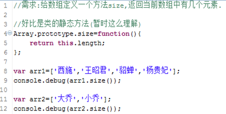
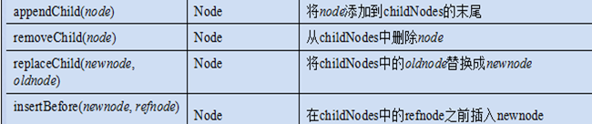
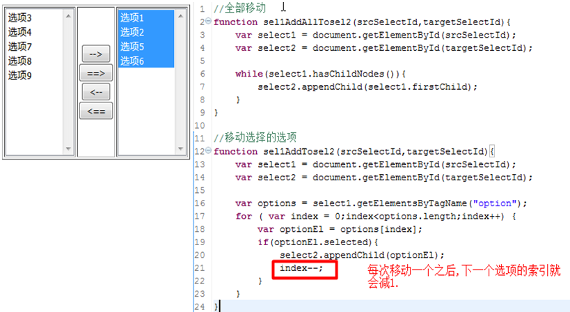
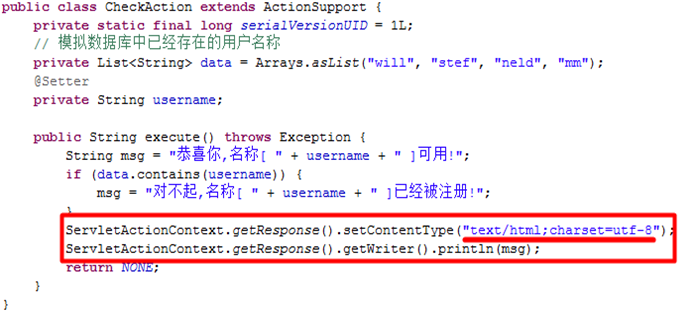
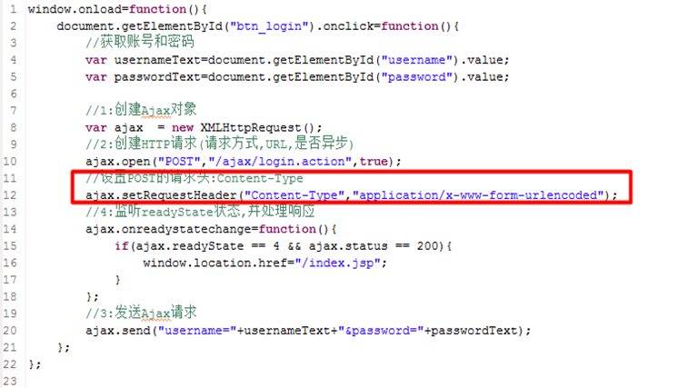

# JS

## JS中特殊的运算符

01_04

### 比较运算符:==与===

`==`忽略类型,只比较内容

`===`先比较类型,如果类型不同,返回false,否则再比较内容

### 逻辑运算符:&&与||

在逻辑运算中: **0、""、false、null、undefined、NaN均表示false**

`&&`操作: 返回最后一个为true的值,或者第一个为false的值

`||`操作: 返回第一个为true的值,或则最后一个为false的值

## 自定义对象

01_08

动态添加属性和方法

```js
/* 构造器 */
function Person() {
    alert('awsl');
}

var p = new Person();
/* 动态添加属性和方法 */
p.name = "zhangsan";
p.age = 30;
p.show = function() {
    console.log(this.name + ":" + this.age);
}
p.show();
```

构造时直接添加

```js
function Person(name,age) {
    this.name = name;
    this.age = age;
    this.toString = function() {
        return "Person[name=" + this.name + ",age=" + this.age + "]";
    }
}
```

为已经定义的Person类添加新方法

```js
//给对象原型添加新方法
Pserson.prototype.show() {
    console.log(this.toString());
}
```

## 数组

01_11

**JS中的数组类:Array,和Java中ArrayList很相似,也体现了栈结构,队列结构**

**数组常用的方法**

- length－获得数组的长度

- concat－连接数组

- join－把数组转换成字符串

- pop－弹出一个元素

- push－放入一个元素

- reverse－颠倒数据中的元素顺序

- shift－移出第一个元素

- slice－截取数组

- sort－排序数组

- unshift－在前面追加元素

- splice 从数组中添加/删除/替换元素,若是删除操作,则返回被删除的元素

  ```js
  /*
  arr = ['妲己','西施','王昭君','貂蝉','杨贵妃','大乔','小乔'];
  
  splice(start, deletecount, items)
  参数:
  	start		插入/更改/删除的位置
  	deletecount	删除的个数,如果不删除,写0
  	items		新插入的元素
  */
  //杨贵妃换成李师师
  arr.splice(4,1,'李师师');
  
  //李师师后面插入陈圆圆
  arr.splice(4,0,'陈圆圆');
  
  //删除陈圆圆
  arr.splice(5,1);
  ```


## prototype

01_12

为已经定义的Person类添加新方法

```js
function Person(name,age) {
    this.name = name;
    this.age = age;
    this.toString = function() {
        return "Person[name=" + this.name + ",age=" + this.age + "]";
    }
}
//给对象原型添加新方法
Pserson.prototype.show() {
    console.log(this.toString());
}
```



## 打开新窗口/关闭窗口

02_03

**window.open()方法：打开一个新窗口**

> 调用示例：
>
> window.open("http://www.520it.com/", "_blank","")
>
> 第一个参数：要打开的网页url，可以是相对路径
>
> 第二个参数：打开窗口的目标；除了自定义名称以外，还包括_self, _parent, _top及_blank几个特殊值
>
> 第三个参数：是一个使用,组成的字符串，用于描述打开窗口的特性，比如大小、是否有工具栏等
>
> ```js
> function openWin() {
>     open("newWin.html");
> }
> ```

**close( )：关闭窗口**

```js
function closeWin() {
    close();
}
```

在非IE浏览器中,close方法不能关闭非js代码打开的窗口

在W3C规范的浏览器中(非IE):**close方法只能关闭open方法打开的窗口**

## 获取浏览器位置

02_05

获得窗口在屏幕上的位置

- IE:

  screenLeft -获得窗口所在X坐标值

  screenTop -获得窗口Y坐标值

- W3C:

  screenX -获得窗口所在X坐标值

  screenY -获得窗口Y坐标值

```js
function getScreenLocation() {
    var x = window.screenX || window.screenLeft || 0;//加0的目的,防止浏览器刚好在0位置
    var y = window.screenY || window.screenRight || 0;
    console.log(x,y);
}
```

## 定时器

02_09

**定时器**

- 在指定的时间之后,执行什么操作,只做一次

  setTimeout(fn,time)函数，返回timer，用于指定一段时间后执行某函数

- 间隔多长时间,周期性执行什么操作

  setInterval(fn,time)函数，返回timer，用于周期性执行某函数

参数fn可以是字符串组成的jascript代码，也可以是一个函数名称

参数time表示时间，毫秒为单位

- clearTimeout(timer)函数，清除由setTimeout创建的定时器

- clearInterval(timer)函数，清除由setInterval指定的定时器

## 不同节点的nodeName-nodeValue-nodeType

02_12

|           | 元素(Element) | 属性(Attribute) | 文本(Text) |
| :-------: | :-----------: | :-------------: | :--------: |
| nodeType  |       1       |        2        |     3      |
| nodeName  | 元素标签名称  |    属性名称     |   [[text]]    |
| nodeValue |     null      |     属性值      |  文本内容  |

## 属性操作

02_13

**元素上的原始属性和自定义属性的获取值和设置值**

> 操作元素的**原始属性**
>
> - 获取属性值
>   - 元素对象.属性名
>   - 元素对象["属性名"]
>
> - 设置属性值
>   - 元素对象.属性名=值
>   - 元素对象["属性名"]=值
>
> 操作元素**自定义属性**
>
> - 获取属性值
>   - 元素对象.getAttribute("属性名")
>
> - 设置属性值
>   - 元素对象.setAttribute("属性名",值)

**操作属性名和默认属性值相同的属性**

checked,selected

**操作class属性-->属性名为:className**

**操作style的属性,如:background-color**

**操作readonly属性:readonly--->readOnly**

## 节点操作

02_14 15



## 事件绑定

03_03



# AJAX

## AJAX概述

04_01

1. Ajax不是一项具体的技术，而是几门技术的综合应用

   **Javascript、XHTML和CSS、DOM、XML和XMLHttpRequest**

2. Ajax核心只不过是要在javascript中调用一个**XMLHttpRequest类**，这个类可以与Web服务器使用HTTP协议进行交互，程序不通过浏览器发出请求，而是用这个特殊的JavaScript对象发送请求和接收响应。

3. **XMLHttpRequest对象在网络上的俗称为Ajax对象**

4. 一种不用刷新整个页面便可与服务器通讯的办法(更新网页部分数据)

## 简单入门 - 获取服务端时间

04_02 03

```html
北京时间:<span id="time"></span><br/>
<input id="btn_getTime" type="button" value="获取服务端时间" />

<script type="text/javascript">
	window.onload = function() {
        document.getElementById("btn_getTime").onclick = getServerTime;
    }
    
    function getServerTime() {
        /* 1.创建AJAX对象 */
        var ajax = new XMLHttpRequest();
        /* 2.创建Http请求,设置请求方式,请求URL,是否使用异步 */
        ajax.open("get","/aw/getServerTime.action",true);
        /* 4.监听readyState属性状态,接收响应数据 */
        ajax.onreadystatechange = function() {
            if (ajax.readyState == 4 && ajax.status == 200)
                document.getElementById("time").innerHTML = ajax.responseText;
        }
        /* 3.发送请求 */
        ajax.send();
    }
</script>
```

## AJAX操作细节

04_04

### 浏览器兼容问题

早期的IE的Ajax类使用的不是XMLHttpRequest

而是**ActiveXObject**类

```js
var ajax = null;
try {
    ajax = new XMLHttpRequest();
} catch(e) {
    ajax = new ActionXObject("Microsoft.XMLHTTP");//早期IE
}
```

## IE浏览器对get请求的缓存问题

使用时间戳

```js
ajax.open("get","/aw/getServerTime.action?" + new Date().getTime(),true);
```

### HTTP状态码,异步请求错误网页404问题

只有当完全响应成功,我们才处理响应结果

```js
ajax.onreadystatechange = function() {
    /* 添加状态码判断 */
    if (ajax.readyState == 4 && ajax.status == 200)
        document.getElementById("time").innerHTML = ajax.responseText;
}
```

## 使用AJAX发送GET请求 - 检查账号是否存在

04_05

response如果包含中文需要设置编码



## 使用AJAX发送POST请求 - 用户登录

04_06

post方式需要设置请求头

必须在open之后设置



## 二级联动 - XML格式

04_09

**后台表现层**


**前台js**


## 使用JSON需要注意的地方

05_01

1. JSON数据格式:(注意:**标准**的JSON的**属性也使用引号**)

2. json对象的toSource方法,**标准**的**JSON字符串应该使用()括起来**

3. 字符串转成对象

   ```js
   var str = "{name:'will',age:17}";
   var json = eval("("+str+")");
   console.log(json);
   ```

## JSON转换的工具

05_03

### json-lib

**依赖jar包**


核心类:JSONSerializer

### fastjson

**依赖jar包**

fastjson.jar

核心类:com.alibaba.fastjson.JSON

### Struts2的json插件

05_04

**依赖jar包**

struts2-json-plugin-2.3.15.3.jar

- 让当前`<package>`继承于json-default包

- 在当前`<action>`中添加`<result>`元素,并设置type为:json

```xml
<package name="pu" namespace="/plugin" extends="struts-default,json-default">
	<action name="province" class="aw.Struts2JsonPluginAction">
    	<result type="json" name="success"></result>
    </action>
</package>
```

Struts2在ValueStack中存储数据,存在两个不同的位置

- **存放在root区域**

  默认情况下,Struts2的JSON插件把转换之后的JSON字符串存储在栈顶Action中(Action在栈顶)

  也就说,默认会把Action中的getter方法的值,存储在JSON字符串中去

  可以使用:`@JSON(serialize=false)`来设置,某一个getter方法不要转换成JSON字符串(使用struts2自带json插件的好处)

- **存放在context区域**

  

**使用JSON转换工具,不能选择把哪些属性转换为JSON,或者不能忽略哪些属性不能转换为JSON,而Struts2的插件比较容易**

## 开发中处理JSON的最佳实践 - 使用IJsonObject接口

05_05

并不是把一个对象中所有的属性都要转换为成JSON字符串,比如密码

应该是由选择的针对部分属性转换为JSON

**解决方案**

定义一个IJsonObject接口,定义toJson方法,所有需要把部分属性转换成JSON的类需要来实现该接口

```java
public interface IJsonObject {
    Object toJson();
}
```

在实现类中实现该接口,覆盖toJson方法

```java
@Getter @Setter @NoArgsContructor @AllArgsContructor
public class Employee implements IJsonObject {
    private Long id;
    private String name;
    private String password;
    private String email;
    private Department dept;
    
    //把EMployee的ID,名称以及部门名称转换为JSON
    public Object toJson() {
        Map<String, Object> jsonMap = new HashMap<>();
        jsonMap.put("id",id);
        jsonMap.put("name",name);
        jsonMap.put("dname",dept == null ? null : dept.getName());
        return jsonMap;
    }
}
```

然后再用json工具类转换`employee.toJson()`

# jQuery

## DOM对象和jQuery对象

05_08

通过`document.getElementById()`找到的和通过`$()`找到的不一样

1. 通过jQuery方法获取的页面元素,都是jQuery对象

2. **jQuery对象其实就是对DOM对象进行了包装**,增强相关了方法,让开发者使用起来更加便利

3. 虽然jQuery对象包装了DOM对象,但是两种不能混用
   
   可以理解为jQuery对象与DOM对象是两个不类型的对象
   
   但是我们调用jQuery对象的方法，事实上底层代码还是操作的是DOM对象

### DOM对象和jQuery对象之间的相互转换

DOM对象 --> jQuery对象

```js
$(DOM对象)
```

jQuery对象 --> DOM对象

- ```
  jQuery对象[index]
  ```

- ```js
  jQuery对象.get(index)
  ```

$等于jQuery,即jQuery===$,$就是jQuery的缩写

## prop和attr的区别

- attr 是从页面搜索获得元素值，所以页面**必须明确定义元素**才能获取值，相对来说比较慢

  ```html
  <input name='test' type='checkbox'/>
  ```

  ```js
  $('input:checkbox').attr('type'); //返回checkbox
  $('input:checkbox').attr('checked'); //返回undefined
  ```

  **因为`<input name='test' type='checkbox'>`中没有checked关键字。**

- prop是从属性对象中取值，属性对象中有多少属性，就能获取多少值，**不需要在页面中显示定义** 

  ```js
  $('input:checkbox').prop('checked'); //返回false
  ```

- attr获取的是初始化值，除非通过attr(‘name’,’value’)改变，否则值不变

  prop属性值是动态的，比如checkbox，选中后，checked变为true，prop值也会发生改变

## child和find的区别

child只找一级后代

find找所有后代

## jquery事件绑定 - on/bind/live

**bind**：向匹配元素添加一个或多个事件处理器

> $(selector).bind("click",data,function);

**live**：向**当前或未来**的匹配元素添加一个或多个事件处理器

> 单事件处理：例如 $(selector).live("click",data,function);

**on**：为指定的元素,添加一个或多个事件处理程序，并规定当这些事件发生时运行的函数

> 使用 on() 方法的事件处理程序适用于当前或未来的元素（比如由脚本创建的新元素）
>
> jquery1.7以后替代bind、live的方法
>
> 例如 $(selector).on("click",childselector,data,function)

### 区别

bind()函数只能针对已经存在的元素进行事件的设置

但是live(),on()均支持未来新添加元素的事件设置

**官方已经不推荐用bind()，替代函数为on(),这也是1.7版本新添加的函数,live()已经被删除**
