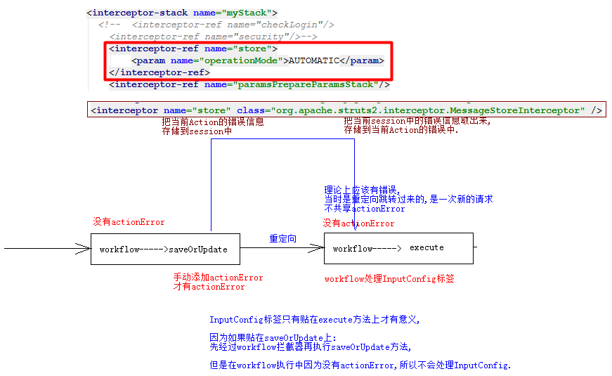
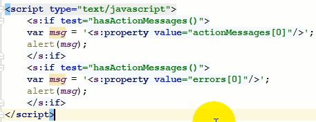
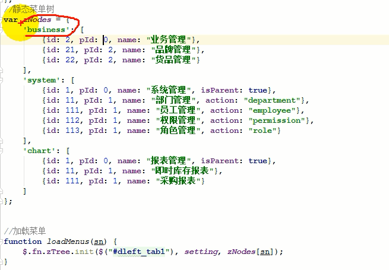
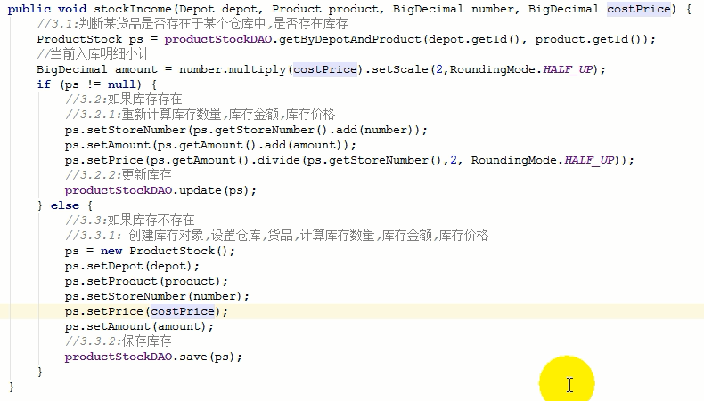
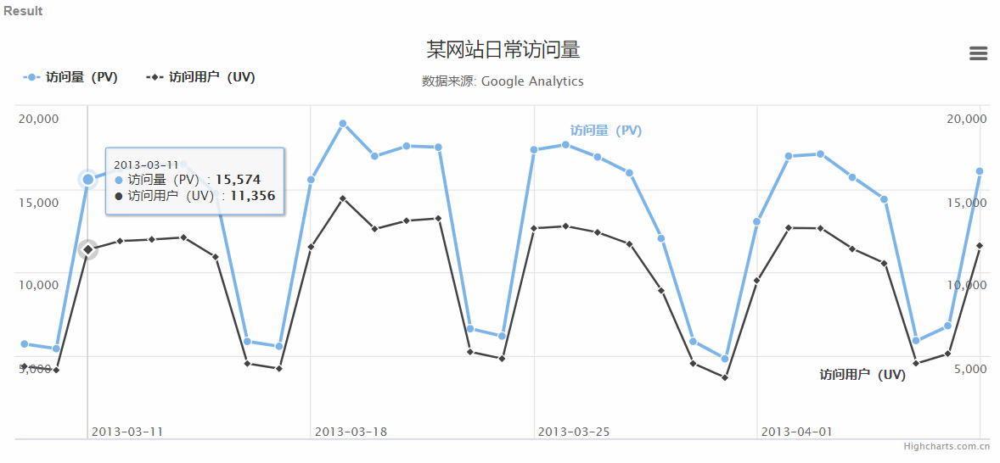

# WMS

## 项目环境准备

01_03

### 常用的日志框架

- Log4j：最广泛使用的日志框架

- common-logging：使用比较多的日志框架

- java logging：JDK提供的日志框架

**问题:很多的日志框架造成一个项目中日志框架泛滥，各种日志工具不兼容**

**解决方案**slf4j

slf4j：standard logging facade for java，定义了一套日志接口

各个日志框架兼容slf4j，但是需要一个中间适配器兼容

### slf4j的简单使用

1. 使用trace/debug/info/warn/error方法

2. 介绍log4j.properties文件
   - rootLogger的配置
   - appender的作用和配置（consoleAppender；RollingFileAppender）
   - apender中的layout
   - logger的层级结构和logger的配置

3. isDebugEnabled，isInfoEnabled

### 导入依赖

```xml
<!--日志 -->
<dependency>
    <groupId>log4j</groupId>
    <artifactId>log4j</artifactId>
    <version>1.2.12</version>
</dependency>
<dependency>
    <groupId>org.slf4j</groupId>
    <artifactId>slf4j-api</artifactId>
    <version>1.7.20</version>
</dependency>
<dependency>
    <groupId>org.slf4j</groupId>
    <artifactId>slf4j-log4j12</artifactId>
    <version>1.7.20</version>
</dependency>
```

### log4j.properties

```properties
log4j.rootLogger=ERROR, stdout
log4j.appender.stdout=org.apache.log4j.ConsoleAppender
log4j.appender.stdout.Target=System.out
log4j.appender.stdout.layout=org.apache.log4j.PatternLayout
#打印的格式
log4j.appender.stdout.layout.ConversionPattern=%d %p [%c]:%L - %m%n
#文件打印
log4j.appender.logfile=org.apache.log4j.RollingFileAppender
log4j.appender.logfile.File=druid.log
log4j.appender.logfile.MaxFileSize=512KB
log4j.appender.logfile.MaxBackupIndex=3
log4j.appender.logfile.layout=org.apache.log4j.PatternLayout
log4j.appender.logfile.layout.ConversionPattern=%d{ABSOLUTE} %5p %c{1}:%L - %m%n
```

## Druid改进

01_06

### 数据库密码的加密

```java
public static void main(String[] args) {
    String pwd = ConfigTools.encrypt("此处填写数据库密码");
    System.out.println(pwd);
}/* 获取加密后的密码 */
```

将加密后的pwd填入db.properties

在applicationContext.xml中的druid连接池中加入解密

```xml
<!-- 配置连接池对象 -->
<bean id="dataSource" class="com.alibaba.druid.pool.DruidDataSource" 
      init-method="init" destroy-method="close">
	<property name="driverClassName" value="${jdbc.driverClassName}" />
    <property name="url" value="${jdbc.url}" />
    <property name="username" value="${jdbc.username}" />
    <property name="password" value="${jdbc.password}" />
   	<property name="maxActive" value="${jdbc.maxActive}" />
    <!-- Druid解密 -->
    <property name="filters" value="config" />
    <property name="connectionProperties" value="config.decrypt=true" /> 
</bean>
```

### 数据库连接池的监控(使用log4j和servlet监控)

添加监控servlet

```xml
<!-- druid监控servlet -->
<servlet>
    <servlet-name>DruidStatView</servlet-name>
    <servlet-class>com.alibaba.druid.support.http.StatViewServlet</servlet-class>
</servlet>
<servlet-mapping>
    <servlet-name>DruidStatView</servlet-name>
    <url-pattern>/druid/*</url-pattern>
</servlet-mapping>
```

在applicationContext.xml中的druid连接池中加入配置

```xml
<property name="filters" value="config,stat" />
```

## 批量删除

01_08

```js
/* 批量删除 */
$(".btn_batch_delete").click(function() {
    var ids = $.map($(".acb:checked"),function(item) {
        //不知道参数可以先console.log(arguments);看看
        return $(item).data("eid");//H5的新特性 data-eid标签
    });
    if (ids.length == 0) {
        alert("请选择要删除的数据!");
    }
    //发送ajax请求
    $.get($(this).data("url"),{ids : ids},function() {
        window.location.reload();//重新加载当前文档
        /* 后台action的return改为none,前台刷新 */
    })
    /*
    注意:
    这里发送出去的参数为
    ids[] 1
    ids[] 2
    ids[] 3
    需要去除[],加入全局配置
    $.ajaxSettings.traditional = true;
    */
});
```

## jQuery插件 - validate表单校验

01_09

引入jQuery的插件jquery.validate.min.js

```html
<script src="jquery.validate.min.js"></script>
```

### 校验规则

**根据name属性校验**


### 示例

```js
//表单校验
$(function() {
    $("[[editform]]").validate({        
        rules: {//校验规则
            'name': {
                required: true,
                rangelenth: [2,8]
            },
            'password': {
                required: true,
                minlength: 4
            },
            'repassword': {
                equalTo: "[[pwd]]"//根据id取
            }
        },
        messages: {//校验失败提示文本
            'name': {
                required: "请填写用户名",
                rangelenth: "用户名长度必须在{0}-{1}位之间"
            },
            'password': {
                required: "密码未填写",
                minlength: "密码长度最少{0}位"
            },
            'repassword': {
                equalTo: "两次输入密码不一致"
            }
        }
    });
});
```

## Struts2的全局异常处理

02_01

struts.xml

```xml
<!-- 全局结果视图 -->
<global-results>
	<result name="error">/WEB-INF/views/common/error.jsp</result>
</global-results>

<!-- 全局统一异常处理 -->
<global-exception-mappings>
	<exception-mapping result="error" exception="java.lang.Exception" />
</global-exception-mappings>
```

**手动trycatch处理**

```java
try {
    putContext("depts",departmentService.listAll());
    putCOntext("pageResults",employeeService.query(qo));
    int a = 1/0; //模拟异常
} catch (Exception e) {
    e.printStackTrace();
    addActionError(e.getMessage());
}
```

## store拦截器解决重定向错误信息数据丢失问题

02_03

store拦截器放在workflow拦截器前面

**store只对action之间的重定向有效**



## 错误和消息的提示处理以及修改ParametersInterceptor源代码

02_04

### 操作提示消息处理

1. 直接使用action.addActionMessage，配合<s:actionmessage>标签显示

2. 在save方法中使用action.addActionMessage，也需要配合store拦截器才能完成显示

3. actionMessage中会产生额外的提示信息
   - 设置devMode为false
   - 可以使用重写ParametersInterceptor代码处理（**推荐**）

前台显示



## jQuery插件 - artDialog对话框

02_04

引入artDialog的jQuery版插件jquery.artDialog.js

添加skin=default参数

```html
<script src="jquery.artDialog.js?skin=default"></script>
```

**删除操作**

```js
$(function() {
    $(".btn_delete").click(function() {
        var url = $(this).data("url");
        $.dialog({
            title: '操作提示',
            icon: 'face-smile',
            content: '你真的要删除吗?',
            cancel: true,
            ok: function() {
                var dialog = $.dialog({
                    title: '操作提示',
                    icon: 'face-smile'
                });
                $.get(url,function() {//url写外面,用$(this).data("url")的话考虑考虑this指针
                    dialog.content("删除成功!").button({
                        name: '朕知道了',
                        callback: function() {
                            window.location.reload();
                            /*
                            后台delete方法的return改为none
                            */
                        }
                    });
                });
            }
        });
    });
});
```

## 角色管理 - 角色编辑问题

02_08

### 问题一


**解决方案**

前台js去重

```js
$(function() {
    //获取右侧所有选项
    var ids = $.map($(".selected_premissions option"), function(item) {
        return item.value;
    });
    //迭代左侧列表选项
    $.each($(".all_permissions option"), function(index,item) {
        var id = item.value;
        if ($.inArray(id, ids) >= 0)
            //去重
            $(item).remove();
    });
});
```

### 问题二

**只会提交右侧列表中选中的选项**

用户在将左侧选中选项移到右侧后,操作右侧列表,就会造成数据不完整提交

**解决方案**

在表单提交前js控制选中右侧所有

```js
$(function() {
    $("[[edit_form]]").submit(function() {
        $(".selected_premissions option").prop("selected",true);
    });
});
```

## FreeMark代码生成器

### 概述和简单运用

03_01

1. 编写模板

   ```html
   <!-- hello.html -->
   <!DOCTYPE html>
   <html lang="en">
       <head>
           <meta charset="utf-8">
           <title>FreeMark的Hello程序</title>
       </head>
       <body>
           我是${name},今年${age}岁
       </body>
   </html>
   ```

2. 编写代码与数据合并

   ```java
   /* 1.创建配置对象 */
   Configuration config = new Configuration(Configuration.VERSION_2_3_22);
   /* 2.设置从哪个目录去加载模板文件 */
   config.setDirectoryForTemplateLoading(new File("templates"));
   /* 3.获取模板对象 */
   Template template = config.getTemplate("hello.html");
   
   /* 准备数据 */
   Map<String,Object> dataModel = new HashMap<>();
   dataModel.put("name","aw");
   dataModel.put("age",18);
   
   /* 4.合并模板和数据 */
   Writer out = new FileWriter("test.html");
   template.process(dataModel,out);
   ```

### 生成DAO组件

03_02

**数据模型对象,封装模板中的占位符数据**

```java
@Getter
public class ClassInfo {
    private String basePkg;//基础包名
    private String className;//domain类的简单类名
    private String objectName;//domain类对象名称,首字母小写
    private List<String> props = new ArrayList<>();;//当前domain的所有属性名称
    
    public ClassInfo(Class<?> clazz) {
        domainPkg = clazz.getPackage().getName();
        this.basePkg = domainPkg.subString(0,domainPkg.laseIndexOf('.'));
        this.className = clazz.getSimpleName();
        this.objectName = className.subString(0,1).toLowerCase() + className.subString(1);
        
		BeanInfo beanInfo = Introspector.getBeanInfo(clazz,BaseDomain.class);//到BaseDomain为止,排除了id
		PropertyDescriptor[] pds = beanInfo.getPropertyDescriptors();
		for (PropertyDescriptor pd : pds) {
			props.add(pd.getName());
        }
    }
}
```

**模板**

IDAO.ftl

```ftl
package ${basePkg}.dao;

import ${basePkg}.domain.${className};

public interface I${className}DAO extends IGenericDAO<${className}> {

}
```

DAOImpl.ftl

```ftl
package ${basePkg}.dao.impl;

import ${basePkg}.domain.I${className}DAO;
import ${basePkg}.domain.${className};

public class ${className}DAOImpl extends GenericDAOImpl<${className}> implements I${className}DAO {

}
```

**代码生成器**

```java
public class CodeGenerator {
    private static Configuration config;

    static {
        try{
            config = new Configuration(Configuration.VERSION_2_3_22);
            config.setDirectoryForTemplateLoading(new File("templates"));
        } catch (Exception e) {
            t.printStackTrace();
        }
    }

    public static void main(String[] args) {        
        ClassInfo classInfo = new ClassInfo(Cat.class);      
        createFile(classInfo,"IDAO.ftl","src/main/java/{0}/dao" + "I{1}DAO.java");
        createFile(classInfo,"DAOImpl.ftl","src/main/java/{0}/dao/impl" + "{1}DAOImpl.java");
    }

    /* 根据模板生成 */
    private static void createFile(ClassInfo,String templateName,String path)
        throws Exception {
        Template template = config.getTemplate(templateName);
        //设置{0}和{1}占位符
        String filepath = MessageFormat.format(
            path,classInfo.getBasePkg().replace('.','/'),
            classInfo.getClassName(),
            classInfo.getObjectName());
        File file = new File(filepath);
        if (!file.getParentFile().exists())
            file.getParentFile().mkdirs();
        template.process(classInfo,new FileWriter(filepath));
    }
}
```

#### GenericDAOImpl(样本)

```java
/* 泛型DAO接口实现类 */
public class GenericDAOImpl<T> implements IGenericDAO<T> {
    @Setter
    protected SessionFactory sessionFactory;
    
    private Class<T> targetType;//哪一个domain字节码
    public GenericDAOImpl() {
        //获取DAO实现类的带有泛型信息的父类
        ParamterizedType pType = 
            (ParamterizedType)this.getClass().getGenericSuperClass();
        //获取泛型父类中的泛型参数
        targetType = (Class<T>)pType.getActualTypeArguments()[0];
    }
    
    @Override
    void save(T t) {
        Session session = sessionFactory.getCurrentSession();
        session.save(t);
    }
    
    @Override
    void update(T t) {
        Session session = sessionFactory.getCurrentSession();
        session.update(t);
    }
    
    @Override
    /* 参数由T改为T.id,考虑级联 */
    void delete(Long id) {
        Session session = sessionFactory.getCurrentSession();
        T t = (T)session.get(targetType,id);
        session.delete(t);
    }
    
    @Override
    T get(Long id) {
        Session session = sessionFactory.getCurrentSession();
        return (T)session.get(targetType,id);
    }
    
    @Override
    List<T> listAll() {
        Session session = sessionFactory.getCurrentSession();
        return (T)session.createCriteria(targetType).list();
    }
    
    @Override
    /* 高级查询+分页查询 */
    PageResult query(QueryObject qo) {
        int currentPage = qo.getCurrentPage();
        int pageSize = qo.getPageSize();
        Session session = sessionFactory.getCurrentSession();
        //查询结果总数
        String countHql = "SELECT COUNT(obj) FROM " + targetType.getSimpleName() + " obj" + qo.getQuery();
        Query query = session.createQuery(countHql);
        setPlaceParameters(qo,query);
        int totalCount = ((Long) query.uniqueResult()).intValue();
        if (totalCount == 0)
            return PageResult.empty(pageSize); /* 代码如下 */              
        //查询结果集
        Stirng resultHql = "SELECT obj FROM " + targetType.getSimpleName() + " obj" + qo.getQuery();
        query = session.createQuery(resultHql);
        setPlaceParameters(qo,query);
        if (currentPage > 0 && pageSize > 0) {
            query.setFirstResult((currentPage - 1) * pageSize);
            query.setMaxResult(pageSize);
        }
        List result = query.list();
        return new PageResult(totalCount, result, currentPage, pageSize);
    }
/*
public static PageResult empty(int pageSize) {
	return new PageResult(0, Collections.emptyList(), 1, pageSize);
}
*/
    
    @Override
    /* 查询符合条件的多条数据 */
    List<T> queryForList(String condition,Object[] params,int currentPage,int pageSize) {
        Session session = sessionFactory.getCurrentSession();
        StringBuilder hql = new StringBuilder(80);
        hql.append("SELECT obj FROM ").append(targetType.getSimpleName()).append(" obj");
        if (params != null && params.length > 0)
            hql.append(" WHERE").append(condition);
        Query query = session.createQuery(hql);
        //设置占位符
        if (params != null) {
            for (int index = 0; index < params.length; index++)
            	query.setParameter(index,params[index]);
        }        
        //设置分页
        if (currentPage > 0 && pageSize > 0) {
            query.setFirstResult((currentPage - 1) * pageSize);
            query.setMaxResult(pageSize);
        }
        return query.list();
    }
    //设置占位符参数到Hibernate的query中
    private void setPlaceParameters(EmployeeQueryObject qo,Query query) {
        for (int index = 0; index < qo.getParams().size(); index++)
            query.setParameter(index,qo.getParams().get(index));
    }
    
    @Override
    List<T> queryForList(String condition,Object... params) {
        return queryForList(condition,params,-1,-1);
    }    
    
    @Override
    T quertForObject(String condition,Object... params) {
        List<T> list = queryForList(condition,params);
        return list.size() == 1 ? list.get(0) : null;
    }
}
```

### 生成Service组件

03_03

IService.ftl

```ftl
package ${basePkg}.service;

import ${basePkg}.domain.${className};
import ${basePkg}.query.PageResult;
import ${basePkg}.query.QueryObject;

import java.util.List;

public interface I${className}Service {
	void save(${className} ${objectName});
	void update(${className} ${objectName});
	void delete(Long id);
	${className} get(Long id);
	List<${className}> listAll();
	PageResult query(QueryObject qo);
}
```

ServiceImpl.ftl

```ftl
package ${basePkg}.service.impl;

import ${basePkg}.dao.I${className}DAO;
import ${basePkg}.domain.${className};
import ${basePkg}.query.PageResult;
import ${basePkg}.query.QueryObject;
import ${basePkg}.service.I${className}Service;

import lombok.Setter;
import java.util.List;

public class ${className}ServiceImpl implements I${className}Service {
	@Setter
	private I${className}DAO ${objectName}DAO;

	void save(${className} ${objectName}) {
		${objectName}DAO.save(${objectName});
	}
	void update(${className} ${objectName}) {
		${objectName}DAO.update(${objectName});
	}
	void delete(Long id) {
		${objectName}DAO.delete(id);
	}
	${className} get(Long id) {
		return ${objectName}DAO.get(id);
	}
	List<${className}> listAll() {
		return ${objectName}DAO.listAll();
	}
	PageResult query(QueryObject qo) {
		return ${objectName}DAO.query(qo);
	}
}
```

```java
createFile(classInfo,"IService.ftl","src/main/java/{0}/service" + "I{1}Service.java");
createFile(classInfo,"ServiceImpl.ftl","src/main/java/{0}/service/impl" + "{1}ServiceImpl.java");
```

### 生成QueryObject组件

03_03

QueryObject.ftl

```ftl
package ${basePkg}.query;

import lombok.Getter;
import lombok.Setter;

@Getter @Setter
public class ${className}QueryObject extends QueryObject {
	
	public void cunstomizedQuery() {
		//TODO
	}
}
```

#### QueryObject基类(样本)

```java
/* 高级查询对象的基类 */
public QueryObject {
    @Getter @Setter
    private int currentPage = 1;
    @Getter @Setter
    private int pageSize = 5;
    
    private List<String> conditions = new ArrayList<>();//查询条件
    private List<Object> params = new ArrayList<>();//占位符参数值
    
    /* 返回查询条件的hql */
    public String getQuery() {
        ..
        if (conditions.size() == 0)
            return "";
        return " WHERE " + StringUtils.join(conditions," AND ");
    }
    
    /* 自定义查询条件,供子类复写 */
    protected void customQuery() {}
    
    protected void addQuery(String condition,Object.. args) {
        this.conditions.add(condition);
        this.params.add(Arrays.asList(args));
    }
    
    /* 返回占位符参数值 */
    public getParams() { return this.params; }
    
    protected boolean hasLength(String str) {
        return str != null && !"".equals(str.trim());
    }
}
```

### 生成Action组件

03_03

Action.ftl

```ftl
package ${className}.web.action;

import ${basePkg}.domain.${className};
import ${basePkg}.query.${className}QueryObject;
import ${basePkg}.util.RequiredPermission;
import ${basePkg}.service.I${className}Service;

import com.opensymphony.xwork2.interceptor.annotations.InputConfig;
import lombok.Setter;
import java.util.List;

public class ${className}Action extends BaseAction {
    @Setter
    private I${className}Service ${objectName}Service;
    
    @Getter
    private ${className} ${objectName} = new ${className}();
    
    @Getter
    private ${className}QueryObject qo = new ${className}QueryObject();
    
    @RequiredPermission("${className}列表")
    @InputConfig(methodName = "input")
    public String execute() throws Exception {
        try {
            putContext("pageResult", ${objectName}Service.query(qo));
        } catch (Exception e) {
            e.printStackTrace();
            addActionError(e.getMessage());
        }
        return LIST;
    }
    
    @RequiredPermission("${className}编辑")
    public String input() throws Exception {
        if (${objectName}.getId() != null)
            ${objectName} = ${objectName}Service.get(${objectName}.getId());
        return INPUT;
    }
    
    @RequiredPermission("${className}删除")
    public String delete() throws Exception {
        if (${objectName}.getId() != null)
            ${objectName}Service.delete(${objectName}.getId());
        return SUCCESS;
    }
    
    @RequiredPermission("${className}保存或更新")
    public String saveOrUpdate() throws Exception {
        try {
            if (${objectName}.getId() != null) {
            	${objectName}Service.save(${objectName});
                addActionMessage("保存成功!");
            } else {
                ${objectName}Service.update(${objectName});
                addActionMessage("更改成功!");
            }
        } catch (Exception e) {
            e.printStackTrace();
            addActionError(e.getMessage());
        }
        return SUCCESS;
    }
    
    public void prepareSaveOrUpdate() throws Exception {
        if (${objectName}.getId() != null)
            ${objectName} = ${objectName}Service.get(${objectName}.getId());
    }
}
```

```java
createFile(classInfo,"Actionl.ftl","src/main/java/{0}/web/action" + "{1}Action.java");
```

### 生成JSP

在ClassInfo中添加字段`List<String> props`用于存放当前domain的属性字段用于页面迭代

```java
public static void main(String[] args) {        
    ClassInfo classInfo = new ClassInfo(Cat.class);      
    createFile(classInfo,"list.jsp","src/main/webapp/WEB-INF/views/{2}/list.jsp");
}

/* 根据模板生成 */
private static void createFile(ClassInfo,String templateName,String path)
    throws Exception {
    Template template = config.getTemplate(templateName);
    //设置{0}和{1}占位符
    String filepath = MessageFormat.format(
        path,classInfo.getBasePkg().replace('.','/'),
        classInfo.getClassName(),
        classInfo.getObjectName());
    File file = new File(filepath);
    if (!file.getParentFile().exists())
        file.getParentFile().mkdirs();
    template.process(classInfo,new FileWriter(filepath));
}
```

### 生成映射文件和bean配置

03_04

**hbm.xml.ftl**

```ftl
<?xml version="1.0"?>
<!DOCTYPE hibernate-mapping PUBLIC
	"-//Hibernate/Hibernate Mapping DTD 3.0//EN"
	"http://www.hibernate.org/dtd/hibernate-mapping-3.0.dtd">
<hibernate-mapping package="${basePkg}.domain">
	<class name="${className}">
		<id name="id">
			<generator class="native" />
		</id>
        <[[list]] props as pName>
            <property name="${pName}" />
        </[[list]]>
	</class>
</hibernate-mapping>
```

```java
createFile(classInfo,"hbm.xml.ftl","src/main/resource/{0}/domain/{1}.hbm.xml");
```

**配置文件追加applicationContext-XXX.xml**(不是生成,在现有文件末尾插入bean元素)

dao.xml.ftl

```ftl
<bean id="${objectName}DAO" class="${basePkg}.dao.impl.${className}DAOImpl" parent="baseDAO"></bean>
```

service.xml.ftl

```ftl
<bean id="${objectName}Service" class="${basePkg}.service.impl.${className}ServiceImpl">
	<property name="${objectName}DAO" ref="${objectName}DAO" />
</bean>
```

action.xml.ftl

```xml
<bean id="${objectName}Action" class="${basePkg}.web.Action.${className}Action" scope="prototype">
	<property name="${objectName}Service" ref="${objectName}Service" />
</bean>
```

```java
public static void main(String[] args) {        
    ClassInfo classInfo = new ClassInfo(Cat.class);      
    appendToXml(classInfo,"dao.xml.ftl","src/main/resources/applicationContext-dao.xml");
    appendToXml(classInfo,"service.xml.ftl","src/main/resources/applicationContext-service.xml");
    appendToXml(classInfo,"action.xml.ftl","src/main/resources/applicationContext-action.xml");
}

private static void appendToXml(ClassInfo classInfo, String templateName,String targetFile)
    throws Exception {
    Template template = config.getTemplate(templateName);
    StringWriter out = new StringWriter();
    template.process(classInfo,out);//把合并的数据输出到一个字符串流中
    
    XmlUtil.appendXML(targetFile,out.toString());
}
```

#### 这里用到XmlUtil.java,代码如下

```java
public class XmlUtil {
	public static void appendXML(File xml, String appendingXml) throws Exception {
		SAXReader reader = new SAXReader();
		Document doc = reader.read(xml);
		Document flagment = DocumentHelper.parseText(appendingXml);
		Element flagEle = flagment.getRootElement();
		flagEle.setQName(new QName(flagEle.getName(), doc.getRootElement()
				.getNamespace()));
		if (flagEle.elements().size() > 0) {
			for (Object c : flagEle.elements()) {
				Element cel = (Element) c;
				cel.setQName(new QName(cel.getName(), flagEle.getNamespace()));
			}
		}
		doc.getRootElement().add(flagEle);
		XMLWriter writer = new XMLWriter(new FileWriter(xml));
		writer.write(doc.getRootElement());
		writer.close();
	}
}
```

## 添加和编辑子菜单

03_07


## jQuery插件 - zTree菜单树

04_03

导入zTree相关的js,css,img

- <font color=red>"<!DOCTYPE html>"是必需的!</font>
- <font color=red>zTree的容器className一定要设置为"ztree"!</font>

### 简单json

04_04

```js
var setting = {
    data: {
        simpleData: true//启用简单json,默认false
    }
};
```



### 异步加载 - 动态菜单树

04_06

```js
var setting = {
    data: {
        simpleData: true//启用简单json
    },
    async: {
        enable: true,//启用异步加载
        url: "",
        autoParam: ["sn=qo.parentSn"]//["元素的某个属性=传递给后台的参数名"][和我们的认知有差异]
    }
};
```

## 货品图片上传

05_01

### 这里用到FileUploadUtil类,代码如下

```java
public class FileUploadUtil {
    public static final String suffix = "_small";

    public static String uploadFile(File file, String fileName)
        throws Exception {
        String uuid = UUID.randomUUID().toString();
        String fileType = fileName.substring(fileName.lastIndexOf("."));
        fileName = uuid + fileType;
        String path = ServletActionContext.getServletContext().getRealPath(
            "/upload");
        File targetFile = new File(path, fileName);
        FileUtils.copyFile(file, targetFile);

        // 缩略图是在文件后面加上_small
        String smallImg = uuid + suffix + fileType;
        File smallTargetFile = new File(path, smallImg);
        // 生成缩略图
        Thumbnails.of(targetFile).scale(0.4f).toFile(smallTargetFile);
        return "/upload/" + fileName;
    }

    /**
	 * 删除文件
	 * @param picr
	 */
    public static void deleteFile(String pic) {
        String path=ServletActionContext.getServletContext().getRealPath("/")+pic;
        File file=new File(path);
        if(file.exists()) file.delete();

        path=ServletActionContext.getServletContext().getRealPath("/")+ pic.substring(0,pic.indexOf("."))+FileUploadUtil.suffix+pic.substring(pic.indexOf("."));
        file=new File(path);
        if(file.exists()) file.delete();
    }
}
```

## jar依赖:thumbnailator - 缩略图

thumbnailator工具

依赖jar包

```xml
<dependency>
	<groupId>net.coobird</groupId>
    <artifactId>thumbnailator</artifactId>
    <version>0.4.8</version>
</dependency>
```

## jQuery插件 - FancyBox图片弹出层

05_02

引入js和css

```html
<!-- class可以自定义 -->
<a class="fancyBox" href="<s:property value='imagePath' />" title="<s:property value='name' />">
	
</a>
```

```js
$(".fancyBox").fancyBox();
```

## 使用window.showModalDialog选择采购货品

05_05

新增订单页面

```js
$(function() {
    //单机按钮进入模态框选择货品
    $(".searchproduct").click(function() {
        //接收回传的数据
        var json = window.showModalDialog("production_selectProductList.action",
                                          "",
                                          "dialogWidth=900px;dialogHeight=700px");
        /*
        	{"id":1,"costPrice":200.00,"name":"360儿童手表","brandName":"360"}
        */
        var tr = $(this).closest("tr");//找到当前行
        tr.find("[tag='name']").val(json.name);
        tr.find("[tag='pid']").val(json.id);
        tr.find("[tag='costPrice']").val(json.costPrice);
        tr.find("[tag='brand']").text(json.brandName);
    });
    
    //为价格和数量绑定change事件,计算价格×数量
    $("[tag='costPrice'],[tag=number]").change(function() {
        var tr = $(this).closest("tr");//找到当前行
        var price = parseFloat(tr.find("[tag='costPrice']").val());
        var number = parseInt(tr.find("[tag='number']").val());
        if (number && price)
            tr.find("[tag='amount']").text((number * price).toFixed(2));
    });
});
```

选择货品模态框

```html
<input type="button" value="选择该货品" class="btn_select" data-product="<s:property value='productJson'/>"
<!--
后台传过来的product对象中有个getProductJson方法
对应productJson属性
-->
```

```js
$(function() {
    $(".btn_select").click(function() {
        //设置回传的数据
        window.returnValue = $(this).data("product");
        /*
        	{"id":1,"costPrice":200.00,"name":"360儿童手表","brandName":"360"}
        */
        //关闭当前窗口
        window.close();
    });
});
```

## 保存更新订单及其明细

05_07


在xml中配置BillItem(one)方放弃了关系维护

在此需要OrderBill(many)方维护关系`item.setBill(bill);`

## 添加明细和统一事件绑定

05_08

为tbody上所有的现在以及未来匹配的元素统一绑定事件

```js
$("[[edit_table_tbody]]").on("click", ".searchproduct", function() {//接收回传的数据
    var json = window.showModalDialog("production_selectProductList.action",
                                      "",
                                      "dialogWidth=900px;dialogHeight=700px");
    /*
        {"id":1,"costPrice":200.00,"name":"360儿童手表","brandName":"360"}
    */
    var tr = $(this).closest("tr");//找到当前行
    tr.find("[tag='name']").val(json.name);
    tr.find("[tag='pid']").val(json.id);
    tr.find("[tag='costPrice']").val(json.costPrice);
    tr.find("[tag='brand']").text(json.brandName);
}).on("change", "[tag='costPrice'],[tag=number]", function() {//为价格和数量绑定change事件,计算价格×数量
    var tr = $(this).closest("tr");//找到当前行
    var price = parseFloat(tr.find("[tag='costPrice']").val());
    var number = parseInt(tr.find("[tag='number']").val());
    if (number && price)
        tr.find("[tag='amount']").text((number * price).toFixed(2));
});
```

## 保存多条订单明细

05_09

```js
//提交表单按钮
$(".btn_submit").click(function() {
    $.each("[[edit_table_tbody]]", function(index, item) {//重新设置每条明细的对应角标
        var tr = $(item);
        tr.find("[tag='pid']").prop("name", "orderBill.items[" + index + "].product.id");
        tr.find("[tag='costPrice']").prop("name", "orderBill.items[","" + index + "].costPrice");
        tr.find("[tag='number']").prop("name", "orderBill.items[","" + index + "].number");
        tr.find("[tag='remark']").prop("name", "orderBill.items[","" + index + "].remark");
    });
    $("[[edit]]").submit();
});
```

**提交时设置角标,删除明细时不用重置角标**

## 删除和更新明细

05_10

删除

```js
$("[[edit_table_tbody]]").on("click", ".removeproduct", function() {
    var tr = $(this).closest("tr");//找到当前行
    if ($("[[edit_table_tbody]]").size() == 1)//最后一行了,不删除,清空数据
        clearTrData();
    else
        tr.remove();//删除此行
});

function clearTrData() {
    tr.find("[tag='name']").val("");
    tr.find("[tag='pid']").val("");
    tr.find("[tag='costPrice']").val("");
    tr.find("[tag='number']").val("");
    tr.find("[tag='remark']").val("");
    tr.find("[tag='brand']").text("");
    tr.find("[tag='amount']").val("");
}
```

更新

```java
public void prepareSaveOrUpdate() throws Exception {
    if (orderBill.getId() != null) {//是更新操作
        orderBill = orderBillService.get(orderBill.getId());//查询出该订单,持久化状态
        orderBill.setSupplier(null);//打破订单与供应商供应商关系
        orderBill.getItems().clear();//打破订单与订单明细关系,使所有明细对象成为孤儿
        /*
        简单来说,更新订单操作
        实质上为
        删除old订单明细
        重新添加new订单明细
        */
    }
}
```

## 起止日期的时分秒生成

06_02

结束时间应该为23:59:59,以下是具体代码

```java
public class DateUtil {
    /**
     * 设置起始时间
     *   时分秒设置0
     */
    public static Date getBeginDate(Date current) {
        Calendar c = Calendar.getInstance();//Calendar抽象类,getInstance生成的是它的子类
        c.setTime(current);
        c.set(Calendar.HOUR_OF_DAY, 0);
        c.set(Calendar.MINUTE, 0);
        c.set(Calendar.SECOND, 0);
        return c.getTime();
    }

    /**
     * 设置结束时间
     *   1>时分秒设置0
     *   2>天数+1
     *   3>秒-1
     */
    public static Date getEndDate(Date current) {
        Calendar c = Calendar.getInstance();
        c.setTime(current);
        c.set(Calendar.HOUR_OF_DAY, 0);
        c.set(Calendar.MINUTE, 0);
        c.set(Calendar.SECOND, 0);
        c.add(Calendar.DATE,1);
        c.add(Calendar.SECOND,-1);
        return c.getTime();
    }
}
```

## 日期在Struts2中的回显

06_03

```jsp
<!-- 定义var属性后不会显示出来,可以被引用 -->
<s:date name="qo.beginDate" format="yyyy-MM-dd" var="bd"/>
<s:date name="qo.endDate" format="yyyy-MM-dd" var="ed"/>

<s:textfield name="qo.beginDate" value="%{bd}" />
<s:textfield name="qo.endDate" value="%{ed}" />
```

### Strut2中的三个符号$/%/#

**#**

在页面上从值栈中的context中获取数据

**$**

在配置文件中获取值栈中的数据

**%**

OGNL和String之间的转换

## js依赖My97DatePicker - 日期选择器

06_04

引入js,<font color=red>注意:calendar.js和config.js,My97DatePicker .html不能删除,一样要拷贝到js文件夹中</font>

```html
<script type="text/javascript" src="My97DatePicker.js"></script>
```

容器className一定要设置为"Wdate"

```js
$(function() {
    $("input[name='qo.beginDate']").addClass("Wdate").click(function() {
        WdatePicker({
            skin: 'ext',//设置皮肤
            maxDate: $("input[name='qo.endDate']").val() || new Date()
        });
    });
    $("input[name='qo.endDate']").addClass("Wdate").click(function() {
        WdatePicker({
            skin: 'ext',
            maxDate: new Date(),
            minDate: $("input[name='qo.beginDate']").val()
        });
    });
});
```

**在struts.xml中配置浏览器地区为中国,防止My97DatePicker 加载失败**

```xml
<!-- 写死:使用中国区域,文本,日期,数字都用中文的style -->
<contant name="struts.locale" value="zh_CN" /> 
```

## 库存操作

07_06

采购入库订单生成后,审核后执行



销售出库订单生成后,审核时执行


## 订货报表分组查询

08_05

按时间分组

**HQL支持date_format函数**,和MySQL使用方式相同


## 使用枚举封装多维分组信息

08_06

```java
/*
每个枚举常量表示一组分组情况,包含了当前分组查询的信息
*/
public enum OrderGroupByType {
    EMPLOYEE("obj.bill.inputUser.name", "obj.bill.inputUser", "订货人员"),
    PRODUCT("obj.product.name", "obj.product", "货品名称"),
    BRAND("obj.product.brand.name", "obj.product.brand", "品牌名称"),
    SUPPLIER("obj.supplier.name", "obj.supplier", "供应商"),
    MONTH("date_format(obj.bill.vdate,'%Y-%m')", "date_format(obj.bill.vdate,'%Y-%m')", "订货日期(月)"),
    DAY("date_format(obj.bill.vdate,'%Y-%m-%d')", "date_format(obj.bill.vdate,'%Y-%m-%d')", "订货日期(日)");

    private OrderGroupByType(String groupType, String groupValue, String groupBy) {
        this.groupValue = groupValue;
        this.groupBy = groupBy;
        this.groupType = groupType;
    }

    private String groupValue;//分组名称,hql写法:obj.bill.inputUser.name
    private String groupBy;//分组查询,如:obj.bill.inputUser
    private String groupType;//分组类型,如:订货人员
}
```

QueryObject查询条件类中的`groupType`的String类型不变

**前台传递过来的`groupType`如"employee"**

- 先通过`toUpperCase()`转成大写
- 再通过`OrderGroupByType.valueOf()`转成OrderGroupByType枚举类型

```java
OrderGroupByType groupByType = OrderGroupByType.valueOf(qo.groupType.toUpperCase());
```

**后台传给前台的分组下拉框信息**

- 先通过`OrderGroupByType.values()`转换枚举为集合
- 再放到值栈中去

```java
ActionContext.getContext().put("groupTypes",OrderGroupByType.values());
```

```jsp
<s:select list="[[groupTypes]]" name="oqo.groupType"
          listKey="name()"
          listValue="groupType" />
<!-- name():枚举中的方法,返回枚举常量的名称 -->
```

## jQuery插件 - Highcharts图表

09_03

```json
{
    xAxis: <s:property value="[[groupTypes]]" escapeHtml="false" />
    //escapeHtml false:不转义引号之类
}
```

### 官网示例

```js
var chart = null;
// 获取 CSV 数据并初始化图表
$.getJSON('https://data.jianshukeji.com/jsonp?filename=csv/analytics.csv&callback=?', function (csv) {
	chart = Highcharts.chart('container', {
		data: {
			csv: csv
		},
		title: {
			text: '某网站日常访问量'
		},
		subtitle: {
			text: '数据来源: Google Analytics'
		},
		xAxis: {
			tickInterval: 7 * 24 * 3600 * 1000, // 坐标轴刻度间隔为一星期
			tickWidth: 0,
			gridLineWidth: 1,
			labels: {
				align: 'left',
				x: 3,
				y: -3
			},
			// 时间格式化字符
			// 默认会根据当前的刻度间隔取对应的值，即当刻度间隔为一周时，取 week 值
			dateTimeLabelFormats: {
				week: '%Y-%m-%d'
			}
		},
		yAxis: [{ // 第一个 Y 轴，放置在左边（默认在坐标）
			title: {
				text: null
			},
			labels: {
				align: 'left',
				x: 3,
				y: 16,
				format: '{value:.,0f}'
			},
			showFirstLabel: false
		}, {    // 第二个坐标轴，放置在右边
			linkedTo: 0,
			gridLineWidth: 0,
			opposite: true,  // 通过此参数设置坐标轴显示在对立面
			title: {
				text: null
			},
			labels: {
				align: 'right',
				x: -3,
				y: 16,
				format: '{value:.,0f}'
			},
			showFirstLabel: false
		}],
		legend: {
			align: 'left',
			verticalAlign: 'top',
			y: 20,
			floating: true,
			borderWidth: 0
		},
		tooltip: {
			shared: true,
			crosshairs: true,
			// 时间格式化字符
			// 默认会根据当前的数据点间隔取对应的值
			// 当前图表中数据点间隔为 1天，所以配置 day 值即可
			dateTimeLabelFormats: {
				day: '%Y-%m-%d'
			}
		},
		plotOptions: {
			series: {
				cursor: 'pointer',
				point: {
					events: {
						// 数据点点击事件
						// 其中 e 变量为事件对象，this 为当前数据点对象
						click: function (e) {
							$('.message').html( Highcharts.dateFormat('%Y-%m-%d', this.x) + ':<br/>  访问量：' +this.y );
						}
					}
				},
				marker: {
					lineWidth: 1
				}
			}
		}
	});
});
```


