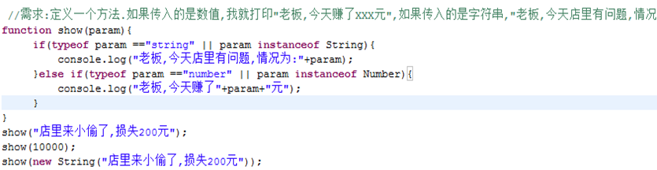
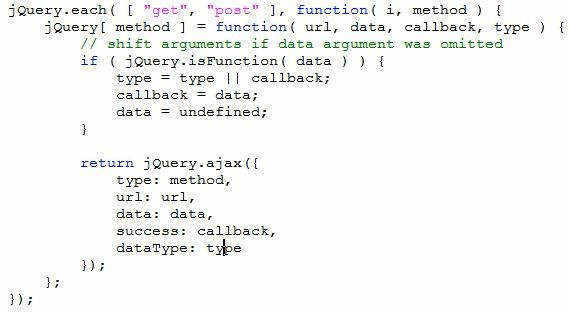
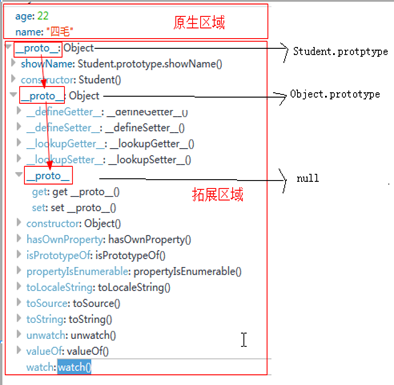
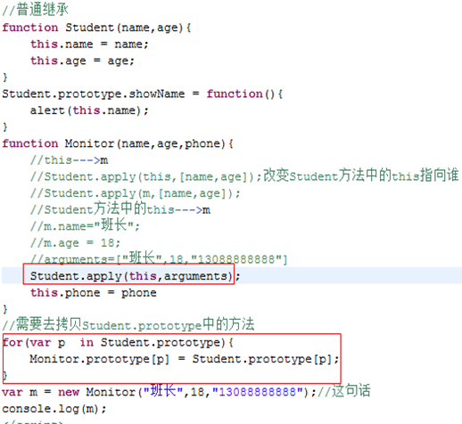
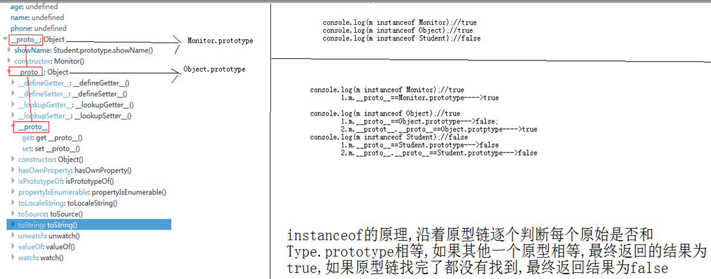
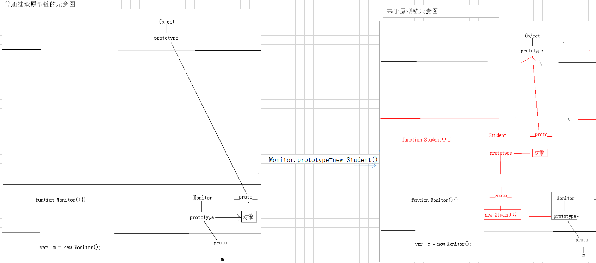

# JS中的函数

# 函数

01

### 函数的返回值

- 如果有显式写return语句,返回值为return语句后面跟表达式的值

- 如果**没有写return语句,返回值为undefined**

### 形参和实参的个数问题

- 实参个数**==**形参个数

  > 函数正常执行

- 实参个数**<**形参个数

  > 函数式正常执行的
  >
  > 缺少的形参在函数中被定义成undefined

- 实参个数**>**形参个数

  > 函数正常执行
  >
  > 多余的参数会被忽略

## 函数的特殊属性 arguments

02

### 实参个数>形参个数,多余的参数有被传递到函数中吗?

通过`console.log(arguments);`可以看到是有被传递的

### arguments

- 不管函数是否申明了形参，在函数内部都可以直接使用arguments对象来直接引用当前调用函数传入的实参

- **arguments不是一个数组，是一个伪数组对象**，类似jQuery对象，可以通过下标访问对象，并且有length属性

### JS中判断变量类型

**回顾Java中判断变量类型**

- `变量.getClass()`获取到权限定名,就知道对于的类型

- `obj instanceOf Type`判断obj是否属于Type类型

**JS中的类型**

- 基本类型:通过字面量获取的
- 引用类型:通过new的方式获取的

**JS中判断类型**

- typeof obj

  > 返回值为obj类型的全小写字符串
  >
  > 注意:
  >
  > **只能作用于基本类型**
  >
  > 如果作用在引用类型上,返回的结果都为”object”,没办法知道变量的真实类型

  ```js
  var s = "";
  console.log(typeof s);//string
  
  var s2 = new String("world");
  console.log(typeof s2);//object
  ```

- obj instanceof Type

  > 返回值为boolean类型,判断obj是否数据Type类型
  >
  > 注意:
  >
  > **只能作用在引用类型上**
  >
  > 如果作用在基本上,返回的结果都是为false结果

  ```js
  var s1 = new String("hello");
  console.log(s1 instanceof String);//true
  
  var s2 = "world";
  console.log(s2 instanceof String);//false
  ```

### 证明arguments不是数组

```js
function show() {
    console.log(typeof arguments);//object --> 说明是引用类型
    console.log(arguments instanceof Array);//false --> 不是数组
}
show();
```

## JS中的函数重载

03

### 重载的概念

使用相同的函数名解决不同的业务

**函数名相同,函数的参数不同**

- 参数的个数不同

- 参数的类型不同

### JS的重载

**JS不直接支持重载,后面定义的同名函数会覆盖之前的**

1. 解决参数个数不同的问题

   使用arguments.length来判断实际传入的参数个数

   

2. 解决类型不同的问题

   使用typeof和instanceof来判断

   

## JS中重载的运用

04

### 模拟jQuery中的$.post

```js
/*
XMLHttpRequestjQuery.post(url, [data], [callback], [type]);
*/

$.post = function(url, data, callback, type) {
    //判断第二个参数的类型
    if (typeof data == 'function') {//第二个参数是方法
        //还原参数列表
        type = callback;//第三个参数应该是'json'或者没传递,赋值给type
        callback = data;//第二个参数是方法,赋值给callback
        data = undefined;//数据置空
    }
    $.ajax({
        type: "POST",
        url: url,
        data: data,
        success: callback,
        dataType: type
    });
}
```

### jQuery中的源代码



## arguments中callee的运用

05

### 场景

在前台完成一个树状结构的匹配或者遍历,会使用到**递归**操作

递归操作是需要在函数体中重新调用当前这个函数,如果直接写函数的名称,如果外层函数名修改了,内部的递归调用的函数名也要修改

很多JS库**为了让函数体内部不需要依赖这个函数本身的名字**,会使用arguments.callee引用当前的函数,使用arguments.callee()来调用当前函数

注意,**因为arguments对象只能本函数体使用,所以callee也只在本函数体中有效**

### 举例

```js
/*
需求:将data转换为zTree可以识别的格式
	即 text属性改为name
*/
var data = [
    {
        "id": 1,
        "text": "父菜单",
        "children": [
            {
                "id": 11,
                "text": "子菜单1"
            },
            {
                "id": 22,
                "text": "子菜单2"
            }
        ]
    }
];

function conver(target) {
    for (var i = 0, i < target.length; i++) {
        target[i].name = target[i].text;
        delete target[i].text;
        if (target[i].children)
            arguments.callee(target[i].children);//递归
    }
}
```

## JS函数的高级

06

- 回调函数

  > 回调函数就是在调用A函数的时候把B函数作为了参数传递给A函数，在A函数执行到某一个时机的时候，去调用B函数的方法，把B函数的业务加入到A函数的执行流程中，我们就说B函数是回调函数

- 匿名函数

  > 如果一个function没有名字，那么这个function就叫做匿名函数
  >
  > 匿名函数一般使用在两种模式里面
  >
  > - 和回调函数配合使用，直接把一个匿名函数作为回调函数传给主函数
  >
  > - 如果一个函数为了避免内容重复执行，只想执行一次，也可以使用匿名函数
  >
  >   ```js
  >   (function() {
  >       alert("初始化");
  >   })();
  >   /*
  >   这样的函数又叫'立即函数',可以立即执行
  >   */
  >   ```

- 闭包

  > 在函数内部，使用函数外部声明的资源
  >
  > **最简单的闭包**
  >
  > ```js
  > var msg = "msg1";
  > function showMsg() {
  >     console.log(msg);
  > }
  > ```
  >
  > **需求:定义一个ID生成器**
  >
  > <font color=red>**闭包最大的用处是可以配合匿名函数把变量变成私有化;**</font>
  >
  > ```js
  > /*
  > ID生成器,下面的生成方式 可以被破坏
  > */
  > var count = 1;
  > function getID() {
  >     return count++;
  > }
  > console.log(getID());//1
  > console.log(getID());//2
  > console.log(getID());//3
  > count = 1;
  > console.log(getID());//1
  > console.log(getID());//2
  > ```
  >
  > ```js
  > /* 不会被破坏 */
  > (function() {
  >     console.log("初始化...");
  >     var count = 1;
  >     window.getID = function() {//要访问到getID,需要扩大getID的作用范围
  >         return count++;
  >     }
  > })();
  > console.log(getID());//1
  > console.log(getID());//2
  > console.log(getID());//3
  > count = 1;
  > console.log(getID());//4
  > console.log(getID());//5
  > ```

# JS面向对象

## 对象的操作

07

### 对象的定义

在JavaScript中，一切都是对象

在JavaScript中，包括两种类型，一种是基本类型，一种是引用类型

- 相同点：**两种类型都可以使用属性和调用方法**(不同于Java)

- 不同点

  > 基本类型是直接通过赋值得到的，引用类型是通过new关键字创建的
  >
  > 基本类型使用typeof可以得到对应的基本类型，而对象通过typeof得到的都是object
  >
  > **引用类型可以自己添加额外的属性和方法，但是基本类型不行**

### 对象的创建方式

- 通过new的方式来创建的

  > var obj = new Object();

- 通过JSON的方式创建

  > var obj2 = {}; 
  >
  > 注意:这样创建出来的对象也是引用类型的对象

### 对象添加属性的方式

- 通过obj.属性名的方式添加属性(属性的值可以为字面量的值或者函数.)

- 如果属性比较特殊,需要使用 obj[“属性名”]=属性值

### 对象访问属性

- 对象.属性名的方式来获取属性

- 通过 对象[“属性名”]获取属性

### 删除对象

使用`delete`关键字

## 对象的克隆

08

对象克隆就是创建一个新的对象，需要从一个目标对象中拷贝所有的属性

在Js中，对象的本质是一堆属性的集合，可以使用for..in..关键字来遍历并拷贝属性值

步骤:获取到克隆对象中的每一个属性( for in的方式 ),往新对象中加入

```js
var target = {
    name: "tom",
    age: 18,
    showName: function() {
        console.log(this.name);
    }
};

function clone(targetObj) {
    var newObj = {};
    for (var p in targetObj)
        newObj[p] = targetObj[p];//p表示对象中的属性名,这里不能用targetObj.p
    return newObj;
}

var cloneObj = clone(target);
console.log(cloneObj);
```

## JS中Function基础

09

### function看法

1. 把funtion看做是一个函数或者方法来调用

   ```js
   function show(){}
   ```

2. 把function看做是对象的属性的值

   ```js
   var obj = {};
   obj.showName=function(){}
   ```

3. 把function看做是一个变量

   ```js
   var sendMsg = function(name) {
       alert("发送短信给" + name);
   }  
   //对象.某方法()----->访问后面的function
   sendMsg.call(window,"小明");
   ```

### this和作用域

全局变量：在script中直接使用var声明的变量；所有的全局变量都是声明在window对象上的

局部变量：在一个函数体内声明的变量

变量的使用遵循就近原则

> this关键字可以明确的指定作用域
>
> this关键字代表的是一个作用范围，谁调用这个函数，this指代的作用域就是谁
>
> 所有不加前缀的函数调用，作用域都是window

### call和apply

**call和apply都可以改变函数执行时候的this指向谁**

- call(thisObject/scope,methodArguments);

- apply(thisObject/scope,methodArgArray);

两个方法都可以临时的把一个方法的调用指派到指定的对象上，即把这个方法定义中所有的this指向thisObject

两个方法的区别：

> call方法第二个参数是**变参，代表方法调用的实参**
>
> apply方法第二个参数必须是**实参的数组**

## 给对象添加方法

10

**直接在构造器中添加方法**

> ```js
> function Student(name) {
>        this.name = name;
>        this.showName = function() {
>            alert(this.name);
>        }
> }
> var s1 = new Student("aw1");
> var s2 = new Student("aw2");
> console.log(s1.showName == s2.showName);//false
> ```
> 
>缺点:**每创建出一个对象都额外的创建出一个function对象**,内存占用过多

**把公共方法定义成全局的方法,在构造方法中引用这个全局方法**

> ```js
> var showName = function() {
>        alert(this.name);
> };
> function Student(name) {
>        this.name = name;
>        this.showName = showName;
> }
> var s1 = new Student("aw1");
> var s2 = new Student("aw2");
> console.log(s1.showName == s2.showName);//true
> ```
>
> 缺点:定义了全局的方法,但是全局的方法只能给对象使用,全局方法说法名不副实,**破坏对象的封装性**

**使用prototype来添加属性的方法**(推荐使用)

> ```js
> function Student(name) {
>     this.name = name;
> }
> Student.prototype.showName = function() {
>     alert(this.name);
> }
> var s1 = new Student("aw1");
> var s2 = new Student("aw2");
> console.log(s1.showName == s2.showName);//true
> ```

## 对象的内部结构

11

proto：这个属性是Js对象上的隐藏属性，这个属性指向的是该对象对应类型的prototype对象



JS中对象分为两部分

> 一部分是原生部分，原生部分是在构造函数中定义的，或者是直接通过`对象.属性=value`赋值的
>
> 一部分是扩展部分，扩展部分的内容是通过`类.prototype.属性名=value`赋值的
>
> - 对于原生部分，直接使用`obj.属性(方法)`访问
>
> - 对于扩展部分，可以通过`obj.__proto__.属性(方法)`访问

对于JS的对象来说，**在查询方法或者属性的时候，会沿着prototype链**，按照就近原则访问，所以`obj.__proto__.属性(方法)`也可以直接通过`obj.属性(方法)`访问

## JS中的继承

### 普通继承

12



存在的问题:**没办法通过instanceof来判断子类的实例属于父类类型**



### 原型链的继承

13,14

```js
function Student(name, age) {
    this.name = name;
    this.age = age;
}
Student.prototype.showName = function() {
    alert(this.name);
}
function Monitor(name, age, phone) {
    Student.apply(this, arguments);
    this.phone = phone;
}
/* 在Monitor的原型链上添加Student的原型 */
Monitor.prototype = new Student();

var m = new Monitor("班长", 18, "13088888888");
console.log(m instanceof Monitor);//true
console.log(m instanceof Student);//true
console.log(m instanceof Object);//true
```


### 原型链继承分析



