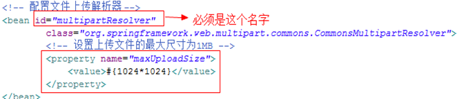
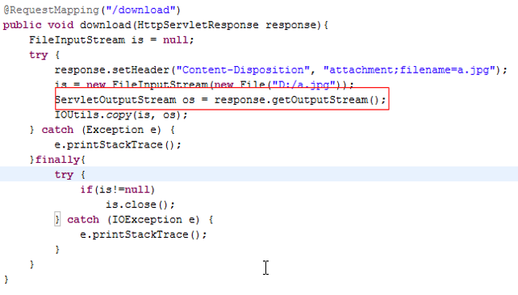

# SpringMVC

## 回顾MVC模式

Spring MVC是基于MVC模式的一个框架

它解决WEB开发中常见的问题(参数接收、文件上传、表单验证、国际化、等等)，而且使用简单

与spring无缝集成


## HelloWorld程序

02

### 导包

1. Spring核心包

   > spring-beans.jar
   >
   > spring-context.jar
   >
   > spring-core.jar
   >
   > spring-expression.jar

2. web相关的支持包

   > spring-web.jar
   >
   > spring-webmvc.jar

3. 日志相关

   > com.springsource.org.apache.commons.logging.jar

4. 全注解相关05

   > spring-aop.jar
   
5. 文件上传12

   > com.springsource.org.apache.commons.fileupload.jar
   >
   > com.springsource.org.apache.commons.io.jar

### SpringMVC相关的配置文件

application.xml(类似struts.xml)

```xml
<!-- 
name: 前台访问的地址
class: 对应的处理类
-->
<bean name="/hello" class="aw.controller.HelloWorldController"></bean>
```

### 编写核心类

实现org.springframework.web.servlet.mvc.Controller接口

```java
public class HelloWorldController implements Controller {
    @Override
    public ModelAndView handleRequest(HttpServletRequest request, HttpServletResponse response) throws Exception {
		System.out.println("awsl");
        return null;
    }
}
```

### web.xml配置请求分发器

DispatcherServlet(类似Struts2的StrutsPrepareAndExecuteFilter)

```xml
<servlet>
    <servlet-name>springMVC</servlet-name>
    <servlet-class>org.springframework.web.servlet.DispatcherServlet</servlet-class>
    <init-param>
        <param-name>contextConfigLocation</param-name>
        <param-value>classpath:application.xml</param-value>
    </init-param>
    <!-- 启动的优先级,数字越小,优先级越高 -->
    <load-on-startup>1</load-on-startup>
</servlet>
<servlet-mapping>
    <servlet-name>springMVC</servlet-name>
    <url-pattern>/</url-pattern>
</servlet-mapping>
```

* springMVC启动时默认去WEB-INF中寻找资源

* 默认找的文件名为`<servlet-name>-servlet.xml`

  ```xml
  <init-param>
      <param-name>contextConfigLocation</param-name>
      <param-value>classpath:application.xml</param-value>
  </init-param>
  ```

* 在第一次访问的时候去加载spring的配置文件

  希望在服务器启动的时候就去加载spring配置文件

  ```xml
  <!-- 启动的优先级,数字越小,优先级越高 -->
  <load-on-startup>1</load-on-startup>
  ```

## 简单应用

03

```java
public ModelAndView handleRequest(HttpServletRequest request, 
                                  HttpServletResponse response) throws Exception {
    /*
    以前的写法:
    	request.setAttribute("msg", "今天下暴雨了");
    	request.getRequestDispatcher("/hello.jsp").forward(request, response);
    */
    ModelAndView mv = new ModelAndView();
    mv.addObject("msg", "今天下暴雨了");
    mv.setViewName("/hello.jsp");
    return mv;
}
```

```jsp
<body>
    ${msg}
</body>
```

## URL映射的方式

04

- BeanNameURL方式

  **对应的类需要实现Controller接口**

  ```xml
  <bean name="/hello" class="aw.controller.HelloWorldController"></bean>
  ```

  ```java
  public class HelloWorldController implements Controller {
      @Override
      public ModelAndView handleRequest(HttpServletRequest request, HttpServletResponse response) throws Exception {
          ModelAndView mv = new ModelAndView();
          mv.addObject("msg", "今天下暴雨了");
          mv.setViewName("/hello.jsp");
          return mv;
      }
  }
  ```

- 基于注解(推荐)

  **不需要实现接口**

  参数可以自定义,**前台传递的参数以及http相关参数都会自动注入**

  **ModelAndView或Response一定要有一个,可以为null**(即void方法必须有response作参数,无response方法必须返回ModelAndView)

  ```xml
  <bean class="aw.controller.AnnotationController"></bean>
  ```

  ```java
  @Controller//标记这个类通过注解方式映射
  public class AnnotationController {
      @RequestMapping("/method")//前台哪个请求映射这个方法
      public ModelAndView method(HttpServletRequest request, HttpServletResponse response) throws Exception {
          ModelAndView mv = new ModelAndView();
          mv.addObject("msg", "明天也下暴雨了");
          mv.setViewName("/hello.jsp");
          return mv;
      }
  }
  ```

## 全注解方式

05

### 使用步骤

1. 需要有一个注解
2. 把注解贴到某个地方
3. 需要扫描器去扫描注解

### 回顾J2EE三层的注解

表现层 @Controller

业务层 @Service

DAO持久层 @Repository

工具类 @Component

### 全注解的方式步骤

依赖spring-aop.jar

**需要引入MVC的命名空间**

开启注解扫描

```xml
<!-- 只需要扫描包中的 Controller 注解 -->
<context:component-scan base-package="aw.controller">
</context:component-scan>

<!-- MVC注解驱动支持,可以做很多事情,例如JSON解析 -->
<mvc:annotation-driven></mvc:annotation-driven>
```

在核心类上添加注解

## 静态资源的处理

06

### 现象

在WebContent中新建index.html,通过浏览器访问localhost/index.html------>404错误

### 原因

tomcat中的web.xml

- 支持访问静态资源
- 需要访问一个静态资源,tomcat有对应的servlet为我们处理,恰好该servlet的映射路径也为/

```xml
<servlet-mapping>
    <servlet-name>default</servlet-name>
    <url-pattern>/</url-pattern>
</servlet-mapping>
```

项目的web.xml

* DispatcherServlet覆盖了tomcat中的default,项目无法访问静态资源

```xml
<servlet-mapping>
    <servlet-name>springMVC</servlet-name>
    <url-pattern>/</url-pattern>
</servlet-mapping>
```

### 解决方式

需要Spring添加支持静态资源处理的配置:

```xml
<!-- 要支持对静态资源的处理 -->
<mvc:default-servlet-handler/>
```

## 传参的方式

### 回顾Struts2

#### 普通传参

前台

```jsp
<form>
    <input type="text" name="username" />
</form>
```

后台

```java
xxxAction {
    @Setter
    private String userName;
}
```

#### 模型传参

前台

```jsp
<form>
    <input type="text" name="u.username" />
</form>
```

后台

```java
xxxAction {
    @Getter
    private User u = new User();;
}
```

#### 使用ModelDriven方式

前台

```jsp
<form>
    <input type="text" name="username" />
</form>
```

后台

```java
xxxAction implements ModelDriven {
    private User u;
    getModel() {
        u = new User();
        return u;
    }
}
```

### SpringMVC的传参方式

#### 使用servlet原生api

```java
@RequestMapping("/param1")
public ModelAndView method1(HttpServletRequest request, HttpServletResponse response) throws Exception {
    String userName = request.getParameter("userName");
    String password = request.getParameter("password");
    
    User u = new User(userName, password);
    System.out.println(u);
    return null;
}
```

#### 方法定义的形参(基于同名匹配规则)

```java
@RequestMapping("/param2")
public ModelAndView method2(String userName, String password) throws Exception {
	User u = new User(userName, password);
    System.out.println(u);
    return null;
}
```

当前台名称和后台形参名字不一致的情况,需要使用@RequestParam(“前台参数名”)来注入

```java
@RequestMapping("/param2_2")
public ModelAndView method2_2(
    @RequestParam("userName") String userName, 
    String password) throws Exception {
	User u = new User(userName, password);
    System.out.println(u);
    return null;
}
```

#### 使用模型传参

前台参数名字需要和模型中的**字段名**一致

```java
@RequestMapping("/param3")
public ModelAndView method3(User u) throws Exception {
    System.out.println(u);
    return null;
}
```

#### 地址栏传参

前台发送的请求格式:/delete/5

```java
@RequestMapping("/delete/{delID}")
public ModelAndView method4(
    @PathVariable("delID") Long id) throws Exception {
    System.out.println("删除ID:" + id);
    return null;
}
```

## 中文乱码解决方案

08

只针对post有效,get的话参考JavaWeb中的乱码解决方式

```xml
<filter>
    <filter-name>CharacterEncoding</filter-name>
    <filter-class>org.springframework.web.filter.CharacterEncodingFilter</filter-class>
    <init-param>
        <param-name>encoding</param-name>
        <param-value>UTF-8</param-value>
    </init-param>
    <init-param>
        <param-name>forceEncoding</param-name>
        <param-value>true</param-value>
    </init-param>
</filter>
<filter-mapping>
    <filter-name>CharacterEncoding</filter-name>
    <url-pattern>/*</url-pattern>
</filter-mapping>
```

## 补充

09

@RequestMapping如果作用在类上,表示请求都带上这样的地址

前台访问地址:localhost/test/method


## 拦截器定义

10

### 定义拦截器类

**需要实现接口org.springframework.web.servlet.HandlerInterceptor**

```java
public class MyInterceptor implements HandlerInterceptor{   
    /* 
    在请求控制器方法前调用
    返回false,拦截请求
    返回true,放行
    */
    @Override
    public boolean preHandle(HttpServletRequest request, 
                             HttpServletResponse response, 
                             Object handler) throws Exception {
        System.out.println("拦截器执行...");
        return true;
    }

    /* 在控制器方法结束,视图结合之前调用 */
    @Override
    public void postHandle(HttpServletRequest request, 
                           HttpServletResponse response, 
                           Object handler, ModelAndView model) throws Exception {
        // TODO Auto-generated method stub
    }
    
    /* 在视图结合之后调用 */
    @Override
    public void afterCompletion(HttpServletRequest request, 
                                HttpServletResponse response, 
                                Object handler, Exception e) throws Exception {
        // TODO Auto-generated method stub
    }
}
```

### 主配置文件中配置拦截器

application.xml

```xml
<!-- 配置拦截器 -->
<mvc:interceptors>
    <!-- 前台访问拦截器 -->
    <mvc:interceptor>
        <!-- 需要拦截的路径 -->
        <mvc:mapping path="/**" />
        <!-- 排除拦截的请求 -->
        <mvc:exclude-mapping path="*.js" />
        <mvc:exclude-mapping path="/resources/**" />
        <!-- 拦截器类 -->
        <bean class="aw.interceptor.MyInterceptor"></bean>
    </mvc:interceptor>
</mvc:interceptors>
```

## 传值的方式

11

### servlet原生api

```java
@RequestMapping("/value1")
public ModelAndView handleRequest(HttpServletRequest request, 
                                  HttpServletResponse response) throws Exception {
    request.setAttribute("msg", "今天下暴雨了");
    request.getRequestDispatcher("/hello.jsp").forward(request, response);
    return null;
}
```

### springMVC提供的api

- addObject(String key, Object value)

  ```java
  model.addObject("msg", "开始下雨了");
  ```

- addAllObjects(Map map)

  ```java
  Map<String,Object> map = new HashMap<>();
  map.put("msg", "开始下雨了");
  model.addAllObjects(map);
  ```

- addObject(Object obj)

  默认key为**传入对象类型的全小写字符串,同类型的后定义的会覆盖前面的**

  ```java
  model.addObject("明天要上课");
  ```

### 直接返回模型对象

```java
@RequestMapping("/value3")
@ModelAttribute("u")//更改返回对象的默认key
public User value3(HttpServletRequest request, 
                   HttpServletResponse response) throws Exception {
    return new User("aw",18);
}
```

没有配置视图解析器之前

> 当请求/value3地址
>
> 去到方法后,没有ModelAndView对象,不知道如何去找视图
>
> **会自动给你默认的视图/value3,相当于循环调用**

#### 配置视图解析器

```xml
<!-- 配置视图解析器 -->
<bean class="org.springframework.web.servlet.view.InternalResourceViewResolver">
    <property name="prefix" value="/WEB-INF/"></property>
    <property name="suffix" value=".jsp"></property>
</bean>
```

配置视图解析器之后

> 当请求/value3地址,去到方法后
>
> 没有ModelAndView对象,不知道如何去找视图,会自动给你默认的视图/value3
>
> 最后会使用视图解析器帮我们返回的地址添加前缀信息和后缀信息,/WEB-INF/value3.jsp

如果想去掉前缀后缀,可以在返回值上做处理`forward:hello.jsp`/`redirect:hello.jsp`


### 返回String,同样通过Model对象放入

```java
@RequestMapping("/value4")
public String value4(Model model) {
    model.addObject("msg", "返回的内容");
    return "haha";//返回的视图名,前缀+返回值+后缀 --> /WEB-INF/haha.jsp
}
```

## 文件上传

11

### 导包

com.springsource.org.apache.commons.fileupload.jar

com.springsource.org.apache.commons.io.jar

### 配置文件上传解析器

1024*1024会被解析成字符串



### 编写对应上传方法

使用MultipartFile参数


```java
@Controller
public class FileController {
    @RequestMapping(value="/upload_photo",method=RequestMethod.POST)
    @ResponseBody
    public Map<String, String> uploadPhoto(MultipartFile photo,HttpServletRequest request){
        Map<String, String> ret = new HashMap<String, String>();
        if(photo == null){
            ret.put("type", "error");
            ret.put("msg", "选择要上传的文件！");
            return ret;
        }
        if(photo.getSize() > 1024*1024*1024){
            ret.put("type", "error");
            ret.put("msg", "文件大小不能超过10M！");
            return ret;
        }
        //获取文件后缀
        String suffix = photo.getOriginalFilename().substring(photo.getOriginalFilename().lastIndexOf(".")+1,photo.getOriginalFilename().length());
        if(!"jpg,jpeg,gif,png".toUpperCase().contains(suffix.toUpperCase())){
            ret.put("type", "error");
            ret.put("msg", "请选择jpg,jpeg,gif,png格式的图片！");
            return ret;
        }
        String savePath = request.getServletContext().getRealPath("/") + "/resources/upload/";
        File savePathFile = new File(savePath);
        if(!savePathFile.exists()){
            //若不存在改目录，则创建目录
            savePathFile.mkdirs();
        }
        String filename = new Date().getTime()+"."+suffix;
        try {
            //将文件保存至指定目录
            photo.transferTo(new File(savePath+filename));
        }catch (Exception e) {
            ret.put("type", "error");
            ret.put("msg", "保存文件异常！");
            e.printStackTrace();
            return ret;
        }
        ret.put("type", "success");
        ret.put("msg", "上传成功！");
        ret.put("filepath",request.getServletContext().getContextPath() + "/resources/upload/" + filename );
        return ret;
    }
}
```

## 文件下载

13

没有做太多的封装,还是使用servlet下载方式



## 源码解析

14


重点看`doDispatch(request, response);`这部分


## 将返回的对象解析成json字符串

15

### 导包

jackson-annotations.jar

jackson-core.jar

jackson.databind.jar

### 对应方法添加@ResponseBody

@ResponseBody

表示我们的请求不再交给springmvc处理

会结合JSON包,将对象解析成JSON字符串


