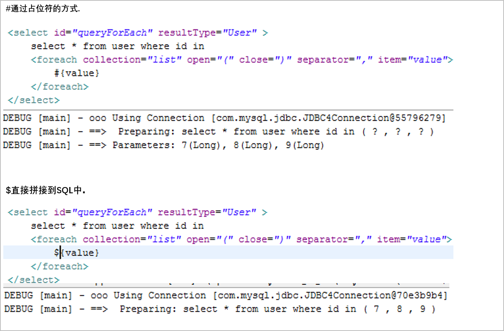

# MyBatis

## 数据信息配置

01_02

### 导包

==key==

- asm.jar
- cglib.jar(动态代理,spring课有讲)
- commons-logging.jar
- log4j.jar
- mybatis.jar
- mysql-connector-java.jar(数据库驱动包)
- slf4j.jar
- slf-log4j.jar

## 主配置文件

mybatis-config.xml

```xml
<?xml version="1.0" encoding="UTF-8" ?>
<!DOCTYPE configuration
  PUBLIC "-//mybatis.org//DTD Config 3.0//EN"
  "http://mybatis.org/dtd/mybatis-3-config.dtd">
<configuration>
    <!-- 环境配置 -->
    <environments default="default">
        <!-- 表示一个数据库环境 -->
        <environment id="default">
            <!--
    			事务管理器
    			JDBC: 表示一个权限定名的别名
   			-->
            <transactionManager type="JDBC"/>
            <!-- 
    			数据源配置
				POOLED: 使用mybatis中的内置连接池,表示一个别名
    		-->
            <dataSource type="POOLED">
                <property name="driver" value="com.mysql.jdbc.Driver"/>
                <property name="url" value="jdbc:mysql://mybatis"/>
                <property name="username" value="root"/>
                <property name="password" value=""/>
            </dataSource>
        </environment>
    </environments>
</configuration>
```

## 保存对象

01_03

- 编写domain文件User.java

- 添加domain文件映射信息UserMapper.xml

  **<font color=red>配置了`keyColumn="id" keyProperty="id" useGenerateKeys="true"`,插入操作完成会自动给对象注入id</font>**
  
  ```xml
  <?xml version="1.0" encoding="UTF-8"?>
  <!DOCTYPE mapper
  PUBLIC "-//mybatis.org//DTD Mapper 3.0//EN"
  "http://mybatis.org/dtd/mybatis-3-mapper.dtd">
  <!-- 建议namespace:所在包名+mapper名 -->
  <mapper namespace="main.UserMapper">
      <!--
  		insert表示插入操作
  		parameterType: 参数类型
  		keyColumn: 数据库中自增长字段名
  		keyProperty: 自增长的字段注入实体的哪个字段
  		useGenerateKeys: 标记这个标签需要使用数据库中的自增长id
  	-->
      <insert id="save" parameterType="main.User" 
              keyColumn="id" keyProperty="id" useGenerateKeys="true">
          insert into user(userName,password,age) values (#{username},#{password},#{age})
      </insert>
  </mapper>
  ```
  
- 将domain的映射文件配置到主配置文件中

  ```xml
  <mappers>
  	<mapper resource="main.UserMapper.xml"/>
  </mappers>
  ```

- 编写测试类,保存对象

  ```java
  @Test
  public void testSave() throws Exception {
      User u = new User("admin","123",17);
      SqlSessionFactory sf = new SqlSessionFactoryBuilder()
          .build(Resources.getResourceAsStream("mybatis-config.xml"));
      Session session = sf.openSession();
      session.insert("main.UserMapper.save", u);//namespace+id
      session.commit();
      session.close();
      System.out.println(u);
  }
  ```


## 补充

01_05

```xml
<transactionManager type="JDBC"/>
<dataSource type="POOLED">
```

**JDBC**:	使用JDBC的事务管理,表示一个全限定名的别名

对应的全限定名为:	org.apache.ibatis.transaction.jdbc.JdbcTransactionFactory

**POOLED**:	使用mybatis中的内置连接池,表示一个别名

对应的全限定名为:	org.apache.ibatis.datasource.pooled.PooledDataSourceFactory

## 监控SQL信息的配置

01_06

资源目录下添加log4j.properties

配置log4j.properties

```properties
# Global logging configuration
log4j.rootLogger=ERROR, stdout
# MyBatis logging configuration... 这里填写namespace的包名或者父包名
log4j.logger.main=TRACE
# Console output...
log4j.appender.stdout=org.apache.log4j.ConsoleAppender
log4j.appender.stdout.layout=org.apache.log4j.PatternLayout
log4j.appender.stdout.layout.ConversionPattern=%5p [%t] - %m%n
```

## 更新,查询,删除

01_07,08,09

### 更新

```xml
<update id="update" parameterType="main.User">
     update user set username=#{userName},password=#{password},age=#{age} where id=#{id}
</update>
```

```java
@Test
public void testUpdate() throws Exception {
    User u = new User("aw","gai",19);
    Session session = MybatisUtils.openSession();
    session.update("main.UserMapper.update", u);
    session.commit();
    session.close();
}
```

### 重构SqlSession开启操作

```java
public class MybatisUtils {
    private SqlSessionFactory sf = null;
    
    private static MybatisUtils instance = new MybatisUtils();
    
    private MybatisUtils() {
        try {
            sf = new SqlSessionFactoryBuilder()
        		.build(Resources.getResourceAsStream("mybatis-config.xml"));
        } catch (Exception e) {
            e.printStackTrace();
        }
    }
    
    public static SqlSession openSession() {
        return instance.sf.openSession();
    }
}
```

### 查询单个

```xml
<select id="get" parameterType="java.lang.Long" resultType="main.User">
	select id,username,password,age from user where id=#{id}
</select>
```

```java
@Test
public void testGet() throws Exception {
    Session session = MybatisUtils.openSession();
    User u = session.selectOne("main.UserMapper.get", 1L);
    System.out.println(u);
    session.close();
}
```

### 查询所有

```xml
<select id="listAll" resultType="main.User">
	select id,username,password,age from user
</select>
```

```java
@Test
public void testList() throws Exception {
    Session session = MybatisUtils.openSession();
    List<User> users = session.selectList("main.UserMapper.listAll");
    for (User u : users)
        System.out.println(u);
    session.close();
}
```

### 删除

```xml
<delete id="delete" parameterType="java.lang.Long">
    delete from user where id=#{id}
</delete>
```

```java
@Test
public void testDelete() throws Exception {
    Session session = MybatisUtils.openSession();
    session.delete("main.UserMapper.delete",1L);
    session.commit();
    session.close();
}
```

## 补充内容

01_10

对于普通的 Java 类型,有许多内建的类型别名。它们都是大小写不敏感的，注意原生类型的特殊处理

| 别名       | 映射的类型 |
| :--------- | :--------- |
| _byte      | byte       |
| _long      | long       |
| _short     | short      |
| _int       | int        |
| _integer   | int        |
| _double    | double     |
| _float     | float      |
| _boolean   | boolean    |
| string     | String     |
| byte       | Byte       |
| long       | Long       |
| short      | Short      |
| int        | Integer    |
| integer    | Integer    |
| double     | Double     |
| float      | Float      |
| boolean    | Boolean    |
| date       | Date       |
| decimal    | BigDecimal |
| bigdecimal | BigDecimal |
| object     | Object     |
| map        | Map        |
| hashmap    | HashMap    |
| list       | List       |
| arraylist  | ArrayList  |
| collection | Collection |
| iterator   | Iterator   |

sqlsession的insert,delete方法底层都是调用的update方法

## MyBatis和Hibernate的区别

01_11

和hibernate对比，MyBatis更基础，要求使用者自己控制的东西更多。

mybatis完成了基本的一些ORM概念，但是没有Hibernate那么完善。要使用mybatis，程序员的关注点更集中于SQL和数据库结构设计。

mybatis没有hibernate使用起来那么面向对象，所以，在使用mybatis的时候，hibernate的一些思想和设计需要改变。

MyBatis的好处：更底层，对性能控制更有优势

​								高级查询更方便

​								更新操作可以更新个别字段(hibernate还要判断是否空,如WMS前台的编辑员工未传递密码)

## 别名方式

01_12

mybatis-config.xml中配置

```xml
<typeAliases>
	<!--
		type: 需要定义别名的全限定类
		alias: 定义的别名
	-->
    <typeAlias type="main.User" alias="User"/>
</typeAliases>
```

## 使用db.properties配置数据库连接信息

01_13

```properties
db.driverClaassName=com.mysql.jdbc.Driver
db.url=jdbc:mysql:///mybatis
db.userName=root
db.password=
```

主配置文件更改

```xml
<property name="driver" value="${db.driverClaassName}"/>
<property name="url" value="${db.url}"/>
<property name="username" value="${db.userName}"/>
<property name="password" value="${db.password}"/>
```

1. 方式一

   SqlSessionFactory传入properties对象

   ```java
   private MybatisUtils() {
       try {
           Properties p = new Properties();
           p.load(Resources.getResourceAsStream("db.properties"));
           sf = new SqlSessionFactoryBuilder()
               .build(Resources.getResourceAsStream("mybatis-config.xml"),p);
       } catch (Exception e) {
           e.printStackTrace();
       }
   }
   ```

2. 方式二

   主配置文件中加入properties配置

   ```xml
   <properties resource="db.propesties" />
   ```

## 使用Mapper接口的方式定义

01_14

**使用statementID的方式存在如下问题**

- 传入的statement字符串有可能会写错,写错的时候必须等到运行的时候才发现

- 传入的参数无法限定类型

**使用Mapper接口的方式**

- 接口的全限定名==UserMapper.xml中的namespace
- 接口中方法==UserMapper.xml中标签ID
- 接口方法上的参数==UserMapper.xml中的parameterType
- 接口方法上的返回值类型==UserMapper.xml中的resultType

```java
/* UserMapper.java */
public interface UserMapper {
    void save(User u);
    void update(User u);
    void delete(Long id);
    User get(Long id);
    List<User> listAll();
}
```

```java
/* session.insert("main.UserMapper.save", u); */
UserMapper mapper = session.getMapper(UserMapper.class);
mapper.save(u);
```

## 使用接口的方式源码分析

01_15


## ResultMap映射

01_16

当查询出来的字段名和对象中的属性名不一致的情况,就没办法使用resultType来默认映射(同名规则)

解决方案:

使用resultMap来映射数据库中的字段到底注入到对象中什么属性中

在mapper文件中定义resultMap标签

```xml
<resultMap type="User" id="base_map">
    <!--
  		column: 查询出来的字段名
  		property: 对象中的属性名
  		jdbcType: 数据库中字段类型
  		javaType: 对象属性的类型
  	-->
    <id column="id" property="d_id" />
    <result column="d_username" property="userName" />
    <result column="d_password" property="password" />
    <result column="d_age" property="age" />
</resultMap>

<select id="listAll" resultMap="base_map">
	select d_id,d_username,d_password,d_age from user
</select>
```

## 动态SQL

01_17,18,19

### where

```java
@Getter @Setter
public class QueryObject {
    private String keyword;
    private Integer beginAge;
    private Integer endAge;
}
```

```xml
<select id="selectByCondition" parameterType="main.QueryObject" resultType="User">
	select * from user
    <where>
    	<if test="keyword!=null">
        	username like '%${keyword}%'
        </if>
        <if test="beginAge!=null">
        	AND age &gt;= #{beginAge}
        </if>
        <if test="endAge!=null">
        	AND age &lt;= #{endAge}
        </if>
    </where>
</select>
```

### set

```xml
<update id="updateDy" parameterType="main.User">
	update user
    <set>
    	<if test="userName!=null">
        	userame=#{userName},
        </if>
        <if test="password!=null">
        	password=#{password},
        </if>
        <if test="age!=null">
        	age=#{age},
        </if>
    </set>
    where id=#{id}
</update>
```

### foreach

```xml
<select id="queryForEach" resultType="User">
	select * from user where id in
    <!-- collection: list,array,map -->
    <foreach collection="list" open="(" close=")" separator="," item="value">
    	#{value}
    </foreach>
    <!-- (1,2,3,4,5) -->
</select>
```

### trim

`<where>`等价于如下

```xml
<trim prefix="WHERE" prefixOverrides="AND|OR">
</trim>
```

`set`等价于如下

```xml
<trim prefix="SET" suffixOverrides=",">
</trim>
```

## 高级查询+分页

01_20

**IUserService.java**

```java
public interface IUserService {
    public PageResult list(QueryObject qo);
}
```

**PageResult.java**

```java
@NoArguments @AllArguments
@Getter @Setter
public class PageResult {
    private Long total;
    private List rows;
    
    public static final PageResult EMPTY = new PageResult(0L,Collections.emptyList());
}
```

**QueryObject.java**

```java
@Getter @Setter
public class QueryObject {
    private Long currentPage;
    private Long pageSize;
    private String keyword;
    private Integer beginAge;
    private Integer endAge;
    
    public Long getStart() {
        return (this.currentPage - 1) * this.pageSize;
    }
}
```

**UserServiceImpl**

```java
public class UserServiceImpl implements IUserService {

    @Override
    public PageResult list(QueryObject qo) {
        SqlSession session = MyBatisUtils.openSession();
        UserMapper mapper = session.getMapper(UserMapper.class);
        //查询总数
        try{
            Long count = mapper.selectByConditionCount(qo);
            if (count > 0) {
                List<User> result = mapper.selectByCondition(qo);
                return new PageResult(count, result);
            } else {
                return PageResult.EMPTY;
            }
        } catch (Exception e) {
            e.printStackTrace();
        } finally {
            session.close();
        }
        return null;
    }
}
```

**UserMapper.xml**

```xml
<sql id="condition">
    <where>
        <if test="keyword!=null">
            username like '%${keyword}%'
        </if>
        <if test="beginAge!=null">
            AND age &gt;= #{beginAge}
        </if>
        <if test="endAge!=null">
            AND age &lt;= #{endAge}
        </if>
    </where>
</sql>

<select id="selectByConditionCount" parameterType="main.QueryObject" resultType="long">
    select count(*) from user
	<include refid="condition"></include>
</select>

<select id="selectByCondition" parameterType="main.QueryObject" resultType="User">
    select * from user
	<include refid="condition"></include>
    limit #{start},#{pageSize}
</select>
```

## $和#的区别

01_22



## 使用注解方式配置映射

02_01

```java
public interface IUserDao {
    @Insert("insert into user(username,password,age) values (#{username},#{password},#{age})")
    @Options(keyColumn="id",keyProperty="id",useGeneratedKey="true")
    void save(User u);
    
    @Insert("update user set username=#{username},password=#{password},age=#{age} where id=#{id}")
    void update(User u);
    
    @Select("select * from user where id=#{id}")
    /*
    xml里配置
    @ResultMap("base_map")
    */
    @Results({
        @Result(column="d_id",property="id"),
        @Result(column="d_username",property="userName"),
        @Result(column="d_password",property="password"),
        @Result(column="d_age",property="age")
    })
    User get(Long id);
}
```

## 使用@Param注解

02_02

```xml
<select id="login" resultType="User">
	select * from user WHERE username = #{userName} AND password = #{password}
</select>
```

mybatis中的方法都是只支持传入一个参数的

如果想传入多个参数

**方式一:Map集合**

在方法参数定义Map集合,把需要传入的参数放入map中

```java
User login(Map<String,Object> paramMap);
```

```java
Map<String,Object> paramMap = new HashMap<>();
paramMap.put("userName","jack");
paramMap.put("password","234");
User u = mapper.login(paramMap);
```

**方式二:@Param注解**

```java
User login(@Param("userName") String userName,@Param("password") String password);
```

```java
User u = mapper.login("jack","234");
```

原理:

@Param底层还是将参数封装成paramMap传递

## 单向many2one

02_03,04

Employee字段		`Long id`,`String name`,`Department dept`

Department字段	`Long id`,`String name`

数据库设计	employee表存在dept_id外键

### 保存


如果先保存employee(many方)

此时department(one方)还没保存,department的id属性为空,没有自动注入,所以数据库中的dept_id为null

### 查询

查询employee(many方)

```xml
<resultMap id="base_map" type="main.entity.Employee">
    <id column="id" property="id"/>
    <result column="name" property="name"/>
    <association colomn="dept_id" property="dept" javaType="main.entity.Department" 
                 select="main.DepartmentMapper.get">
    </association>
</resultMap>

<select id="get" resultMap="base_map">
	select id,name,dept_id from employee where id = #{id}
</select>
```

**association中的属性**

property	表示实体类中的关联关系属性名

javaType	实体类类型

select		  标识需要发送sql去查询出关联对象的sql映射

column		需要发送sql查询关联对象的查询条件参数

## 延迟加载

02_05

### 回顾hibernate中的延时加载

many方是正常的对象,one是代理代理

当调用one的非ID和非Class属性的时候才去调用session去查询出结果出来

### mybatis中的延时加载

1. 在myBatis中默认的延时加载时禁用的

   在主配置文件中开启延时加载 - lazyLoadingEnabled

   ```xml
   <setting name="lazyLoadingEnabled" value="true"/>
   ```

2. many变成代理对象.class 

   com._520it.mybatis.day02.many2one.Employee$$EnhancerByCGLIB$$42c5091f

   调用many方的任意属性,都会触发one方的加载

   aggressiveLazyLoading:当启用时, 有延迟加载属性的对象在被调用时将会完全加载任意属性。否则, 每种属性将会按需要加载

   ```xml
   <!-- 配置如下属性,按需加载  -->
   <setting name="aggressiveLazyLoading" value="false"/>
   ```

3. 在many方默认的调用equals,clone,hashCode,toString 方法都会出发one方的加载

   ```xml
   <!--
   配置只有调用many方的clone方法才会触发one方加载,
   默认为"equals,clone,hashcode,toString"
   -->
   <setting name="lazyLoadTriggerMethods" value="clone"/>
   ```

## N + 1 问题的解决方案

02_06

在查询所有many记录,每个many对应的one都是不同,查询N个many对象

总共会发出N+1条SQL(**性能特别不友好**)

### 使用连接查询

```xml
<resultMap id="base_map" type="main.entity.Employee">
    <id column="id" property="id"/>
    <result column="name" property="name"/>
    <association property="dept" javaType="main.entity.Department">
        <id column="dept_id" property="id"/>
        <result column="dept_name" property="name"/>
    </association>
</resultMap>
<select id="list" resultMap="base_map">
    select e.id,e.name,d.id as dept_id,d.name as dept_name from employee e left join department d on e.dept_id=d.id
</select>
```

### 补充

02_07

columnPrefix	为one方映射设置统一前缀

```xml
<association property="dept" javaType="main.entity.Department" columnPrefix="dept_">
    <id column="id" property="id"/>
    <result column="name" property="name"/>
</association>
```

## 一级缓存

02_08

生命周期

> 和session一样的生命周期
> 
> 通过`session.get(1L)`,`session.get(1L)`,总共两次get方法只会发一条SQL.第二次使用的是一级缓存的内容

**针对数据量大的时候,使用分页+clearCache()及时清除缓存**

```java
//清除一级缓存中内容
session.clearCache();
```

## 单向one2many

02_09,10,11,12

Employee字段		`Long id`,`String name`

Department字段	`Long id`,`String name`,`List<Employee> emps`

数据库设计	employee表存在dept_id外键

### 保存

**EmployeeMapper.xml**

```xml
<insert id="save" parameterType="main.entity.Employee" 
        keyColumn="id" keyProperty="id" useGeneratedKeys="true">
	insert into employee(name) values (#{name})
</insert>
```

**DepartmentMapper.xml**

```xml
<insert id="save" parameterType="main.entity.Department"
         keyColumn="id" keyProperty="id" useGeneratedKeys="true">
	insert into department(name) values(#{name})
</insert>

<update id="handlerRelation">
	update employee set dept_id=#{deptID} where id=#{empID}
</update>
```

**DepartmentMapper.java**

```java
void handlerRelation(@Param("deptID") String deptID,@Param("empID") String empID);
```

testSave

```java
@Test
public void testSave() {
    SqlSession session = MyBatisUtils.openSession();
    EmployeeMapper empMapper = session.getMapper(EmployeeMapper.class);
    DepartmentMapper deptMapper = session.getMapper(DepartmentMapper.class);
    
    Employee e1 = new Employee("e1");
    Employee e2 = new Employee("e2");
    Department d1 = new Department("d1");
    d1.getEmps().add(e1);
    d1.getEmps().add(e2);
    
    deptMapper.save(d1);
    empMapper.save(e1);
    empMapper.save(e2);
    
    //由one方去处理外键关系
    for (Employee emp : d1.getEmps())
    	deptMapper.handlerRelation(d1.getId(), emp.getId());
    
    session.commit();
    session.close();
}
```

### 查询

**DepartmentMapper.xml**

```xml
<resultMap id="base_map" type="main.entity.Department">
    <id column="id" property="id"/>
    <result column="name" property="name"/>
    <collection column="id" property="emps" ofType="main.entity.Employee" 
                select="main.mapper.EmployeeMapper.selectByDeptId">
    </collection>
</resultMap>

<select id="get" parameterType="long" reultMap="base_map">
    select * from department where id=#{id}
</select>
```

**EmployeeMapper.xml**

```xml
<select id="selectByDeptId" parameterType="long" resultType="main.entity.Employee">
	select id,name from employee where dept_id=#{deptId}
</select>
```

### 查询 - 内联方式

02_11

```xml
<resultMap id="base_map" type="main.entity.Department">
    <id column="id" property="id"/>
    <result column="name" property="name"/>
    <collection property="emps" ofType="Employee" columnProfix="emp_">
        <id column="id" property="id"/>
        <result column="name" property="name"/>
    </collection>
</resultMap>

<select id="get" parameterType="long" reultMap="base_map">
    select d.id,d.name,e.id as emp_id,e.name as emp_name
    from department d
    left join employee e on e.dept_id=d.id
    where d.id=#{id}
</select>
```

### 删除

02_12

**DepartmentMapper.xml**

```xml
<delete id="delete" parameterType="long">
	delete from department where id=#{id}
</delete>
```

**EmployeeMapper.xml**

```xml
<update id="updateRelation" parameterType="long">
	update employee set dept_id=null where dept_id=#{deptId}
</update>
```

testDelete

```java
@Test
public void testSave() {
    SqlSession session = MyBatisUtils.openSession();
    EmployeeMapper empMapper = session.getMapper(EmployeeMapper.class);
    DepartmentMapper deptMapper = session.getMapper(Department.class);
    
    //删除之前先处理外键约束
    Department department = deptMapper.get(17L);
    empMapper.updateRelation(17L);
    deptMapper.delete(17L);
    
    session.commit();
    session.close();
}
```

## many2many

02_13,14

Teacher字段	`Long id`,`String name`,`List<Student> stus`

Student字段	`Long id`,`String name`

数据库设计	中间表

### 保存

**TeacherMapper.xml**

```xml
<insert id="save" parameterType="main.entity.Teacher" 
        keyColumn="id" keyProperty="id" useGeneratedKeys="true">
	insert into teacher(name) values (#{name})
</insert>

<insert id="handlerRelation">
    insert into tea_stu(t_id,s_id) values(#{teaId},#{stuId})
</insert>
```

**StudentMapper.xml**

```xml
<insert id="save" parameterType="main.entity.Student" 
        keyColumn="id" keyProperty="id" useGeneratedKeys="true">
	insert into student(name) values (#{name})
</insert>
```

**TeacherMapper.java**

```java
void handlerRelation(@Param("teaId") String teaId,@Param("stuId") String stuId);
```

testSave

```java
@Test
public void testSave() {
    //准备数据
    Teacher t1 = new Teacher("t1"); Teacher t2 = new Teacher("t2");
    Student s1 = new Student("s1"); Student s2 = new Student("s2");
    t1.getStus().add(s1); t1.getStus().add(s2);
    t2.getStus().add(s1); t2.getStus().add(s2);
    
    SqlSession session = MyBatisUtils.openSession();
    TeacherMapper teaMapper = session.getMapper(TeacherMapper.class);
    StudentMapper stuMapper = session.getMapper(StudentMapper.class);
    
    teaMapper.save(t1); teaMapper.save(t2);
    stuMapper.save(s1); stuMapper.save(s2);
    
    //处理中间表的关系
    for(Student stu : t1.getStus())
        teaMapper.handleRelation(t1.getId(), stu.getId());
    for(Student stu : t2.getStus())
        teaMapper.handleRelation(t2.getId(), stu.getId());
    
    session.commit();
    session.close();
}
```

### 查询

**TeacherMapper.xml**

```xml
<resultMap id="base_map" type="main.entity.Teacher">
    <id column="id" property="id"/>
    <result column="name" property="name"/>
    <collection column="id" property="stus" ofType="main.entity.Student" 
                select="main.mapper.StudentMapper.selectByTId">
    </collection>
</resultMap>

<select id="get" parameterType="long" reultMap="base_map">
    select * from teacher where id=#{id}
</select>
```

**StudentMapper.xml**

```xml
<select id="selectByTId" parameterType="long" resultType="main.entity.Student">
	select id,name from student where id in (select s_id from tea_stu where t_id in(select t_id from teacher where id=#{tId}))
</select>
```

### 查询 - 内联方式

```xml
<resultMap id="base_map" type="main.entity.Teacher">
    <id column="id" property="id"/>
    <result column="name" property="name"/>
    <collection property="stus" ofType="main.entity.Student" columnProfix="stu_">
        <id column="id" property="id"/>
        <result column="name" property="name"/>
    </collection>
</resultMap>

<select id="get" parameterType="long" reultMap="base_map">
    select t.id,t.name,s.id as stu_id,s.name as stu_name
    from teacher t
    left join tea_stu m on t.id=m.t_id
    left join student s on s.id=m.s_id
    where t.id=#{id}
</select>
```

## 回顾Hibernate的二级缓存

02_17

二级缓存的生命周期和sessionFactory一样的生命周期

 什么样类型的对象适合放入二级缓存

> 读远远大于写的对象

 hibernate中的缓存

1. 一级缓存

2. 二级缓存

3. 查询缓存(限制很多,命中率比较低)

 开启二级缓存后,get (),insert(),get(); 总共发2条sql

insert()不会影响到二级缓存,会影响查询缓存

## MyBatis中的(二级)缓存

02_18

**启用MyBatis缓存**

1. 需要在mapper文件中添加`<cache />`

2. 缓存的对象需要实现序列化接口

myBatis开启二级缓存后,get(),insert(),get(); 总共发3条sql

> 在mybatis中无论是selectOne还是selectList都是使用查询缓存
>
> 当对象新增,更新,删除的时候,都会去清空查询缓存

**手动让MyBatis缓存向hibernate 二级缓存靠近**

1. list(查询)方法不去缓存中存放对象

   ```xml
   <select id="list" resultType="main.entity.User" useCache="false">
   	select * from User
   </select>
   ```

2. insert(新增)方法不去清空缓存

   ```xml
   <insert id="save" parameterType="main.entity.User" 
           keyColumn="id" keyProperty="id" useGeneratedKeys="true"
           flushCache="false">
       insert into user(username,password,age) values(#{userName},#{password},#{age})
   </insert>
   ```

## 使用第三方缓存框架

02_19

1. 导包

   * ehcache-core.jar
   * mybatis-ehcache.jar

2. 添加ehcache.xml配置文件

3. 在mapper文件中配置

   ```xml
   <cache type=”org.mybatis.caches.ehcache.EhcacheCache”>
   ```
   
4. 使用不同的缓存策略,在**ehcache.xml**中配置

   ```xml
   <cache name="Mapper文件中的namespace"
          maxElementsInMemory="100"
          eternal="true"
          timeToIdleSeconds="300"
          timeToLiveSeconds="600"
          overflowToDisk="true"
          />
   ```

   * maxElementsInMemory：该缓存池放在内存中最大的缓存对象个数

   * eternal：是否永久有效，如果设置为true，内存中对象永不过期

   * timeToIdleSeconds：缓存对象最大空闲时间，单位：秒

   * timeToLiveSeconds：缓存对象最大生存时间，单位：秒

   * overflowToDisk：当内存中对象超过最大值，是否临时保存到磁盘

   * maxElementsOnDisk：能保存到磁盘上最大对象数量

   * diskExpiryThreadIntervalSeconds:磁盘失效线程运行时间间隔，默认是120秒

   * memoryStoreEvictionPolicy：当达到maxElementsInMemory限制时，Ehcache将会根据指定的策略去清理内存

