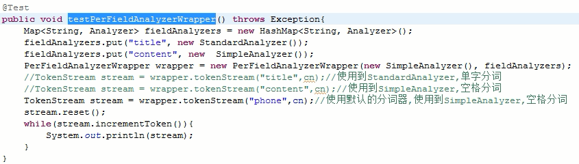

# Lucene

## 索引的创建

03

### 导包

- lucene-core.jar	核心包

- lucene-analyzers-common.jar	分词器

- lucene-queryparser.jar	文本解析器

### 创建索引

```java
public class TestCreate {
    String content1 = "hello world";
    String content2 = "hello java world";
    String content3 = "hello lucene world";

    String path = "D:/aw";
    Version matchVersion = Version.LUCENE_4_10_4;

    @Test
    public void testIndex() throws Exception {
        //创建目录文件,存储索引文件
        Directory directory = FSDirectory.open(new File(path));
        //语言分析接口(分词器)
        Analyzer analyzer = new StandardAnalyzer();
        //配置对象
        IndexWriterConfig config = new IndexWriterConfig(matchVersion, analyzer);
        //索引写入对象
        IndexWriter writer = new IndexWriter(directory, config);

        FieldType type = new FieldType();
        type.setIndexed(true);
        type.setStored(true);

        //创建文档
        Document doc1 = new Document();
        //在文档中添加字段信息
        doc1.add(new Field("title", "doc1", type));
        doc1.add(new Field("content", content1, type));

        Document doc2 = new Document();
        doc2.add(new Field("title", "doc2", type));
        doc2.add(new Field("content", content2, type));

        Document doc3 = new Document();
        doc3.add(new Field("title", "doc3", type));
        doc3.add(new Field("content", content3, type));

        //写入对象到文档
        writer.addDocument(doc1);
        writer.addDocument(doc2);
        writer.addDocument(doc3);

        //将写入内容提交
        writer.commit();

        //关闭资源
        writer.close();
    }
}
```

### 生成结果


## 索引的查询

05

### 查询索引

```java
@Test
public void testSearch() throws Exception {
    //创建目录文件,存储索引文件
    Directory directory = FSDirectory.open(new File(path));
    //需要读取索引库中的内容
    IndexReader r = DirectoryReader.open(directory);
    //创建索引读取对象
    IndexSearcher searcher = new IndexSearcher(r);
    //如果需要根据文本获取到查询对象,需要导入queryParse类,能将文本变成Query对象
    /*
	* new QueryParser(f, a)
	* f	需要查询的字段
	* a	分词器对象
	*/
    //语言分析接口(分词器)
    Analyzer analyzer = new StandardAnalyzer();
    QueryParser parser = new QueryParser("content", analyzer);
    Query query = parser.parse("hello");
    /*
	* search(query, n)
	* query 	查询对象,定义了查询哪个字段,查询什么内容
	* n			符合条件的前n条记录
	*/
    TopDocs tds = searcher.search(query, 100);
    System.out.println("查询命中数:" + tds.totalHits);
    ScoreDoc[] sds = tds.scoreDocs;
    Document doc = null;
    ScoreDoc scoreDoc = null;
    for (int i = 0; i < sds.length; i++) {
        scoreDoc = sds[i];
        System.out.println("文档分数>>>>>" + scoreDoc.score);
        System.out.println("文档编号>>>>>" + scoreDoc.doc);
        doc = searcher.doc(scoreDoc.doc);
        System.out.println("title>>>>>" + doc.get("title"));
        System.out.println("content>>>>>" + doc.get("content"));
        System.out.println("*****************************");
    }
}
```

### 结果

```
查询命中数:3
文档分数>>>>>0.4451987
文档编号>>>>>0
title>>>>>doc1
content>>>>>hello world
*****************************
文档分数>>>>>0.35615897
文档编号>>>>>1
title>>>>>doc2
content>>>>>hello java world
*****************************
文档分数>>>>>0.35615897
文档编号>>>>>2
title>>>>>doc3
content>>>>>hello lucene world
*****************************
```

## FieldType的解释

06

```java
FieldType type = new FieldType();
type.setIndexed(true);
type.setStored(true);
type.setTokenized(true);

//创建文档
Document doc1 = new Document();
//在文档中添加字段信息
doc1.add(new Field("title", "doc1", type));
doc1.add(new Field("content", content1, type));
```

setIndexed		是否索引字段,控制索引区内容

setStored	   	是否存储内容,控制存储区内容

setTokenized 	是否进行分词操作

**index和store不能同时为false**

## 分词器Analyzer

07

### SimpleAnalyzer

默认空格分词

中文也是空格分词

### StandardAnalyzer

英文--空格分词

中文--单字分词

### PerFieldAnalyzerWrapper

可以根据不同的字段来配置分词器



### CJKAnalyzer

中文--两字分词

### SmartChineseAnalyzer

导包

* lucene-analyzers-smartcn.jar

根据字典来分词

### IKAnalyzer

导包

- IKAnalyzer2012FF_u1.jar

## 索引的更新和删除

08

### 更新

```java
@Test
public void testUpdate() throws Exception {
    //创建目录文件,存储索引文件
    Directory directory = FSDirectory.open(new File(path));
    //语言分析接口(分词器)
    Analyzer analyzer = new StandardAnalyzer();
    //配置对象
    IndexWriterConfig config = new IndexWriterConfig(matchVersion, analyzer);
    //索引写入对象
    IndexWriter writer = new IndexWriter(directory, config);

    FieldType type = new FieldType();
    type.setIndexed(true);
    type.setStored(true);

    Document updateDoc = new Document();
    updateDoc.add(new Field("title", "doc2", type));
    updateDoc.add(new Field("content", "hello更新后的内容", type));
    /*
     * writer.updateDocument(term, updateDoc);
     * term			更新哪条记录
     * updateDoc	更新的内容
     */
    writer.updateDocument(new Term("title", "doc2"), updateDoc);
    writer.commit();
    writer.close();
}
```

更新的实质

> 先把符合条件的记录删除,再新增记录

### 删除

```java
@Test
public void testUpdate() throws Exception {
    //创建目录文件,存储索引文件
    Directory directory = FSDirectory.open(new File(path));
    //语言分析接口(分词器)
    Analyzer analyzer = new StandardAnalyzer();
    //配置对象
    IndexWriterConfig config = new IndexWriterConfig(matchVersion, analyzer);
    //索引写入对象
    IndexWriter writer = new IndexWriter(directory, config);
    
    /*
    第一种方式,通过Query方式删除
    QueryParser parser = new QueryParser("title", analyzer);
    Query query = parser.parse("doc3");
    writer.deleteDocument(query);
    */
    //第二种方式,通过Term方式
    writer.deleteDocuments(new Term("title", "doc3"));
    
    writer.commit();
    writer.close();
}
```

## 高级查询

09

```java
public void testSearch(String content) throws Exception {
    Directory directory = FSDirectory.open(new File(path));
    IndexReader r = DirectoryReader.open(directory);
    IndexSearcher searcher = new IndexSearcher(r);

    Analyzer analyzer = new StandardAnalyzer();
    QueryParser parser = new QueryParser("content", analyzer);
    Query query = parser.parse(content);
    
    System.out.println(query.class);

    TopDocs tds = searcher.search(query, 100);
    System.out.println("查询命中数:" + tds.totalHits);
    ScoreDoc[] sds = tds.scoreDocs;
    Document doc = null;
    ScoreDoc scoreDoc = null;
    for (int i = 0; i < sds.length; i++) {
        scoreDoc = sds[i];
        System.out.println("文档分数>>" + scoreDoc.score);
        doc = searcher.doc(scoreDoc.doc);
        System.out.println(" title>>" + doc.get("title"));
        System.out.println(" content>>" + doc.get("content"));
        System.out.println("*****************************");
    }
}

public void testSearch(Query query) throws Exception {
    Directory directory = FSDirectory.open(new File(path));
    IndexReader r = DirectoryReader.open(directory);
    IndexSearcher searcher = new IndexSearcher(r);

    System.out.println(query);

    TopDocs tds = searcher.search(query, 100);
    System.out.println("查询命中数:" + tds.totalHits);
    ScoreDoc[] sds = tds.scoreDocs;
    Document doc = null;
    ScoreDoc scoreDoc = null;
    for (int i = 0; i < sds.length; i++) {
        scoreDoc = sds[i];
        System.out.println("文档分数>>" + scoreDoc.score);
        doc = searcher.doc(scoreDoc.doc);
        System.out.println(" title>>" + doc.get("title"));
        System.out.println(" content>>" + doc.get("content"));
        System.out.println("*****************************");
    }
}
```

### 查询所有

```java
testSearch("*:*");

System.out.println("----------------");

MatchAllDocsQuery query = new MatchAllDocsQuery();
testSearch(query);
```

\*:* 第一个*匹配所有字段

​	  第二个*匹配所有内容

### 单词查询

```java
testSearch("title:doc1");

System.out.println("----------------");

TermQuery query = new TermQuery(new Term("title", "doc1"));
testSearch(query);
```

查询字段:查询内容

### 段落查询

```java
testSearch("\"java lucene\"");

System.out.println("----------------");

PhraseQuery query = new PhraseQuery();
query.add(new Term("content", "java"));
query.add(new Term("content", "luence"));
testSearch(query);
```

"查询内容"	通过双引号包裹的内容会作为整体

### 通配符查询

```java
testSearch("l*cen?"");

System.out.println("----------------");

WildcardQuery query = new WildcardQuery(new Term("content", "l*cen?"));
testSearch(query);
```

\*	可以匹配多个字符

?	匹配单个字符

### 单词模糊查询

```java
testSearch("luXene~1"");

System.out.println("----------------");

FuzzyQuery query = new FuzzyQuery(new Term("content", "luXene"), 1);
testSearch(query);
```

~N 代表允许单词错几个,最大为2

### 段落临近查询

```java
testSearch("\"java lucene\"~2");

System.out.println("----------------");

PhraseQuery query = new PhraseQuery();
query.add(new Term("content", "java"));
query.add(new Term("content", "luence"));
query.setSlop(2);
testSearch(query);
```

~N 表示中间可以插入N个词元,N数值随意

### 范围查询

```java
testSearch("inputtime:[20160918 TO 20160920}");

System.out.println("----------------");

TermRangeQuery query = new TermRangeQuery("inputtime", 
                                         new BytesRef("20160918"),
                                         new BytesRef("20160920"),
                                         true,
                                         false);
query.setSlop(2);
testSearch(query);
```

{}	左右开区间

[]	左右闭区间

true/false	是否闭区间

### 组合查询

```java
//testSearch("java AND lucene");
//testSearch("java && lucene");
//testSearch("java OR lucene");
//testSearch("java || lucene");
//前面的结果 !/NOT 需要排除的结果
//testSearch("*:* ! content:java");
//testSearch("*:* NOT content:java");
testSearch("+content:java -content:lucene");

System.out.println("----------------");

BooleanQuery query = BooleanQuery();
TermRangeQuery q1 = new TermRangeQuery("inputtime", 
                                         new BytesRef("20160918"),
                                         new BytesRef("20160920"),
                                         true,
                                         true);
TermQuery q2 = new TermQuery(new Term("content", "java"));
/*
MUST + MUST		取交集,AND
MUST + MUST_NOT 取q1,且排除q2
SHOULD + SHOULD	取并集,OR
*/
query.add(q1, Occur.MUST);
query.add(q2, Occur.MUST);
testSearch(query);
```

使用时注意：

> 单独使用MUST_NOT：无意义，检索无结果。（也不报错）
>
> 单独使用SHOULD：结果相当于MUST。
>
> MUST_NOT和MUST_NOT：无意义，检索无结果。（也不报错）
>
> SHOULD和MUST_NOT： 此时SHOULD相当于MUST，结果同MUST和MUST_NOT。
>
> MUST和SHOULD：此时SHOULD无意义，结果为MUST子句的检索结果。

### 增加权重

```java
testSearch("lucene^10 java");

System.out.println("----------------");

BooleanQuery query = BooleanQuery();
TermQuery q1 = new TermQuery(new Term("content", "lucene"));
q1.setBoost(10f);//设置权重
TermQuery q2 = new TermQuery(new Term("content", "java"));
query.add(q1, Occur.SHOULD);
query.add(q2, Occur.SHOULD);
testSearch(query);
```

^N	给单词添加权重信息

N	  需要增加的权重

### Lucene查询中的特殊字符

+,-,&&,||,!,(,),{,},[,],^,",~,*,?,:,\

## 高亮的显示

### 导包

- lucene-highlighter.jar

### 查询

```java
@Test
public void testSearch() throws Exception {
    Directory directory = FSDirectory.open(new File(path));
    IndexReader r = DirectoryReader.open(directory);
    IndexSearcher searcher = new IndexSearcher(r);

    Analyzer analyzer = new StandardAnalyzer();
    QueryParser parser = new QueryParser("content", analyzer);
    Query query = parser.parse("hello");

    TopDocs tds = searcher.search(query, 100);
    System.out.println("查询命中数:" + tds.totalHits);
    ScoreDoc[] sds = tds.scoreDocs;
    Document doc = null;
    ScoreDoc scoreDoc = null;

    /* 高亮部分 */
    Formatter formatter = new SimpleHTMLFormatter("<font color=\"red\">","</font>");
    Scorer scorer = new QueryScorer(query);
    Highlighter hl = new Highlighter(formatter, scorer);
    //hl.setMaxDocCharsToAnalyze(20);//限定前20个字符高亮显示,多余内容会被忽略

    for (int i = 0; i < sds.length; i++) {
        scoreDoc = sds[i];
        System.out.println("文档分数>>>>>" + scoreDoc.score);
        System.out.println("文档编号>>>>>" + scoreDoc.doc);
        doc = searcher.doc(scoreDoc.doc);
        System.out.println("title>>>>>" + doc.get("title"));
        System.out.println("content>>>>>" + doc.get("content"));

        /* 高亮打印 */
        String str = hl.getBestFragment(analyzer, 
                                        "content", 
                                        doc.get("content"));
        System.out.println(str);

        System.out.println("*****************************");
    }
}
```

