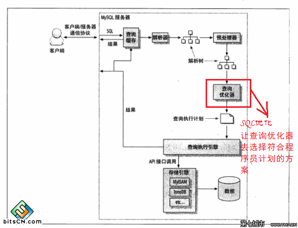
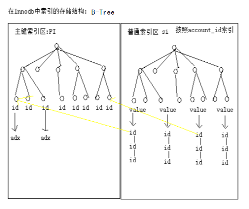
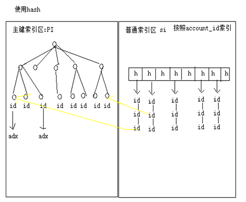

# MySQL性能优化

## 影响性能的因素

### 商业需求对性能的影响

#### 不合理需求

需求：一个论坛帖子总量的统计

附加要求：实时更新

- 初级阶段：SELECT COUNT(*)

- 新建一个表，在这个表中更新这个汇总数据（频率问题）

- 真正的问题在于，有必要实时？创建一个统计表，隔一段时间统计一次并存入

#### 无用功能堆积

- 无用的列堆积

- 错误的表设计

- 无用的表关联

### 系统架构及实现对性能影响

#### 哪些数据不适合放在数据库中

- 二进制数据

  > 音乐,视频之类
  >
  > 会降低查询效率,增加IO次数

- 流水队列数据

  > 日志之类

- 超大文本

#### 合理的cache

**哪些数据适合放到cache中**

- 系统配置信息

- 活跃的用户的基本信息

- 活跃用户的定制化信息

- 基于时间段的统计数据

- 读>>>写的数据

#### 减少数据库交互次数

N+1问题的解决

- 使用连接查询

  > 连接的对象/表过多,性能会下降
  >
  > 如果n个对象关联的都是一个对象,会产生无用的结果集,会对IO和排序造成影响


- 使用冗余字段

  > 更新表的时候需要有额外的业务逻辑

- 使用1+1查询(推荐)

  >避免了连接查询的无用结果集和冗余字段
  >
  >查询所有员工,将其部门id放入set,再发sql去查set,然后去显示

#### 过度依赖数据库SQL语句的功能

- 交叉表

- 不必要的表连接

#### 重复执行相同的SQL

在一个页面中，有相同内容，但是使用2条SQL去查询

> 新闻主页分为各个栏目,综合热点显示各个栏目的第一个最热信息,各个栏目显示本栏目前十最热
>
> * 2sql	查询各个栏目第一条最热,显示到综合
>
>   ​			查询各个栏目2~11条最热
>
> * 1sql     查询各个栏目1~11条最热
>
>   ​			第一条显示给综合
>
>   ​			2~11显示给本栏目

#### 其他常见系统架构和实现问题

- Cache 系统的不合理利用导致Cache 命中率低下造成数据库访问量的增加，同时也浪费了Cache系统的硬件资源投入

- 过度依赖面向对象思想，对系统可扩展性的过渡追求，促使系统设计的时候将对象拆得过于离散，造成系统中大量的复杂Join语句，而MySQL Server 在各数据库系统中的主要优势在于处理简单逻辑的查询，这与其锁定的机制也有较大关系

- 对数据库的过度依赖，将大量更适合存放于文件系统中的数据存入了数据库中，造成数据库资源的浪费，影响到系统的整体性能，如各种日志信息

- 过度理想化系统的用户体验，使大量非核心业务消耗过多的资源，如大量不需要实时更新的数据做了实时统计计算

### 其他因素

#### SQL引起性能问题的原因

SQL的执行过程

1. 客户端发送一条查询给服务器

2. 服务器通过权限检查后先会检查查询缓存，如果命中了缓存，则立即返回存储在缓存中的结果。否则进入下一阶段

3. 服务器端进行SQL解析、预处理，再**由优化器根据该SQL所涉及到的数据表的统计信息进行计算，生成对应的执行计划**

4. MySQL根据优化器生成的执行计划，调用存储引擎的API来执行查询

5. 将结果返回给客户端



SQL执行的最大瓶颈在于磁盘的IO，即数据的读取；不同SQL的写法，会造成不同的执行计划的执行，而不同的执行计划在IO的上面临完全不一样的数量级，从而造成性能的差距

所以,我们说,优化SQL,其实就是让查询优化器根据程序猿的计划选择匹配的执行计划,来减少查询中产生的IO

#### Schema(结构)设计对系统的性能影响

- 冗余数据的处理

  > 适当的数据冗余可以提高系统的整体查询性能(在P2P中,在userinfo对象中有realname和idnumber)
  >
  > 关系数据库的三范式
  >
  > 第一范式（1NF）是对关系模式的基本要求，不满足第一范式（1NF）的数据库就不是关系数据库，是指数据库表的每一列都是不可分割的基本数据项，同一列中不能有多个值
  >
  > 第二范式（2NF）要求数据库表中的每个实例或行必须可以被惟一地区分
  >
  > 第三范式（3NF）要求一个数据库表中不包含已在其它表中已包含的非主关键字信息。 (不允许有冗余数据)

- 大表拆小表，有大数据的列单独拆成小表

  > 在一个数据库中,一般不会设计属性过多的表
  >
  > 在一个数据库中,一般不会有超过500/1000万数据的表(拆表,按照逻辑拆分,按照业务拆分)
  >
  > 有大数据的列单独拆成小表(富文本编辑器,CKeditor)

- 根据需求的展示设置更合理的表结构

- 把常用属性分离成小表

  > 在P2P项目中,我们把logininfo和userinfo和account表拆成了三张表
  >
  > **减少查询常用属性需要查询的列**
  >
  > **便于常用属性的集中缓存**

#### 硬件环境对性能影响

- 提高IO指标

  IOPS：每秒可提供的IO 访问次数

  IO 吞吐量：每秒的IO 总流量

- 提高CPU计算能力

- 如果是单独的数据库服务器，提高网络能力

#### 数据库系统场景

**OLTP**(on-line transaction processing)联机事务处理

> OLTP式传统的关系型数据库的主要应用,主要是基本的,日常的事务处理,例如银行交易.
>
> 特点
>
> - 系统总体数据量较大，但活动数据量较小
>
> - IO访问频繁，单涉及数据量较小，分布离散
>
> - 并发很高
>
> - 网络交互数据量较小，但交互频繁
>
> 硬件架构选型
>
> - 大量的合理的cache设计，能够大大减少数据库的交互；应尽量的扩大内存容量
>
> - IOPS指标要求较高
>
> - CPU的计算能力，并行计算能力要求较高
>
> - 对外网络要求较高

**OLAP**(on-line analytical processing)联机分析处理

> OLAP是数据仓库系统的主要应用,支持复杂的分析操作,侧重决策支持,并且提供直观易懂的查询结果,数据仓库就是一个典型的应用场景
>
> 特点
>
> - 数据量非常大，数据访问集中，数据活跃度分布平均
>
> - 并发访问较低
>
> - 每次检索的数量非常多
>
> 架构选型
>
> - 硬盘存储容量需要非常大
>
> - 对存储设备的IO吞吐量要求很高
>
> - CPU要求较低
>
> - 对外网络要求不高

### 综合考虑

需求和架构及业务实现优化：55%

Query 语句的优化：30%

数据库自身的优化：15%

## SQL优化

### 合理使用索引

#### 理解MySQL的索引


##### 索引的物理结构

- 数据库文件存储的位置:my.ini配置文件中dataDir对应的数据目录中

- 每一个数据库一个文件夹

  > MYISAM引擎:每一个表(table_name)-->
  >
  > - table_name.MYI:存放的是数据表对应的索引信息和索引内容
  >
  > - table_name.FRM:存放的是数据表的结构信息
  >
  > - table_name.MYD:存放的是数据表的内容
  
  > InnoDB引擎:每一个表(table_name)-->
  >
  > table_name.frm:存放的是数据表的结构信息
  >
  > 数据文件和索引文件都是统一存放在ibdata文件中

- 索引文件都是额外存在的,**对索引的查询和维护都是需要消耗IO的**

##### 索引的结构

默认情况下,一旦创建了一个表,这个表设置了主键,那么MYSQL会自动的为这个主键创建一个unique的索引

索引类型

- Normal:普通的索引;允许一个索引值后面关联多个行值
- UNIQUE:唯一索引;允许一个索引值后面只能有一个行值;之前对列添加唯一约束其实就是为这列添加了一个unique索引;当我们为一个表添加一个主键的时候,其实就是为这个表主键列(设置了非空约束),并为主键列添加了一个唯一索引

- Fulltext:全文检索,mysql的全文检索只能用myisam引擎,并且性能较低,不建议使用

##### 索引的方法(规定索引的存储结构)

b-tree:是一颗树(二叉树,平衡二叉树,平衡树(B-TREE))

> 使用平衡树实现索引，是mysql中使用最多的索引类型
>
> 在innodb中，存在两种索引类型，第一种是主键索引（primary key），在索引内容中直接保存数据的地址；第二种是其他索引，在索引内容中保存的是指向主键索引的引用；所以在使用innodb的时候，要尽量的使用主键索引，速度非常快
>
> b-tree中保存的数据都是按照一定顺序保存的数据,是可以**允许在范围之内进行查询**



hash:把索引的值做hash运算，并存放到hash表中

> 使用较少，一般是memory引擎使用
>
> 优点
>
> - 因为使用hash表存储，按照常理，hash的性能比B-TREE效率高很多
>
> 缺点
>
> - hash索引只能适用于精确的值比较，=，in，或者<>；无法使用范围查询
>
> - 无法使用索引排序
>
> - 组合hash索引无法使用部分索引
>
> - 如果大量索引hash值相同，性能较低



#### 索引的利弊

索引的好处

- 提高表数据的检索效率

- 如果排序的列是索引列，大大降低排序成本

- 在分组操作中如果分组条件是索引列，也会提高效率

索引的问题

- 索引需要额外的维护成本

  > 因为索引文件是单独存在的文件
  >
  > 对数据的增加,修改,删除,都会产生额外的对索引文件的操作
  >
  > 这些操作需要消耗额外的IO,会降低增/改/删的执行效率

#### 如何创建索引

- 较频繁的作为查询条件的字段应该创建索引

- 唯一性太差的字段不适合单独创建索引，即使频繁作为查询条件

  > 作为索引的列,如果不能有效的区分数据,那么这个列就不适合作为索引列;比如(性别,状态不多的状态列) 
  >
  > 举例:SELECT sum(amount) FROM accountflow WHERE accountType = 0;
  >
  > 如果可能出现,只按照该条件查询,那我们就要考虑到其他的提升性能的方式了;
  >
  > **解决方案**
  >
  > 第一种方案:单独创建一个系统摘要表;在这个表里面有一个列叫做系统总充值金额;每次充值成功,增加这个列的值;以后要查询系统总充值金额,只需要从这个系统摘要表中查询;(缺陷:如果充值频率过快,会导致表的锁定问题)
  >
  > 第二种方案:流水一旦发生了,是不会随着时间改变的;针对这种信息,我们就可以使用增量查询(结算+增量查询)
  >
  > - 创建一张日充值表;记录每一天的充值总金额(beginDate,endDate,totalAmount),每天使用定时器对当前的充值记录进行结算;日充值报表里面记录只能记录截止昨天的数据
  >
  > - 创建一张月充值表;记录每一个月的充值总金额(beginDate,endDate,totalAmount),每月最后一天使用定时器对当月的充值记录进行结算(**数据源从日充值报表来**)
  >
  > - 要查询系统总充值,**从月报表中汇总**(当前月之前的总充值金额),再从日充值报表中查询当天之前的日报表数据汇总;再从流水中查询当前截止查询时间的流水
  >
  >   使用另外一张当天流水表记录当天的流水
  >
  >   再把三个数据累加

- 更新非常频繁的字段不适合创建索引

- 不会出现在WHERE 子句中的字段不该创建索引

- 索引不是越多越好(只为必要的列创建索引)

  > **不管你有多少个索引,一次查询至多采用一个索引**(索引和索引之间是独立的)
  >
  > 因为索引和索引之间是独立的,所以说每一个索引都应该是单独维护的;数据的增/改/删,会导致所有的索引都要单独维护

#### 单值索引和组合索引

因为一个查询一次至多只能使用一个索引,所以,如果都使用单值索引(一个列一个索引),在数据量较大的情况下,不能很好的区分数据

所以,MYSQL引入了多值索引(复合索引)

复合索引就是由多列的值组成的索引;并且(**注意:多列的索引是有顺序的**)

**复合索引的原理**

> 就是类似orderby(orderby后面可以跟多个排序条件order by hire_date,username desc);
>
> 就是在排序和分组(创建倒排表的时候),按照多个列进行排序和合并
>
> - SELECT * FROM accountflow WHERE actionTime < 'xxxxx' AND account_id = 5
>
>   可以使用actionTime+account_id的复合索引
>
> - SELECT * FROM accountflow WHERE actionTime < 'xxxxx'
>
>   可以使用actionTime+account_id的复合索引
>
> - SELECT * FROM accountflow WHERE account_id = 5
>
>   不可以使用actionTime+account_id的复合索引
>
> - SELECT * FROM accountflow WHERE account_id = 5 AND actionTime < 'xxxxx'
>
>   不可以使用actionTime+account_id的复合索引

复合索引在查询的时候,遵守向左原则

> 在查询的时候,是按照复合索引从左到右的顺序依次查询
>
> 不管查询条件是否完全满足所有的符合索引的列,都可以使用部分的符合索引
>
> **查询AC是可以用ABC的索引的,只不过只索引了A**

在实际应用中,基本上都使用复合索引

#### MySQL中索引使用限制

MySQL 目前不支持函数索引(在MYSQL中,索引只能是一个列的原始值,不能把列通过计算的值作为索引)

> **实例**
>
> 请查询1981年入职的员工
>
> SELECT * FROM emp WHERE year(hire_date)='1981';
>
> **问题**
>
> 查询的列是在过滤之前经过了函数运算;所以,就算hire_date作为索引,year(hire_date)也不会使用索引
>
> **解决方案**
>
> 1. SELECT * FROM emp WHERE hire_date BETWEEN '1981-01-01' AND '1981-12-31';
>
> 2. 再创建一列,这列的值是year(hire_date),然后把这列的值作为索引

使用不等于（!= 或者<>）的时候MySQL 无法使用索引

过滤字段使用了函数运算后（如abs(column)），MySQL 无法使用索引

Join 语句中Join 条件字段类型不一致的时候MySQL 无法使用索引

BLOB 和TEXT 类型的列只能创建前缀索引(同下一个字符串的LIKE)

使用LIKE 操作的时候如果条件以通配符开始（ '%abc...'）MySQL 无法使用索引

> 字符串是可以用来作为索引的,字符串创建的索引按照字母顺序排序
>
> 如果使用LIKE
>
> 实例:SELECT * FROM userinfo WHERE realName LIKE '吴%';这种情况是可以使用索引的
>
> 但是LIKE '_嘉' 或者LIKE '%嘉'都是不能使用索引的

使用非等值查询的时候MySQL 无法使用Hash 索引

### 使用Explain和Profiling

查看MYSQL的执行计划和执行明细状态(explain+profiling)

#### Explain命令

可以让我们查看MYSQL执行一条SQL所选择的执行计划

**使用方式**	explain SQL;

**返回结果**

ID：执行查询的序列号

select_type：使用的查询类型

- DEPENDENT SUBQUERY：子查询中内层的第一个SELECT，依赖于外部查询的结果集

- DEPENDENT UNION：子查询中的UNION，且为UNION 中从第二个SELECT 开始的后面所有SELECT，同样依赖于外部查询的结果集

- PRIMARY：子查询中的最外层查询，注意并不是主键查询

- SIMPLE：除子查询或者UNION 之外的其他查询

- SUBQUERY：子查询内层查询的第一个SELECT，结果不依赖于外部查询结果集

- UNCACHEABLE SUBQUERY：结果集无法缓存的子查询

- UNION：UNION 语句中第二个SELECT 开始的后面所有SELECT，第一个SELECT 为PRIMARY

- UNION RESULT：UNION 中的合并结果

table：这次查询访问的数据表

type：对表所使用的访问方式

- **all**：全表扫描

- **const**：读常量，且最多只会有一条记录匹配，由于是常量，所以实际上只需要读一次

- eq_ref：最多只会有一条匹配结果，一般是通过主键或者唯一键索引来访问

- fulltext：全文检索，针对full text索引列

- **index**：全索引扫描

- index_merge：查询中同时使用两个（或更多）索引，然后对索引结果进行merge 之后再读取表数据

- index_subquery：子查询中的返回结果字段组合是一个索引（或索引组合），但不是一个主键或者唯一索引

- rang：索引范围扫描

- **ref**：Join 语句中被驱动表索引引用查询

- ref_or_null：与ref 的唯一区别就是在使用索引引用查询之外再增加一个空值的查询

- system：系统表，表中只有一行数据

- unique_subquery：子查询中的返回结果字段组合是主键或者唯一约束

possible_keys：可选的索引；如果没有使用索引，为null

key：最终选择的索引

key_len：被选择的索引长度

ref：过滤的方式，比如const（常量），column（join），func（某个函数）

rows：查询优化器通过收集到的统计信息估算出的查询条数

Extra：查询中每一步实现的额外细节信息

- Distinct：查找distinct 值，所以当mysql 找到了第一条匹配的结果后，将停止该值的查询而转为后面其他值的查询

- Full scan on NULL key：子查询中的一种优化方式，主要在遇到无法通过索引访问null值的使用使用

- Impossible WHERE noticed after reading const tables：MySQL Query Optimizer 通过收集到的统计信息判断出不可能存在结果

- No tables：Query 语句中使用FROM DUAL 或者不包含任何FROM 子句

- Not exists：在某些左连接中MySQL Query Optimizer 所通过改变原有Query 的组成而使用的优化方法，可以部分减少数据访问次数

- Select tables optimized away：当我们使用某些聚合函数来访问存在索引的某个字段的时候，MySQL Query Optimizer 会通过索引而直接一次定位到所需的数据行完成整个查询。当然，前提是在Query 中不能有GROUP BY 操作。如使用MIN()或者MAX（）的时候

- Using filesort：当我们的Query 中包含ORDER BY 操作，而且无法利用索引完成排序操作的时候，MySQL Query Optimizer 不得不选择相应的排序算法来实现

- Using index：所需要的数据只需要在Index 即可全部获得而不需要再到表中取数据

- Using index for group-by：数据访问和Using index 一样，所需数据只需要读取索引即可，而当Query 中使用了GROUP BY 或者DISTINCT 子句的时候，如果分组字段也在索引中，Extra 中的信息就会是Using index for group-by

- Using temporary：当MySQL 在某些操作中必须使用临时表的时候，在Extra 信息中就会出现Using temporary 。主要常见于GROUP BY 和ORDER BY 等操作中

- Using where：如果我们不是读取表的所有数据，或者不是仅仅通过索引就可以获取所有需要的数据，则会出现Using where 信息

- Using where with pushed condition：这是一个仅仅在NDBCluster 存储引擎中才会出现的信息，而且还需要通过打开Condition Pushdown 优化功能才可能会被使用。控制参数为engine_condition_pushdown 

#### profiling的使用

可以用来准确定位一条SQL的性能瓶颈

Query Profiler是MYSQL5.1之后提供的一个很方便的用于诊断Query执行的工具，能够准确的获取一条查询执行过程中的CPU，IO等情况

1. 开启profiling：set profiling=1;(此句是mysql提供的命令,set用于设置mysql的环境变量)

2. 执行QUERY，在profiling过程中所有的query都可以记录下来

3. 查看记录的query：show profiles

4. 选择要查看的profile：show profile cpu, block io for query 6

status是执行SQL的详细过程

Duration：执行的具体时间

CPU_user：用户CPU时间

CPU_system：系统CPU时间

Block_ops_in：IO输入次数

Block_ops_out：IO输出次数

profiling只对本次会话有效

### 优化JOIN

#### 理解JOIN原理

在mysql中使用Nested Loop Join来实现join

> A JOIN B
>
> 通过A表的结果集作为循环基础
>
> 一条一条的通过结果集中的数据作为过滤条件到下一个表中查询数据
>
> 然后合并结果


#### JOIN优化原则

- 尽可能减少Join 语句中的Nested Loop 的循环总次数，用小结果集驱动大结果集

- 优先优化Nested Loop 的内层循环

- 保证Join 语句中被驱动表上Join 条件字段已经被索引

- 扩大join buffer的大小

### 其他优化

#### 优化ORDER BY

ORDER BY 实现原理

- 通过有序索引而直接取得有序的数据

- 通过MySQL 的排序算法将存储引擎中返回的数据进行排序然后再将排序后的数据返回

优化方案

- 加大max_length_for_sort_data 参数

- 去掉不必要的返回字段

- 增大sort_buffer_size 参数

#### 优化GROUP BY

#### 优化DISTINCT

### SQL优化原则

- 选择需要优化的SQL

  > **选择需要优化的SQL**:不是所有的SQL都需要优化,在优化的过程中,首选更需要优化的SQL
  >
  > *怎么选择*
  >
  > 优先选择优化高并发低消耗的SQL
  >
  > 1. 1小时请求1W次，1次10个IO
  >
  > 2. 1小时请求10次，1次1W个IO
  >
  > *考虑*
  >
  > 1. 从单位时间产生的IO总数来说,相同的
  >
  > 2. 针对一个SQL,如果我能把10个IO变成7个IO,一小时减少3W个IO
  >
  >    针对第二个SQL,如果能把1W个IO变成7K个IO,一小时减少3W个IO
  >
  > 3. 从优化难度上讲,1W->7K难的多
  >
  > 4. 从整体性能上来说,第一个SQL的优化能够极大的提升系统整体的性能
  >
  >    ​								   第二个SQL慢一点,无非也就是10个连接查询慢一点
  >
  > 选择**请求量大且查询慢**的SQL
  >
  > **定位性能瓶颈**
  >
  > - SQL运行较慢有两个影响原因，IO和CPU，明确性能瓶颈所在
  >
  > - 明确优化目标

- Explain和Profile

  > 任何SQL的优化，都从Explain语句开始；Explain语句能够得到数据库执行该SQL选择的执行计划
  >
  > 首先明确需要的执行计划，再使用Explain检查
  >
  > 使用profile明确SQL的问题和优化的结果

- 永远用小结果集驱动大结果集

- 在索引中完成排序

- 使用最小Columns

  > 1. 减少网络传输数据量
  >
  > 2. 特别是需要使用column排序的时候
  >
  >    为什么?
  >
  >    MYSQL排序原理，是把所有的column数据全部取出，在排序缓存区排序，再返回结果；如果column数据量大，排序区容量不够的时候，就会使用先column排序，再取数据，再返回的多次请求方式

- 使用最有效的过滤条件

  > 过多的WHERE条件不一定能够提高访问性能(毕竟只能使用一条索引)
  >
  > 一定要让where条件使用自己预期的执行计划

- 避免复杂的JOIN和子查询

  > 复杂的JOIN和子查询，需要锁定过多的资源，MYSQL在大量并发情况下处理锁定性能下降较快
  >
  > 不要过多依赖SQL的功能，把复杂的SQL拆分为简单的SQL
  >
  > MySQL子查询性能较低，应尽量避免使用

## 其他优化

### Query Cache

### Innodb_buffer_pool_size

Innodb_buffer_pool_size

innodb的缓存，可以用于缓存索引，同时还会缓存实际的数据

用来设置Innodb 最主要的Buffer(Innodb_Buffer_Pool)的大小，对Innodb 整体性能影响也最大，可以按需要设置大一些

### 事务优化

理解Innodb事务机制

- 事务在buffer中对数据进行修改

- 事务的变化记录在事务日志中

- 在**合适的时机**同步事务日志中的数据到数据库中

所以什么时候提交事务日志文件，对系统性能影响较大

可以通过设置innodb_flush_log_at_trx_commit来修改事务日志同步时机

* innodb_flush_log_at_trx_commit = 0，每1秒钟同步一次事务日志文件

* innodb_flush_log_at_trx_commit = 1，默认设置，每一个事务完成之后，同步一次事务日志文件

* innodb_flush_log_at_trx_commit = 2，事务完成之后，写到事务日志文件中，等到日志覆盖再同步数据

注意，1性能最差，2不能完全保证数据是写到数据文件中，如果宕机，可能会有数据丢失现象，但性能最高；3，性能和安全性居中

## MySQL复制(集群/主从)


就算MYSQL拆成了多个,也必须分出主和从,所有的写操作都必须要在主MYSQL 上完成

所有的从MYSQL的数据都来自于(同步于)主MYSQL

既然涉及到同步,那一定有延迟;有延迟,就一定可能在读的时候产生脏数据;所以,能够在从MYSQL上进行的读操作,一定对实时性和脏数据有一定容忍度的数据;比如,登陆日志,后台报表,首页统计信息来源;文章;资讯;SNS消息

在我们的P2P中,做主从,绝大部分的读操作,都必须在主MYSQL上执行;只有(登陆日志,报表,满标一审列表,满标二审列表,用户的流水信息,充值明细,投标明细查询类的业务可以定位到从MYSQL)

[一定注意]:在MYSQL主从时,如果一个业务(service中的一个方法)中,如果既有R操作,又有W操作,因为W操作一定要在主MYSQL上,所以在一个事务中所有的数据来源都只能来自于一个MYSQL

### MySQL复制机制原理


### 安装新的MySQL实例

1. 复制mysql安装目录

2. 修改新mysql的相关配置(端口,安装目录,数据目录)

3. 为新的mysql创建数据目录(从mysql的安装目录中拷贝data文件夹)

4. 为新的mysql创建windows系统服务

   mysqld install MySQL2 --defaults-file="E:\MySQL\mysql_base\ini\my.ini"

5. 检查创建的系统服务,并启动测试

### 配置主从

因为主数据库之前的内容没有放在binlog中,所以要同步这些数据,只能通过主数据库备份来完成

配置主数据库(my.ini)

- server-id://给数据库服务的唯一标识，一般为大家设置服务器Ip的末尾号,在一个集群中,这个id是不能重复的;

- log-bin=master-bin://开启二进制文件;后面设置的这个master-bin就是二进制文件的名字前缀(名字);

- log-bin-index=master-bin.index//开启二进制文件的索引;名字一般为log-bin.index

启动主数据库,执行show master status命令


> 只要能够看到正常的查询结果,说明主服务器已经配置完成
>
> 结果中,注意两个重点
>
> - File:二进制文件的文件名
> - Position:当前文件已经记录到的位置

配置从服务器

- server-id

- relay-log=slave-relay-bin

- relay-log-index=slave-relay-bin.index

启动从服务器

在从服务器中恢复主数据库的备份

为从数据库指定Master库

```mysql
change master to master_host='127.0.0.1', #Master 服务器Ip
master_port=3306,#Master服务器的端口
master_user='root',#Master服务器的账户(其实应该是一个专门用于数据同步的账户)
master_password='admin',#Master服务器的同步账户密码
master_log_file='master-bin.000001',#Master服务器产生的日志
master_log_pos=0;#指定请求同步Master的bin-log的哪一行数据之后的内容;
```

启动从MYSQL

### 读写分离


一个service方法必须定位到一个唯一的数据库上

引入路由DataSource之后

1. 在应用中,需要自己去确定(告诉路由DS)这次要访问的真实的目标Datasource

2. 让路由DS知道有哪些真实的Datasource和他们对应的名字

3. 让路由DS根据我传入的名字去返回真实的DS

完成读写分离

- 认识Spring中的AbstractRountingDataSource

  在Spring中提供了AbstractRountingDataSource来完成路由DS的功能
  
  - targetDataSources:用于配置真实的datasource

    这个属性是一个Map,Map的key就是DS的名字,Map的value是真实的DS对象

  - defaultTargetDataSource:如果路由DS没有找到你当前请求的DS,直接使用默认的DS

  - abstract Object determineCurrentLookupKey()

    这个方法是需要我们自己实现的,这个方法需要返回一个值,这个值就是DS的名字

    这个方法就是让应用(我们)提供给Spring怎么找DS名字的逻辑

- 步骤

  1. 创建一个继承AbstractRountingDataSource的对象,并在Spring中配置

  2. 修改原来的datasource的配置

db.properties

```properties
db.driverClaassName=com.mysql.jdbc.Driver
db.url=jdbc:mysql://localhost:3306/aw
db.userName=root
db.password=

db2.driverClaassName=com.mysql.jdbc.Driver
db2.url=jdbc:mysql://localhost:3307/aw
db2.userName=root
db2.password=
```

application.xml

```xml
<!-- 主DataSource -->
<bean id="masterds" class="com.alibaba.druid.pool.DruidDataSource" 
      init-method="init" destroy-method="close">
    <property name="driverClassName" value="${db.driverClassName}" />
    <property name="url" value="${db.url}" />
    <property name="username" value="${db.username}" />
    <property name="password" value="${db.password}" />
</bean>

<!-- 从DataSource -->
<bean id="slaveds" class="com.alibaba.druid.pool.DruidDataSource" 
      init-method="init" destroy-method="close">
    <property name="driverClassName" value="${db2.driverClassName}" />
    <property name="url" value="${db2.url}" />
    <property name="username" value="${db2.username}" />
    <property name="password" value="${db2.password}" />
</bean>

<!-- 配置SqlSessionFactory要使用的DataSource -->
<bean id="dataSource" class="aw.util.MyRountingDataSource">
    <property name="targetDataSources">
        <map>
            <entry key="masterds" value-ref="masterds" />
            <entry key="slaveds" value-ref="slaveds" />
        </map>
    </property>
    <proerty name="defaultTargetDataSource" ref="masterds" />
</bean>

<bean id="sessionFactory" class="org.mybatis.spring.SqlSessionFactoryBean">
    <property name="dataSource" ref="dataSource"/>
    <property name="configLocation" value="classpath:mybatis-config.xml"/>
    <!-- 扫描po包,使用别名 -->
    <property name="typeAliasesPackage" value="main.domain"></property>
    <!-- 扫描映射文件 -->
    <property name="mapperLocations">
        <array>
            <value>classpath:config/mybatis/mapper/admin/*.xml</value>
            <value>classpath:config/mybatis/mapper/*.xml</value>
        </array>
    </property>
</bean>
```

MyRountingDataSource.java

```java
/* 路由DataSource */
public class MyRountingDataSource extends AbstractRountingDataSource {
    
    @Override
    protected Object determineCurrentLookupKey() {
        return DataSourceContext.get();
    }
}
```

DataSourceContext.java

```java
/* 存放当前线程需要访问的DataSource名字 */
public class DataSourceContext {
    private static ThreadLocal<String> dataSourcePool = new ThreadLocal<>();
    
    public static void set(String dsName) {
        dataSourcePool.set(dsName);
    }
    
    public static String get() {
        return dataSourcePool.get();
    }
}
```

需要访问mysql从服务器的service方法添加`DataSourceContext.set("slaveds");`


测试

- 正常登陆,查看master和slave是否同步

- 修改从slave中的数据库 ,检查查询是否修改

思考:

- 使用Annotation来完成Datasource的切换

- 使用AOP来完成Datasource的切换
