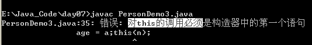
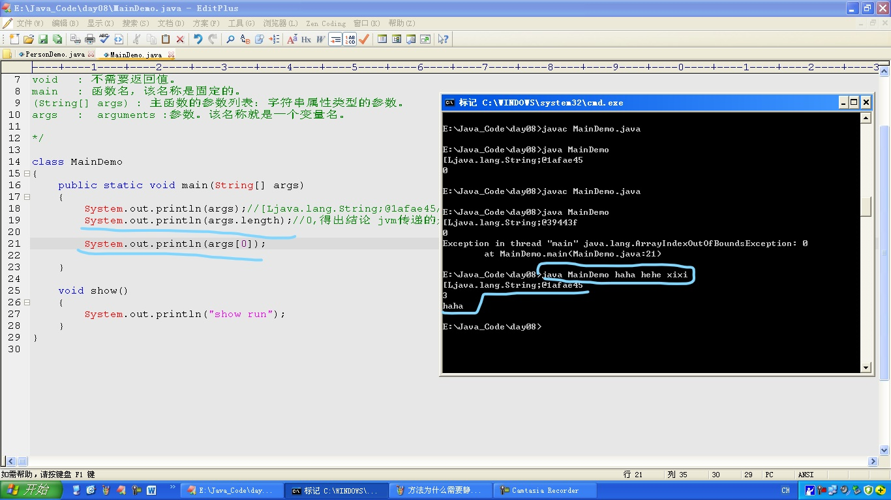
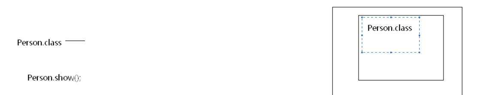
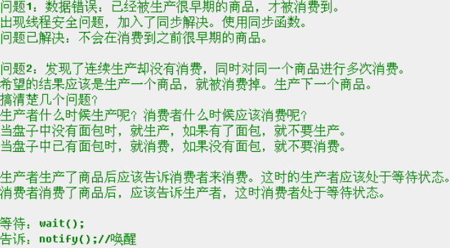
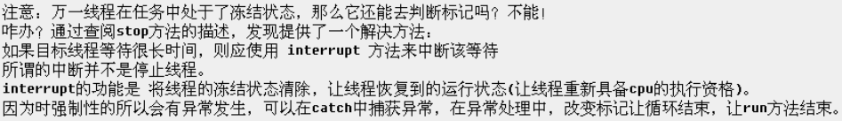
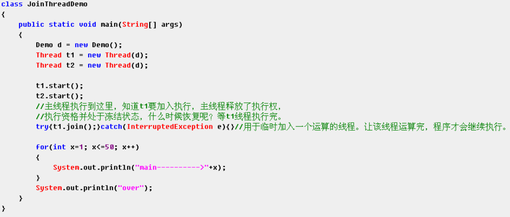

#### 异或 运算符

day03_23

一个数异或另一个数两次，结果还是这个数。

```java
/*
对两个整数变量的值进行互换(不需要第三方变量)
*/
int a = 3,b = 7;
a = a ^ b; //a = 3 ^ 7
b = a ^ b; //b = 3 ^ 7 ^ 7 = 3
a = a ^ b; //a = 3 ^ 7 ^ 3 = 7
```

---

#### switch选择语句

day03_30

**语句特点**

- 答案的书写没有顺序。
- 匹配的答案被执行，一直执行到break结束，或者执行到switch语句结束。
- `byte`，`short`，`int`，`char`，`enum`(<font color=red>5.0</font>)，`String`(<font color=red>7.0</font>)

---

#### break语句

day03_39

`break`只作用于选择/循环结构。

```java
public static void main(String[] args) {
    break;//编译报错：在switch或loop外部中断
}
```

`break`之后的语句无法访问，无条件直接`break`会出现编译错误。

```java
for(int i=0;i<3;i++) {
    break;
    System.out.println("i=" + i);//编译报错：无法访问的语句
}
```

---

#### continue语句

day03_40

`continue`只作用于循环结构。结束本次循环，继续下次循环。

`continue`之后的语句无法访问，无条件直接`continue`会出现编译错误。

```java
for(int i=0;i<3;i++) {
    continue;
    System.out.println("i=" + i);//编译报错：无法访问的语句
}
```

---

#### 给定整数获取其十六进制表现形式

day04_43

##### 思路

1. 啥是十六进制，数据的一种表现形式，好处在于可以表现形式更短。

   原理：将二进制中每4位作为一个十六进制位。

2. 哦，原来就是对给定的整数进行二进制的每4位的获取。
3. 咋获取每4位呢？其实就是获取四位中的1，可以通过&位运算的方式完成。
4. 而且想要获取下四位，可以通过对原数据进行无符号右移的方式。

##### 步骤

1. 定义变量记录该整数。
2. 对该变量进行`&`运算，既然是获取四位，就`&`四个1，二进制四个1就是十进制的15。

```java
int num = 26;
int n1 = num & 15;
System.out.println("n1=" + n1);//显示10，十六进制应该显示为a，可以(char)(n1 - 10 + 'a')

num = num >>> 4;
int n2 = num & 15;
System.out.println("n2=" + n2);
```

运算重复，&15结果是否需要字母转换不确定。

##### 改进

day04_44

* 通过循环完成重复操作。
* 通过`if`完成是否需要字母判断。

```java
int num = 26;
for(int i=0;i<8;i++) {
    int n = num & 15;
    if(n > 9)
        System.out.println((char)(n - 10 + 'A'));
    else
        System.out.println(n);   
    num = num >>> 4;
}
/*
输出
	A
	1
	0
	0
	0
	0
	0
	0
*/
```

##### 后记

* 顺序反了。

  day05_18

  > ```java
  > public static void main(String[] args) {
  > 	String strHex = toHex(26);
  > 	System.out.println(strHex);
  > }
  > 
  > public static String toHex(int num) {
  > 	//一个整数最多8个16进制位数
  > 	char[] chs = new char[8];
  > 	//定义数组索引
  > 	int index = chs.length - 1;
  > 	for(int i=0;i<8;i++) {
  > 		int n = num & 15;
  > 		if(n > 9)
  > 			chs[index] = (char)(n - 10 + 'A');
  > 		else
  > 			chs[index] = (char)(n + '0');
  > 		index--;
  > 		num = num >>> 4;
  > 	}
  > 	return "0x" + toString(chs);
  > }
  > 
  > /* 把字符数组转换成字符串 */
  > public static String toString(char[] arr) {
  > 	String temp = "";
  > 	for (int i = 0; i < arr.length; i++) {
  > 		temp = temp + arr[i];
  > 	}
  > 	return temp;
  > }
  > //输出 0x0000001A
  > ```

* 多了很多零。需要对多数据进行存储。

  day05_19

  > ```java
  > public static String toHex(int num) {
  >     //一个整数最多8个16进制位数
  >     char[] chs = new char[8];
  >     //定义数组索引
  >     int index = chs.length;
  >     while(num != 0) {
  >         int n = num & 15;
  >         if(n > 9)
  >             chs[--index] = (char)(n - 10 + 'A');
  >         else
  >             chs[--index] = (char)(n + '0');
  >         num = num >>> 4;
  >     }
  >     return "0x" + toString(chs,index);
  > }
  > 
  > public static String toString(char[] arr,int index) {
  >     String temp = "";
  >     for (int i = index; i < arr.length; i++) {
  >         temp = temp + arr[i];
  >     }
  >     return temp;
  > }
  > //输出 0x1A
  > ```

##### 查表版

day05_20

```java
public static String toHex(int num) {
    //1.建立表
    char[] chs = {'0','1','2','3','4','5',
                  '6','7','8','9','A','B',
                  'C','D','E','F'};
    //2.创建临时容器
    char[] arr = new char[8];
    //3.创建操作临时容器的角标
    int index = arr.length;
    //4.通过循环对num进行& >>>等运算
    while(num != 0) {
        //5.对num进行&运算
        int n = num & 15;
        //6.根据&运算后的结果作为角标查表，获取相应的字符,并将字符存储到临时容器中
        arr[--index] = chs[n];
        //7.对num进行右移
        num = num >>> 4;
    }
    return "0x" + toString(arr,index);
}
public static String toString(char[] arr,int index) {
    String temp = "";
	for (int i = index; i < arr.length; i++) {
		temp = temp + arr[i];
	}
	return temp;
}
//输出 0x1A
```

##### 通用版

day05_21

用于进制转换

```java
/* 十进制->二进制 */
public static String toBinary(int num) {
    return trans(num,1,1);
}
/* 十进制->八进制 */
public static String toOctal(int num) {
    return "0" + trans(num,7,3);
}
/* 十进制->十六进制 */
public static String toHex(int num) {
    return "0x" + trans(num,15,4);
}

public static String trans(int num,int base,int offset) {
    //1.建立表
    char[] chs = {'0','1','2','3','4','5',
                  '6','7','8','9','A','B',
                  'C','D','E','F'};
    //2.创建临时容器
    char[] arr = new char[32];
    //3.创建操作临时容器的角标
    int index = arr.length;
    //4.通过循环对num进行& >>>等运算
    while(num != 0) {
        //5.对num进行&运算
        int n = num & base;
        //6.根据&运算后的结果作为角标查表，获取相应的字符,并将字符存储到临时容器中
        arr[--index] = chs[n];
        //7.对num进行右移
        num = num >>> offset;
    }
    return toString(arr,index);
}
public static String toString(char[] arr,int index) {
	String temp = "";
	for (int i = index; i < arr.length; i++) {
		temp = temp + arr[i];
	}
	return temp;
}
//输出 0x1A
```

---

#### 函数的重载

day04_06

与参数列表的个数和数据类型有关，与返回值无关

---

#### Java对内存空间的划分

* 栈内存

  > 存储局部变量
  >
  > 只要在方法中定义的变量都是局部变量
  >
  > 一旦变量的生命周期结束该变量就被释放

* 堆内存

  > 存储实体(对象)
  >
  > 每一个实体都有一个首地址值
  >
  > 堆内存中的变量都有<font color=red>默认的初始化值</font>。不同类型不一样
  >
  > * `int`-0
  >
  > * `double`-0.0
  >
  > * `boolean`-false
  >
  > * `char`-'\u0000'
  >
  > 当实体不再使用时，就会被垃圾回收机制处理
  >
  > ```java
  > int[] arr = new int[3];
  > arr = null;
  > System.out.println(arr[0]);//NullPointerException空指针异常
  > ```

* 方法区

  > 保存系统的类信息
  >
  > 比如类的字段、方法、常量池等。方法区的大小决定系统可以保存多少个类
  >
  > 可以理解为永久区

* 本地方法区

* 寄存器

---

#### 二维数组

```java
int[][] arr = new int[3][2];

System.out.println(arr);
/*
输出	[[I@e6f7d2
[[	 	表示是二维数组
I    	表示数据类型Int
@    	分隔符
e6f7d2  内存地址哈希值
*/
```

---

#### 数组获取插入点

day05_30

`Arrays.binarySearch(arr,10);`

如果不存在，返回的是`-(1 + 插入点的索引)`

---

#### 面向对象

day06_07

**好处**

1. 更符合人们思考习惯

2. 面向过程更多体现的是执行者

   面向对象更多体现指挥者，指挥对象做事情

3. 将复杂的问题简单化了

**具体例子**

> 开发大型项目，个人开发周期长
>
> 为了提高效率，可以找很多具有开发能力的人(即对象)来一起开发
>
> 只需要指挥这些“对象”就可以了

**如何应用到需求中**

day05_08

> 在需求中尽量的去寻找对象（从问题领域中抽取对象）
>
> 最简单的思考方式：一般情况，名词表示的大多是对象
>
> **总结**
>
> 1. 先按照名词提取问题领域的对象
> 2. 对对象进行描述，其实就是在明确对象中应该具备的属性和功能
> 3. 通过new的方法就可以创建该事物的具体对象
> 4. 通过该对象调用它已有的功能

---

#### 成员变量和局部变量的区别

day05_13

* 定义位置不同

  > 成员变量定义在类中
  >
  > 局部变量定义在方法以及语句里

* 在内存中位置不同

  > 成员变量存储在堆内存中
  >
  > 局部变量存储在栈内存的方法中

* 生命周期不同

  > 成员变量随着对象的出现而出现，随着对象的消失而消失
  >
  > 局部变量随着方法的运行而出现，随着方法的出栈而消失

* 初始化不同

  > 成员变量因为在堆内存中，默认初始化值
  >
  > 局部变量没有默认初始化值，必须初始化后才能使用

---

#### 匿名对象

day06_14

```java
/* 定义Car类 */
class Car {
    String color;
    int number;
    
    void run() {
        System.out.println(color + "::" + number);
    }
}
```

```java
new Car().run();
```

这个对象没有名字，这就是匿名对象
简化成这样的写法就是为了简化书写

> 凡是简化的，通常都有局限
>
> 执行完对象就变成了垃圾

**使用场景**

​	当对象对方法进行调用时，而且只调用一次

---

#### 构造函数

一个类中可以有多个构造函数，它们的存在是以重载的形式体现的

构造函数中也是**<font color=red>有`return`语句</font>**的，用于结束初始化动作的

构造函数是否能被`private`修饰呢？

> <font color=red>能，作用：其他程序无法创建该类的对象(单例模式)</font>

```java
class Person {
    void Person() { }
    /* 构造函数前面加上void可以编译通过，因为变成了一般函数，已经不是构造函数了 */
}
```

**构造函数之间的调用**

```java
class Person {
    private Stirng name;
    private int age;
    
    Person() { }
    private Person(String name) { this.name = name; }
    Person(String name,int age) {
        this(name); //构造函数之间的调用方式
        this.age = age;
    }
}
```

注意：

> ​	构造函数调用另一个构造函数<font color=red>只能调用一个</font>，必须定义在构造函数的第一行。<font color=red>初始化动作要先执行</font>
>
> 

---

#### 静态方法

不能访问非静态的成员

不允许出现`this`、`super`关键字

**原理**

* 静态随着类的加载就加载了，也是随着类的消失而消失了
* 静态优先于对象存在，被对象共享
* 静态先存在于内存中，无法访问后来对象中的数据，所以静态无法访问非静态，而且内部无法书写`this`。因为这时对象可能不存在，`this`没有任何指向

---

#### 静态的主函数

`public static void main(String[] args)`

|       代码        |                意义                 |
| :---------------: | :---------------------------------: |
|     `public`      |              权限最大               |
|     `static`      |      不需要对象，直接类名访问       |
|      `void`       |            不需要返回值             |
|      `main`       |          函数名，名称固定           |
| `(String[] args)` | 主函数的参数列表，字符串类型的参数  |
|      `args`       | arguments参数。该名称就是一个变量名 |



---

#### 静态加载的内存图解

day08_36

主要关注方法区的存储


---

#### 静态代码块 + 构造块 + 局部代码块

day08_37、38

**静态代码块**

> **特点**
>
> ​	随着类的加载而执行，仅执行一次
>
> **作用**
		给类进行初始化

**构造块**

> **特点**
>
> ​	只要创建对象就会被调用
>
> ​	给所有对象初始化，构造函数只给对应的对象针对性的初始化
>
> **作用**
>
> ​	定义不同构造函数的共性代码

```java
class Demo {
    static {
        System.out.println("类加载就执行的部分...");
    }//静态代码块
    {
        System.out.println("构造块");
    }//构造块
}
```

**<font color=red>对象创建时的初始化顺序</font>**

> 类初始化（静态变量；静态块）
>
> 对象初始化（普通变量，构造块，构造函数）
>
> > **揭秘**构造函数内的**隐式**部分
> >
> > 1. `super()`访问父类中的构造函数
> >
> > 2. 非静态成员变量的显示初始化
> >
> > 3. 构造块的初始化
> >
> > **显式**部分
> > 
> > ​	自身构造函数的执行

**局部代码块**

> **作用**
>
> ​	控制局部变量的生命周期

```java
public static void main(String[] args) {
    {
        int x = 5;
        System.out.println("局部代码块..." + x);
    }
    System.out.println("over..." + x);//执行报错
}
```

---

#### 单例模式

day08_41、43

**场景**

​	多个程序都要使用一个配置文件中的数据，而且要实现数据共享和交换

​	必须要将多个数据封装到一个对象中，而且多个程序操作的是同一个对象

​	即保证这个配置文件对象的唯一性

> **饿汉式**(立即加载)
>
> ```java
> class Single {
> 	private static final Single s = new Single();
> 
> 	private Single() {  }
> 
> 	public static Single getInstance() {
> 		return s;
> 	}
> }
> /* 饿汉式单例模式 */
> ```
>
> **懒汉式**(延迟加载)
>
> ```java
> class Single {
>     	private static final Single s = null;
> 
>     	private Single() {  }
>     
>     	public static Single getInstance() {
>         	if (s == null)
>             	s = new Single();
>         	return s;
>     	}
> }
> /* 懒汉式单例模式 */
> ```
> 
> **内部类**
> 
> **集合**

开发时一般用饿汉式，面试时多是懒汉式

---

#### 继承

day08_46

**在Java中继承的体现**

> Java允许单继承，不直接支持多继承
>
> 多继承有其他方式的体现
>
> * 单继承：一个子类只能由一个父类
>
> * 多继承：一个子类可以有多个父类
>
> 多继承的弊端，可能多个父类有相同函数名的函数，调用就会出现不确定性
>
> Java保留了多继承的好处，改良了它的弊端，体现在<font color=red>多实现</font>上

day09_47

**`super`和`this`的用法很相似**

|      `this`      |                `super`                |
| :--------------: | :-----------------------------------: |
| 本类的对象的引用 | 父类的<font color=red>内存空间</font> |
|   可以单独存在   |      单独存在无意义(编译不通过)       |

**继承中重写(`override`)注意事项**

day09_50

* 子类覆盖父类，必须保证<font color=red>权限大于或等于父类的权限</font>
* 静态只能被静态覆盖

**子类父类构造函数**

day09_51

先执行父类的构造函数，再执行子类的。

​	子类的构造函数第一行都有一句隐式的`super();`

```java
class Fu {
    Fu() { System.out.println("Fu constructor run..."); }
}
class Zi extends Fu {
    Zi() {
        //super(); 隐式存在
        System.out.println("Zi constructor run...");
    }
}
class ExtendsDemo {
    public static void main(String[] args) {
        new Zi();
    }
}
```


day09_52

当父类没有空参数构造函数时，子类的构造函数必须通过显式的`super`语句指定要访问的父类中的构造函数

day09_53

**细节**

1. 子类构造函数第一行写了`this`调用了本类其他构造函数，那么隐式的`super`就没有了

   因为`this()`或者`super()`只能定义在第一行，初始化动作要先执行

   ```java
   class Zi entends Fu {
       Zi() {  }
       Zi(int x) {
           this();//会去调用Zi(),Zi里面第一行会调用super()
           System.out.println("Zi constructor run..." + x);
       }
   }
   ```


2. 父类构造函数也有隐式的`super()`

   Java体系中，定义了根类`Object`

3. `this`语句和`super`语句不能在同一个构造函数中出现，因为不能同时定义在第一行

---

#### final

day09_55

`final`修饰的变量必须显式的初始化

```java
class aw {
    static final int number;//编译错误
}
```

---

#### abstract抽象

day09_57

`abstract`修饰的函数所属的类必须被`abstract`修饰

抽象类不能创建实例对象

子类继承抽象类后，必须覆盖其<font color=red>所有</font>抽象方法后，才能实例化

day09_58

抽象类有构造函数。虽然不能给自己对象初始化，但是可以给子类对象初始化

`abstract`不能与`final`、`private`、`static`组合使用

---

#### interface接口

day09_61

**接口最重要的体现**

> 解决了多继承的弊端
>
> * 多继承父类中有相同功能时，由于功能有主体，所以导致运行时可能产生不确定性
> * 多实现接口中的功能没有主体，由子类明确
>
> 将多继承这种机制在Java中通过多实现完成了
>
> 避免了单继承的局限性
>
> * 父类中定义事物的基本功能
>* 接口中定义事物的扩展功能

类与类之间-继承关系

类与接口之间-实现关系

接口与接口之间-继承关系

day10_65

**接口的思想**

* 对功能实现了扩展

* 定义了规则

* 降低了耦合性(解耦)

---

#### 多态

day10_68

父类的引用指向了子类对象

> ```java
> Animal d = new Dog();
> ```
>
> **好处**
>
> 提高了程序的扩展性
>
> **弊端**
>
> 只能使用父类已有的方法，不能操作子类的特有方法
>
> **前提**
>
> 1. 必须有关系：继承、实现
> 2. 通常都有重写操作

day10_69

父类型引用指向子类对象时，就是让子类对象进行了<font color=red>向上转型</font>

向下转型(强制转换)

```java
Animal a = new Dog();
//提高程序健壮性
if (a instanceof Dog) {
    Dog d = (Dog)a;//可能发生ClassCastException类型转换异常
    d.lookhome();
}
```

day10_73

**多态中，成员调用的特点**

1. 成员变量

   ```java
   class Fu { int num = 3; }
   class Zi extends Fu { int num = 5; }
   
   class DuoTaiDemo {
       public static void main(String[] args) {
           /* 测试成员变量的多态调用 */
           
           Fu f = new Zi();
           System.out.println(f.num); //结果：3
           Zi z = new Zi();
           System.out.println(z.num); //结果：5
       }
   }
   ```

   当子父类中出现同名的成员变量时

   ​	多态调用该变量时

   * 编译时期

     > 参考<font color=red>引用型变量</font>所属的类中是否有被调用的成员变量
     >
     > 没有->编译失败

   * 运行时期

     > 也是调用引用型变量所属的类中的成员变量
     

   简单记：<font color=red>编译和运行都参考等号的左边/编译运行看左边</font>

2. 成员函数

   ```java
   class Fu {
       void show() {
           System.out.println("Fu show run...");
       }
   }
   class Zi extends Fu {
   	void show() {
           System.out.println("Zi show run...");
       }
   }
   
   class DuoTaiDemo {
       public static void main(String[] args) {
           /* 测试成员函数的多态调用 */
           
           Fu f = new Zi();
           f.show(); //结果：Zi show run...
       }
   }
   ```

   * 编译

     > 参考左边
     >
     > 没有->编译失败

   * 运行 

     > 参考右边的对象所属的类

   <font color=red>编译看左边，运行看右边</font>

   对于成员函数是动态绑定到对象上

3. 静态函数 

   ```java
   class Fu {
       static void method() {
           System.out.println("Fu static method run...");
       }
   }
   class Zi extends Fu {
   	static void method() {
           System.out.println("Zi static method run...");
       }
   }
   
   class DuoTaiDemo {
       public static void main(String[] args) {
           /* 测试静态函数的多态调用 */
           
           Fu f = new Zi();
           f.method();//结果：Fu static method run...
       }
   }
   ```

   <font color=red>编译和运行都参考左边</font>

   对于静态函数是绑定到类上

   注意：

   > 真正开发静态方法并不会被多态调用

结论：

​	对于成员变量和静态函数，编译和运行都看左边

​	对于成员函数，编译看左边，运行看右边

---

#### 重写`equals`方法

```java
public boolean equals(Object obj) {
    /* 提高效率 */
    if (this == obj)
        return true;
    if (!(obj instanceof Person))
        throw new ClassCastExcetion("类型错误，请改正");
    Person p = (Person)obj;
    
    return this.age == p.age;
}
```

先判断是否是同一个对象，可以提高效率。

---

#### 内部类

day11_80

当Outer中的内容要被Inner类直接访问，而Outer还需要创建Inner的对象访问Inner的内容时，可以将Inner类定义到Outer类的内部，这样访问更为便捷。

将Inner类称之为内部类(内置类、嵌套类)。

```java
class Outer {
    private int num = 4;
    
    public class Inner {//内部类
        void show() {
            System.out.println("num=" + num);
        }
    }
    
    static class Inner2 {//静态内部类
        void show2() {
            System.out.println("Inner2 show2 run...");
        }
        static void staticShow() {
            System.out.println("Inner2 staticShow run...");
        }
    }
    
    void method() {
        Inner in = new Inner();
        in.show();
    }
}
```

内部类可以直接访问外部类中的所有成员，包括私有的。

**内部类作为成员时可以用的修饰符**

* 内部类在成员位置上的访问方式

  > **`public`**
  >
  > 不多见
  >
  > 直接访问Outer中的Inner内部类的非静态成员
  >
  > 内部类作为成员，应该先有外部类对象，再有内部类对象
  >
  > <font color=red>非静态内部类中不允许定义静态成员，允许定义静态常量(static final)。</font>
  >
  > ```java
  > Outer.Inner in = new Outer().new Inner();
  > in.show();//结果：num=4
  > ```
  >
  > **`static`**
  >
  > 内部类被静态修饰后，随着Outer的加载而加载
  >
  > ```java
  > /* 静态内部类访问普通方法 */
  > Outer.Inner2 in = new Outer.Inner2();
  > in.show2();
  > /* 静态内部类访问静态方法 */
  > Outer.Inner2.staticShow();
  > ```

day11_81

**内部类访问外部类的原因**

内部类其实持有了外部类的引用->外部类.this

静态内部类不持有外部类.this，而是直接使用外部类名

```java
class Outer {
    int num = 3;
    class Inner {
        int num = 4;
        void show() {
            System.out.println("num=" + num);
            System.out.println("this.num" + this.num);
            System.out.println("Outer.this.num" + Outer.this.num);
        }
    }
}
```

day11_82

**局部内部类**(定义在类的方法体中)

```java
class Outer {
    Object obj;
    
    public void method() {
        final int x = 10;
        int y = 9;
        /* 局部内部类，不能被成员修饰符修饰 */
        class Inner {
            public String toString() {
                return "toString:" + y;//y的生命周期太短了
            }
        }
        obj = new Inner();
    }
    
    public void function() {
        System.out.println(obj);//y已经出栈了
    }
}
```

局部内部类，不能被成员修饰符修饰，只能访问被final修饰的变量。

day11_83

内部类是可以继承或者实现外部其他的类或接口的。

day11_84

内部类继承外部其他类/实现接口，用`private`修饰，不对外提供，建立get方法，通过父类/接口访问。

day11_85

**匿名内部类**(带有内容的子类对象)<font color=red>内部类必须继承父类/实现接口</font>

new 父类/接口() { }

```java
abstract class AbsDemo {
    abstract void show();
}
class aw {
    int num = 4;
    public void method() {
        /* 匿名内部类 */
        new AbsDemo() {
            void show() {
                System.out.println("num=" + num);
            }
        }.show();
    }
}
```

day11_87

* 静态方法访问内部类时，内部类必须是静态的。

* ```java
  public class Test {
      public void method() {
          /* 编译通过 */
          new Object(){
              public void show() {
                  System.out.println("awsl");
              }
          }.show();
  
          /* 编译失败 */
          Object obj = new Object() {
              public void show() {
                  System.out.println("awsl2");
              }
          };
          obj.show();
      }
  }
  /* 匿名类是子类对象，Object obj指向时，向上转型，Object中无show方法 */
  ```

---

#### 异常

day11_89


**自定义异常**

day12_92、94

必须继承`Throwable`，或是继承`Throwable`的子类才能被throw抛出。

Throwable

* Error

* Exception

  * 编译时异常

    > 编译时会检测的异常

  * 运行时异常

    > 不需要声明

day12_95

**声明**

> 将问题标识出来，报告给调用者
>
> 在方法上使用`throws`关键字进行声明，让调用者处理

```java
class Demo {
    void show() throws Exception{
        throw new Exception();
    }
    
    public static void main(String[] args) throws Exception {
        Demo d = new Demo();
        d.show();
    }
}
```

**捕获**

> Java对异常的捕获有针对性的语句
>
> 语句
>
> ```java
> Demo d = new Demo();
> try{
>     //需要被检测的语句
>     d.show();
> } catch(Exception e) {
>     //异常的处理语句
>     System.out.println("异常出现！");
> } finally {
>     //一定会执行的语句
> }
> ```
>
> day12_99
>
> * 多个`catch`语句如果捕获的异常有父子关系，应该先捕获子异常。
>
> * 异常转换
>
> 
>
> day13_101
>
> `try`或`catch`语句中有`System.exit(0);`时，`finally`语句就不会执行。
>
> ```java
> System.exit(0);//退出JVM
> ```
>
> **`finally`的使用场景**
>
> ```java
> class Test {
>     int show(int num) {
>         try {
>             if (num<0)
>                 throw new Exception();
>             return 200;
>         } catch (Exception e) {
>             System.out.println(e.toString());
>             return 404;
>         } finally {
>             System.out.println("finally run...");
>             return 500;
>         }
>     }
>     
>     public static void main(String[] args) {
>         int num = new Test().show(-5);
>         System.out.println("num=" + num);
>     }
> }
> /*
> 结果：
> finally run...
> num=500
> */
> ```
>

day13_104

<font color=red>**异常在覆盖中的体现**</font>

* 父类方法声明异常，子类覆盖只能声明与父类相同类型的异常/该异常的子类/不声明

  > 参考多态中的成员函数

* 父类方法声明多个异常，子类覆盖只能声明多个异常的子集

* 被覆盖的方法没有异常声明时，子类无法声明

  > 接口中没有声明异常，实现的子类覆盖方法时发生了异常
  >
  > 这时无法进行`throws`声明，只能`catch`捕获
  >
  > `catch`捕获后的代码块中可以`throw`抛出，但必须转换成RuntimeException异常

---

#### package包机制

day13_106

1. 对类文件进行管理
2. 给类文件提供了名称空间

day13_107

|        | public | protected | default | private |
| :----: | :----: | :-------: | :-----: | :-----: |
|  同类  |   ok   |    ok     |   ok    |   ok    |
|  同包  |   ok   |    ok     |   ok    |         |
|  子类  |   ok   |    ok     |         |         |
| 不同包 |   ok   |           |         |         |

day13_108

import时不同包有相同类

```java
import packA.Aw;
import packB.Aw;

public class packDemo {
    public static void main(String[] args) {
        new Aw();//这种写法错误
    }
}
```

---

#### 线程

day14_01

**进程**

> 应用程序在内存中运行的空间

**线程**

> 进程中的一个执行单元
>
> 负责进程中程序的运行，一个进程中至少有一个线程
>
> **多线程**
>
> 实现多部分程序并发执行
>
> 多线程的使用可以合理使用CPU资源，但如果线程过多则会降低性能

day14_04

线程对象调用`run()`和调用`start()`的区别

* 调用`run()`不开启线程，仅是对象调用方法
* 调用`start()`会开启线程，让JVM调用`run()`在开启的线程中执行

**创建线程**

day14_05

多线程执行时，在栈内存中，每一个执行线程都有一片自己所属的栈内存空间进行方法的进栈和出栈

|                  |                  方法                  |                应用                |
| :--------------: | :------------------------------------: | :--------------------------------: |
| 获取当前线程对象 | `public static Thread currentThread()` |      `Thread.currentThread()`      |
|   获取线程名称   |       `public String getName()`        | `Thread.currentThread().getName()` |

1. 继承`Thread`类
   * 定义一个类继承`Thread`
   * 重写`run()`方法
   * 创建子类对象，即创建进程对象
   * 调用`start()`方法，开启线程并让线程执行，同时还会告诉JVM去调用`run()`方法

2. 实现`Runnable`接口(<font color=blur>避免了单继承的局限性，较为常用</font>)

   day14_09

   * 定义类实现`Runnable`接口，避免了单继承的局限性
   * 重写接口中的`run()`方法
   * 创建`Thread`类的对象
   * 将`Runnable`接口的子类对象作为参数传递给`Thread`类的构造函数
   * 调用`start()`方法，开启线程

   ```java
   public class Demo implements Runnable {
       private String name;
   
       public Demo(String name) {
           this.name = name;
       }
   
       @Override
       public void run() {
           for (int i = 1; i <= 30; i++) {
               System.out.println(name + "..." + i);
           }
       }
       
       public static void main(String[] args) {
           Thread t1 = new Thread(new Demo("小强"));
           Thread t2 = new Thread(new Demo("旺财"));
           System.out.println(Thread.currentThread().getName());
       }
   }
   ```

实现`Runnable`接口的方式更加符合面向对象的思想

> 线程分为两部分，一部分线程对象，一部分线程任务
>
> 继承`Thread`类，线程对象和线程任务会耦合在一起
>
> 实现`Runnable`接口，将线程任务单独分离出来封装成对象

多次启动一个线程是非法的

**售票案例**

day14_10

<font color=red>多线程任务中通常都有循环结构。</font>

```java
public class Ticket implements Runnable {
    private int tickets = 100;//票数
    private Object obj = new Object();
    
    @Override
    public void run() {
        while (true) {	
        	synchronized(obj) {            
            	if (tickets > 0)
            		System.out.println(Thread.currentThread().getName() + "....." + 					tickets--);
        	}
		}  
}
```

**多线程安全问题**

day14_13

* 线程任务中在操作共享数据
* 线程任务操作共享数据的代码有多条(运算有多个)

**同步代码块`synchronized`**

```java
private Object obj = new Object();//obj相当于同步锁
```

```java
synchronized(obj) {
    /* 需要同步的代码 */
}
```

弊端

> 降低了程序的性能

day14_15

前提

> 保证多线程在同步中使用同一个对象

**同步函数**

day15_17

> 同步函数使用的锁是固定的`this`
>
> 同步代码块使用的锁可以是任意对象(<font color=red>较为常用</font>，线程任务需要多个同步时，必须用代码块)

**静态同步函数**

> 静态同步函数使用的锁不是this，而是字节码文件对象，类名.class
>
> 

**懒汉式单例模式加入同步机制并不降低性能的方式**

day15_19

```java
class Single {
    private static Single s = null;
    
    private Single() { }
    
    public static Single getInstance() {
        /* 通过双重判断的方式，解决效率问题，减少判断锁的次数 */
        if (s == null) {
            synchronized(Single.class) {
                if (s == null)
                    s = new Single();
            }
        }
        return s;
    }
}
```

---

#### 生产者&消费者模式

day15_24

```java
/* 公共资源 */
class Resource {
    private String name;
    private int id = 1;
    
    //定义标记
    private boolean flag = false;
    
    public synchronized void set(String name) {
        while (flag) {
            try {
                wait();
            } catch (InterruptedException e) {
                e.printStackTrace();
            }
        }
        this.name = name + id;
        id++;
        System.out.println(Thread.currentThread().getName() + "生产了" + this.name);
        
        flag = true;
        notifyAll();
    }
    
    public synchronized void out() {
        while (!flag) {
            try {
                wait();
            } catch (InterruptedException e) {
                e.printStackTrace();
            }
        }
        System.out.println(Thread.currentThread().getName() + "消费了" + this.name);
        
        flag = false;
        notifyAll();
    }
}
/* 生产者 */
class Producer implements Runnable {
    private Resource r;
    
    Producer(Resource r) {
        this.r = r;
    }
    
    @Override
    public void run() {
        while (true) {
            r.set("面包");
        }
    }
}
/* 消费者 */
class Consumer implements Runnable {
    private Resource r;
    
    Consumer(Resource r) {
        this.r = r;
    }
    
    @Override
    public void run() {
        while (true) {
            r.out();
        }
    }
}
```



**等待唤醒机制**

day15_24

`wait()`和`notify()` 必须使用在同步中，因为要标识wait和notify等方法所属的锁。

|     方法      |                       功能                       |
| :-----------: | :----------------------------------------------: |
|   `wait()`    | 让线程处于等待状态，即将线程临时存储到了线程池中 |
|  `notify()`   | 唤醒线程池中任意<font color=red>一个</font>线程  |
| `notifyAll()` |             唤醒线程池中所有等待线程             |

**多生产多消费**

问题

1. 生产商品没有被消费，同一个商品被消费多次

2. 发现改成while后，死锁了

分析

1. 被唤醒的线程没有判断标记，造成了问题1的产生。

   解决

   > if标记改为while标记

2. 生产方唤醒了线程池中本方的线程。

   解决

   > `notifyAll()`

---

#### java.util.current.locks

Lock接口

day15_27

|    方法    |  功能  |
| :--------: | :----: |
|  `lock()`  | 获取锁 |
| `unlock()` | 释放锁 |

Condition接口

day15_28

监视器方法封装到Condition对象中。

```java
Condition c = lock.new Condition();
```


|     方法      |                       功能                       |
| :-----------: | :----------------------------------------------: |
|   `await()`   | 让线程处于等待状态，即将线程临时存储到了线程池中 |
|  `signal()`   | 唤醒线程池中任意<font color=red>一个</font>线程  |
| `signalAll()` |             唤醒线程池中所有等待线程             |

`lock()`之后的代码可能发生异常，所以<font color=red>`unlock()`一定要放在`finally{}`</font>中。

day15_29


```java
import java.util.concurrent.locks.Lock;
import java.util.concurrent.locks.ReentrantLock;

/* 公共资源 */
class Resource {
    private String name;
    private int id = 1;
    
    //定义锁对象
    private Lock lock = new ReentranLock();
    //多个监视器对象
    private Condition producer = lock.new Condition();//监视生产
    private Condition consumer = lock.new Condition();//监视消费
    
    //定义标记
    private boolean flag = false;
    
    public void set(String name) {
        lock.lock();/* new */
        try{
            while (flag) {
            	try {
                	producer.await();/* new */
            	} catch (InterruptedException e) {
                	e.printStackTrace();
            	}
        	}
        	this.name = name + id;
        	id++;
        	System.out.println(Thread.currentThread().getName() + "生产了" + this.name);        
        	flag = true;
        	consumer.signal();
        } finally {
            lock.unlock();
        }
    }
    
    public void out() {
        try {
        	while (!flag) {
            	try {
                	consumer.await();
            	} catch (InterruptedException e) {
                	e.printStackTrace();
            	}
        	}
        	System.out.println(Thread.currentThread().getName() + "消费了" + this.name);       
        	flag = false;
        	producer.signal();
        } finally {
            lock.unlock();
        }
    }
}
/* 生产者 */
class Producer implements Runnable {
    private Resource r;
    
    Producer(Resource r) {
        this.r = r;
    }
    
    @Override
    public void run() {
        while (true) {
            r.set("面包");
        }
    }
}
/* 消费者 */
class Consumer implements Runnable {
    private Resource r;
    
    Consumer(Resource r) {
        this.r = r;
    }
    
    @Override
    public void run() {
        while (true) {
            r.out();
        }
    }
}
```

**API中的Condition范例**

day15_30

```java
class BoundedBuffer {
   final Lock lock = new ReentrantLock();
   final Condition notFull  = lock.newCondition(); //生产
   final Condition notEmpty = lock.newCondition(); //消费

   final Object[] items = new Object[100];//存储容器
   int putptr/*生产者角标*/, takeptr/*消费者角标*/, count/*计数器*/;

   /* 生产 */
   public void put(Object x) throws InterruptedException {
     lock.lock();
     try {
       while (count == items.length)//判断容器是否满
         notFull.await();//生产等待
       items[putptr] = x;
       if (++putptr == items.length)//存储满，角标归零
           putptr = 0;
       ++count;
       notEmpty.signal();//唤醒消费者
     } finally {
       lock.unlock();
     }
   }

   /* 消费 */
   public Object take() throws InterruptedException {
     lock.lock();
     try {
       while (count == 0)//判断容器是否空
         notEmpty.await();//消费等待
       Object x = items[takeptr];
       if (++takeptr == items.length)//全部消费完，角标归零
           takeptr = 0;
       --count;
       notFull.signal();//唤醒生产者
       return x;
     } finally {
       lock.unlock();
     }
   }
 }
```

---

#### sleep和wait的区别

相同点

> 可以让线程冻结

不同点

> * `sleep`必须指定时间
>
>   `wait`可以指定时间，也可以不指定
>
> * `sleep`时间到，线程处于临时阻塞/运行
>
>   `wait`如果没有时间，必须通过`notify`/`notifyAll`唤醒
>
> * `sleep`不一定非要定义在同步中
>
>   `wait`必须定义在同步中
>
> * 都定义在同步中
>
>   线程执行到`sleep`，不会释放锁
>
>   线程执行到`wait`，必须释放锁

---

#### 线程如何停止

`stop`方法过时

线程结束就是让线程任务代码执行完，`run`方法结束

`run`方法结束，`run`方法通常都定义循环，只要控制循环就可以了

```java
class Demo implements Runnable {
    private boolean flag = true;
    @Override
    public void run() {
        while(flag) {
            try {
                wait();
            } catch(InterruptException e) {
                System.out.println(Thread.currentThread().getName() + e.toString());
                changeFlag();
            }
            System.out.println(Thread.currentThread().getName() + "------>");
        }
    }
    
    public void changeFlag() {
        flag = !flag;
    }
    
    public static void main(String[] args) {
        Demo d = new Demo();
        Thread t1 = new Thread(d);
        Thread t2 = new Thread(d);
        t1.start();
        t2.start();
        
        for (int i = 0;i < 50;i++) {
             System.out.println("main--------->" + i);
        }
//      d.changeFlag();
        /* 强制t1线程对象清除中断状态，恢复运行 */
        t1.interrupt();
        t2.interrupt();
        System.out.println("over");
    }
}
```



---

#### 守护线程

day16_38

后台线程，一般创建的都是前台线程

前后台线程运行时都是一样的，只有结束的时候不同

前台线程通过`run`方法结束，线程结束

后台线程也可以通过`run`方法结束，但还有另外一种情况

当进程中所有的前台线程都结束了，这时无论后台线程处于什么样的状态都会结束，从而结束进程

进程结束依赖的都是前台线程

---

#### 线程的优先级

day15_39

|            |                        |
| :--------: | :--------------------: |
|  取值范围  |          1-10          |
|  默认取值  |           5            |
| 设置优先级 |  `setPriority(int x)`  |
| 最高优先级 | `Thread.MAX_PRIORITY`  |
| 最低优先级 | `Thread.MIN_PRIORITY`  |
| 默认优先级 | `Thread.NORM_PRIORITY` |

---

#### 线程组

day16_39

ThreadGroup，可以通过Thread的构造函数明确新县城对象所属的线程组

好处

> 可以对多个同组线程进行统一的操作

默认都属于main线程组

---

#### join&yield

day16_40

`join`



`yield`静态方法

```java
Thread.yield();//线程临时暂停
```

---

#### 线程的匿名内部类

day16_41

```java
new Thread(){
    @Override
    public void run() {
        //code...
    }
}.start();
```

```java
new Thread(new Runnable(){
    @Override
    public void run() {
        //code...
    }
}).start();
```

---

#### Eclipse快捷键

day16_03

|                           快捷键                            |                   描述                   |
| :---------------------------------------------------------: | :--------------------------------------: |
|                 <kbd>alt</kbd>+<kbd>/</kbd>                 |               内容辅助补全               |
|                <kbd>ctrl</kbd>+<kbd>1</kbd>                 | 对小红叉提供解决方案，大红叉必须修改代码 |
|        <kbd>ctrl</kbd>+<kbd>shift</kbd>+<kbd>o</kbd>        |               import所有类               |
|              <kbd>shift</kbd>+<kbd>enter</kbd>              |            切换到下一行起始处            |
|  <kbd>ctrl</kbd>+<kbd>alt</kbd>+<kbd>↑</kbd>/<kbd>↓</kbd>   |             向上/下复制一行              |
|          <kbd>alt</kbd>+<kbd>↑</kbd>/<kbd>↓</kbd>           |             向上/下移动一行              |
|         <kbd>ctrl</kbd>+<kbd>/</kbd>/<kbd>\\</kbd>          |          单行注释/取消单行注释           |
| <kbd>ctrl</kbd>+<kbd>shift</kbd>+<kbd>/</kbd>/<kbd>\\</kbd> |          多行注释/取消多行注释           |
|                <kbd>ctrl</kbd>+<kbd>d</kbd>                 |                删除选中行                |

---

#### String

day17_01

String类重写了`equals`方法判断字符串是否相同

day17_03

`public String subString(int beginIndex,int endIndex)`包括beginIndex，不包括endIndex

day17_04

* `public boolean startsWith(String prefix)`

  `public boolean endsWith(String prefix)`

* `public boolean contains(CharSequence s)`false不存在

  `public int indexOf(String s)`-1不存在

  > 接口CharSequence
  >
  > 实现类CharBuffer、Segment、String、StringBuffer、StringBuilder

* `public String replace(CharSequence target,CharSequence replacement)`

* `public char[] toArrays()`字符数组

  `public bytes[] getBytes()`字节数组

* `public String toLowerCase()`

  `public String toUpperCase()`

* `public String[] split(String regex)`

  `public String[] split(String regex,int limit)`

* `public int compareTo(String anotherString)`字符串比较大小

day17_07

练习 获取Key在给定字符串中出现的次数

```java
public static int getKeyCount(String s,String key) {
		int keyLength = key.length();
		int count = 0;
		int indexTemp = 0;
		while((indexTemp = s.indexOf(key,indexTemp)) != -1) {
			System.out.println(indexTemp);
			count++;
			indexTemp += keyLength;
		}
		return count;
	}
```

day17_08

练习 给定字符串递减截取输出

```java
String s = "itcast_sh";
for (int i = 0; i < s.length(); i++) {//行数
	for (int start = 0,end = s.length() - i; end <= s.length(); start++,end++)//列数
		System.out.print(s.substring(start, end) + "\t");
	System.out.println();
}
/*
控制台输出
itcast_sh	
itcast_s	tcast_sh	
itcast_		tcast_s		cast_sh	
itcast	tcast_	cast_s	ast_sh	
itcas	tcast	cast_	ast_s	st_sh	
itca	tcas	cast	ast_	st_s	t_sh	
itc		tca		cas		ast		st_		t_s		_sh	
it		tc		ca		as		st		t_		_s		sh	
i		t		c		a		s		t		_		s		h	
*/
```

---

#### StringBuffer

day17_09

* 字符串缓冲区，其实就是一个容器
* 长度可变，可以将任意数据类型转成字符串存储
* 提供了对容器中数据的增删改查操作
* 必须所有数据最终变成字符串

> 数组每一个元素都是独立的
>
> 字符串缓冲区虽然<font color=red>底层是数组</font>，但所有元素都被转成字符串，最后拼成一个大的字符串

初始容量16个字符

增		`append(String str)`、`insert(int index,String str)`

删		`delete(int start,int end)`、`deleteCharAt(int index)`

改		`replace(int start,int end,String newValue)`、`setCharAt(int index,char ch)`

查		`charAt(int index)`

反转	`reverse()`

```java
String s = "a" + 5;
/* 内部原理如下 */
s = new StringBuffer().append("a").append(5).toString();
```

---

#### StringBuffer和StringBuilder区别

day17_11

`StringBuffer`的增删改方法有`synchronized`修饰，多线程访问安全

`StringBuilder`供单线程访问，不保证同步，效率高
