#### 基本包装类

day18_02

**字符串类型转换**

> `int parseInt(String s)`
>
> `xxx parseXxx(String s)`...
>
> 注意：char类型没有parse方法

```java
System.out.println(Integer.parseInt("a1",16));
/*
结果：161
后面的16指的是第一个参数的进制
应用
	将其他进制转成十进制
*/
```

|          方法           |       功能       |
| :---------------------: | :--------------: |
| `toBinaryString(int x)` |  十进制转二进制  |
| `toOctalString(int x)`  |  十进制转八进制  |
|  `toHexString(int x)`   | 十进制转十六进制 |

**基本数据类型和包装对象的转换**

day18_04

->

* `new Integer()`方法
* `Integer.valueOf()`方法

<-

* `intValue()`方法

**自动拆装箱**

day18_05

```java
//int i = 4;
//Integer i = new Integer(4);
Integer i = 4;
/* 自动装箱(基本类型自动转包装对象) */

//i = Integer.valueOf(i.intValue() + 5);
i = i + 5;
/* 自动拆箱(包装对象转基本类型，再转包装对象) */
```

在JDK1.5自动装箱时，如果数值在byte范围内，不会创建新对象，而是使用原来已有的空间。

```java
Integer i = 128;
Integer j = 128;
System.out.println(i==j);//比地址false
System.out.println(i.equals(j));//比值true
```

```java
Integer i = 18;
Integer j = 18;
System.out.println(i==j);//比地址true
System.out.println(i.equals(j));//比值true
```

练习

day18_06

"23 9 -4 18 100 7"
对这串数字从大到小排序，生成数值有序的字符串

```java
class Demo {	
	private static final String SPACE = " ";
    
    public static void main(String[] args) {
        String s = "23 9 -4 18 100 7";
        String res = sortNumberString(s);
        System.out.println(res);
    }

    private static String sortNumberString(String numsString) {
        String[] strs = numsString.split(SPACE);

        int[] nums = toIntArray(strs);

        Arrays.sort(nums);

        return array2String(nums);
    }

    private static int[] toIntArray(String[] strs) {
        int l = strs.length;
        int[] res = new int[l];
        for (int i = 0; i < l; i++) {
            res[i] = Integer.parseInt(strs[i]);
        }
        return res;
    }

    private static String array2String(int[] nums) {
        StringBuilder sb = new StringBuilder();
        for (int i = 0; i < nums.length; i++) {
            sb.append(nums[i]).append(" ");
        }
        /* 1>
        sb.deleteCharAt(sb.length() - 1);
        return sb.toString();
        */
        /* 2> */
        return sb.toString().trim();
    }
}
```

---

#### 集合

**集合和数组的区别**

day18_01

* 数组的长度固定

	集合的长度可变

* 数组存储同一类型元素，可以存基本类型

	集合**<font color=red>必须存储对象</font>**，而且对象类型可以不一致
	
	day17_08
	
	```java
	Collection c = new ArrayList();
	c.add(3)；
	/*
	自动装箱
	实际是
		c.add(Integer.valueOf(3));
	*/
	```
	
	

**Collection接口**(最顶层)

day18_02

定义了集合体系中最共性的功能

**集合元素的取出**

day18_07

```java
Collection c = new ArrayList();
c.add("awsl1");
c.add("awsl2");
c.add("awsl3");
c.add("awsl4");
/*
//获取迭代器对象
Iterator i = c.iterator();
while (i.hasNext())
	System.out.println(i.next());
*/
/*
相较上述代码，下述it是局部变量，更节省内存空间
*/
for (Iterator it = c.iterator();it.hasNext();)
	System.out.println(it.next());
```

Collection

* List

  day18_10

  > 有序、带索引(所以元素可以重复、允许空)
  >
  > 特有功能
  >
  > * 索引增删改查

  ```java
  List list = new ArrayList<Student>();
  
  list.add(new Student("awsl1",25));
  list.add(new Student("awsl2",24));
  list.add(new Student("awsl3",23));
  
  /* List的特有插入方式 */
  list.add(1,(new Student("awsl4",22)));
  /*
  for (Iterator it = list.iterator();it.hasNext();) {
  	System.out.println(it.next());
  }
  */
  for(int i = 0;i < list.size(); i++)
      System.out.println(list.get(i));
  ```

  day19_12

  * **Vector**

    > 可增长的数组结构
    >
    > 线程安全，可同步

    day19_26

    ```java
    Vector<String> v = new Vector<>();
    v.add("awsl1");
    v.add("awsl2");
    v.add("awsl3");
    v.add("awsl4");
    
    for (Enumeration<String> en = v.elements(); en.hasMoreElements();) {
    	System.out.println("enum" + en.nextElement());
    }
    /* 同 */
    for (Iterator<String> it = v.iterator(); it.hasNext();) {
    	System.out.println("iter" + it.next());
    }
    /* 同 */
    for (String i : v) {
        System.out.println("foreach" + it.next());
    }
    ```

  * **ArrayList**

  	> 数组结构
	>
  	> 长度可变(原理：创建新数组+复制数组)
  	>
  	> 内存连续，便于查询
  	>
  	> 线程不安全
  
  * **LinkedList**

  	> 链表结构
	>
  	> 内存不连续，便于增删
  	>
  	> 线程不安全
  	>
  
  	day19_13
  	
  	可用于实现堆栈、队列
  	
  	|              方法               |          操作          |
  	| :-----------------------------: | :--------------------: |
  	|    `addFirst()`、`addLast()`    |          插入          |
  	|    `getFirst()`、`getLast()`    |          获取          |
  	| `removeFirst()`、`removeLast()` |          删除          |
  	|           `isEmpty()`           | 判断空(底层：`size()`) |
  
* Set

	day19_16

	> 元素不重复(依赖`equals()`方法)、不允许空、无序
	>
	> 无特有方法
	>
	> 只能通过迭代器取元素
	
	day19_17
	
	* **HashSet**
	
	  > 数组中存储都是元素<-->哈希值对应关系，该数组称为**哈希表**
	  >
	  > * 好处：查询速度比数组快
	  >
	  > * 坏处：重复元素不能存储，元素唯一
	  >
	  > 
	  >
	  > **哈希冲突**
	  >
	  > 元素的`hashcode()`一致，这时再判断`equals()`
	  >
	  > * true
	  >
	  > 	相同元素，不存
	  >
	  > * false
	  >
	  > 	不同元素，继续算法算位置存储(拉链表)
	  >
	  > 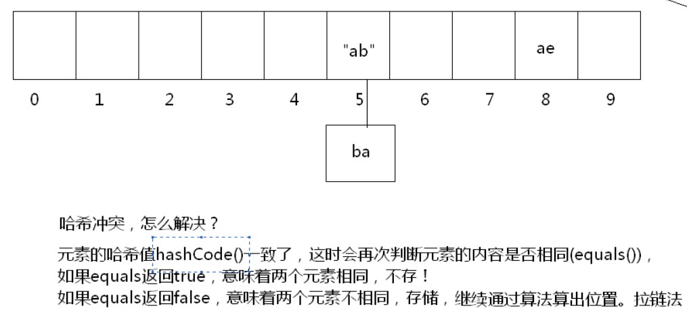
	
	* **TreeSet**
	
		day19_20
	
		会对元素进行<font color=red>排序(依赖Comparable接口的`compareTo()`方法)</font>，不叫<font color=red>有序(有序指存取数据顺序)</font>
	
		依赖`compareTo()`方法判断是不是一个元素
	
		二叉树结构
	
		```java
		@Override
		public int compareTo(Student o) {
			int res = this.getAge()-o.getAge();
			return res == 0?this.username.compareTo(o.username):res;
		}
		```
	
		

---

#### String作业

day18_12

两个字符串的最大相同子串

```java
public static void main(String[] args) {
    String s1 = "asdfitcastghjfghjk",s2="xcitcastvbnm";

    String maxSubstring = getMaxSubstring(s1,s2);
    System.out.println("maxSubstring = " + maxSubstring);
}
/*
1.先确定两个字符串的长短，在长串中判断短串是否存在
2.存在，已找到，说明短串就是最大的相同串
  不存在，就将短串按照长度递减的方式，获取短串的子串去长串判断
3.一旦存在，停止查找
*/
public static String getMaxSubstring(String s1,String s2) {
    String max = (s1.length()>s2.length())?s1:s2;
    String min = (s1.length()>s2.length())?s2:s1;

    for (int i = 0; i < min.length(); i++) {//行数
        for (int start = 0,end = min.length() - i; end <= min.length(); start++,end++) 
        {//列数
            String temp = min.substring(start, end);
            if (max.contains(temp))
                return temp;
        }
    }
    return null;
}
```

day18_13

对给定字符串进行自然顺序排序

```java
public static void main(String[] args) {
    String s = "cfdasbv";
    System.out.println(sortString(s));
}

public static String sortString(String s) {
    char[] chars = s.toCharArray();
    Arrays.sort(chars);
    return new String(chars);
}
```

---

#### Iterator迭代同时操作

day19_11

在迭代过程中，对集合元素进行操作，会引发ConcurrentModificationException异常

Iterator有一个子接口可以解决该问题

**ListIterator**

<font color=red>List集合特有迭代器</font>，可以边迭代边增删改查，原理<font color=red>List集合有编号</font>

```java
list.listIterator();
```

---

#### LinkedList模拟队列

day19_14

```java
import java.util.*;

class Queue<E> {
    private LinkedList<E> link;

    Queue() {
        link = new LinkedList<E>();
    }

    /**
     * 队列添加元素
     * @param e
     */
    public void enQueue(E e) {
        link.addLast(e);
    }

    /**
     * 队列删除元素
     * @return
     */
    public E deQueue() {
        return link.removeFirst();
    }

    /**
     * 判断空队列
     * @return
     */
    public boolean isEmpty() {
        return link.isEmpty();
    }
}
```

模拟堆栈同理

---

#### 比较器Comparator

对象的排序方式

* 自然排序

	> 元素自身实现`Comparable`接口，重写`compareTo()`方法

* 比较器

	> ```java
	> Set<Student> set = new TreeSet<Student>(new Comparator<Student>() {
	> 	@Override
	> 	public int compare(Student s1, Student s2) {
	> 		//code...比较依据
	>         int res = s1.getAge()-s2.getAge();
	>         return res == 0?s1.getUsername().compareTo(s2.getUsername()):res;
	> 		return s1.age;
	> 	}
	> });
	> ```

**练习**

day19_24

字符串进行长度由长到短的排序

```java
Set<String> set = new TreeSet<>(new Comparator<String>() {
	@Override
	public int compare(String s1, String s2) {
		int i = s1.length() - s2.length();
		return (i == 0)?s1.compareTo(s2):i;
	}
});
set.add("abc");
set.add("haha");
set.add("xixi");
set.add("z");
set.add("hiahia");
for (Iterator it = set.iterator(); it.hasNext();)
	System.out.println(it.next());
/*
输出
z
abc
haha
xixi
hiahia
*/
```

---

#### LinkedHashSet

day19_24

HashSet的子类

保留了HashSet的元素唯一性的同时，还能保证有序(取出顺序同添加顺序)

---

#### foreach增强for循环

day19_25

底层还是迭代器，用于遍历数组和Collection

---

#### 泛型E

day20_28

* 安全机制，明确了集合元素类型
* 运行时可能发生的ClassCastException转换为编译时期的编译失败
* 泛型技术，是给编译器使用的技术
* 避免了强转的麻烦

**泛型的擦除**

day20_30

Java的泛型是伪泛型，这是因为Java在编译期间，所有的泛型信息都会被擦掉，正确理解泛型概念的首要前提是理解类型擦除

Java的泛型基本上都是在编译器这个层次上实现的，在生成的字节码中是不包含泛型中的类型信息的，使用泛型的时候加上类型参数，在编译器编译的时候会去掉，这个过程成为类型擦除

<font color=red>生成的.class文件中不含泛型</font>

> **类型擦除引起的问题及解决方法**
>
> 先检查，再编译以及编译的对象和引用传递问题
>
> Q: 既然说类型变量会在编译的时候擦除掉，那为什么我们往 ArrayList 创建的对象中添加整数会报错呢？不是说泛型变量String会在编译的时候变为Object类型吗？为什么不能存别的类型呢？既然类型擦除了，如何保证我们只能使用泛型变量限定的类型呢
>
> A: Java编译器是通过先检查代码中泛型的类型，然后在进行类型擦除，再进行编译
>
> ```java
> ArrayList<String> list1 = new ArrayList(); //第一种 情况
> ArrayList list2 = new ArrayList<String>(); //第二种 情况
> /*
> 因为类型检查就是编译时完成的，new ArrayList()只是在内存中开辟了一个存储空间，可以存储任何类型对象
> 而真正设计类型检查的是它的引用，因为我们是使用它引用list1来调用它的方法
> 比如说调用add方法，所以list1引用能完成泛型类型的检查
> 而引用list2没有使用泛型，所以不行
> */
> ```
>
> **自动类型转换**
>
> 因为类型擦除的问题，所以所有的泛型类型变量最后都会被替换为原始类型。
>
> 既然都被替换为原始类型，那么为什么我们在获取的时候，不需要进行强制类型转换呢？
>
> 看下`ArrayList.get()`方法源码
>
> ```java
> public E get(int index) {  
>  RangeCheck(index);  
>  return (E) elementData[index];  
> }
> ```
>
> **泛型类型变量不能是基本数据类型**
>
> 不能用类型参数替换基本类型
>
> 就比如，没有`ArrayList<double>`，只有`ArrayList<Double>`
>
> 因为当类型擦除后，`ArrayList`的原始类型变为`Object`，但是`Object`类型不能存储`double`值，只能引用`Double`的值

**泛型方法**

day20_31

```java
public class Test2<T> {    
    public static T one;   //编译错误    
    public static  T show(T one){ //编译错误    
        return null;    
    }    
}
------------------------------------------------------------------
------------------------------------------------------------------
public class Test2<T> {    
    public static <T>T show(T one){ //这是正确的    
        return null;    
    }    
}
```

静态方法需要使用泛型，<font color=red>泛型必须定义在方法上,且泛型类中的静态方法和静态变量不可以使用泛型类所声明的泛型类型参数</font>

**泛型接口及其实现类**

day20_32


**泛型通配符**

day20_33

`Collection<?> c`--? 通配符

```java
private static void printList(Collection<?> c) {
	for (Iterator<?> it = c.iterator(); it.hasNext();) {
		System.out.println(it.next());
	}
}
```

day20_34

`Collection<? extends Person> c`--? extends Person 通配符(限定)

只接受Person和Person子类

```java
private static void printList(Collection<? extends Person> c) {
	for (Iterator<?> it = c.iterator(); it.hasNext();) {
		System.out.println(it.next());	
	}
}
```

`Collection<? super Person> c`--? super Person 通配符(限定)

只接受Person和Person父类

**Example**(子类限定)

day20_36

```java
Collection<Student> c = new ArrayList<>();
c.add(new Student("aw99",21));
c.add(new Student("aw2",22));
c.add(new Student("aw3",23));
/*
具体体现
TreeSet<Person>构造器只接受Person和Person子类
*/
TreeSet<Person> ts = new TreeSet<>(c);//TreeSet<? extends Person>()
ts.add(new Person("aw", 21));
		
for (Iterator<Person> it = ts.iterator(); it.hasNext();) {
	Person person = it.next();
	System.out.println(person);
}
/*
输出
Person [name=aw, age=21]
Student [name=aw99, age=21]
Student [name=aw2, age=22]
Student [name=aw3, age=23]
*/
```

**Example**(父类限定)

day20_36

```java
//TreeSet<E>(Comparable<? super E> e)
TreeSet<Student> ts = new TreeSet<>(new Comparator<Student>() {
	@Override
	public int compare(Student s1, Student s2) {
		int temp = s1.getAge() - s2.getAge();
		return temp == 0 ? s1.getName().compareTo(s2.getName()) : temp;
	}	
});
ts.add(new Student("aw1",26));
ts.add(new Student("bw2",29));
ts.add(new Student("ow3",20));

for (Iterator<Student> it = ts.iterator(); it.hasNext();) {
	Student student = it.next();
	System.out.println(student);
}
```

**小Tips**

day20_38

```java
public static void main(String[] args) {
	Collection<Student> c = new ArrayList<>();
	
	c.add(new Student("aw1",12));
	c.add(new Student("aw2",13));
	c.add(new Student("aw3",14));
		
	Student stu = getMax(c);
	System.out.println(stu);
}
/*
有点晕
为什么是<E extends Comparable<? super E>>？Comparable不是接口吗？
*/	
public static <E extends Comparable<? super E>> E getMax(Collection<? extends E> c) {
	Iterator<? extends E> it = c.iterator();
	E max = it.next();
	while (it.hasNext()) {
		E e = it.next();
		if (e.compareTo(max) > 0) {
			max = e;
		}
	}
	return max;
}
```

---

#### Collections集合工具类

day20_39

|                  返回值                  |                             方法                             |                        描述                         |
| :--------------------------------------: | :----------------------------------------------------------: | :-------------------------------------------------: |
|  `<T extends Comparable<? super T>> T`   | `max(Collection<? extends T> coll,Comparator<? super T> cmp)` |             获取最大值(比较器参数可选)              |
|  `<T extends Comparable<? super T>> T`   | `min(Collection<? extends T> coll,Comparator<? super T> cmp)` |             获取最小值(比较器参数可选)              |
| `<T extends Comparable<? super T>> void` |        `sort(List<T> list,Comparator<? super T> cmp)`        | 排序(比较器参数可选)<font color=red>List专用</font> |
|                  `void`                  |                   `reverse(List<?> list)`                    |       反转顺序<font color=red>List专用</font>       |
|           `<T> Comparable<T>`            |              `reverseOrder(Comparable<T> cmp)`               |       逆转实现Comparable对象(比较器参数可选)        |

集合工具类添加同步效果的方法

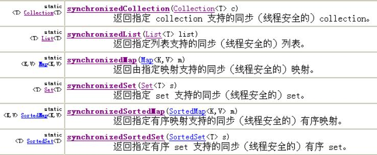

---

#### Arrays数组工具类

day20_40

`<T> List<T> asList(T... a)`返回一个受指定数组支持的<font color=red>固定大小</font>的列表

* 数组转集合的目的：为了使用集合的方法操作数组的元素

* 数组转的集合<font color=red>不支持增删等改变长度</font>操作(java.lang.UnsupportedOperationException不支持操作异常)

* 数组中存储的是<font color=red>基本数据类型</font>，转换成集合，<font color=red>数组对象</font>作为集合元素存在

	```java
	int[] arr = {34,21,67};
	List<int[]> list = Arrays.asList(arr);
	System.out.println(list);
	/* 结果[[I@145c859] */
	```

	数组中存储的是<font color=red>引用数据类型</font>，转换成集合，<font color=red>数组元素</font>作为集合元素存在

	```java
	Integer[] arr = {34,21,67};
	List<Integer> list = Arrays.asList(arr);
	System.out.println(list);
	/* 结果[34,21,67] */
	```

Collection中的方法`<T> T[] toArray(T[] a)`返回包含此集合中所有元素的数组

* 集合转数组的目的：为了限制增删操作

```java
Collection<String> c = new ArrayList<>();
		
c.add("aw1");
c.add("aw2");
c.add("aw3");
/*
传入的数组长度不够，会创建一个同类型的集合长度的数组
长度过长，多余的位置为null
最好定义为c.size()
*/
String[] res = c.toArray(new String[c.size()]);
System.out.println(Arrays.toString(res));
/* 结果[aw1, aw2, aw3] */
```

---

#### Map集合

day21_41

|               方法               |     描述     |
| :------------------------------: | :----------: |
|        `Set<K> keySet()`         |  返回键集合  |
| `Set<Map.Entry<K,V>> entrySet()` | 返回映射关系 |
|     `Collection<V> values()`     |  返回值集合  |

day21_45

键集合需要保证数据唯一性，所以用`Set`

值集合不需要保证唯一性，所以用`Collection`

```java
Map<String, String> res = new HashMap<>();
res.put("星期一", "Monday");
res.put("星期日", "Sunday");

Set<Entry<String,String>> entrySet = res.entrySet();
/* 方法一 */
for (Iterator<Entry<String,String>> it = entrySet.iterator(); it.hasNext();) {
	Entry<String, String> entry = it.next();
	String key = entry.getKey();
	String value = entry.getValue();
	System.out.println(key + "  " + value);
}
/* 方法二 */
for (Entry<String, String> entry : entrySet) {
	String key = entry.getKey();
	String value = entry.getValue();
	System.out.println(key + "  " + value);
}
```


---

#### Map子类

* Hashtable

	> 哈希表
	>
	> 同步
	>
	> 不允许空键值对

	* Properties

		> 属性集
		>
		> 键值都是字符串
		>
		> 结合IO流细讲

* HashMap

	> 哈希表
	>
	> 不保证同步
	>
	> 允许空键值对

	* LinkedHashMap

		> 链表+哈希表
		>
		> 保证Map集合有序(存取顺序一致)

* TreeMap

	> 二叉树
	>
	> 不保证同步
	>
	> 可以对Key排序

day21_46

```java
/*
Student重写了hashcode()、toString()和equals()方法
同姓名同年龄视为同一人
*/
HashMap<Student,String> map = new HashMap<>();
		
map.put(new Student("zhouqi", 25),"广州");
map.put(new Student("zhouqi", 25),"aw");
		
for (Student stu : map.keySet()) {
	String value = map.get(stu);
	System.out.println(stu + "   " + value);
}
/*
结果：Student [name=zhouqi, age=25]   aw
*/
```

day21_48

统计给定字符串各个字符频数

```java
String s = "werertrt";
char[] cs = s.toCharArray();
Map<Character, Integer> map = new TreeMap<>();
for (int i = 0; i < cs.length; i++) {
    /* 不统计标点之类的 */
    if (!(cs[i] >= 'a' && cs[i] <= 'z') || (cs[i] >= 'A' && cs[i] <= 'Z')) {
        continue;
    }

    Integer val = map.get(cs[i]);
    Integer count = 1;
    if (val != null)
        count += val;
    map.put(cs[i], count);
}
System.out.println(map);
/*
结果：{e=2, r=3, t=2, w=1}
*/
```

---

#### 可变参数

day21_49


同时注意：<font color=red>可变参数必须定义在参数列表的最后</font>

---

#### 静态导入

day21_50

```java
import static java.uil.Collections.max;
/* 静态导入，导入指定类中的静态成员 */
```

```java
List<String> list = new ArrayList<>();
//add code...
String m = max(list);//可以不用写Collections.
System.out.println(m);
```

---

#### System

|             方法             |          描述          |
| :--------------------------: | :--------------------: |
|  `long currentTimeMillis()`  | 获取当前系统时间毫秒值 |
| `Properties getProperties()` |     获取系统属性集     |

```java
Properties prop = System.getProperties();
Set<String> keys = prop.stringPropertyNames();
for (String key : keys) {
	String values = prop.getProperty(key);
	System.out.println(key + ":" + values);
}
```

```
java.runtime.name:Java(TM) SE Runtime Environment
sun.boot.library.path:C:\Program Files\Java\jdk1.8.0_251\jre\bin
java.vm.version:25.251-b08
java.vm.vendor:Oracle Corporation
java.vendor.url:http://java.oracle.com/
path.separator:;
java.vm.name:Java HotSpot(TM) 64-Bit Server VM
file.encoding.pkg:sun.io
user.script:
user.country:CN
sun.java.launcher:SUN_STANDARD
sun.os.patch.level:
java.vm.specification.name:Java Virtual Machine Specification
user.dir:D:\IDEAworkspace\demo
java.runtime.version:1.8.0_251-b08
java.awt.graphicsenv:sun.awt.Win32GraphicsEnvironment
java.endorsed.dirs:C:\Program Files\Java\jdk1.8.0_251\jre\lib\endorsed
os.arch:amd64
java.io.tmpdir:C:\Users\ADMINI~1\AppData\Local\Temp\
line.separator:

java.vm.specification.vendor:Oracle Corporation
user.variant:
os.name:Windows 10
sun.jnu.encoding:GBK
java.library.path:C:\Program Files\Java\jdk1.8.0_251\bin;C:\WINDOWS\Sun\Java\bin;C:\WINDOWS\system32;C:\WINDOWS;C:\Program Files (x86)\Common Files\Oracle\Java\javapath;C:\WINDOWS\system32;C:\WINDOWS;C:\WINDOWS\System32\Wbem;C:\WINDOWS\System32\WindowsPowerShell\v1.0\;C:\WINDOWS\System32\OpenSSH\;C:\Program Files\nodejs\;C:\Users\Administrator\AppData\Local\Microsoft\WindowsApps;D:\Program Files (x86)\Bangizip\;C:\Program Files\Java\jdk1.8.0_251\lib;C:\Program Files\Java\jdk1.8.0_251\bin;C:\Users\Administrator\AppData\Roaming\npm;D:\Program Files (x86)\mysql-5.7.26\bin;;.
java.specification.name:Java Platform API Specification
java.class.version:52.0
sun.management.compiler:HotSpot 64-Bit Tiered Compilers
os.version:10.0
user.home:C:\Users\Administrator
user.timezone:
java.awt.printerjob:sun.awt.windows.WPrinterJob
file.encoding:UTF-8
java.specification.version:1.8
user.name:Administrator
java.class.path:C:\Program Files\Java\jdk1.8.0_251\jre\lib\charsets.jar;C:\Program Files\Java\jdk1.8.0_251\jre\lib\deploy.jar;C:\Program Files\Java\jdk1.8.0_251\jre\lib\ext\access-bridge-64.jar;C:\Program Files\Java\jdk1.8.0_251\jre\lib\ext\cldrdata.jar;C:\Program Files\Java\jdk1.8.0_251\jre\lib\ext\dnsns.jar;C:\Program Files\Java\jdk1.8.0_251\jre\lib\ext\jaccess.jar;C:\Program Files\Java\jdk1.8.0_251\jre\lib\ext\jfxrt.jar;C:\Program Files\Java\jdk1.8.0_251\jre\lib\ext\localedata.jar;C:\Program Files\Java\jdk1.8.0_251\jre\lib\ext\nashorn.jar;C:\Program Files\Java\jdk1.8.0_251\jre\lib\ext\sunec.jar;C:\Program Files\Java\jdk1.8.0_251\jre\lib\ext\sunjce_provider.jar;C:\Program Files\Java\jdk1.8.0_251\jre\lib\ext\sunmscapi.jar;C:\Program Files\Java\jdk1.8.0_251\jre\lib\ext\sunpkcs11.jar;C:\Program Files\Java\jdk1.8.0_251\jre\lib\ext\zipfs.jar;C:\Program Files\Java\jdk1.8.0_251\jre\lib\javaws.jar;C:\Program Files\Java\jdk1.8.0_251\jre\lib\jce.jar;C:\Program Files\Java\jdk1.8.0_251\jre\lib\jfr.jar;C:\Program Files\Java\jdk1.8.0_251\jre\lib\jfxswt.jar;C:\Program Files\Java\jdk1.8.0_251\jre\lib\jsse.jar;C:\Program Files\Java\jdk1.8.0_251\jre\lib\management-agent.jar;C:\Program Files\Java\jdk1.8.0_251\jre\lib\plugin.jar;C:\Program Files\Java\jdk1.8.0_251\jre\lib\resources.jar;C:\Program Files\Java\jdk1.8.0_251\jre\lib\rt.jar;D:\IDEAworkspace\demo\out\production\demo;D:\Program Files (x86)\JetBrains\IntelliJ IDEA 2020.1.2\lib\idea_rt.jar
java.vm.specification.version:1.8
sun.arch.data.model:64
java.home:C:\Program Files\Java\jdk1.8.0_251\jre
sun.java.command:aw.Demo
java.specification.vendor:Oracle Corporation
user.language:zh
awt.toolkit:sun.awt.windows.WToolkit
java.vm.info:mixed mode
java.version:1.8.0_251
java.ext.dirs:C:\Program Files\Java\jdk1.8.0_251\jre\lib\ext;C:\WINDOWS\Sun\Java\lib\ext
sun.boot.class.path:C:\Program Files\Java\jdk1.8.0_251\jre\lib\resources.jar;C:\Program Files\Java\jdk1.8.0_251\jre\lib\rt.jar;C:\Program Files\Java\jdk1.8.0_251\jre\lib\sunrsasign.jar;C:\Program Files\Java\jdk1.8.0_251\jre\lib\jsse.jar;C:\Program Files\Java\jdk1.8.0_251\jre\lib\jce.jar;C:\Program Files\Java\jdk1.8.0_251\jre\lib\charsets.jar;C:\Program Files\Java\jdk1.8.0_251\jre\lib\jfr.jar;C:\Program Files\Java\jdk1.8.0_251\jre\classes
java.vendor:Oracle Corporation
file.separator:\
java.vendor.url.bug:http://bugreport.sun.com/bugreport/
sun.cpu.endian:little
sun.io.unicode.encoding:UnicodeLittle
sun.desktop:windows
sun.cpu.isalist:amd64
```

---

#### Math

day21_03

|                方法                |            描述             |
| :--------------------------------: | :-------------------------: |
|             `abs(参)`              |           绝对值            |
| `acos(参)`、`asin(参)`、`atan(参)` |   反余弦、反正弦、反正切    |
|       `int max(int a,int b)`       |           最大值            |
|      `double ceil(double a)`       | 大于a的最小整数的double表示 |
|      `double floor(double a)`      | 小于a的最大整数的double表示 |
|      `double round(double a)`      |          四舍五入           |
|  `double pow(double a,double b)`   |          a的b次方           |
|         `double random()`          |         0-1伪随机数         |

---

#### Date & Format

day22_03

DateFormat.FULL/LONG/MEDIUM(默认风格)/SHORT

```java
DateFormat.getDateInstance(DateFormat.FULL).format(new Date());
/* 2020年7月9日 星期四 */

DateFormat.getDateInstance(DateFormat.LONG).format(new Date());
/* 2020年7月9日 */

DateFormat.getDateInstance(DateFormat.MEDIUM).format(new Date());
/* 2020-7-9 */

DateFormat.getDateInstance(DateFormat.SHORT).format(new Date());
/* 20-7-9 */
```

`getDateTimeInstance(DateFormat.LONG,DateFormat.LONG)`

```java
DateFormat.getDateTimeInstance(DateFormat.LONG,DateFormat.LONG).format(new Date());
/* 2020年7月9日 下午03时54分55秒 */
```

**Calendar**

day22_04

```java
public static void main(String[] args) {
    Calendar c = Calendar.getInstance();
    int year = c.get(Calendar.YEAR);
    int month = c.get(Calendar.MONTH) + 1;
    int day = c.get(Calendar.DAY_OF_MONTH);
    String week = getCnWeek(c.get(Calendar.DAY_OF_WEEK));
    System.out.println(year + "年" + month + "月" + day + "日 " + week);
}

public static String getCnWeek(int week) {
    String[] weeks = {"","星期日","星期一","星期二","星期三","星期四","星期五","星期六"};
    return weeks[week];
}
```

**练习**

day22_05

1. 将毫秒值转成指定的日期格式	xxxx年xx月xx日 hh:mm:ss

	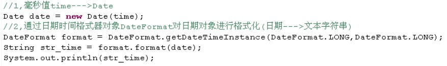

2. "2012/3/17"转成对象

	```java
	String str_date = "2012/3/17";
	DateFormat df = new SimpleDateFormat("yyyy/MM/dd");
	
	Date date = df.parse(str_date);//声明异常ParseException
	
	System.out.println(date);
	```

   

3. "2013-4-25"到"2013年7月29日"到底有多少天

	```java
	/*
	思路
	1.到底多少天？相减的过程
	2.字符串不能减，毫秒值可以减
	3.怎么获取毫秒值？日期对象转毫秒值
	4.怎么获取日期对象？字符串文本转日期对象
	*/
	String s1 = "2013-4-25";
	String s2 = "2013年7月29日";
	//DateFormat df1 = new SimpleDateFormat("yyyy-MM-dd");
	//DateFormat df2 = new SimpleDateFormat("yyyy年MM月dd日");
	DateFormat df1 = DateFormat.getDateTimeInstance(DateFormat.MEDIUM);
	DateFormat df2 = DateFormat.getDateTimeInstance(DateFormat.LONG);
	Date date1 = df1.parse(s1);
	Date date2 = df2.parse(s2);
	
	long time = Math.abs(date1.getTime() - date2.getTime());
	int day = (int)(time / 1000 / 60 / 60 / 24);
	
	System.out.println("day = " + day);
	```

4. 获取给定年份的2月有多少天

	时间是连续的，3月1日的前一天就是2月的最后一天

	```java
	public static void show(int year) {
	    Calendar c = Calendar.getInstance();
	    c.set(year,2,1);//月份从0开始
	    c.add(Calendar.DAY_OF_MONTH,-1);
	    c.get(Calendar.DAY_OF_MONTH);
	}
	```

---

#### IO流(数据持久化存储)

**File**

day22_03

将文件封装成File对象，也可以封装不存在的文件/文件夹变成对象

```java
String pathName = "d:\\downloads\\Tools\\geek.exe";
File f = new File(pathName);
```

```java
File dir = new File("d:\\downloads\\Tools");
File f = new File(dir,"geek.exe");
```

`File.separator` 文件分隔符--字符串对象(跨平台)

```java
File dir = new File("d:" + File.separator + "downloads\\Tools");
```

**文件夹创建删除**

day22_05

创建文件

* 文件不存在，创建，返回true
* 文件存在，返回false
* 路径错误，IOException

```java
File f = new File("d:\\aw.txt");
System.out.println(f.createNewFile());
```

删除文件/文件夹

文件

* 文件存在
	* 未被使用，删除，返回true
	* 正在使用，返回false
* 文件不存在，返回false

文件夹

* 有内容，返回false
* 无内容，删除，返回true

```java
File f = new File("d:\\aw.txt");	
System.out.println(f.delete());
```

判断文件是否存在

```java
File f = new File("d:\\aw.txt");	
System.out.println(f.exits());
```

判断是否是绝对路径

```java
isAbsolute()
```

判断是否是文件夹(不存在也会false的)

```java
isDirectory()
```

判断是否是文件(不存在也会false的)

```java
isFile()
```

获取文件最后修改时间

```java
String pathName = "d:\\downloads\\Tools\\geek.exe";
File f = new File(pathName);
long lm = f.lastModified();
String format = DateFormat.getDateTimeInstance(DateFormat.LONG,DateFormat.LONG).format(new Date(lm));
System.out.println(format);
```

创建目录

```java
mkdir() //单级目录
mkdirs() //多级目录
```

获取文件夹名称`Stirng[] list()`

> 返回String[]数组，而不返回集合的原因：集合存在增删操作

获取文件夹文件`List<File> listFiles()`

> 返回File类型的集合

```java
File f = new File("d:\\downloads");
//File[] listFiles = null;
String[] files = null;
if (f.exists() && f.isDirectory()) {
//	listFiles = f.listFiles();
	files = f.list();
}
//for (File file : listFiles) {
//	System.out.println(file.getName());
//}
for (String file : files) {
	System.out.println(file);
}
/*
结果：
125期×每周作业练习-HAI000.pdf
day22_日期时间类_IO技术入门
day23_File类_字节流
day24_字符流综合使用
day25_编码解码_流的操作规律
day26_文件切割合并_对象的序列化
day27_打印流_图形界面编程
desktop.ini
jetbrains-agent
MyBatis笔记.pdf
texture
Tools
官网看插件
成绩单.jpg
桌面.gif
简历.pdf
*/
```

---

#### 练习 文件名过滤器，包含指定字符串的文件

```java
File f = new File("d:\\downloads");
File[] list = null;
if (f.exists() && f.isDirectory()) {
	list = f.listFiles(new FilenameFilter() {
		@Override
		public boolean accept(File dir, String name) {
			return name.endsWith(".pdf");//以".pdf"结尾的文件
		}
	});
}
for (File file : list) {
	System.out.println(file);
}
```

**文件过滤器**

```java
File f = new File("d:\\downloads");
File[] list = null;
if (f.exists() && f.isDirectory()) {
	list = f.listFiles(new FileFilter() {
				
		@Override
		public boolean accept(File pathname) {
			return pathname.isDirectory();
		}
	});
}
for (File file : list) {
	System.out.println(file);
}
```

---

#### 练习 打印层级目录结构(深度遍历)

day24_07

```java
public static void showAll(File f) throws Exception {
	if (!f.exists())
		throw new Exception("路径不存在");
	if (f.isDirectory()) {
		File[] list = f.listFiles();
		for (File file : list) {
			if (file.isDirectory()) {
				System.out.println(file.getName() + "<文件夹>");
				System.out.print("\t");
				showAll(file);
			} else {
				System.out.println(file.getName());
			}
		}
	} else {
		System.out.println(f.getName());
	}
}
```

---

#### 练习 打印层级目录结构(广度遍历)

day24_09

```java
public static void showAll2(File f) throws Exception {
	if (!f.exists())
		throw new Exception("路径不存在");
	if (f.isDirectory()) {
		Queue<File> fq = new Queue<>();
		fq.enQueue(f);
		while (!fq.isEmpty()) {
			File dfile = fq.deQueue();
			System.out.println(dfile.getName() + "<文件夹>");
			File[] list = dfile.listFiles();
			for (File file : list) {
				if (file.isDirectory())
					fq.enQueue(file);
				else
					System.out.println(file.getName());
			}
		}
	} else {
		System.out.println(f.getName());
	}
}
```

---

#### 字节输出流

day24_10

输出流

* 文件不存在，创建文件
* 文件存在，覆盖文件

```java
File dir = new File("temp");
//创建临时目录
if (!dir.exists())
	dir.mkdir();
//创建存储数据的文件
File f = new File(dir,"demo.txt");
//输出流目的是文件，会自动创建，如果存在会覆盖
OutputStream FOP = new FileOutputStream(f);
byte[] data = "awsl\tnmsl".getBytes();
FOP.write(data);
//关闭流资源
FOP.close();
```

day24_11

输出流_续写

`FileOutputStream(File file,boolean append)`

day24_12

IO异常

```java
File file = new File("k:\\temp\\demo.txt");
FileOutputStream fos = null;
try {
	fos = new FileOutputStream(file);
	String s = System.getProperty("line.separator") + "awsl2";
	fos.write(s.getBytes());
} catch (IOException e) {
	e.printStackTrace();
} finally {
	if (fos !=null) {
		try {
			fos.close();
		} catch (IOException e) {
			throw new RuntimeException();
		}
	}
}
```

---

#### 字节输入流

`int read()` -- 读取一个字节并返回，没有字节返回-1

```java
File f = new File("temp\\demo.txt");
InputStream fis = new FileInputStream(f);
int ch;
while((ch = fis.read()) != -1) {
	System.out.print((char)ch);
}
fis.close();
```

`int read(byte[] b)` -- 读取一定量的字节数，并存储到字节数组中，返回实际读取到的字节数

```java
File f = new File("temp\\demo.txt");
InputStream fis = new FileInputStream(f);

byte[] buf = new byte[1024];
int len = 0;
while ((len = fis.read(buf)) != -1) {
	System.out.print(new String(buf,0,len));			
}

fis.close();
```

`int available()` -- 返回关联文件的估计大小

```java
InputStream fis = new FileInputStream(f);

byte[] buf = new byte[fis.available()];//定义了一个刚刚好的数组
/* 文件过大数组长度还是会溢出，所以建议还是取1024整数倍 */
fis.close();
```

---

#### 练习 文件清单列表

day24_10

```java
public class Demo {
    private static final String LINE_SEPARATOR = System.getProperty("line.separator");

    public static void main(String[] args) throws IOException {
        File dir = new File("d:\\IDEAworkspace");
        ArrayList<File> list = new ArrayList<>();
        getFileList(dir, new FileFilter() {
            @Override
            public boolean accept(File pathname) {
                return pathname.getName().endsWith(".java");
            }
        },list);
        System.out.println(list.size());

        File o = new File("d:\\java.txt");
        list2File(list,o);
        System.out.println("over");
    }

    private static void list2File(List<File> list, File o) throws IOException {
        FileOutputStream fos = null;
        try {
            fos = new FileOutputStream(o);
            for (File f : list) {
                String temp = f.getAbsolutePath() + LINE_SEPARATOR;
                fos.write(temp.getBytes());
            }
        } finally {
            if (fos != null)
                fos.close();
        }
    }

    public static void getFileList(File dir, FileFilter ft, List<File> list) {
        File[] files = dir.listFiles();
        for (File f : files) {
            if (f.isDirectory())
                getFileList(f, ft,list);
            else {
                if (ft.accept(f))
                    list.add(f);
            }
        }
    }
}
```

---

#### 字节流 字符流

day24_11

**字节流**

> <font color=red>操作字节数组</font>
>
> 一次读一个字节，无法读取中文。
>
> 一个中文2~3个字节。
>
> 也有处理方式，如下。
>
> ```java
> FileInputSream fis = new FileInputStream("temp/aw.txt");
> 
> byte[] buf = new byte[1024];
> /*
> byte[4] 数组过小，可能会存半个中文
> */
> int len = 0;
> while ((len = fis.read(buf)) != -1) {
>  String s = new String(buf,0,len);
>  System.out.print(s);
> }
> ```

day24_14

**字符流**

> <font color=red>操作字符数组</font>
>
> 一次读一个字符
>
> 为了便于操作数据中的字符数据
>
> 原理 -- 字节流+编码表
>
> * Reader
>
> * Writer
>
> 	> `flush()`和`close()`的区别
> 	>
> 	> `flush()` -- 将流中缓冲区的数据刷新到目的地，刷新后可以继续使用流。
> 	>
> 	> `close()` -- 关闭资源，会先调用`flush()`将缓冲区的数据刷新到目的地。
> 	>
> 	> 
> 	>
> 	> 写入数据多，边写边刷新，最后一次可以不刷。

day24_15

FileWriter、FileReader -- 只能使用默认的编码

OutputStreamWriter、InputStreamReader -- 可以指定charset编码格式

```java
File f = new File("d:\\downloads\\aw.txt");
OutputStreamWriter osw = new OutputStreamWriter(new FileOutputStream(f),"gbk");

osw.write("炉石传说真尼玛好玩！");
//osw.flush();
osw.close();
```

day24_16

```java
File f = new File("d:\\downloads\\aw.txt");
InputStreamReader isr = new InputStreamReader(new FileInputStream(f), "gbk");

char[] buf = new char[1024];
int len;
while((len = isr.read(buf)) != -1) {
	System.out.print(new String(buf,0,len));
}
```

day24_17

**继承关系**

OutputStreamWriter

* FileWriter

InputStreamReader

* FileReader

父类和子类功能上的区别

*  OutputStreamWriter和InputStreamReader是字符和字节的桥梁，也可以称之为字符转换流

	字符转换原理：字节流 + 编码表

*  FileWriter、FileReader作为子类，仅作为操作字符文件的便捷类存在

	当操作的字符文件使用的是默认编码时可以不用父类，简化了代码。

---

#### 编码表

day24_12

1. ASCII

	> 一个字节中的7位就可以表示
	>
	> 对应的字节都是正数
	>
	> 0xxxxxxx

2. ISO8859-1

	> 拉丁码表latin
	>
	> 用了一个字节的8位
	>
	> 1xxxxxxx

3. GB2312

	> 简体中文码表，六七千个中文和符号
	>
	> 用两个字节表示
	>
	> 开头都是1，两个字节都是负数

	GBK

	> 两万的中文和符号
	>
	> 用两个字节表示
	>
	> 一部分文字第一个字节开头1，第二个字节开头0

	GB18030

4. Unicode

	> 国际标准码表
	>
	> 无论什么文字，都用两个字节存储
	>
	> <font color=red>Java中的char类型就是用的这个码表</font>
	>
	> <font color=red>String按照系统默认码表解析</font>

5. UTF-8

	> 基于unicode
	>
	> 一个字节能存储的，不用两个字节存储
	>
	> 更加标准化，每个字节头都加入了编码信息

---

#### 练习 复制文件

day24_18

```java
private static void copyFile(File f, File f2) throws IOException {
	FileReader fr = new FileReader(f);
    FileWriter fw = new FileWriter(f2);

    char[] buf = new char[1024];
    int ch = 0;
    while ((ch = fr.read(buf)) != -1) fw.write(buf,0,ch);

    fr.close();
    fw.close();
}
```

day24_19

字符流缓冲区对象复制文本文件

```java
private static void bufferedCopyFile(File f, File f2) throws IOException {
    BufferedReader br = new BufferedReader(new FileReader(f));
    BufferedWriter bw = new BufferedWriter(new FileWriter(f2));

    String s;
    while ((s = br.readLine()) != null) {
        System.out.println(s);
        bw.write(s/* + bw.newLine()*/);
        bw.flush();//记得刷新缓冲区
    }
    br.close();
    bw.close();
}
```

---

#### 编码解码

day25_20

字符串String <--> 字节数组byte[]

> 字符串 - 编码(`getBytes()`) -> 字节数组
>
> 字节数组 - 解码(`new String(byte[])`) -> 字符串

day25_22

)

---

#### 字符流缓冲区以及readLine()原理

day25_23


模拟自定义字符流缓冲区

day25_25、26

```java
public class MyBufferedReader {
    private Reader r;

    /* 定义字符数组，作为缓冲区 */
    private char[] buf = new char[1024];
    /* 定义数组索引 */
    private int index = 0;
    /* 定义read读取字符个数 */
    private int count = 0;

    public MyBufferedReader(Reader r) {
        this.r = r;
    }

    /**
     * 从缓冲区拿一个字符
     * @return
     */
    public int read() throws IOException {
        /* 缓冲区没有数据才去读 */
        if (count == 0) {
            //count重新记录buf大小
            count = r.read(buf);
            /* 角标归0 */
            index = 0;
        }

        if (count == -1) return -1;

        /* 从缓冲区中取出一个字符 */
        char ch = buf[index];
        /* 角标自增 */
        index++;
        /* 计数器自减 */
        count--;
        return ch;
    }

    /**
     * 将行终止符前的数据转成字符串返回
     * @return
     */
    public String readLine() throws IOException {
        //1.定义临时容器
        StringBuilder sb = new StringBuilder();
        //2.调用本类的read，从缓冲区读取字符，存储
        int ch = 0;
        while ((ch = this.read()) != -1) {
            if (ch == '\r')
                continue;
            if (ch == '\n')
                return sb.toString();
            sb.append((char)ch);
        }

        /* 防止最后一行没有终止符 */
        if (sb.length() != 0)
            return sb.toString();
        return null;
    }

    /**
     * 关闭流资源
     * @throws IOException
     */
    public void close() throws IOException {
        r.close();
    }
}
```

---

#### 装饰设计模式

day25_27

Reader

* XxxReader
* YyyReader
* BufferedReader

减少继承体系的臃肿，增加功能比继承更为灵活

装饰设计模式

> ***解决问题***
>
> 给一组类增加功能，避免继承的臃肿，提高灵活性
>
> ***注意***
>
> 装饰类和被装饰类必须同一体系
>
> 装饰类通常提供构造函数接收被装饰类

---

#### 键盘高效录入

day25_29

```java
BufferedReader br = new BufferedReader(new InputStreamReader(System.in));
/*
等效
InputStream in = System.in;//字节输入流，获取了键盘输入流
InputStreamReader isr = new InputStreamReader(in);
BufferedReader br = new BufferedReader(isr);
*/
String s = null;
while((s = br.readLine()) != null) {
    System.out.println(s);
}
```

---

#### 高效录入并存文件

day25_30

```java
BufferedReader br = new BufferedReader(new InputStreamReader(System.in));
BufferedWriter bw = new BufferedWriter(new FileWriter("d:\\downloads\\aw.txt",true));

String s = null;
while((s = br.readLine()) != null) {
    System.out.println(s);
    bw.write(s);
    bw.newLine();
    bw.flush();
}
br.close();
bw.close();
```

---

#### IO流体系总结

day25_31

***字节流***

* FileInputStream、FileOutputStream
* BufferedInputStream、BufferedOutputStream

***字符流***

* FileReader、FileWriter
* InputStreamReader、OutputStreamWriter
* BufferedReader、BufferedWriter

IO流对象很多，解决问题到底用哪个对象呢

**明确一**：要操作的数据是数据源还是数据目的地

> **源**  InputStream、Reader
> 
> **目的地**  OutputStream、Writer

**明确二**：要操作的设备上的数据是字节还是文本

> **源**
> 
> * 字节  InputStream
> * 文本  Reader
> 
> **目的地**
>
> * 字节  OutputStream
> * 文本  Writer

**明确三**：数据所在的具体设备

> **源设备**
>
> * 硬盘    文件File开头
> * 内存    数组、字符串
> * 键盘    System.in
> * 网络    Socket
>
> **目的设备**
>
> * 硬盘    文件File开头
> * 内存    数组、字符串
> * 屏幕    System.out
> * 网络    Socket

**明确四**：是否需要额外功能

> 转换	转换流	InputStreamReader、OutputStreamWriter
>
> 高效    缓冲区对象	Buffered...
>
> 多个源	序列流	SequenceInputStream、...
>
> 对象需要序列化	ObjectInputStream、ObjectOutputStream
>
> 保证数据的表示形式	PrintStream
>
> 保证基本数据类型字节原样性	DataOutputStream、DataInputStream

---

#### Test

1. 将字符串写入到文件中

	day25_32

	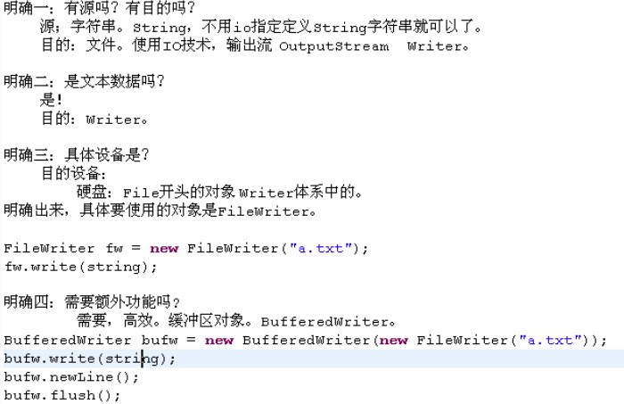

2. 复制一个文本文件

	day25_33

	

	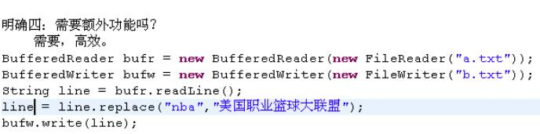

3. 读取键盘录入，存储到文件中

	day25_34

	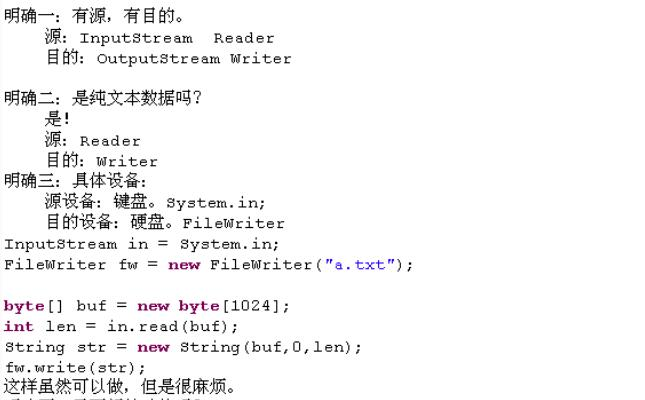

	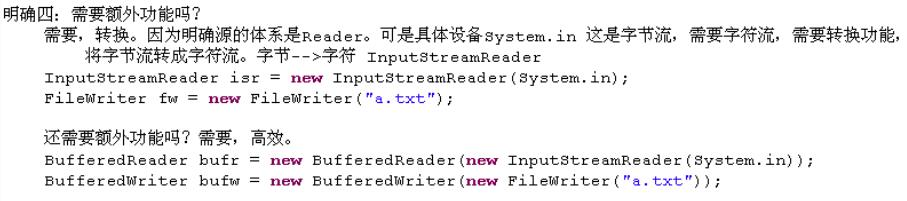

4. 读取文本文件打印到屏幕上

	day25_35

	

	

5. 读取文件文本数据，UTF-8存储文件

	day25_36

	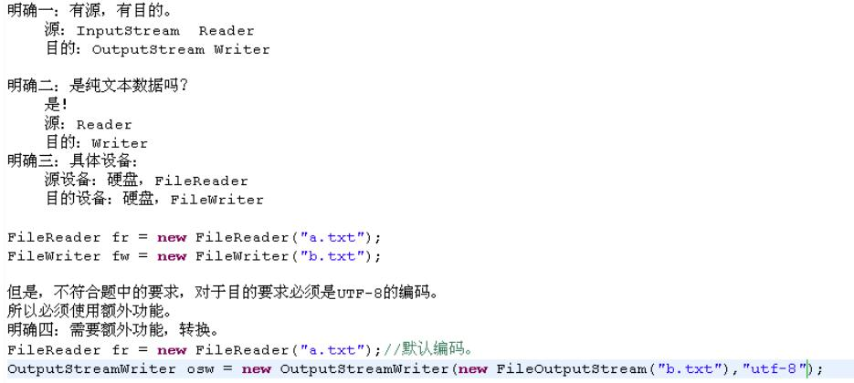

---

#### 练习 切割文件

day26_37

```java
public static void splitFiles(File srcF,File partDir) throws IOException {
    /* 健壮性判断 */
    if (!(srcF.exists() && srcF.isFile()))
        throw new RuntimeException("源文件不存在");
    if (!partDir.isDirectory())
        throw new IOException("目的路径格式不正确，请键入文件夹目录");
     if (!partDir.exists())
        partDir.mkdirs();
    FileInputStream fis = new FileInputStream(srcF);
    FileOutputStream fos = null;

    byte[] buf = new byte[BUFFER_SIZE];
    int len = 0;
    int count = 1;
    while((len = fis.read(buf)) != -1) {
        /* 注意count要自增 */
        fos = new FileOutputStream(new File(partDir,(count++) + ".part"));
        fos.write(buf,0,len);
        fos.close();
    }
    String filename = srcF.getName(),partCount = Integer.toString(count - 1);
    fos = new FileOutputStream(new File(partDir, ".partConfig"));
    fos.write(("filename=" + filename + LINE_SEPARATOR).getBytes());
    fos.write(("partcount=" + partCount).getBytes());
    fos.close();
    
    fis.close();
}
```

---

#### 集合Properties

day26_39

Map中和IO技术结果的集合对象：Properties

存储的键值都是字符串

通常这个集合就用于配置文件的读取

可以保存在流中或从流中加载

day26_45

```java
//根据配置文件获取配置信息属性集。
private static Properties getProperties(File configFile) throws IOException {
	FileInputStream fis = null;
	Properties prop = new Properties();
	try{
		//读取流和配置文件相关联。
		fis = new FileInputStream(configFile);
		//将流中的数据加载的集合中。
		prop.load(fis);
	}finally{
		if(fis!=null){
			try{
				fis.close();
			}catch(IOException e){
				//写日志，记录异常信息。便于维护。
			}
		}
	}
	return prop;
}
```

```java
private static void merge(File partsDir,Properties prop) throws FileNotFoundException,
			IOException {		
	//获取属性集中的信息。
	String filename = prop.getProperty("filename");
	int partCount = Integer.parseInt(prop.getProperty("partcount"));		
	//使用io包中的SequenceInputStream，对碎片文件进行合并，将多个读取流合并成一个读取流。
	List<FileInputStream> list = new ArrayList<FileInputStream>();		
	for (int i = 1; i <= partCount; i++) {
		list.add(new FileInputStream(new File(partsDir, i + ".part")));
	}		
	//怎么获取枚举对象呢？List自身是无法获取枚举Enumeration对象的，考虑到Collections中去找。
	Enumeration<FileInputStream> en = Collections.enumeration(list);		
	SequenceInputStream sis = new SequenceInputStream(en);//源
	FileOutputStream fos = new FileOutputStream(new File(partsDir,filename));//目的
	byte[] buf = new byte[4096];
	int len = 0;
	while((len=sis.read(buf))!=-1){
		fos.write(buf,0,len);
	}		
	fos.close();
	sis.close();
}
```

---

#### 练习 记录程序运行次数

day26_46

```java
public class AppCountDemo {
	public static void main(String[] args) throws IOException {
        /*
         * 练习:定义功能记录程序运行次数，满足试用次数后，给出提示：试用次数已到，请注册。
         *
         * 思路：
         * 1，需要计数器。这个软件使用一次计数一次。每使用一次，就进行计数累计。
         * 2，计数器是程序中的一个变量，程序启动计数器计数，可是程序结束这个计数器就消失了。
         * 下次启动会重新进行计数，原来计数的值没有保留下来。咋办?
         * 3，让这个计数器持久化。存储到文件中，为了标识数据可读性，数据起个名字。出现键值对。
         * 而且还是一个持久化的键值对，Properties集合正好符合这个要求。
         *
         */
        if (tryStop()) {
            System.out.println("试用结束，请注册");
            return;
        }
        runCode();
    }

    private static void runCode() {
        System.out.println("code...run...");
    }

    private static boolean tryStop() throws IOException {
        //读取配置文件
        File f = new File("temp.properties");
        if (!f.exists()) {
            f.createNewFile();
        }
        //创建属性集
        Properties prop = new Properties();
        //定义读取流和配置文件关联
        FileInputStream fis = new FileInputStream(f);
        //将流关联的数据读取到属性集中
        prop.load(fis);
        //获取次数
        String value = prop.getProperty("count","0");
        int count = Integer.parseInt(value);
        if (count >= 2)
            return true;
        count++;
        //存储到属性集，键相同，值覆盖
        prop.setProperty("count",Integer.toString(count));

        //定义输出流
        FileOutputStream fos = new FileOutputStream(f);
        prop.store(fos,"app run count");

        //关闭资源
        fos.close();
        fis.close();

        return false;
    }
}
```

---

#### 对象序列化  ObjectOutputStream

day26_47

`Serializable`标记接口，用于启动类序列化功能

```java
public static void writeObj(Object obj) throws IOException {
    FileOutputStream fos = new FileOutputStream("test.object",true);
    ObjectOutputStream oos = new ObjectOutputStream(fos);
    oos.writeObject(obj);
    oos.close();
}
```

---

#### 对象反序列化  ObjectInputStream

day26_48

```java
public static void readObj() throws IOException,ClassNotFoundException {
    FileInputStream fis = new FileInputStream("test.object");
    ObjectInputStream ois = new ObjectInputStream(fis);
    Object obj = oos.redObject();
    System.out.println(obj.toString());
}
```

---

#### Serializable序列化接口

day26_49

* 没有方法，不需要覆盖，是一个标记接口，为了启动序列化功能

* 给每一个需要序列化的类分配一个序列版本号

	这个版本号和该类相关联

	在序列化时，会将序列号也一同保存到文件中

	反序列化会读取这个序列号和本类的序列号进行匹配

	不匹配会抛出异常java.io.InvalidClassException

建议自己定义序列号

```java
private static final long serialVersionUID = 123451;
```

day26_50

类中的静态数据不会被序列化

非静态数据通过添加`transient`关键字修饰，也不会被序列化

transient/* 瞬态 */

---

#### 打印流

day27_51

字节流的write方法只将一个整数的最低字节写入到目的地

```java
PrintStream ps = new PrintStream("temp\\int.txt");
//ps.write(97);//只能写入最低字节
ps.print(97);//将数据转成字符串
ps.close();
```

输出语句对应的对象PrintStream

提供了很多打印的方法，保证数据值的表现形式

write()只能写入最低字节，可以和读配合

print()将数据转成字符串

同样的也存在字符打印流PrintWriter

---

#### 基本类型数据流

day27_52

DataInputStream

```java
public static void readData() throws IOException {
	FileInputStream fis = new FileInputStream("tempfile\\data.txt");
	//读取一个整数，需要额外功能。
	DataInputStream dis = new DataInputStream(fis);
	int num = dis.readInt();
	System.out.println("num="+num);
	dis.close();	
}
```

DataOutputStream

```java
public static void writeData() throws IOException {		
	FileOutputStream fos = new FileOutputStream("tempfile\\data.txt");
	//需要额外功能吗？需要，可以写一个基本数值的原字节不变。
	DataOutputStream dos = new DataOutputStream(fos);
	dos.writeInt(97);//00000000 00000000 00000000 01100001 
	dos.close();	
}
```

---

#### 用于操作数组和字符串的流

day27_53

ByteArrayInputStream

ByteArrayOutputStream

* 关闭此流无效(没有调用底层资源)

* 不会抛出IOException
* 内部有一个可以<font color=red>自动增长</font>的数组

```java
public class ByteArrayStreamDemo {
	public static void main(String[] args) {
		//源和目的都内存的读写过程。		
		//源：内存。
		ByteArrayInputStream bis = new ByteArrayInputStream("abcde".getBytes());//用流的读写思想操作数组中的数据。				
		//目的：内存。
		ByteArrayOutputStream bos = new ByteArrayOutputStream();//内部有一个可自动增长的数组。
//		byte[] buf = "abcde".getBytes();
//		for(byte b : buf){
//			bos.write(b);
//		}
		int ch = 0;
		while((ch=bis.read())!=-1){
			bos.write(ch);
		}
		//因为没有调用底层资源，所以不要关闭，即使调用了close，也没有任何效果，不会抛出IOException.		
		System.out.println(bos.toString());
	}
}
```


---

#### RandomAccessFile

day27_54

RandomAccessFile

重点对象：

* File开头的四个。
* Buffered开头的四个。
* 转换流两个。
* 打印流两个。
* File对象。

后面的都是额外功能。

```java
public class RandomAccessFileDemo {
	public static void main(String[] args) throws IOException {
		/*
		 * RandomAccessFile：
		 * 1，随机访问。
		 * 2，操作文件。
		 * 3，既可以读又可以写，
		 * 4，内部维护了用于存储数据的byte数组。
		 * 5，提供了一个对数组操作的文件指针。
		 * 6， 文件指针可以通过getFilePointer 方法读取，并通过 seek 方法设置。 
		 * 
		 * 注意：随机读写，数据需要规律，用RandomAccessFile类需要明确要操作的数据的位置。
		 */

//		writeFile();		
		readFile();		
	}

	public static void readFile() throws IOException {	
		RandomAccessFile raf = new RandomAccessFile("tempfile\\random.txt", "r");
		//改变指针的位置，想读谁就读谁。
		raf.seek(8*3);		
		
		byte[] buf = new byte[4];
		raf.read(buf);
		String name = new String(buf);
		System.out.println("name="+name);
		
		int age = raf.readInt();
		System.out.println("age="+age);
		
		raf.close();		
	}

	public static void writeFile() throws IOException {	
		RandomAccessFile raf = new RandomAccessFile("tempfile\\random.txt", "rw");
        //写一些字符信息，姓名 +年龄。
//		raf.write("张三".getBytes());
//		raf.writeInt(97);//保证字节的原样性。
//		raf.write("李四".getBytes());
//		raf.writeInt(99);//保证字节的原样性。
		
		raf.seek(4);
		
		raf.write("王武".getBytes());
		raf.writeInt(102);
		
		System.out.println(raf.getFilePointer());
		
		raf.close();		
	}
}
```

---

#### GUI

day28_02

**Awt**

Component

* Container
	* Window
		* Frame
		* Dialog
			* FileDialog
	* Panel
* Button
* Label
* Checkbox
* TextComponent
	* TextArea
	* TextField

**常见的布局管理器**

* FlowLayout(流式布局)
	* 从左到右的顺序排列
	* Panel默认的布局管理器

* BorderLayout(边界布局)
	* 东，南，西，北，中
	* <font color=red>Frame默认的布局管理器</font>

* GridLayout(网格布局)
	* 规则的矩阵

* CardLayout(卡片布局)
	* 选项卡

* GridBagLayout(网格包布局)
	* 非规则的矩阵

---

#### GUI事件监听机制

day28_05

```java
Button btn = new Button("awsl");
btn.addActionListener(new ActionListener() {
    @Override
    public void actionPerformed(ActionEvent e) {
        System.exit(0);
    }
});
f.add(btn);
```

---

#### 适配器

day28_06

WindowListener的抽象实现类WindowAdapter

只要监听接口的方法在2个以内，就没有适配器。

适配器的出现只为方便创建监听对象。

但是一般监听接口都有适配器。

---

#### 鼠标、键盘事件

day28_07

鼠标

```java
btn.addMouseListener(new MouseAdapter() {
    @Override
    public void mouseClicked(MouseEvent e) {
        if (e.getClickCount() == 2)
            System.out.println("Double clicked!...");
    }
});
f.add(btn);
```

day28_08

键盘

```java
TextField tf = new TextField(40);
tf.addKeyListener(new KeyAdapter() {
    @Override
    public void keyPressed(KeyEvent e) {
//      int keyCode = e.getKeyCode();
//      if (!(keyCode >= KeyEvent.VK_0 && keyCode <= KeyEvent.VK_9)) {
//          System.out.println("请键入数字");
//          e.consume();//阻止行为
//      }
        if (e.isControlDown() && e.getKeyCode() == KeyEvent.VK_ENTER)
            System.out.println("ctrl + enter is down...");
    }
});
```

---

#### 网络编程 网络要素

day29_02


---

#### TCP UDP

day29_05

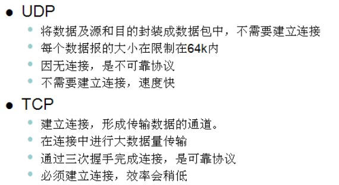

---

#### UDP发送端

day29_07

DatagramSocket	对数据包操作的插座

DatagramPacket	封装的数据包

```java
public class UDPSend {
    public static void main(String[] args) throws IOException {
        //1.建立UDP的socket，具备发送或者接收功能
        DatagramSocket ds = new DatagramSocket();
        //2.将数据封装到数据包DatagramPacket中
        String text = "hello world";
        byte[] buf = text.getBytes();
        DatagramPacket dp = new DatagramPacket(buf,buf.length, InetAddress.getByName("127.0.0.1"),10000);
        //3.使用socket对象的send方法发送数据包
        ds.send(dp);
        //4.关闭资源
        ds.close();
    }

}
```

---

#### UDP接收端

day29_08

```java
public class UDPReceive {
    public static void main(String[] args) throws IOException {
        System.out.println("接收端run...");
        //定义接收的插座，一定要明确接收端口
        DatagramSocket ds = new DatagramSocket(10000);
        //接受数据，先定义数据包
        byte[] buf = new byte[1024];
        DatagramPacket dp = new DatagramPacket(buf, buf.length);
        ds.receive(dp);//在接收到数据之前一直堵塞
        //解析数据
        String ip = dp.getAddress().getHostAddress();
        int port = dp.getPort();
        String data = new String(dp.getData(), 0, dp.getLength());
        System.out.println("ip:" + ip);
        System.out.println("port:" + port);
        System.out.println("data:" + data);
        //关闭资源
        ds.close();
    }
}
```

day29_09

键盘录入数据

```java
public class UDPSend2 {
    public static void main(String[] args) throws IOException {
        //1.建立UDP的socket，具备发送或者接收功能
        DatagramSocket ds = new DatagramSocket();
        //2.将数据封装到数据包DatagramPacket中，数据来自键盘录入
        BufferedReader br = new BufferedReader(new InputStreamReader(System.in));
        String text = null;
        while ((text = br.readLine()) != null) {
            if ("over".equals(text))
                break;
            byte[] buf = text.getBytes();
            DatagramPacket dp = new DatagramPacket(buf,buf.length, InetAddress.getByName("192.168.1.106"),10001);
            //3.使用socket对象的send方法发送数据包
            ds.send(dp);
        }
        //4.关闭资源
        ds.close();
    }
}
```

---

#### 练习 UDP群聊程序

day29_10

```java
public class UDPChat {
    public static void main(String[] args) throws IOException {
        DatagramSocket sendDs = new DatagramSocket();
        DatagramSocket receiveDs = new DatagramSocket(10001);
        //创建任务对象
        Send send = new Send(sendDs);
        Receive receive = new Receive(receiveDs);
        //创建进程
        Thread t1 = new Thread(send);
        Thread t2 = new Thread(receive);

        t1.start();
        t2.start();
    }
}

class Send implements Runnable {
    private DatagramSocket ds;

    public Send(DatagramSocket ds) {
        this.ds = ds;
    }

    @Override
    public void run() {
        try {
            BufferedReader br = new BufferedReader(new InputStreamReader(System.in));
            String text = null;
            while ((text = br.readLine()) != null) {
                byte[] buf = text.getBytes();
                DatagramPacket dp = new DatagramPacket(buf,buf.length, InetAddress.getByName("192.168.1.106"),10001);
                ds.send(dp);
                if ("over".equals(text))
                    break;
            }
            //4.关闭资源
            ds.close();
        } catch (IOException e) {
            e.printStackTrace();
        }
    }
}

class Receive implements Runnable {
    private DatagramSocket ds;

    public Receive(DatagramSocket ds) {
        this.ds = ds;
    }

    @Override
    public void run() {
        //定义接收的插座，一定要明确接收端口
        while (true) {
            try {
                byte[] buf = new byte[1024];
                DatagramPacket dp = new DatagramPacket(buf, buf.length);
                ds.receive(dp);//在接收到数据之前一直堵塞
                String ip = dp.getAddress().getHostAddress();
                int port = dp.getPort();
                String data = new String(dp.getData(), 0, dp.getLength());
                if ("over".equals(data)) {
                    System.out.println(ip + "离开了聊天室...");
                }
                System.out.println(ip + ":" + port + ":" + data);
            } catch (IOException e) {
                e.printStackTrace();
            }
        }
    }
}
```

---

#### TCP客户端

day29_11

```java
public class TCPClient {
    public static void main(String[] args) throws IOException {
        System.out.println("客户端run...");
        //1.建立TCP客户端socket
        Socket s = new Socket("127.0.0.1", 10003);
        //2.如果通道建立成功，就会出现socketIo流，客户端要做的就是获取socket中的输出流
        OutputStream out = s.getOutputStream();
        //3.发送数据
        out.write("hello world".getBytes());
        //4.关闭资源
        s.close();
    }
}
```

---

#### TCP服务端

day29_12

```java
public class TCPServer {
    public static void main(String[] args) throws IOException {
        System.out.println("服务端run...");
        //创建服务端socket，明确端口
        ServerSocket ss = new ServerSocket(10003);
        //服务端获取客户端和指定的客户端通信
        Socket s = ss.accept();
        String ip = s.getInetAddress().getHostAddress();
        System.out.println("ip:" + ip + "已连接");
        //读取数据
        InputStream is = s.getInputStream();
        byte[] buf = new byte[1024];
        //打印
        int len = 0;
        while ((len = is.read(buf)) != -1) {
            System.out.println(new String(buf,0,len));
        }
        //关闭资源
        s.close();
        System.out.println("ip:" + ip + "断开连接");
        ss.close();
    }
}
```

day29_16

`shutdownOutput()`	客户端输出完数据，提醒服务端数据输出完毕，不要等着读取了

---

#### 通过字符流传输媒体数据不可以的原因

day29_17


---

#### http1.0和http1.1的区别

day29_28

`URL`	解析url地址

`URLConnection`	获取url的连接，封装了Socket对象

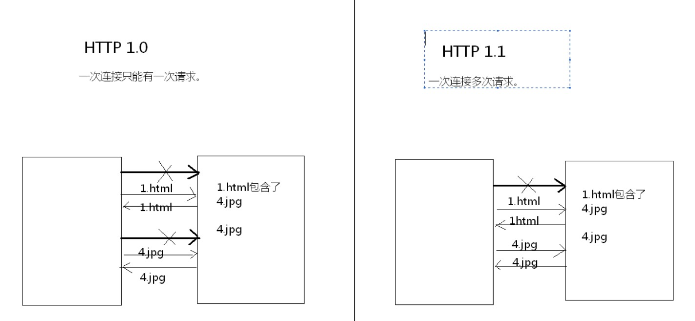

---

#### CS	BS

day29_29

C/S : client / server

* 程序员需要开发客户端和服务端
* 维护较为麻烦
* 将一部分运算转移到客户端来完成，减轻服务器端的压力

B/S : browser / server

* 程序员只需要开发服务端，客户端使用浏览器即可
* 维护很简单，只需维护服务端
* 所有运算都在服务端

---

#### 正则表达式

day30_01

专门用于操作字符串的技术

简化代码，用于对字符串验证

弊端

> 符号多了、阅读性差

1.匹配

2.切割

> **正则规则的复用**
>
> day30_05
>
> 先封装，正则封装用()完成。
>
> 封装完成有编号，从1开始。规则中被()封装的称之为组。直接通过编号就可以调用对应的组。
>
> `(.)\\1`使用已有的第一组
>
> ```java
> /* 切割 */
> String test = "ert###yuixkkkkcvbn";
> String regex = "(.)\\1+";//正则规则的复用，先封装,用()完成,封装完成后有编号，从1开始,
> String[] ss = test.split(regex);
> for (String s : ss) {
>     System.out.println(s);
> }
> /*
> 结果
> ert
> yuix
> cvbn
> */
> ```

3.替换

  > day30_06
  >
  > 在参数列表中，其他参数要使用之前参数中的规则的组，需要使用$组编号来获取。
  >
  > ```java
  > /* 替换 */
  > String test = "wert@@@@yuios#####dfgh";
  > String regex = "(.)\\1+";
  > test = test.replaceAll(regex,"$1");
  > System.out.println(test);
  > /*
  > 结果
  > wert@yuios#dfgh
  > */
  > ```
  >
  > ```java
  > /* 替换二 */
  > String test = "ertyuio9999999999fghjk54831613165137sgdfsfv";
  > test = test.replaceAll("\\d{5,}","***");
  > System.out.println(test);
  > /*
  > 结果
  > ertyuio***fghjk***sgdfsfv
  > */
  > ```

4.获取

> day30_07
>
> `match()`内部封装了Pattern对象
>
> 通过pattern对象获取matcher对象(匹配对象)
>
> 通过匹配器对象进行匹配，结果在匹配器中
>
> 通过匹配器对象获取结果
>
> *范例代码*
>
> ```java
> Pattern p = Pattern.compile("a*b");
> Matcher m = p.matcher("aaaaab");
> boolean b = m.matches();
> ```
> 
> ```java
> /* 获取 */
> String str = "da jia zhu yi le ming tian fang jia le";
> String regex = "\\b[a-zA-Z]{3}\\b";//取出由三个字母组成的单词
> Pattern p = Pattern.compile(regex);
> Matcher m = p.matcher(str);
> while (m.find()) {
>     System.out.println(m.start() + ".." + m.group() + ".." + m.end());
>     System.out.println(str.substring(m.start(),m.end()));
> }
> /*
> 结果
> 3..jia..6
> jia
> 7..zhu..10
> zhu
> 32..jia..35
> jia
> */
> ```

day30_02

**预定义字符**

|  .   |           任何字符            |
| :--: | :---------------------------: |
|  \d  |          数字 [0-9]           |
|  \D  |        非数字 \[^0-9]         |
|  \s  | 空白字符 [ \\t\\n\\x0B\\f\\r] |
|  \S  |      非空白字符 \[^\\s]       |
|  \w  |     单词字符 [a-zA-Z_0-9]     |
|  \W  |       非单词字符\[^\\w]       |

**Greedy数量词**

|   X?   |    X，一次或一次也没有    |
| :----: | :-----------------------: |
|   X*   |       X，零次或多次       |
|   X+   |       X，一次或多次       |
|  X{n}  |        X，恰好n次         |
| X{n,}  |        X，至少n次         |
| X{n,m} | X，至少n次，但是不超过m次 |

##### 邮箱正则

`Stirng regex = "\\w+@\\w+(\\.\\w+)+";`

---

#### <font color=red>练习 IP排序</font>

day30_09

```java
public static void test_2(){
	String str_ips = "127.0.0.1  3.3.3.3     192.168.104.23  10.10.10.10";
		
	/*
	* 应该先让这些ip地址的每一段的位数都是3位，这样才可以通过字符串自然排序。
	* 不足3位用0补，每一段要补的0的个数也不一致。咋补呢？
	* 
	* 干脆，按照每一段最大的的补零数去补，保证每一个段至少有三位，
	* 然后每一段只取最后三位。
	* 
	* 替换。
	*/
	//1,先每一段都补两个0.
	str_ips = str_ips.replaceAll("(\\d+)", "00$1");
	System.out.println(str_ips);
	//00127.000.000.001  003.003.003.003     00192.00168.00104.0023  0010.0010.0010.0010
	
	//2,只保留三位。
	str_ips = str_ips.replaceAll("0*(\\d{3})", "$1");
	System.out.println(str_ips);
	//127.000.000.001  003.003.003.003     192.168.104.023  010.010.010.010
	
	String[] ips = str_ips.split(" ");
	Arrays.sort(ips);//按照字符串的自然顺序,排序的结果不是对的，因为ip的每一段位数是不一致的。
	for(String ip : ips){
		System.out.println(ip.replaceAll("0*(\\d+)", "$1"));
	}
}
```

---

#### 反射机制

day30_02

**字节码文本对应的类**

```java
class Class {//描述字节码文件的类
    Field field;//将字段封装成对象类型Field
    Constructor cons;//构造函数
    Method method;//一般方法
    getaField();//获取公共成员
    getFields();//获取所有公共成员
    getDeclaredField(String name);//获取任意成员
    getDeclaredFields();//获取所有成员
    getMethod();
    getConstructor();
    newInstance();//直接创建此类实例
}
```

**获取字节码文件对象**

* getClass()[不适用反射]

   day30_03
   
   ```java
   Class clazz1 = new Person().getClass();
   Class clazz2 = new Person().getClass();
   System.out.println(clazz1 == clazz2);
   /* true */
   ```
   
* 所有类的静态成员class[不适用反射]

   day30_04

   ```java
   System.out.println(Person.class);
   /* class reflect.Person */
   ```

* `Class.forName(String className)`

   day30_05

   ```java
   String className = "reflect.Person";//注意填全路径
   Class<?> clazz = Class.forName(className);
   System.out.println(clazz);
   ```

**创建字节码对象所表示的类的对象**

day30_06

`Object newInstance()`

```java
String className = "reflect.Person";
Class<?> clazz = Class.forName(className);
Object o = clazz.newInstance();
```

抛出的异常

day30_07

* InstantiationException	没有对应的构造函数
* IllegalAccessException    权限不够读取对应的构造函数

**获取构造函数(带参)**

day30_08

```java
String className = "reflect.Person";
Class<?> clazz = Class.forName(className);
Constructor<?> c = clazz.getConstructor(String.class,int.class);
Object aw = c.newInstance("aw", 24);
System.out.println(aw);
/* Person{name='aw', age=24} */
```

**获取字段 暴力访问**

day30_09

```java
String className = "reflect.Person";
Class<?> clazz = Class.forName(className);
Field f = clazz.getDeclaredField("age");
Object o = clazz.newInstance();
f.setAccessible(true);//取消权限检查，暴力访问
f.set(o,30);
System.out.println(o);
/* Person{name='null', age=30} */
```

**获取方法**

day30_10

```java
String className = "reflect.Person";
Class<?> clazz = Class.forName(className);

Method show = clazz.getMethod("show",null);
Object o = clazz.newInstance();
show.invoke(o,null);
```


---

#### HTML 列表标签

day31_04

dl>dt(上层列表)+dd(下层列表(具备缩进效果))

项目符号列表都具备缩进效果

* ol>li有序
* ul>li无序

```html
<!-- type:circle/disc/square -->
<ul type="square">
	<li>aw1</li>
	<li>aw2</li>
	<li>aw3</li>
</ul>
```

---

#### Get Post

day31_15

Get提交，将提交信息封装到了请求行

Post提交，将提交信息封装到了请求体

---

#### 客户端服务端校验思考

day31_16

如果表单加入了增强型的校验，这时，服务器收到数据后，还需要校验吗？

> 需要，因为客户端有可能避开校验，提交错误数据到服务端
>
> 别人把表单复制一份，去除网页的校验js提交数据

和服务端交互

* 地址栏输入	get
* 超链接             get
* 表单                 get/post

服务端如果进行校验，页面还需要校验吗？

> 需要
>
> 为了减轻服务端的压力
>
> 同时增强用户的体验效果

---

#### JavaScript

day32_05

在js中，非0非null即为true，默认为1；否则为false，默认为0

```js
console.log(5320/1000);//5.32

console.log('13' + 8);//138
console.log('13' - 8);//5

console.log(true + 1);//2
console.log(false + 1);//1
```

**函数**

day32_07

函数定义没有参数列表也能传参数，默认存在arguments[]里面

函数内置参数数组arguments[]，存放参数

```js
function show() {
	for (let a in arguments) {
		console.log(a);
        console.log("--------");
        console.log(arguments[a]);
	}
}
show(3,5,4,2,1);
/*
0
1
2
3
4
-------
3
5
4
2
1
*/
```

js中函数其实是一个对象，函数名就是对象的引用

```js
function show() {
	return 100;
}
//var z = show();//运行show方法，赋值z
var z = show;//将show引用指向的对象的地址赋值z
console.log(z);
console.log(z());
/*
show() {
	return 100;
}
100
*/
```

动态函数

```js
/*
动态函数
使用js中的已有内置对象Function
*/
var getSum = new Function("x,y","var sum = x + y; return sum;");
var sum = getSum(3,4);
console.log(sum);
/*
7
*/
```

匿名函数

```js
var qq = function() {
	console.log("run...");
};
qq();
```

**数组**

day32_10

* 是一个容器
* 长度是可变的
* 任何类型的数据，弱类型

表示方式

* ```js
	var arr = [];
	```

* ```js
	var arr = new Array();
	```

	```js
	var arr = new Array(3);//创建长度为3的数组
	```

	```js
	var arr = new Array(3,9);//创建了一个长度为2的数组，元素为3、9
	```

```js
var arr = [1,2,3,4,5];
arr[6] = 20;
for (let i = 0; i < arr.length; i++) {
    console.log(arr[i]);
}
/*
1
2
3
4
5
undefined
20
*/
```

**内置对象**

day32_11

* Array

	

* Math

	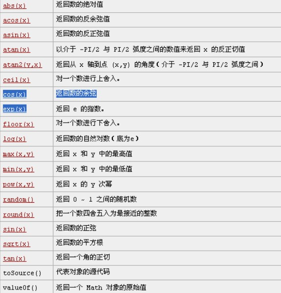

* Date

* String

* Boolean

**原型**

day32_12

Array对象的`prototype`原型属性    使您有能力向对象添加属性和方法

```js
Array.prototype.getMax = function() {
    var max = this[0];
    for (let i = 1; i < this.length; i++) {
        if (this[i] > max)
            max = this[i];
    }
    return max;
};
```

**自定义对象**

day33_13

动态添加属性和方法

```js
/* 构造器 */
function Person() {
    alert('awsl');
}

var p = new Person();
/* 动态添加属性和方法 */
p.name = "zhangsan";
p.age = 30;
p.show = function() {
    console.log(this.name + ":" + this.age);
}
p.show();
```

构造时直接添加

```js
function Person(name,age) {
    this.name = name;
    this.age = age;
    this.toString = function() {
        return "Person[name=" + this.name + ",age=" + this.age + "]";
    }
}
//给对象原型添加新方法
Pserson.prototype.show() {
    console.log(this.toString());
}
```

---

#### DOM(Document Object Model)文档对象模型

day32_01

将标记型文档以及文档中的标签等所有内容都封装成了对象

浏览器内置了DOM技术的解析器，打开网页就会解析之后驻留在内存中

---

#### BOM(Browser Object Model)浏览器文档模型

day32_03

将浏览器以及浏览器中的一些内容封装成了对象

Window

* history
* location
	* href
	* reload()
* navigator
* document
	* getElementById()
		* nodeName	节点名称
		* innerHTML    其中源代码
		* innerText        其中文本
		* childNodes     子节点
		* parentNode     父节点
		* previousSibling、nextSibling   前后一个节点(<font color=red>尽量不要用</font>)
	* getElementsByName()
	* getElementsByTagName()

```html
<a href="javascript:void(0);"></a>
<!-- 什么都不做 -->
```

```html
<form onsubmit="return check();">
    <button type="submit">提交</button>
</form>
<script type="text/script">
	function check() {
		if(...)
			return true;
		else
			return false;
	}
</script>
```

