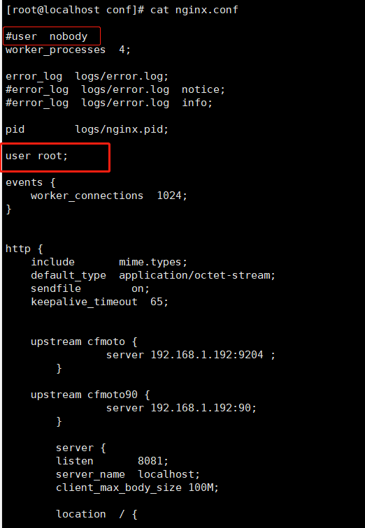
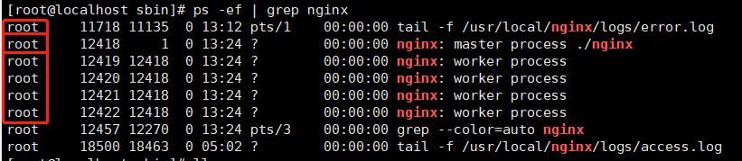

# nginx

## nginx安装配置并运行

```shell
#安装gcc gcc是一个linux下的编译器。可以编译C,C++,Ada,Object C和Java等语言。
#查看版本
gcc -v
#安装
yum -y install gcc

#pcre,pcre-devel安装。pcre是一个perl库,包括perl兼容的正则表达式库,nginx的http模块使用pcre来解析正则表达式。
yum install -y pcre pcre-devel

#zlib安装 zlib库提供了很多种压缩和解压缩方式nginx使用zlib对http包的内容进行gzip,所以需要安装。
yum install -y zlib zlib-devel

#openssl是web安全通信的基石,没有openssl,可以说我们的信息都是在裸奔
yum install -y openssl openssl-devel

#下载nginx
wget http://nginx.org/download/nginx-1.9.9.tar.gz

#解压
tar -zxvf nginx-1.9.9.tar.gz

#切换到cd /usr/local/java/nginx-1.9.9/下面。执行以下三个命令
./configure
make
make install

#之后nginx就被安装在了 /usr/local/nginx 中。然后切换到/usr/local/nginx安装目录。如下图：
```


### 配置nginx环境变量

```shell
#使用nginx的命令比较方便，不需要进入到sbin目录下
#1打开配置文件
	sudo vi /etc/profile
#2添加配置
	export NGINX_HOME=/usr/local/nginx
	export PATH=$PATH:$NGINX_HOME/sbin
#3保存退出
	:wq
#4重载文件
	source /etc/profile
#5验证是否成功
	nginx -v
```


### nginx config

[nginx的配置文件](https://www.cnblogs.com/54chensongxia/p/12938929.html)

~~~shell
#一,全局块

#worker_processes是nginx进程相关配置，一般一个进程足够。一般情况下不用修改。但考虑到实际情况，可以修改这个数值，以提高性能。
#官方的建议是修改成CPU的内核数，据实践表明，nginx的这个参数在一般情况下开4个或8个就可以了，再往上开的话优化不太大。
worker_processes  1;

#二,event块
#主要是影响nginx服务器与用户的网络连接
events {
    #支持的最大连接数配置
    worker_connections  1024;
}

#三,http块是最重要的配置
http {
    #http全局块配置包括：1文件引入 2mime类型 3日志自定义 4连接超时时间 5单连接请求上限等。
    include       		mime.types;
    default_type  		application/octet-stream;
    sendfile        	on;
    keepalive_timeout   65;
    
    #server块
    server {
        #全局块server负责揽活并分发给location，前端访问的是server全局块的配置。
        listen       8000;
        server_name  localhost;#ip地址
        
        #location块
        location / {
            root    html;
            proxy_pass    http://IP地址:端口 #后端服务的地址和端口
            index    index.html index.htm;
        }
        
        error_page   500 502 503 504  /50x.html;
        location = /50x.html {
            root   html;
        }
    }
    
    #这边可以有多个server块
    server {
        ...
    }
}
~~~


```shell
#运行nginx
#进入/usr/local/nginx/sbin
./nginx

#同样是在/usr/local/nginx/sbin下
./nginx -s stop    #停止nginx
./nginx -s reload  #重启nginx 重新加载配置文件

#检查nginx的配置文件是否正确
	/usr/local/nginx/sbin/nginx -t -c /usr/local/nginx/conf/nginx.conf 
	#或者进入到nginx启动目录下
		./nginx -t

#更改文件夹本身的读写权限
	chmod -R 764 /usr/local/nginx/proxy_temp
#更改文件夹所属用户
	chown -R root:root /usr/local/nginx/proxy_temp
```


### Json字符串太长 nginx将其截断 导致前端无法显示的问题

```shell
#原因是因为数据量太大缓冲区不够 nginx只能往临时文件夹写 但临时文件夹没有权限 所以造成此问题
#解决如下：
```

1 保证启动nginx的是root用户(只要是对nginx中 proxy_temp fastcgi_temp 文件夹有权限的用户 就可以)

​										可以再nginx配置文件中添加 user root; 配置



​										然后更改缓冲区配置

​										nginx与缓冲区有关的 配置：

​											fastcgi_buffers 8 512K;

​											fastcgi_buffer_size 4K;

​											proxy_buffers 8 512k;

​											proxy_buffer_size 4k;


2 更改proxy_temp 与 fastcgi_temp文件夹权限

   #(1)更改文件夹本身的读写权限
   	   chmod -R 764 /usr/local/nginx/proxy_temp
   #(2)更改文件夹所属用户
		  chown -R root:root /usr/local/nginx/proxy_temp


3 最终 ./nginx 重启nginx

​										然后重启nginx (重启nginx的方法至今没找到好用的方式 把工作线程全部kill掉)



