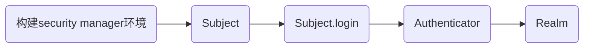

### 安全性框架

apache shiro

spring security

- 用户身份认证
- 资源授权

### shiro框架架构

#### Subject

受认证的主体(应用程序,某个用户)

#### SecureityManager

安全管理器,不是直接做认证和授权

#### Authenticator

认证器

#### Authorizer

授权器

#### SessionManager

会话管理器

> web应用中,传统上,session是交由容器来管理
>
> c/s应用中,使用shiro会话管理器管理会话

#### SessionDao

管理session中的数据

#### CacheManager

管理缓存数据

#### Cryptography

跟密码加密有关联,MD5

#### Realm

领域,实现认证和授权的业务逻辑

- 默认Realm
- 自定义Realm

### 用户认证步骤



- 账号错误 --> org.apache.shiro.authc.UnknownAccountException
- 密码错误 --> org.apache.shiro.authc.IncorrectCredentialsException

### 用户授权

- 默认Realm
- 自定义Realm

### 5张权限管理数据库表

- 用户 角色	多对多
- 角色 权限    多对多

### *.ini语法

--[users]	账号列表	zhangsan=111111

--[main]	相当于spring容器(的根)

--[roles]	角色和权限列表定义	角色包含一系列权限

### /**=authc

login.jsp --> login.action

​									--> FormAuthenticationFilter

​													--> 判断验证码(自定义FormAuthenticationFilter)

​																	--> 失败 : login.jsp,并提示

```java
//login.action 处理错误消息
String exceptionName = (String) request.getAttribute("shiroLoginFailure");
```

​																	--> 成功 : CustomRealm

​																						--> 成功 : /first.action 首页

​																						--> 失败 : login.action

​																										--> 在shiroLoginFailure名称的request作用域中提取错误的消息

​																										--> 处理失败信息,使用springmvc异常处理机制,error.jsp

### 自定义Realm

```java
public class CustomRealm extends AuthorizingRealm {

    @Autowired
    private SysService sysService;

    @Override //执行认证
    protected AuthenticationInfo doGetAuthenticationInfo(AuthenticationToken token) throws AuthenticationException {
        //先获取用户的输入 的帐号
        String username = (String) token.getPrincipal();
        SysUser loginUser = null;
        List<SysPermission> menus = null;
        try {
            loginUser = sysService.findSysUserByUserCode(username);
            if (loginUser == null) {
                return null;
            }
            //查询用户的菜单列表
            menus = sysService.findMenuListByUserId(username);
        } catch (Exception e) {
            e.printStackTrace();
        }
        String password_db = loginUser.getPassword();
        String salt = loginUser.getSalt();

        //构建ActiveUser封装用户对象 
        ActiveUser activeUser = new ActiveUser();
        activeUser.setUserid(loginUser.getId());
        activeUser.setUsercode(loginUser.getUsercode());
        activeUser.setUsername(loginUser.getUsername());
        activeUser.setMenus(menus);

        // session.setAttribute("user",user);
        SimpleAuthenticationInfo info = new SimpleAuthenticationInfo(activeUser,password_db,ByteSource.Util.bytes(salt),"CustomRealm");  //验证密码
        return info;
    }

    @Override//执行授权
    protected AuthorizationInfo doGetAuthorizationInfo(PrincipalCollection principal) {
        List<String> permissions = null;
        try {
            ActiveUser activeUser = (ActiveUser) principal.getPrimaryPrincipal(); 
            List<SysPermission> permissionList = sysService.findPermissionListByUserId(activeUser.getUsercode());
            permissions = new ArrayList<>();

            for (SysPermission permission : permissionList) {
                permissions.add(permission.getPercode());
            }
        } catch (Exception e) {
            e.printStackTrace();
        }

        SimpleAuthorizationInfo info = new SimpleAuthorizationInfo();
        info.addStringPermissions(permissions);
        return info;
    }
}
```

### 自定义FormAuthenticationFilter

```java
public class CustomFormAuthenticationFilter extends FormAuthenticationFilter {


    @Override  // 先校验验证码 
    protected boolean onAccessDenied(ServletRequest request, ServletResponse response) throws Exception {

        HttpServletRequest req = (HttpServletRequest) request;
        HttpServletResponse resp = (HttpServletResponse) response;
        //生成的随机数
        String validateCode = (String) req.getSession().getAttribute("validateCode");
        //用户输入 的验证码
        String randomcode = request.getParameter("randomcode");

        if (validateCode != null && randomcode != null && !validateCode.equals(randomcode)) {
            request.setAttribute(DEFAULT_ERROR_KEY_ATTRIBUTE_NAME, "valideCodeError");
            return true;  //不再 调用Realm  ---> login controller
        }

        return super.onAccessDenied(request, response);  // 执行默认操作  ： 调用realm
    }
}
```

### application-shiro.xml

```xml
<beans xmlns="http://www.springframework.org/schema/beans"
       xmlns:xsi="http://www.w3.org/2001/XMLSchema-instance" xmlns:mvc="http://www.springframework.org/schema/mvc"
       xmlns:context="http://www.springframework.org/schema/context"
       xmlns:aop="http://www.springframework.org/schema/aop" xmlns:tx="http://www.springframework.org/schema/tx"
       xsi:schemaLocation="http://www.springframework.org/schema/beans 
                           http://www.springframework.org/schema/beans/spring-beans-3.2.xsd 
                           http://www.springframework.org/schema/mvc 
                           http://www.springframework.org/schema/mvc/spring-mvc-3.2.xsd 
                           http://www.springframework.org/schema/context 
                           http://www.springframework.org/schema/context/spring-context-3.2.xsd 
                           http://www.springframework.org/schema/aop 
                           http://www.springframework.org/schema/aop/spring-aop-3.2.xsd 
                           http://www.springframework.org/schema/tx 
                           http://www.springframework.org/schema/tx/spring-tx-3.2.xsd ">

    <!-- 开启aop，对类代理 -->
    <aop:config proxy-target-class="true"></aop:config>
    <!-- 开启shiro注解支持 -->
    <bean  class="org.apache.shiro.spring.security.interceptor.AuthorizationAttributeSourceAdvisor">
        <property name="securityManager" ref="securityManager" />
    </bean>

    <!-- web.xml中shiro的filter对应的bean -->
    <!-- Shiro 的Web过滤器链 -->
    <bean id="shiroFilter" class="org.apache.shiro.spring.web.ShiroFilterFactoryBean">
        <property name="securityManager" ref="securityManager" />
        <!-- loginUrl认证提交地址，如果没有认证将会请求此地址进行认证，请求此地址将由formAuthenticationFilter进行表单认证 -->
        <property name="loginUrl" value="/login.action" />
        <!-- 认证成功统一跳转到first.action，建议不配置，shiro认证成功自动到上一个请求路径 -->
        <property name="successUrl" value="/first.action" />
        <!-- 通过unauthorizedUrl指定没有权限操作时跳转页面 -->
        <property name="unauthorizedUrl" value="/refuse.jsp" />

        <!-- 自定义filter配置 -->
        <property name="filters">
            <map>
                <!-- 将自定义 的FormAuthenticationFilter注入shiroFilter中-->
                <entry key="authc" value-ref="formAuthenticationFilter" />
            </map>
        </property>

        <!-- 过虑器链定义，从上向下顺序执行，一般将/**放在最下边 -->
        <property name="filterChainDefinitions">
            <value>
                <!-- 所有的静态资源要匿名访问 -->
                /js/**=anon
                /images/**=anon
                /styles/**=anon
                /validatecode.jsp=anon
                /items/queryItem.action=perms[item:query]
                /items/editItems.action=perms[item:edit]
                /first.action=user
                /index.jsp=user
                /welcome.jsp=user
                <!-- 退出系统 -->
                /logout.action=logout
                <!-- FormAuthenticationFilter 用于用户认证  调用realm-->
                /**=authc				
            </value>
        </property>
    </bean>

    <!-- securityManager安全管理器     ini -->
    <bean id="securityManager" class="org.apache.shiro.web.mgt.DefaultWebSecurityManager">
        <property name="realm" ref="customRealm" />
        <property name="cacheManager" ref="cacheManager"/>
        <property name="rememberMeManager" ref="rememberMeManager"/>
    </bean>

    <!-- realm -->
    <bean id="customRealm" class="cn.items.ssm.shiro.CustomRealm">
        <property name="credentialsMatcher" ref="credentialsMatcher" />
    </bean>

    <!-- 凭证匹配器 -->
    <bean id="credentialsMatcher"
          class="org.apache.shiro.authc.credential.HashedCredentialsMatcher">
        <property name="hashAlgorithmName" value="md5" />
        <property name="hashIterations" value="2" />
    </bean>

    <!-- 自定义form认证过虑器 -->
    <!-- 基于Form表单的身份验证过滤器，不配置将也会注册此过虑器，表单中的用户账号、密码及loginurl将采用默认值，建议配置 -->
    <bean id="formAuthenticationFilter" class="cn.items.ssm.shiro.CustomFormAuthenticationFilter">
        <!-- 表单中账号的input名称 -->
        <property name="usernameParam" value="username" />
        <!-- 表单中密码的input名称 -->
        <property name="passwordParam" value="password" />
    </bean>

    <!-- 缓存管理器 -->
    <bean id="cacheManager" class="org.apache.shiro.cache.ehcache.EhCacheManager">
        <property name="cacheManagerConfigFile" value="classpath:shiro-ehcache.xml"/>
    </bean>

    <!-- rememberMeManager管理器，写cookie，取出cookie生成用户信息 -->
    <bean id="rememberMeManager" class="org.apache.shiro.web.mgt.CookieRememberMeManager">
        <property name="cookie" ref="rememberMeCookie" />
    </bean>
    <!-- 记住我cookie -->
    <bean id="rememberMeCookie" class="org.apache.shiro.web.servlet.SimpleCookie">
        <!-- rememberMe是cookie的名字 -->
        <constructor-arg value="rememberMe" />
        <!-- 记住我cookie生效时间30天 -->
        <property name="maxAge" value="2592000" />
    </bean>
</beans>
```

