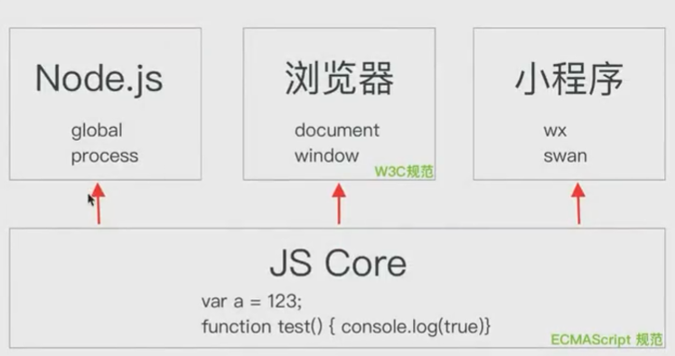
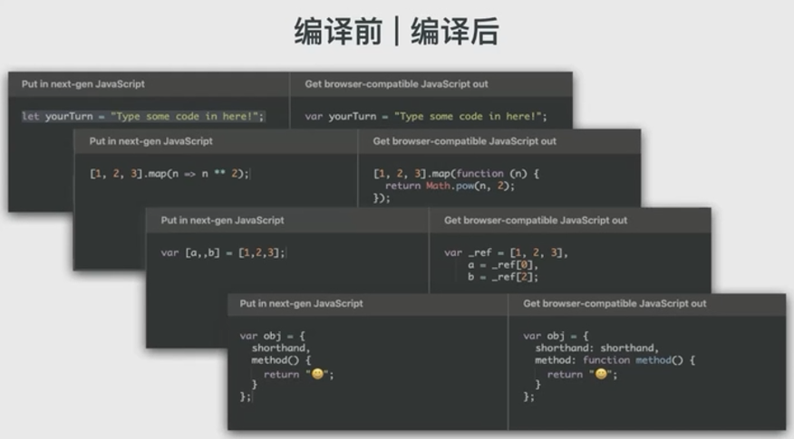

## JS 模块化

要明白我们的打包工具究竟做了什么, 首先必须明白的一点就是 JS 中的模块化, 在 ES6 规范之前, 我们有 CommonJS、AMD 等主流的模块化规范.

### CommonJS

Node.js 就是一个基于 V8 引擎, 事件驱动 I/O 的服务端 JS 运行环境, 在 2009 年刚推出时, 它就实现了一套名为 **CommonJS** 的模块化规范.

在 CommonJS 规范里, 每个 JS 文件就是一个**模块(module)**, 每个模块内部可以使用`require`函数和`module.exports`对象来对模块进行导入和导出.

```js
// index.js
require("./moduleA");
var m = require("./moduleB");
console.log(m);

// moduleA.js
var m = require("./moduleB");
setTimeout(() => console.log(m), 1000);

// moduleB.js
var m = new Date().getTime();
module.exports = m;
```

- **index.js** 代表的模块通过执行`require`函数, 分别加载了相对路径为`./moduleA`和`./moduleB`的两个模块, 同时输出 **moduleB** 模块的结果.

- **moduleA.js** 文件中也通过`require`函数加载了 **moduleB.js** 模块, 在 1s 后也输出了加载进来的结果.

- **moduleB.js** 文件内部相对来说就简单得多, 仅仅定义了一个时间戳, 然后直接通过`module.exports`导出.

### AMD

另一个为 WEB 开发者所熟知的 JS 运行环境就是浏览器了. 浏览器并没有提供像 Node.js 里一样的`require`方法. 不过, 受到 CommonJS 模块化规范的启发, WEB 端还是逐渐发展起来了 AMD, SystemJS 规范等适合浏览器端运行的 JS 模块化开发规范.

AMD 全称 **Asynchronous module definition**, 意为异步的模块定义, 不同于 CommonJS 规范的同步加载, AMD 正如其名所有模块默认都是异步加载, 这也是早期为了满足 web 开发的需要, 因为如果在 web 端也使用同步加载, 那么页面在解析脚本文件的过程中可能使页面暂停响应.

```js
// index.js
require(['moduleA', 'moduleB'], function (moduleA, moduleB) {
    console.log(moduleB);
});

// moduleA.js
define(function (require) {
    var m = require('moduleB');
    setTimeout(() => console.log(m), 1000);
})

// moduleB.js
define(function (require) {
    return new Date().getTime();
});
```

如果想要使用 AMD 规范, 我们还需要添加一个符合 AMD 规范的加载器脚本在页面中, 符合 AMD 规范实现的库很多, 比较有名的就是 **require.js**.

### 能同时被 CommonJS 规范和 AMD 规范加载的 UMD 模块

有时候我们写的模块需要同时运行在浏览器端和Node.js里面, 这也就需要我们分别写一份AMD模块和CommonJS模块来运行在各自环境, 这样如果每次模块内容有改动还得去两个地方分别进行更改, 就比较麻烦.

```js
// 一个返回随机数的模块, 浏览器使用的 AMD 模块
// math.js
define(function () {
    return function () {
        return Math.random();
    }
});

// 一个返回随机数的模块, Node.js 使用的 CommonJS 模块
module.exports = function () {
    return Math.random();
};
```

基于这样的问题, **UMD(Universal Module Definition)** 作为一种 **同构(isomorphic)** 的模块化解决方案出现, 它能够让我们只需要在一个地方定义模块内容, 并同时兼容AMD和CommonJS语法.

写一个UMD模块也非常简单, 我们只需要判断一下这些模块化规范的特征值, 判断出当前究竟在哪种模块化规范的环境下, 然后把模块内容用检测出的模块化规范的语法导出即可.

```js
(function (self, factory) {
    if (typeof module === 'object' && typeof module.exports === 'object') {
        // 当前环境是 CommonJS 规范环境
        module.exports = factory();
    } else if (typeof define === 'function' && define.cmd) {
        // 当前环境是 AMD 规范环境
        define(factory);
    } else {
        // 什么环境都不是, 直接挂在全局对象上
        self.umdModule = factory();
    }
}(this, function () {
    return function () {
        return Math.random();
    }
}));
```

上面就是一种定义UMD模块的方式, 我们可以看到首先他会检测当前加载模块的规范究竟是什么.

- 如果`module.exports`在当前环境中为对象, 那么肯定为CommonJS, 我们就能用`module.exports`导出模块内容.

- 如果当前环境中有`define`函数并且`define.amd`为`true`, 那我们就可以使用AMD的`define`函数来顶一个模块.

- 最后, 即使没检测出来当前环境的模块化规范, 我们也可以 直接把模块内容挂在在全局对象上, 这样也能加载到模块导出的结果.

### ESModule 规范

前面我们说到的 CommonJS 规范和 AMD 规范有这么几个特点:

1. 语言上层的运行环境中实现的模块化规范, 模块化规范由环境自己定义.

2. 相互之间不能共用模块. 例如不能在 Node.js 运行 AMD 模块, 不能直接在浏览器运行 CommonJS 模块.

在 EcmaScript 2015 也就是我们常说的 ES6 之后, JS 有了语言层面的模块化导入导出关键词与语法以及与之匹配的 ESModule 规范. 使用 ESModule规范, 我们可以通过`import`和`export`两个关键词来对模块进行导入与导出.

还是之前的例子, 使用 ESModule 规范和新的关键词就需要这样定义:

```js
// index.js
import './moduleA';
import m from './moduleB';
console.log(m);

// moduleA.js
import m from './moduleB';
setTimeout(() => console.log(m), 1000);

// moduleB.js
var m = new Date().getTime();
export default m;
```

ESModule 与 CommonJS 和 AMD 最大的区别在于, ESModule 是由 JS 解释器实现, 而后者是在宿主环境中运行时实现. ESModule 导入实际上是在语法层面新增了一个语句, 而 AMD 和 CommonJS 加载模块实际上是调用了`require`函数.

```js
// 这是一个新的语法, 我们没办法兼容, 如果浏览器无法解析就会报语法错误
import moduleA from "./moduleA";

// 我们只需要新增加一个require函数, 就可以首先保证 AMD 或 CommonJS 不报语法错误
function require() {}
const moduleA = require("./moduleA");
```

ESModule 规范支持通过这些方式导入导出代码, 具体使用哪种情况得根据如何导出来决定:

```js
import { var1, var2 } from './moduleA';
import * as vars from './moduleB';
import m from './moduleC';

export default {
    var1: 1,
    var2: 2
}

export const var1 = 1;

const obj = {
    var1,
    var2
};
export default obj;
```

这里有一个地方需要额外指出, `import {var1} from "./moduleA"`这里的括号并不代表获取结果是个对象, 虽然与 ES6 之后的对象解构语法非常相似.

```js
// 这些用法都是错误的, 这里不能使用对象默认值, 对象 key 为变量这些语法
import {var1 = 1} from "./moduleA"
import {[test]: a} from "./moduleA";

// 这个才是 ESModule 导入语句中正确的重命名方式
import {var1 as customVar1} from "./moduleA";

// 这些用法都是合理的, 因为 CommonJS 导出的就是个对象, 我们可以用操作对象的方式来操作导出结果
const {var1 = 1} = require("./moduleA");
const {[test]: var1 = a} = require("./moduleA");

// 这种用法是错误的, 因为对象不能这么使用
const {var1 as customVar1} = require("./moduleA");
```

用一张图来表示各种模块规范语法和它们所处环境之间的关系:



每个 JS 的运行环境都有一个解析器, 否则这个环境也不会认识 JS 语法. 它的作用就是用 ECMAScript 的规范去解释 JS 语法, 也就是处理和执行语言本身的内容, 例如按照逻辑正确执行`var a = "123";`, `function func() { console.log("hahaha");}`之类的内容.

在解析器的上层, 每个运行环境都会在解释器的基础上封装一些环境相关的 API . 例如 Node.js 中的`global`对象、`process`对象, 浏览器中的`window`对象、`document`对象等等. 这些运行环境的 API 受到各自规范的影响, 例如浏览器的 W3C 规范, 它们规定了`window`对象和`document`对象上的 API 内容, 以使得我们能让`document.getElementById`这样的 API 在所有浏览器上运行正常.

事实上, 类似于`setTimeout`和`console`这样的 API, 大部分也不是 JS Core 层面的, 只不过是所有运行环境实现了相似的结果.

`setTimeout`在 ES7 规范之后才进入 JS Core 层面, 在这之前都是浏览器和 Node.js 等环境进行实现.

`console`类似`promise`, 有自己的规范, 但实际上也是环境自己进行实现的, 这也就是为什么 Node.js 的`console.log`是异步的而浏览器是同步的一个原因. 同时, 早期的 Node.js 版本是可以使用 `sys.puts`来代替`console.log`来输出至 stdout 的.

ESModule 就属于 JS Core 层面的规范, 而 AMD, CommonJS 是运行环境的规范. 所以, 想要使运行环境支持 ESModule 其实是比较简单的, 只需要升级自己环境中的 JS Core 解释引擎到足够的版本, 引擎层面就能认识这种语法, 从而不认为这是个**语法错误(syntax error)**, 运行环境中只需要做一些兼容工作即可.

Node.js 在 V12 版本之后才可以使用 ESModule 规范的模块, 在 V12 没进入 LTS 之前, 我们需要加上 `--experimental-modules`的 flag 才能使用这样的特性, 也就是通过`node --experimental-modules index.js`来执行. 浏览器 Chrome61 之后的版本可以开启支持 ESModule 的选项, 只需要通过``这样的标签加载即可.

这也就是说, 如果想在 Node.js 环境中使用 ESModule, 就需要升级 Node.js 到高版本, 这相对来说比较容易, 毕竟服务端 Node.js 版本控制在开发人员自己手中. 但浏览器端具有分布式的特点, 是否能使用这种高版本特性取决于用户访问时的版本, 而且这种解释器语法层面的内容无法像 AMD 那样在运行时进行兼容, 所以想要直接使用就会比较麻烦.

### 后模块化时代

通过前面的分析我们可以看出来, 使用 ESModule 的模块明显更符合 JS 开发的历史进程, 因为任何一个支持 JS 的环境, 随着对应解释器的升级, 最终一定会支持 ESModule 的标准. 但是, WEB 端受制于用户使用的浏览器版本, 我们并不能随心所欲的随时使用 JS 的最新特性. 为了能让我们的新代码也运行在用户的老浏览器中, 社区涌现出了越来越多的工具, 它们能静态将高版本规范的代码编译为低版本规范的代码, 最为大家所熟知的就是`babel`.

它把 JS Core 中高版本规范的语法, 也能按照相同语义在静态阶段转化为低版本规范的语法, 这样即使是早期的浏览器, 它们内置的 JS 解释器也能看懂.



然后, 不幸的是, 对于模块化相关的`import`和`export`关键字, `babel`最终会将将它编译为包含`require`和`exports`的 CommonJS 规范. [点击链接在线查看编译结果](https://babeljs.io/repl#?browsers=defaults%2C%20not%20ie%2011%2C%20not%20ie_mob%2011&build=&builtIns=false&corejs=3.6&spec=false&loose=false&code_lz=JYWwDg9gTgLgBAIgHQHoCGA7CMAWBTKAWQgBMBXAGzwQG4AoUSWONOAMyghEVRFMrwBBWnTwAPJvBJ42aSvDQ0gA&debug=false&forceAllTransforms=false&shippedProposals=false&circleciRepo=&evaluate=false&fileSize=false&timeTravel=false&sourceType=module&lineWrap=true&presets=env%2Creact%2Cstage-2&prettier=false&targets=&version=7.16.4&externalPlugins=&assumptions=%7B%7D)

这就造成了另一个问题, 这样带有模块化关键词的模块, 编译之后还是没办法直接运行在浏览器中, 因为浏览器端并不能运行 CommonJS 的模块. 为了能在 WEB 端直接使用 CommonJS 规范的模块, 除了编译之外, 我们还需要一个步骤叫做**打包(bundle)**.

所以打包工具比如 webpack/rollup, 编译工具 babel 他们之间的区别和作用就很清楚了.

- 打包工具主要处理的是 JS 不同版本间模块化的区别

- 编译工具主要处理的是 JS 版本间语义的问题

## 浏览器内置对象/事件/ajax

浏览器是一个 JS 的运行时环境, 它基于 JS 解析器的同时, 增加了许多环境相关的内容. 用一张图表示各个运行环境和 JS 解析器的关系如下:


我们把常见的, 能够用 JS 这门语言控制的内容称为一个 JS 的运行环境. 常见的运行环境有 Node.js, 浏览器, 小程序, 一些物联网设备等等. 所有的运行环境都必须有一个 JS 的解释器, 在解释器层面符合 ECMAScript 规范, 定义了 JS 本身语言层面的东西比如关键字, 语法等等.

在每个环境中, 也会基于 JS 开发一些当前环境中的特性, 例如 Node.js中的 global 对象, process 对象; 浏览器环境中的 window 对象, document 对象等等, 这些属于运行环境在 JS 基础上的内容.

这也就解释了为什么在 Node.js 和浏览器中都能使用数组, 函数, 但是只能在 Node.js 使用 require 加载模块, 而不能在浏览器端使用的原因, 因为 require 是 Node.js 特有的运行环境中的内容.

### 内置对象属性

#### Window

##### `setTimeout`和`setInterval`

##### alert, confirm, prompt 等交互相关 API

#### Location


##### 属性

##### 方法

#### Document

##### 方法: 选择器

##### 方法: 创建元素

##### 属性

#### Element

##### 属性

##### 方法

#### Text 类型

#### History

##### 属性

##### 方法

#### 总结 (面试常考点 & 易错点)

- 全局定义的变量均可以通过 window 来进行访问. 使用 setInterval 需要注意, 有可能代码并不是以相同间隔执行. 使用 alert 等 API 需要注意, JS 代码可能会被阻塞.

- location 对象需要明确对于 URL 来说, 每一个类型代表的具体值是什么.

- document 对象主要衔接 JS 和我们的 DOM 元素. 需要注意这里很多选择的结果是 array-like 的类数组元素. 以及使用 createFragment 代码片段等优化, 来防止浏览器多次重排序造成性能问题.

- Element 和 Text 是两个我们常见且易考易用的两个 DOM 对象. 熟悉常见的方法和 debug 方式(console.dir) 其次写代码时需要明确我们当前的方法究竟是 JS 层面的, 还是环境层面的.

- history 因为和前端路由息息相关, 我们需要熟悉新增的 pushState 和 replaceState 方法.

浏览器内置对象需要我们多看多练, 以上是我们总结的一些常考点、易错点, 对于基础的属性作用和用途, 就需要同学们多在动手中打印熟悉确定了.

### 事件

#### 定义事件

#### 事件捕获及冒泡

### ajax

### ES6 之后的 fetch API

在 ES6 之后, 浏览器端新增了一个 fetch api, 它有以下的几个特点:

- fetch api 返回一个 promise 的结果

- 默认不带 cookie, 需要使用配置`credentials:"include"`

- 当网络故障时或请求被阻止时, 才会标记为 reject. 否则即使返回码是500, 也会 resolve 这个 promise

```js
fetch('/ajax?foo=bar')
    .then(function () {
        console.log('请求发送成功');
    });
```

这就是一个简单的请求, 发送之后就会进入 resolve 状态, 与普通的 ajax 请求不同的是, 在服务端返回内容时, 我们还需要调用一些方法才能拿到真正返回的结果.

```js
fetch('/ajax?foo=bar')
    .then(function (response) { 
        response.text(); // 返回字符串
        response.json(); // 返回 json
        response.blob(); // 一般指返回文件对象
        response.arrayBuffer(); // 返回一个二进制文件
        response.formData(); // 返回表单格式内容
    });
```

常见的 json 请求, 我们需要再调用一次`response.json`来让 fetch API 返回的结果序列化为 json.

```js
fetch('/ajax?foo=bar')
    .then(function (response) { 
        return response.json();
    }).then(function (result) {
        console.log(result);
    });
```

### 封装的通用 ajax 请求

```js
function fetch(url, config = {}) {
    if (window.fetch) return window.fetch(url, config);
    return new Promise((resolve, reject) => {
        function createXHR() {
            if (typeof XMLHttpRequest !== undefined) {
                return new XMLHttpRequest();
            }
            // 兼容早期 IE
            if (typeof ActiveXObject !== undefined) {
                if (typeof arguments.callee.activeXString !== 'string') {
                    var versions = ['MSXML2.XMLHttp.6.0', 'MSXML2.XML2.XMLHttp.3.0', 'MSXML2.XMLHttp'];
                    for (var i = 0; i < versions.length; i++) {
                        try {
                            new ActiveXObject(versions[i]);
                            arguments.callee.activeXString = versions[i];
                            break;
                        } catch (e) { }
                    }
                }
                return new ActiveXObject(arguments.callee.activeXString);
            }
            throw new Error('不支持 xhr 相关内容');
        };
        
        var xhr = createXHR();
        
        xhr.onreadystatechange = function () {
            console.log(xhr);
            if (xhr.readyState !== 4) return;
            var options = {
                status: xhr.status,
                statusText: xhr.statusText
            };
            var body = 'response' in xhr ? xhr.response : xhr.responseText;
            var response = {
                status: options.status || 200,
                statusText: options.statusText || 'ok',
                ok: options.status >= 200 && options.status < 300,
                text() {
                    if (typeof body === 'string') {
                        return Promise.resolve(body);
                    }
                },
                json() {
                    return this.text().then(JSON.parse);
                }
            };
            resolve(response);
        };
        xhr.open(config.method || 'get', url, true);
        xhr.send();
    });
};
```
