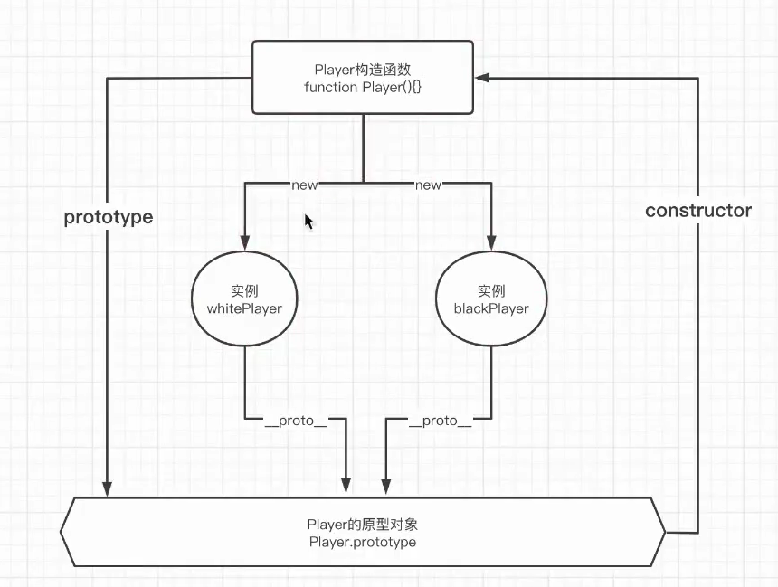

# 面向对象编程 原型及原型链 继承

## 面向对象编程

### 一、什么是面向对象编程

编程思想

面向过程: 关注的是动词, 分析出解决问题所需要的所有步骤, 针对所有的步骤一一实现一些函数, 按照顺序来调用函数.

面向对象: 关注的是主谓, 是把构成这个问题的所有事物, 拆解成一个个的对象, 这一个个对象是为了描述这个对象在当前问题中的各种行为方式.

#### 面向对象编程的特性

1. 封装: 让使用对象的人不用去考虑内部的实现, 对象对外暴露出一些 api, 提供给使用方使用.

2. 继承: 为了代码的复用, 从父类上继承它允许继承的属性和方法.

3. 多态: 不同的对象作用于同一个操作, 然后产生不同的结果. 多态的思想实际上是把"做什么"和"谁去做"这两者分离开.

#### 面向对象编程的表现

五子棋

**面向过程**: 开局 -> 下白棋 -> 展示白棋 -> 判断胜负 -> 下黑棋 -> 展示黑棋 -> 判断胜负

```js
init();
whiteStart();
showWhite();
check();
// black...
```

**面向对象**: 棋盘 玩家(黑方, 白方)

1. 封装: Player 类, CheckerBoard 类, start, revert, init

2. 继承: white 和 black 继承自 Player, 可以直接使用 start, revert.

3. 多态: white 下棋是白色, black 下棋是黑色的.

```js
class Player {

}

class blackP extends Player {

}
```

#### 什么场景适合面向对象编程

面向过程: 简单的场景下, 协同人员较少.

面向对象: 中型或者大型项目中, 协同人员较多, 迭代频繁. 健壮

### 二、JS 中的面向对象

object-based

方法

属性

#### JS 中的一些内置对象

Array Date Function RegExp

[].toString()
{}.toString()

```js
Object.prototype.toString.call(arr) == '[object Object]'
```

#### JS 中怎么创建对象?

1. 普通方式

```js
const Player = new Object();
Player.color = 'red';
Player.start = function () {
    console.log('下棋');
}
```

工厂模式

```js
function createPlayer(color) {
    const Player = new Object();
    Player.color = color;
    Player.start = function () {
        console.log('下棋');
    }
    return Player;
}

const red = createPlayer('red');
const green = createPlayer('green');
```

缺点: 无法判断类型

2. 构造函数/实例

```js
function Player() {
    this.color = 'red';
    this.start = function () {
        console.log(this.color);
    }
}

const p1 = new Player();
const p2 = new Player();
console.log(p1.start === p2.start);
```

缺点: 每生成一个实例, 构造函数内部的方法都会重新开辟一块内存.

3. 原型

prototype

```js
function Player() {
    this.color = 'red';
}

Player.prototype.start = function () {
    console.log(this.color);
}

const p1 = new Player();
const p2 = new Player();
console.log(p1.start === p2.start);
```

4. 静态属性

```js
function Player() {
    this.color = 'red';
    if (!Player.total) {
        Player.total = 0;
    }
    Player.total++;
}

Player.prototype.start = function () {
    console.log(this.color);
}

const p1 = new Player();
const p2 = new Player();
console.log(p1.start === p2.start);
```

## 原型及原型链

### 一、我们为什么要在原型上添加属性或者方法?

在构造函数内通过 this 添加方法的话, 每生成一个对象, 都会重新开辟一块内存空间.

Player.prototype.xxx = xxx;

### 二、怎么找到一个构造函数的原型对象?

```js
function Player() {
    this.color = 'red';
    if (!Player.total) {
        Player.total = 0;
    }
    Player.total++;
}

Player.prototype.start = function () {
    console.log(this.color);
}

const p1 = new Player();
const p2 = new Player();
/*
* __proto__ 读法: double underscore proto
* */
```



### 三、new 关键字做了什么?

1. 一个继承自`Player`的新对象`p1`被创建了.

2. `p1.__proto__ = Player.prototype`, `p1`的`__proto__`指向`Player`的原型对象.

3. 将`this`指向新创建的对象`p1`

4. 返回这个新对象`p1`

   > 4.1 未显式 return, 返回新对象 p1
   >
   > 4.2 显式 return this, 返回新对象 p1
   >
   > 4.3 显式 return 基本类型(包括null), 返回新对象 p1
   >
   > 4.4 显式 return 对象类型, 返回对象

```js
function Player() {
    this.color = 'red';
    // 不显式 return this
    // 显式 return this
    // return this;

    // 显式 return 基本类型: number, string, boolean ...
    // return 1;

    // 显式 return Object
    // return {};
    // return [];
    return function () {
    }
}

const p1 = new Player();
console.log(p1);
```

#### 手写实现`new`

```js
function Player(val) {
    this.name = 'paleafsvf';
    this.pants = val;
}

function objectFactoy() {
    // arguments [Player, '秋裤']
    let o = new Object();
    // 1. Array.from(arguments) 返回新数组, 这样去shift不改变原来的arguments
    // let constructor = [].shift.call(arguments); 
    // let constructor = [].shift.call(arguments);
    let constructor = Array.prototype.shift.call(arguments); // 妙啊
    o.__proto__ = constructor.prototype;
    // arguments ['秋裤']

    let ret = constructor.apply(o, arguments);

    return typeof ret === 'object' ? ret : o;
}

let p = objectFactoy(Player, '秋裤');
console.log(p);
```

### 四、原型链到底是什么?

```js
Object.prototype.name = 'Object`s';
function Player() {

}
Player.prototype.name = 'Player`s';
var p = new Player();
p.name = 'p`s';
console.log(p.name); // p`s

// 删除 p.name
delete p.name;
console.log(p.name); // Player`s

// delete p.__proto__.name;
delete Player.prototype.name;
console.log(p.name); // Object`s
```

## 原型链继承

### 一、原型链继承

#### 实现

```js
function Parent() {
    this.name = 'Parent`s';
    this.actions = ['sing', 'jump', 'rap'];
}
function Child() {}
Child.prototype = new Parent();
Child.prototype.constructor = Child;

const c1 = new Child();
c1.actions.push('awsl');
const c2 = new Child();
console.log(c1.actions);
console.log(c2.actions);
```

#### 缺点

1. 父类如果存在引用类型, 其中一个实力如果改变了此变量, 那么所有的实例都会共享.

2. 无法传参给 Parent

### 二、构造函数继承

#### 实现

```js
function Parent(name, age) {
    this.name = name;
    this.age = age;
    this.actions = ['sing', 'jump', 'rap'];
}
function Child(name, age) {
    Parent.apply(this, arguments);
}

const c1 = new Child('c1', 18);
c1.actions.push('awsl');
console.log(c1);
const c2 = new Child('c2', 20);
console.log(c2);
```

#### 缺点

1. 浪费内存

### 三、组合继承

#### 实现

```js
function Parent(name, age) {
    this.name = name;
    this.age = age;
}
Parent.prototype.getName = function () {
    return this.name;
}
function Child(name, age) {
    Parent.apply(this, arguments); // 调用构造函数
}

Child.prototype = new Parent(); // 调用构造函数
Child.prototype.constructor = Child;

const c1 = new Child('c1', 18);
console.log(c1);
console.log(c1.getName());
const c2 = new Child('c2', 20);
console.log(c2);
console.log(c2.getName());
```

#### 缺点

1. 调用了两次构造函数, 生成了多余的属性

### 四、寄生组合式继承

#### 实现

line: 12

为什么不能这么写, 已经实现了所有继承的要求?

因为更改了child的prototype, parent的也跟着改变了.

```js
function Parent(name, age) {
   this.name = name;
   this.age = age;
}
Parent.prototype.getName = function () {
   return this.name;
}
function Child(name, age) {
   Parent.apply(this, arguments); // 调用构造函数
}

Child.prototype = Parent.prototype; // 为什么不能这么写, 已经实现了所有继承的要求? 因为更改了child的prototype, parent的也跟着改变了.
Child.prototype.constructor = Child;

Child.prototype.run = function () {
   console.log('nmsl');
}
console.log(Parent.prototype);
```

改用`Object.create`

```js
function Parent(name, age) {
    this.name = name;
    this.age = age;
}
Parent.prototype.getName = function () {
    return this.name;
}
function Child(name, age) {
    Parent.apply(this, arguments); // 调用构造函数
}

Child.prototype = Object.create(Parent.prototype);
Child.prototype.constructor = Child;

Child.prototype.run = function () {
    console.log('nmsl');
}
console.log(Parent.prototype);
```

#### 手写`Object.create`

```js
// Child.prototype = Object.create(Parent.prototype);
/* 手写 Object.create */
function create1(val) {
    let Temp = function () {};
    Temp.prototype = val;
    return new Temp();
}
Child.prototype = create1(Parent.prototype);
Child.prototype.constructor = Child;
```

#### 缺点

### class

实现

```js
class Parent {
   constructor(name) {
      this.name = name;
   }

   getName() {
      return this.name;
   }
}

class Child extends Parent {
   constructor(name) {
      super(name);
   }
}

var p1 = new Child('nmsl');
console.log(p1.name);
console.log(p1.__proto__);
console.log(Child.prototype);
console.log(Parent.prototype);
```
