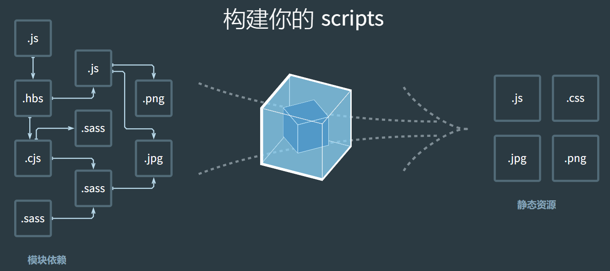

## 前端工程化的发展及工具详解

### 什么是工程化? 什么是前端工程化?

随着前端技术的逐步发展, 作为工程师除了需要关注需要写的页面, 样式和逻辑之外, 还需要面对日益复杂的系统性问题, 比如模块化文件的组织、ES6 JS 文件的编译、打包压缩所有的 JS 代码、优化和合并图片静态资源等等事情.

这也就是在说, 我们的项目需要以一种合理的方式进行组合, 以应对在团队协作、需求迭代中保持项目项目的稳定发展. 这种方式就是工程化系统去运行我们的项目.

例如下图所示就是前端工程化中一次打包的过程, 左侧就是我们项目中出现的源文件, 例如我们会通过 sass 这种预处理样式来更好的组织我们的样式代码, 使用各类其他语言比如 typescript、coffescript 等来书写我们的逻辑脚本. 在最终上线时, 我们需要把我们的这类文件, 转化为能够在线上被浏览器识别的 css 和 js.

这种使用工程化思维, 以工具的形式来进行上述过程的, 就是前端方面的工程化.



一句话总结就是, 前端工程化, 就是在使用工具处理那些与实际业务无关的内容, 比如处理 JS 编译、打包、压缩、图片合并优化等等各个方面的工程性代码.

### 前端工程化具体类目

#### 包管理工具

对于一门成熟的语言来说, 在有语言规范的同时, 社区或者指定语言规范的组织也会有模块化的规范和模块存储到平台, 每个人都能将自己写好的模块化代码发布到平台上, 同时任何人也可以下载公共平台上其他人的模块化代码. 这种模块化的代码我们一般称之为**包(package)**, 平台我们称之为**包管理平台**, 这种行为哦我们称之为**包管理(package manager)**.

对于 JS 来说, 现阶段大家比较熟悉的就是 node.js 环境自带的 npm 工具, npm 全称是 node package manager, 就是 node.js 的包管理工具, 对于一个符合规范的包来说, 我们可以通过 npm publish 发布包, 同样的, 也可以通过 npm install 来下载别人发布的包, 实现大家的模块复用.

社区中常见的包管理工具有 bower, npm 和 yarn.目前还在经常使用的是 npm 和 yarn.

##### bower

**bower**最早出现是使用在浏览器项目中. 安装 bower 命令后, 通过`bower install jquery`, 就可以将 jquery 下载到 `bower_components`目录中, 我们就可以在 html 文件加上`<script src="bower_components/jquery/dist/jquery.min.js"></script>`. 免去了我们直接从官网下载然后挪动到项目中的烦恼.

bower 也支持一些配置, 我们只需要在项目根目录下增加`.bowerrc`[^rc]配置即可:

```json
{
  "directory": "app/components",
  "timeout": 120000,
  "registry": {
    "search": [
      "http://localhost:8000",
      "https://registry.bower.io"
    ]
  }
}
```

上面的配置主要配置了我们下载后的模块存储目录, 下载超时时间和下载的地址等等.

如果想要发布一个 bower 模块的话, 需要我们这个项目下配置 bower.json, 然后通过`bower register`命令发布.

bower 内容的介绍比较简单, 现在新项目中使用已经不多, 包管理工具这一小节的重点是 npm.

##### npm

**npm**是伴随着 node.js 下载会一同安装的一个命令, 它的作用与 bower 一样, 都是下载或发布一些 JS 模块.

我们可以使用`npm --version`查看安装的 npm 版本, 不同版本带有不同功能.

同时, 我们可以通过`npm install`来安装一个模块, 例如上面的例子中, 我们就可以通过`npm install jquery`来安装 jquery, npm 会将模块安装到 node_modules 目录中.

一个合格的 npm 包, 必须拥有 package.json 这个文件, 里面有以下几个常见字段:

- name: 包或者模块的名称

- version: 版本

- main(重要): 默认加载的入口文件

- scripts: 定义一些脚本

- dependencies: 运行时需要的模块

- devDependencies: 本地开发需要运行的模块

- optionalDependencies: 可选的模块, 及时安装失败安装进程也会正常退出

- peerDependencies: 必要依赖的版本版本

其中 dependencies 和 devDependencies 里面的版本号通过"大版本.次要版本.小版本"的格式规定. 我们通过`npm install`安装的模块, 最终都会在里面进行记录. 同时, 我们通过`npm install`时, 还会安装这里记录但是 node_modules 中没有的模块.

如果前面带有波浪号(~), 则以大版本号和次要版本号为主, 例如"~1.3.2"的版本, 最终安装时就会安装 1.3x的最新版本.

如果前面带有插入号(^), 则以大版本号为主, 例如"^1.3.2"的版本, 最终安装就会安装 1.x.x 的最新版本.

高版本的 npm 会将所有依赖进行「打平」操作, 这样能保证尽可能少的安装相同的模块.

所有下载的模块, 最终都会记录在`package-lock.json`完全锁定版本, 下次我们再`npm install`时, 就会先下载 package-lock 里面的版本.

##### yarn

[https://yarnpkg.com/](https://yarnpkg.com/) 是一个新兴的包管理工具, 它与 npm 有着相似的功能, 最大的优势就是并发和快.

我们可以通过`yarn add`来安装一个模块, 通过`yarn xxx`来运行 scripts 中的脚本.

##### 包管理工具中常见面试问题

- dependencies、devDependencies、optionalDependencies 和 peerDependencies 区别

  > devDependencies 是指使用本地开发时需要使用的模块, 而真正的业务运行时不用的内容.
  > 
  > dependencies 是指业务运行时需要的模块.
  > 
  > optionalDependencies 是可选模块, 安不安装均可, 即使安装失败, 包的安装过程也不会报错.
  > 
  > peerDependencies 一般用在大型框架和库的插件上, 例如我们写 webpack-xx-plugin 的时候, 对于使用者而言, 他一定会先有 webpack 再安装我们的这个模块, 这里的 peerDependencies 就是约束了这个例子中 webpack 的版本.

- npm 中 --save-dev 和 --save 之间的区别

  > 对于大型项目来说, 它们的界限实际上并不清晰. 真正会有差异的地方是究竟我们使用哪种方式来进行安装所有的依赖.
  > 
  > save-dev 和 save 都会把模块安装到 node_modules 目录下, 但 save-dev 会将依赖名称和版本写到 devDependencies 下, 而 save 会将依赖名称和版本写到 dependencies 下. 如果我们使用`npm --production install`这样的命令安装模块的话, 就只会安装 save 安装的包.

#### 源代码静态检查和格式化工具

静态检查指的是我们在本地写源代码时, 我们使用的编辑器对我们所写代码的**提示**, **检查**和**格式化**. 在大型项目中, **提示**这一步因人而异大部分不做共同要求, 检查和格式化一般会对团队使用的内容进行约束, 以保证大家能写出「正确」的代码和统一的代码风格.

对于代码的检查和格式化, 在前端发展中比较经典的是 **jslint**, **jshint**, **eslint** 和 **prettier**.

它们基本上都是一类的工具, 再细分的话, jslint, jshint 和 eslint 是一类, 它们专门处理 JS 格式化和静态语法检查, prettier 是另一类, 它能处理多语言的格式化.

##### eslint

eslint 的官网: [https://eslint.org/](https://eslint.org/), 我们以 eslint 为例, 只需要在项目中通过`npm install --save-dev eslint`安装它, 通过配置`.eslintrc`(runtime config)我们就可以使用了. 配合 eslint 的编辑器插件, 我们就可以在编辑代码时 eslint 对我们的代码进行提示和修复.

通过配置`eslint index.js`这样的脚本, 就可以对脚本文件进行静态校验.

**[注意]: 这里是`--save-dev`因为我们只需要在项目开发过程中使用它而不是运行过程使用这个模块.**

##### prettier

prettier 的官网: [https://prettier.io/](https://prettier.io/), 同样的我们可以配置 prettier 的配置, `.prettierrc`里面也可以进行配置, 最终搭配 prettier 的编辑器插件, 我们同样能够实现代码编辑状态下的提示和修复.

#### ES6 及其他泛 JS 语言的编译

大部分时候, 我们不能直接在线上使用 ES6 语法规范的 JS 代码, 我们就需要通过工具对 JS 进行编译. 同时, 有些项目我们可能会使用 coffeescript, typescript, flow, elm, ocaml 等可以编译为 JS 语言的泛 JS 语言书写代码, 这就需要在调试或发布时, 使用编译工具将对应代码编译为 JS 代码才能直接运行.

在编译过程中, JS 比较常见的工具是 babel, 而其他的语言则对应有自己的编译器, 例如 coffeescript 使用 coffeescript 编译器进行编译为 js, typescript 使用 typescript 编译器编译为 js.

##### babel

babel 官网为 [https://babeljs.io/](https://babeljs.io/), 对于一个项目来说, 我们可以通过`npm install --save-dev @babel/core @babel/cli`来安装 babel 所需要的工具.

`@babel/cli`来安装 babel 所需要的工具.

`@babel/core`是 babel 内部核心的编译和生成代码的方法

`@babel/cli`(command line tool)是 babel 命令行工具内部解析相关方法

安装了这两个包之后, 我们就能够使用 babel 相关方法对代码进行操作, 接下来我们需要配置, 告诉 babel 我们需要将代码变成什么.

增加一个 babel 的 preset, preset代表的是我们希望编译的结果的预设值. 在最新的 babel 工具链中, 统一使用了`@babel/preset-env`作为环境预设值. 我们安装`npm install --save-dev @babel/preset-dev`之后, 新建 .babelrc 里面, 通过配置

```json
{
  "presets": ["@babel/preset-env"]
}
```

在 scripts 内定义一个脚本执行`babel index.js -o output.js`, 我们在 index.js 中写的 es6 语法就会被编译.

这一步只是编译语法层面的内容, 如果我们使用了一些新的方法的话, 还需要增加一个 polyfill

使用`npm install @babel/polyfill`安装了所有符合规范的 polyfill 之后, 我们需要在入口文件引入这个模块, 就能正常的使用规范中定义的方法了.

```json5
{
  "presets": [
    "@babel/preset-env",
    {
      "targets": "> 0.5%",
      /* polyfill 按需加载 */
      "useBuiltIns": "usage",
      "corejs": 2
    }
  ]
}
```

```shell
node_modules\.bin\babel index.js --out-dir=dist
```

#### JS 打包工具

对于 JS 这门语言的不同环境来说, 有 CommonJS, AMD 和 ESModule 这几种常见的模块化规范, 这几种规范都有自身的缺点.

CommonJS 不经处理只能运行在 node.js, AMD 不经处理无法运用在各个平台, 需要搭配符合 AMD 规范的其他库例如 require.js 一起使用. ESModule 虽然从语言层面上解决了规范问题, 但是即使经过 babel 编译, 也会将 import, export 之类的关键词编译为 CommonJS 的 require 和 exports, 我们还是无法直接在浏览器中使用.

为了能使任何一个模块都能自由的切换所使用的环境, 例如在浏览器使用 CommonJS 封装好的模块, 我们就需要经过打包这个步骤.

browserify、rollup 等等工具都是处理诸如此类内容.

##### browserify[^ify]

地址: [http://browserify.org](http://browserify.org), 我们通过`npm install --save-dev browserify`安装 browserify, 我们写一个简单的 CommonJs模块, 通过`browserify index.js -o output.js`命令就可以将 CommonJS 模块化的包转化为通用的任何环境均可以加载的模块化规范.

```shell
node_modules\.bin\browserify index.js -o output.js
```

##### rollup

rollup 是一个新兴的打包工具, 他最先提出一个概念叫 **tree shaking**, 它可以移除我们代码中无用的其他代码.

通过 **ESModule** 写的模块, 在经过 rollup 处理之后, 会对未使用的导出内容进行标记, 在压缩过程就会将这类未使用的内容移除.

```shell
node_modules\.bin\rollup index.js --file output.js
```

#### JS 压缩工具

经过编译和打包的 JS 代码, 最终要在线上经过压缩处理之后, 才能最终在网站上面向用户显示. 对于 JS 压缩工具来说, 目前有非常多, 但用的最多的还是 uglify 系列, uglify 最新是版本3, 不同 uglify 的实现原理和性能都有极大的不同.

##### uglify

uglify3 地址: [https://github.com/mishoo/UglifyJS](https://github.com/mishoo/UglifyJS)

安装成功之后非常简单, 只需要通过`uglifyjs index.js -o output.js`就可以输出压缩的结果, 同时我们可以通过添加**--source-map**在运行时生成 sitemap 文件, 方便我们进行 debug.

#### 其他类目工具

##### 任务处理工具(gulp/grunt)

上面我们说的所有工具都是针对某一个垂直领域来说的, 比如 编译、打包、压缩等等, 我们需要通过不同的命令去运行和操作我们的 JS 文件.

本小节说的任务处理工具, 就是这一类脚本工具, 他们能通过脚本的形式将不同的工具进行组合输出.

流式处理工具比较常说的两个是 grunt 和 gulp. 本小节我们分别介绍一下这两个工具.

**grunt**

grunt 官网: [https://gruntjs.com/](https://gruntjs.com/), 首先通过`npm install --save-dev grunt`安装 grunt 工具, 新建 gruntfile.js 通过 gruntfile.js 中的配置来让 grunt 做不同的操作.

这里我们安装`npm --save-dev @babel/core @babel/preset-env grunt-babel grunt-contrib-uglify`来完整的进行一个项目的构建, 通过配置 gruntfile 脚本, 我们分别执行了编译、压缩的过程生成最后 js 脚本.

**gulp**

gulp 官网: [https://gulpjs.com/](https://gulpjs.com/), 同样的我们使用`npm install --save-dev gulp`安装 gulp 工具, 新建 gulpfile.js 配置.

我们同样实现相同的功能来重新配置一下 gulp 任务.

gulp 相比于 grunt 来说, 配置更加清晰, 是一个链式调用的写法.

##### 通用处理工具(fis3/webpack)

通用处理工具这里我们的分类是从功能上来讲, 具备上面列举类目的多种功能的集合. 这里我们列举的几个工具是 fis3 和 webpack.

fis 是国内百度公司在早期发布的一款前端通用处理工具(比 webpack 早), fis3 是它的第三代, 使用 node.js 重写了.

fis3 和 webpack 它们有个最大的特点就是, 它们已经不再是一个普通工具, 而是一个具有插件化的系统, 有着丰富和完善的社区环境, 它们属于 **前端解决方案** 这么一个领域. 理论上它们可以做非常多的事情, 而不像上面介绍的大部分工具, 只能处理某一个垂直分类下的内容.

webpack 实际上和 gulp grunt 这类的任务处理工具有些类似, 但是它本身具有打包的功能, 同时也支持通过中间件和插件实现其它领域功能, 最终通过一个命令就能处理完成所有操作.

webpack 通过 webpack.config.js 配置, 配置 loader 中间件来对不同文件进行操作, 同时通过插件化的配置, 支持例如压缩等等操作.

使用 fis3 和 webpack, 它们更多的是将前面我们讲的所有其它工具融合起来, 以一种插件的形式进行加载, 从而达到了通用的目的.

```js
module.exports = {
    mode: 'none',
    entry: {
        index: './index.js',
        index2: './index2.js'
    },
    output: {
        path: path.resolve(__dirname, 'dist'),
        filename: '[name].bundle.js',
        publicPath: 'dist'
    },
    externals: {
        'jquery': 'jQuery'
    },
    module: {
        rules: [{
            test: /\.js$/,
            use: {
                loader: 'babel-loader',
                options: {
                    presets: ['@babel/preset-env']
                }
            }
        }]
    },
    /* webpack自己分析提取chunk, 但html中不主动去写引入chunk就不会去加载chunk */
    optimization: {
        splitChunks: {
            chunks: 'all', // async, init...
            minSize: 0
        }
    }
}

/* module, package, bundle 和 chunk */
```

```js
/* webpack的环境下的异步加载 */
require.ensure(['./module'], function (require) {
  const result = require('./module');
  console.log(result);
});

/* ES Module规范的import函数异步加载 */
import('./module')
    .then(res => console.log(res));
```

```shell
rm -rf dist && webpack
```

[^rc]:runtime config的简称 ↩

[^ify]:使xx化, promisify ↩
