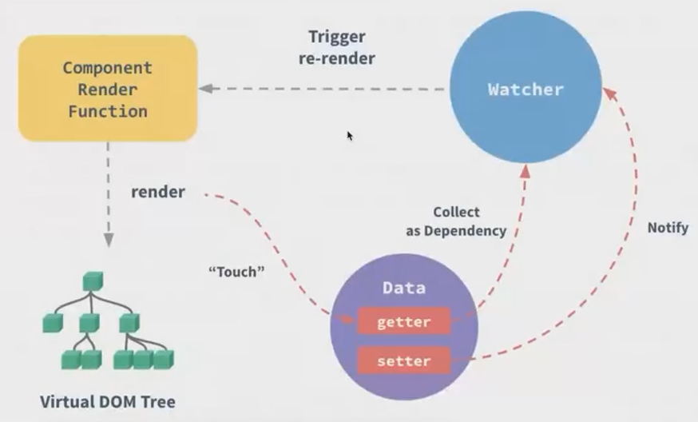

## Vue & Vuex 源码解析

### vuex 源码解析

注册更新与依赖收集

```js
const storeData = {
    key: 'value'
};
new Vue({
    data() {
        return {
            $$state: {
                sotreData
            }
        }
    }
});
```

### vue 源码解析

#### 响应式原理

vue 依赖 defineProperty, 劫持所有 data 中的 key, 从而做二次操作.

```js
class Vue {
    constructor(options) {
        this._data = options.data;
        observe(this._data, options,render);
    }
}

function observe(obj, cb) {
    Object.keys(obj).forEach(key => {
        const val = obj[key];
        Object.defineProperty(obj, key, {
            enumerable: true,
            configurable: true,
            get() {
                return val;
            },
            set(newVal) {
                val = newVal;
                cb();
            }
        });
    });
}
```

第一步是将数据 data 转化为了 observer 的数据, 这样当我们调用 data.xxx = something 的时候, 就可以通过 defineProperty 执行一个回调函数.

#### 依赖收集

依赖收集是最重要的一步, 我们在每次数据更新的时候, 需要去有意识的更新依赖这些数据部分的代码.

每次在创建 Vue 实例的时候, 我们呢首先会指定所有的 data 数据, 在触发 getter 的时候, 将当前的依赖进行收集, 最后所有的 data 数据就会被收集.



#### VNODE

```ts
// vnode.d.ts
export interface Vnode {
    tag?: string;
    data?: VNodeData;
    children?: VNode[];
    text?: string;
    elm?: Node;
    ns?: string;
    context?: Vue;
    key?: string | number;
    componentOptions?: VNodeComponentOptions;
    componenyInstance?: Vue;
    parent?: VNode;
    raw?: boolean;
    isStatic?: boolean;
    isRootInsert: boolean;
    isComment: boolean;
}
```

对于每一个 node 节点来说, 都会使用一个对象结构对其进行描述, 最终基于这个对象来决定渲染或是其他操作. 上面这部分就是一个 vnode 的节点定义的 interface.

```json5
{
  tag: 'div',
  data: {
    class: 'div-test'
  },
  children: [
    {
      tag: 'div',
      text: 'hello world'
    }
  ]
}
```

就会被渲染为:

```html
<div class="div-test">
    <div>hello world</div>
</div>
```

对于 vnode 来说, 有以下的一些方法:

- createEmptyVNode: 创建一个空的 node 节点

- createTextNode: 创建一个文本节点

- createComponent: 组件节点

- cloneVNode: 克隆节点

- createElement: 创建一个虚拟节点

### patch 更新

在 patch 的过程中, 如果两个 VNode 被认为是同一个 VNode(sameVnode), 则会进行深度的比较, 得出最小差异, 否则直接删除旧有 DOM 节点, 创建新的 DOM 节点.

这里主要需要关注对比过程以及更新过程, 主要需要看的是 updateChildren 方法, 主要会进行当前 vnode 对比的过程.

### 事件

instance/events.js 中定义了 $on、$once、$off、$emit 几个方法.

## 通过手写了解

index.html

```html
<!doctype html>
<html lang="en">
<head>
    <meta charset="UTF-8">
    <meta name="viewport"
          content="width=device-width, user-scalable=no, initial-scale=1.0, maximum-scale=1.0, minimum-scale=1.0">
    <meta http-equiv="X-UA-Compatible" content="ie=edge">
    <title>Document</title>
</head>
<body>
    <div id="app">
        <h1>{{text}}</h1>
        <input type="text" v-model="text"/>
        <button type="button" v-on:click="handleClick">按钮v-on</button>
        <button type="button" @click="handleClick">按钮@</button>
    </div>

    <script src="customVue.js" ></script>
    <script>
        const vm = new Vue({
            el: '#app',
            data: {
                text: 'hello world'
            },
            methods: {
                handleClick() {
                    console.log("handle click");
                    this.text = 'handleClick';
                }
            }
        });
    </script>
</body>
</html>
```

customVue.js

```js
const util = {
    model(node, value, vm) {
        // 完成数据获取及绑定
        // console.log(node, value, vm, detail);
        const oldVal = this.getValue(value, vm);
        new Watcher(value, vm, newVal => {
            this.updater.modelUpdate(node, newVal);
        });
        node.addEventListener('input', e => {
            this.setVal(value, vm, e.target.value);
        });
    },
    on(node, value, vm, detail) {
        const fn = vm.$options.methods[value];
        node.addEventListener(detail, fn.bind(vm), false);
    },
    text(node, content, vm) {
        let value;
        if (content.includes('{{')) {
            value = content.replace(/\{\{(.+)\}\}/g, (...args) => {
                new Watcher(args[1], vm, newVal => {
                    this.updater.textUpdate(node, newVal);
                });
                return this.getValue(args[1], vm);
            });
        } else {
            value = this.getValue(content, vm);
        }
        this.updater.textUpdate(node, value);
    },
    getValue(expr, vm) {
        return vm.$data[expr];
    },
    setVal(expr, vm, newVal) {
        vm.$data[expr] = newVal;
    },
    updater: {
        textUpdate(node, value) {
            node.textContent = value;
        },
        modelUpdate(node, value) {
            node.value = value;
        }
    },
    getContent(content, vm) {
        return content.replace(/\{\{(.+?)\}\}/g, (...args) => {
            return this.getValue(args[1], vm);
        });
    }
};

class Dep {
    constructor() {
        this.dep = [];
    }

    addWatcher(watcher) {
        this.dep.push(watcher);
    }

    notify() {
        this.dep.forEach(watcher => watcher.update());
    }
}

class Watcher {
    constructor(expr, vm, cb) {
        this.expr = expr;
        this.vm = vm;
        this.cb = cb;
        this.oldVal = this.getOldVal();
    }

    getOldVal() {
        Dep.target = this;
        const oldVal = util.getValue(this.expr, this.vm);
        Dep.target = null;
        return oldVal;
    }

    update() {
        const newVal = util.getValue(this.expr, this.vm);
        if (newVal !== this.oldVal) {
            this.cb(newVal);
        }
    }
}

class Observer {
    constructor(data) {
        this.observe(data);
    }

    observe(data) {
        if (data && typeof data === 'object') {
            Object.keys(data).forEach(key => {
                this.defineReactive(data, key, data[key]);
            });
        }
    }

    defineReactive(obj, key, value) {
        // 如果 value 是一个对象, 继续递归处理内部 key 的响应式
        this.observe(value);
        const dep = new Dep();
        Object.defineProperty(obj, key, {
            get() {
                if (Dep.target) {
                    dep.addWatcher(Dep.target);
                }
                return value;
            },
            set: (v) => {
                if (v === value) return;
                this.observe(v);
                value = v;
                dep.notify();
            }
        });
    }
}

class Compiler {
    constructor(el, vm) {
        this.el = this.isElement(el) ? el : document.querySelector(el);
        this.vm = vm;
        // 创建文档碎片, 优化整体更新性能
        const fragment = this.createFragment(this.el);

        // 处理文档碎片中, node 节点中 {{}} v- @ 等语法内容, 数据绑定
        this.compile(fragment);

        this.el.appendChild(fragment);
    }

    compile(fragment) {
        fragment.childNodes.forEach(child => {
            if (this.isElement(child)) {
                // 元素标签节点 需要去处理标签上的属性 v- @
                this.compileElement(child);

                // DFS 深度优先遍历处理所有子元素
                if (child.childNodes && child.childNodes.length) {
                    // 当前 child 有子元素
                    this.compile(child);
                }
            } else {
                // 文本节点 {{}} 语法处理
                this.compileText(child);
            }
        });
    }

    compileElement(node) {
        const attributes = Array.from(node.attributes);
        attributes.forEach(attribute => {
            const {name, value} = attribute;
            if (this.isDirector(name)) {
                // 指令 v-
                const [, directive] = name.split('-');
                // 有可能有 v-on:click 的形式
                const [key, detail] = directive.split(':');

                util[key](node, value, this.vm, detail);
                node.removeAttribute(name);
            } else if (this.isEventName(name)) {
                // 方法 @

            }
        });
    }

    isDirector(name) {
        return name.startsWith('v-');
    }

    isEventName(name) {
        return name.startsWith('@');
    }

    compileText(node) {
        const content = node.textContent;
        if (/\{\{(.+)\}\}/.test(content)) {
            console.log(content);
            util['text'](node, content, this.vm);
        }
    }

    createFragment(el) {
        // 创建文档碎片, 把 el 的内容挪到文档碎片中去, 后续如果继续使用 DOM 更新, 不会触发真正的 UI 更新, 提升性能
        const f = document.createDocumentFragment();
        let firstChild;
        // appendChild 之后, firstChild 自动会被移除
        while (firstChild = el.firstChild) {
            f.appendChild(firstChild);
        }
        return f;
    }

    isElement(el) {
        return el.nodeType === 1;
    }
}

class Vue {
    constructor(options) {
        this.$el = options.el;
        this.$data = options.data;
        this.$options = options;

        if (this.$el) {
            // 1. 模板编译
            // 2. 数据劫持
            new Observer(this.$data);

            new Compiler(this.$el, this);

            this.proxyData(this.$data);
        }
    }

    proxyData(data) {
        // 把 this.xx 转发到 this.$data.xx 上去
        Object.keys(data).forEach(key => {
            Object.defineProperty(this, key, {
                get() {
                    return data[key];
                },
                set(v) {
                    data[key] = v;
                }
            });
        });
    }
}
```

