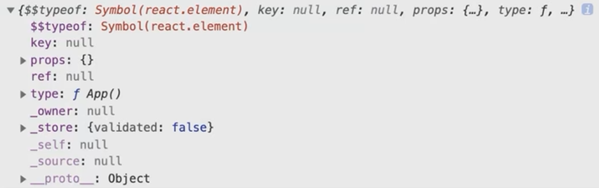
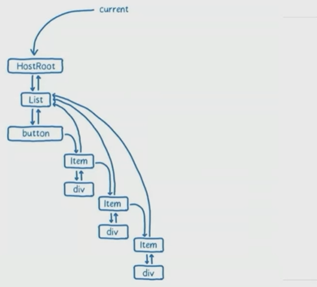
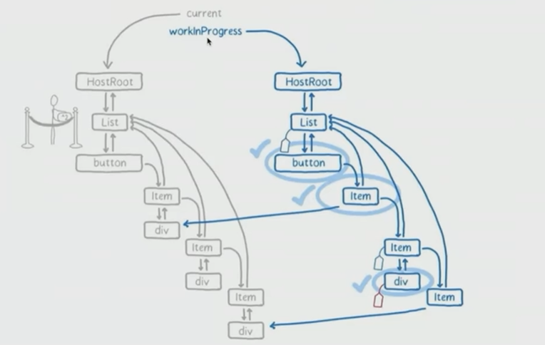

## 27react源码解析

### 基本概念认知

#### react

`import xxx from 'react';` 暴露了大部分的我们会用到的 API

- createElement
- Component
- Children
- hooks
- context
- createRef

#### JSX 与 ReactElement

```jsx
const App = () => {
    return <div>hello</div>;
}
```

```js
const App = () => {
    return /*#__PURE__*/
    	React.createElement("div", null, "hello");
}
```

#### ReactElement

通过 React.createElement 创建出 ReactElement

本质上只是一个对象, 记录了 jsx 上携带的属性



#### 组件 Component

- class component
- function component
- host component

#### 渲染器 render

##### 协调器 reconciler

react 在不同宿主环境下, 需要调用不同的渲染器, 但是渲染器有共同的逻辑, 此部分就在 react-reconciler 下.

##### 调度器 scheduler

react 的异步渲染, 会对不同优先级的渲染过程进行调度.

scheduler 包暴露与优先级相关的 API, 大多都还处于未稳定的版本.

##### 事件系统 events

react 内部实现了一套事件系统, 相比于原生 dom 节约内存消耗. 当事件触发时, 内部创建合成事件进行处理, 合成事件对原生事件进行封装.

react 内部有一个事件池, 管理事件对象的创建和销毁.

#### Fiber

- 能够让任务进行切片

- 支持任务的可中断

- 支持任务优先级

- FiberRootNode

  > rootFiberNode 可以从 root 的 dom 节点上访问到 rootFiberNode
  >
  > document.getElementById('root')._reactRootContainer._internalRoot

- FiberNode

  > - react element 对应的运行实例
  > - 自身的实例类型 type
  > - 与其他 fiber 的关系 child, sibling, return
  > - 已处理未处理的信息 pendingProps, memoizedProps
  > 
  > 调用 createFiberFromElement 创建对应的 fiber.

##### 构建 Fiber

```jsx
const List = () => {
    return [
        <button/>,
        <Item/>,
        <Item/>,
        <Item/>
    ];
};

const Item = () => <div></div>;
```



##### 对 Fiber 进行更新



#### 过期时间 ExpirationTime

react 通过优先级来调度渲染过程, 同时通过过期时间来保证低优先级的任务能够被顺利执行.

在并行渲染时使用, 暂时不是生产接口.

### 源码解析

#### React.createElement

[https://github.com/facebook/react/blob/v16.13.1/packages/react/src/ReactElement.js#L348](https://github.com/facebook/react/blob/v16.13.1/packages/react/src/ReactElement.js#L348)

```jsx
const App = () => {
    return /*#__PURE__*/
    	React.createElement("div", null, "hello");
}
```

- 为什么我们必须要在 jsx 文件中 import react 库

- 为什么有些属性无法从 props 设置? 比如 ref、key

  [https://github.com/facebook/react/blob/v16.13.1/packages/react/src/ReactElement.js#L16](https://github.com/facebook/react/blob/v16.13.1/packages/react/src/ReactElement.js#L16)

#### ReactDOM.render 主流程

- [https://github.com/facebook/react/blob/v16.13.1/packages/react-reconciler/src/ReactFiberReconciler.js#L228](https://github.com/facebook/react/blob/v16.13.1/packages/react-reconciler/src/ReactFiberReconciler.js#L228)

- 创建 FiberRootNode, FiberNode

- 计算 expirationTime

  [https://github.com/facebook/react/blob/v16.13.1/packages/react-reconciler/src/ReactFiberWorkLoop.js#L315](https://github.com/facebook/react/blob/v16.13.1/packages/react-reconciler/src/ReactFiberWorkLoop.js#L315)

- 创建 update

- enqueueUpdate 把 update 准备好, 并构成一个回环

  [https://github.com/facebook/react/blob/v16.13.1/packages/react-reconciler/src/ReactUpdateQueue.js#L205](https://github.com/facebook/react/blob/v16.13.1/packages/react-reconciler/src/ReactUpdateQueue.js#L205)

- scheduleWork

  [https://github.com/facebook/react/blob/v16.13.1/packages/react-reconciler/src/ReactFiberWorkLoop.js#L379](https://github.com/facebook/react/blob/v16.13.1/packages/react-reconciler/src/ReactFiberWorkLoop.js#L379)

#### ReactDOM.render - render 过程

- performSyncWorkOnRoot
- workLoopSync 这一步会同步的将所有 work 执行完毕为止
- 每一个 work 都会通过 performUnitOfWork 执行 [https://github.com/facebook/react/blob/v16.13.1/packages/react-reconciler/src/ReactFiberWorkLoop.js#L1474](https://github.com/facebook/react/blob/v16.13.1/packages/react-reconciler/src/ReactFiberWorkLoop.js#L1474)
- beginWork 会根据 tag 的类型分发更新逻辑, 首次 render 阶段执行 updateHostRoot、mountIndeterminateComponent、updateHostComponent 等 [https://github.com/facebook/react/blob/v16.13.1/packages/react-reconciler/src/ReactFiberBeginWork.js#L2874](https://github.com/facebook/react/blob/v16.13.1/packages/react-reconciler/src/ReactFiberBeginWork.js#L2874)
- updateHostRoot 会把 current 的 updateQueue 克隆到 wip 上, 调用 processUpdateQueue 开始处理 updateQueue [https://github.com/facebook/react/blob/v16.13.1/packages/react-reconciler/src/ReactUpdateQueue.js#L335](https://github.com/facebook/react/blob/v16.13.1/packages/react-reconciler/src/ReactUpdateQueue.js#L335)
- getStateFromUpdate 会根据 tag 计算出新的 state { element: xxx } 设置到 wip.memoizedState 上 [https://github.com/facebook/react/blob/v16.13.1/packages/react-reconciler/src/ReactUpdateQueue.js#L262](https://github.com/facebook/react/blob/v16.13.1/packages/react-reconciler/src/ReactUpdateQueue.js#L262)
- reconcileChildren 会处理出 wip.child [https://github.com/facebook/react/blob/v16.13.1/packages/react-reconciler/src/ReactFiberBeginWork.js#L212](https://github.com/facebook/react/blob/v16.13.1/packages/react-reconciler/src/ReactFiberBeginWork.js#L212)
- reconcileSingleElement [https://github.com/facebook/react/blob/v16.13.1/packages/react-reconciler/src/ReactChildFiber.js#L1154](https://github.com/facebook/react/blob/v16.13.1/packages/react-reconciler/src/ReactChildFiber.js#L1154)
- createFiberFromElement 创建新的 FiberNode, 此时是 App 的 FiberNode, 对应的类型是 IndeterminateComponent, fiber.return 是第一个 container fiberNode [https://github.com/facebook/react/blob/v16.13.1/packages/react-reconciler/src/ReactFiber.js#L743](https://github.com/facebook/react/blob/v16.13.1/packages/react-reconciler/src/ReactFiber.js#L743)
- completeWork 上述的 beginWork 会持续给出 next, 当 next 是 null 的时候就调用 completeWork

#### ReactDOM.render - commit 过程

- finishSyncRender
- commitRoot
- commitRootImpl [https://github.com/facebook/react/blob/v16.13.1/packages/react-reconciler/src/ReactFiberWorkLoop.js#L1720](https://github.com/facebook/react/blob/v16.13.1/packages/react-reconciler/src/ReactFiberWorkLoop.js#L1720)
- commitMutationEffects [https://github.com/facebook/react/blob/v16.13.1/packages/react-reconciler/src/ReactFiberWorkLoop.js#L2063](https://github.com/facebook/react/blob/v16.13.1/packages/react-reconciler/src/ReactFiberWorkLoop.js#L2063)
- commitPlacement [https://github.com/facebook/react/blob/v16.13.1/packages/react-reconciler/src/ReactFiberCommitWork.js#L1075](https://github.com/facebook/react/blob/v16.13.1/packages/react-reconciler/src/ReactFiberCommitWork.js#L1075)
- insertOrAppendPlacementNodeIntoContainer
- appendChildToContainer [https://github.com/facebook/react/blob/v16.13.1/packages/react-reconciler/src/ReactDOMHostConfig.js#L424](https://github.com/facebook/react/blob/v16.13.1/packages/react-reconciler/src/ReactDOMHostConfig.js#L424)

#### React 更新阶段

- ensureRootIsScheduled

- scheduleSyncCallback (performSynvWorkOnRoot.bind(null, root))

- flushSyncCallbackQueue 时执行 performSyncWorkOnRoot

- 过程和 mount 阶段相似, 这里会从 workInProcess 克隆 fiberNode [https://github.com/facebook/react/blob/v16.13.1/packages/react-reconciler/src/ReactChildFiber.js#L1420](https://github.com/facebook/react/blob/v16.13.1/packages/react-reconciler/src/ReactChildFiber.js#L1420)

- 通过 reconcileChildren 时, 判断是否需要更新 didReceiveUpdate [https://github.com/facebook/react/blob/v16.13.1/packages/react-reconciler/src/ReactChildFiber.js#L1165](https://github.com/facebook/react/blob/v16.13.1/packages/react-reconciler/src/ReactChildFiber.js#L1165)(单个 child) [https://github.com/facebook/react/blob/v16.13.1/packages/react-reconciler/src/ReactChildFiber.js#L593](https://github.com/facebook/react/blob/v16.13.1/packages/react-reconciler/src/ReactChildFiber.js#L593)(children) [https://github.com/facebook/react/blob/v16.13.1/packages/react-reconciler/src/ReactDOMComponent.js#L619](https://github.com/facebook/react/blob/v16.13.1/packages/react-reconciler/src/ReactDOMComponent.js#L619)

  如果有更新会把 workInProcess.effectTag 置 Update, 再把 wip 挂载到returnFiber.lastEffect 后面, 最终在 container fiber node 上形成一个待更新的 effect list

- react 的 diff 算法?

  > key 需要相同
  >
  > component type 需要相同

#### Hooks useState

- Dispatcher 在 renderWithHooks 用到 HooksDispatcherOnMountInDEV
- useState 在当前的 fiberNode.memoizedState 构建 hook 链表 [https://github.com/facebook/react/blob/v16.13.1/packages/react-reconciler/src/ReactFiberHooks.js#L1553](https://github.com/facebook/react/blob/v16.13.1/packages/react-reconciler/src/ReactFiberHooks.js#L1553)
- dispatchAction [https://github.com/facebook/react/blob/v16.13.1/packages/react-reconciler/src/ReactFiberHooks.js#L1263](https://github.com/facebook/react/blob/v16.13.1/packages/react-reconciler/src/ReactFiberHooks.js#L1263)
- 触发更新重新计算 state, 如果 state 变化则调用 scheduleWork, 在 commitWork 的时候重新渲染

- 为什么 setState 多次但只有一次生效?

  > ```jsx
  > const [count, setCount] = useState(0);
  > 
  > const increment = () => {
  >     setCount(count + 1);
  >     setCount(count + 1);
  >     setCount(count + 1);
  > };
  > ```
  >
  > setCount -> 组织更新队列, 更新 hook 的 queue, 还没有 commit 的
  >
  > 所以三句话只是提交了3次 setCount(1)

#### Hooks useCallback

- 每次更新时, 都会调用 updateCallback [https://github.com/facebook/react/blob/v16.13.1/packages/react-reconciler/src/ReactFiberHooks.js#L1108](https://github.com/facebook/react/blob/v16.13.1/packages/react-reconciler/src/ReactFiberHooks.js#L1108)
- 如果deps 内的数据没有变化, 就返回上一次的 callback 即可.

- 为什么在 useCallback 使用 setState 失败?

  ```jsx
  const [count, setCount] = useState(0);
  const increment = useCallback(() => {
      setCount(count + 1);
  }, []);
  ```

#### React event

- injectEventPluginsByName 提供了事件的注册机制 [https://github.com/facebook/react/blob/v16.13.1/packages/legacy-events/EventPluginRegistry.js#L217](https://github.com/facebook/react/blob/v16.13.1/packages/legacy-events/EventPluginRegistry.js#L217)
- setInitialDOMProperties 对事件回调进行了劫持 [https://github.com/facebook/react/blob/v16.13.1/packages/react-dom/src/client/ReactDOMComponent.js#L298](https://github.com/facebook/react/blob/v16.13.1/packages/react-dom/src/client/ReactDOMComponent.js#L298)
- trapBubbledEvent 最终将 dispatchDiscreteEvent 绑定到 document [https://github.com/facebook/react/blob/v16.13.1/packages/react-dom/src/events/ReactDOMEventListener.js#L81](https://github.com/facebook/react/blob/v16.13.1/packages/react-dom/src/events/ReactDOMEventListener.js#L81)
- 事件触发时, onClick 调用 discreteUpdates 找到对应的 FiberNode [https://github.com/facebook/react/blob/v16.13.1/packages/react-reconciler/src/ReactFiberWorkLoop.js#L1164](https://github.com/facebook/react/blob/v16.13.1/packages/react-reconciler/src/ReactFiberWorkLoop.js#L1164)
- 从 SyntheticMouseEvent 中获取一个事件代理, 通过 fiber 找到 props.onClick 进行调用 [https://github.com/facebook/react/blob/v16.13.1/packages/react-dom/src/events/SimpleEventPlugin.js#L194](https://github.com/facebook/react/blob/v16.13.1/packages/react-dom/src/events/SimpleEventPlugin.js#L194)
- executeDispatch 执行 [https://github.com/facebook/react/blob/v16.13.1/packages/legacy-events/EventPluginUtils.js#L65](https://github.com/facebook/react/blob/v16.13.1/packages/legacy-events/EventPluginUtils.js#L65)
- 事件池 [https://github.com/facebook/react/blob/v16.13.1/packages/legacy-events/SyntheticEvent.js#L320](https://github.com/facebook/react/blob/v16.13.1/packages/legacy-events/SyntheticEvent.js#L320)

- 为什么异步的 event 无法保留?

  ```jsx
  const handler = (e) => {
      asyncValid.then((isValid) => {
          submit(e.target.value); // error, e 会被 release
      });
  };
  ```

  
