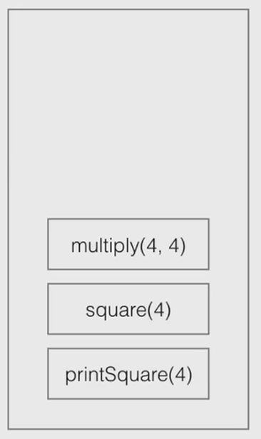
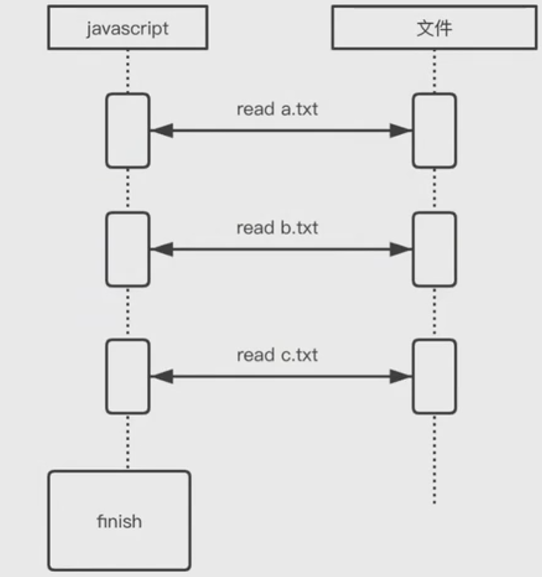
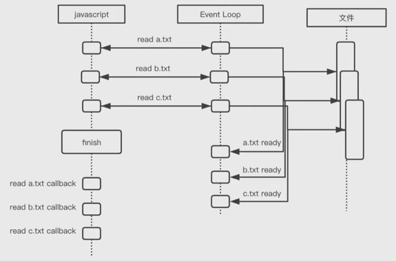
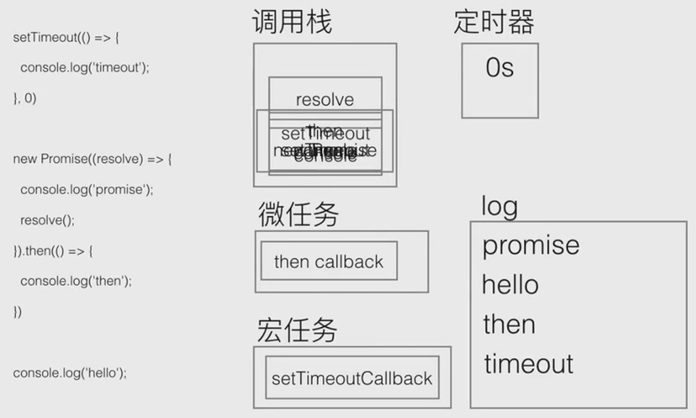

## Node.js 原理详解

### 事件循环模型 Event Loop

#### 调用栈(1)

```js
function multiply(a, b) {
    return a * b;
}
function square(n) {
    return multiply(n, n);
}
function printSquare(n) {
    console.log(squre(n));
}
printSqure(4);
```



#### 调用栈(2)

```js
function multiply(a, b) {
    throw new Error();
}
function square(n) {
    return multiply(n, n);
}
function printSquare(n) {
    console.log(squre(n));
}
printSqure(4);
```


#### 调用栈(3)

```js
function fn(a) {
    fn(a);
}
fn(1);
```


#### 同步调用

```js
const fs = require('fs');

fs.readFileSync('./a.txt');
fs.readFileSync('./b.txt');
fs.readFileSync('./c.txt');

console.log('finish');
```



#### 异步调用

```js
const fs = require('fs');

fs.readFile('./a.txt');
fs.readFile('./b.txt');
fs.readFile('./c.txt');

console.log('finish');
```



#### 事件循环机制

```js
setTimeout(() => {
    console.log('timeout');
}, 5000);

console.log('hello');
```


### 宏任务与微任务

**宏任务**

- setTimeout
- setInterval
- js 主代码
- setImmediate(Node)
- requestAnimationFrame(浏览器)

**微任务**

- process.nextTick
- Promise 的 then 方法

> 任务队列被分为 1. 宏任务队列 和 2. 微任务队列
>
> 微任务队列率先执行, 直到清空
>
> 当微任务队列为空时, 执行宏任务队列

#### 事件循环机制

```js
setTimeout(() => {
    console.log('timeout');
}, 0);

new Promise((resolve) => {
    console.log('promise');
    resolve();
}).then(() => {
    console.log('then');
});

console.log('hello');
```



---

```js
console.log(1);
setTimeout(function () {
    console.log(2);
}, 10);
new Promise(function (resolve) {
    console.log(3);
    resolve();
    console.log(4);
}).then(function () {
    console.log(5);
});
console.log(6);
console.log(8);
requestAnimationFrame(() => console.log(9));
```

### Buffer

#### 什么是 Buffer

- Buffer 是 UInt8Array
- 是数组, 且每个 item 有效范围是 0~255

```js
Buffer.from([1, 1, 1, 1]);

Buffer.from([257, 257.5, -255, '1']);

Buffer.from('abcd');
// <Buffer 61 62 63 64>
```

utf8 编码


### Event

#### Event Eimtter

- on 方法, 注册事件回调
- emit 方法, 手动触发事件

```js
const EventEmitter = require('events');

class MyEventEmitter extends EventEmitter {}

const myEventEmitter = new MyEventEmitter();

myEventEmitter.on('ping', function () {
    console.log('pong');
});

myEventEmitter.emit('ping');
```

### Stream

#### 什么是 Stream

- Node.js 中很多对象都是 Stream, 例如 HTTP 的请求, 进程日志输出, 文件的读写
- Stream 本身是一个 EventEmitter
- Stream 内部含有 Buffer
- 当 Stream 中 Buffer 有数据可读时, emit data 事件, 通知外部读取数据
- 当 Stream 可写时, 通过调用 write(), end() API 来写入数据到内部 Buffer 中

#### Stream 的类型

- 可写 Writable
- 可读 Readable
- 双工 Duplex
- 转换 Transform

#### Stream 的应用场景

- fs.createReadStream('sample.txt', {
      start: 90,
      end: 99
  })

- gulp.src('**/*').pipe(xxx)

- fetch('https://www.baidu.com').then(data => xxx)

```js
const http = require('http');
const net = require('net');
const { URL } = require('url');

// Create an HTTP tunneling proxy
const proxy = http.createServer((req, res) => {
    res.writeHead(200, {
        'Content-Type': 'text/plain'
    });
    res.end('okay');
});
proxy.on('connect', (req, clientSocket, head) => {
    // Connect to an origin server
    const { port, hostname } = new URL(`http://${req.url}`);
    const serverSocket = net.connect(port || 80, hostname, () => {
        clientSocket.write('HTTP/1.1 200 Connection Established\r\n' +
                          'Proxy-agent: Node.js-Proxy\r\n' +
                          '\r\n');
        serverSocket.write(head);
    })
});
```

### Node 全局对象

#### 常用的 Node.js 全局对象

- clearInterval
- setInterval
- clearTimeout
- setTimeout
- console
- process

#### 全局对象与模块

- __filename
- __dirname
- exports
- module
- require

这 5 个 API 看上去像是全局对象, 但其实是在模块加载的时候进行注入, 所以要和**全局对象**进行区分.
