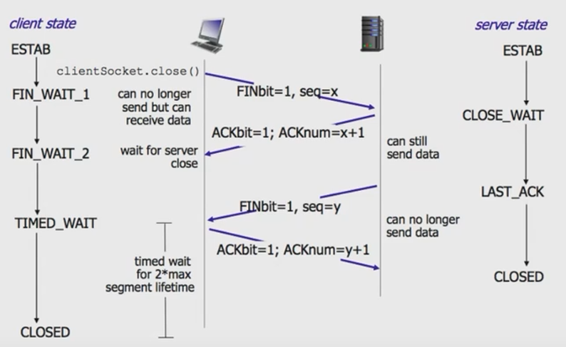

## Node.js HTTP

### OSI 模型

- ⑦ 应用层

  > 各种应用程序协议

- ⑥ 表示层

  > 数据的格式化、数据加密解密、数据的压缩解压缩

- ⑤ 会话层

  > 建立、管理、中止实体之间的会话连接

- ④ 传输层

  > 数据的分段及重组; 提供端到端的数据服务(可靠或不可靠)

- ③ 网络层

  > 将分组从源端传送到目的端; 逻辑寻址; 路由选择

- ② 数据链路层

  > 将分组数据封装成帧; 实现两个相邻结点之间的通信; 差错检测

- ① 物理层

  > 在介质上传输比特; 提供机械的和电气的规约

### HTTP - 应用层协议

HTTP 请求

```
<方法> <资源地址> <协议版本>
<请求部首>

<请求体>
```

### HTTP 方法

- GET: 通常用于请求服务器发送某些资源
- HEAD: 请求资源的头部信息, 并且这些头部与 HTTP GET 方法请求时返回的一致. 该请求方法的一个使用场景是在下载一个大文件前先获取其大小再决定是否要下载, 以此可以节约带宽资源
- OPTIONS: 用于获取目的资源所支持的通信选项
- POST: 发送数据给服务器
- PUT: 用于新增资源或者使用请求中的有效负载替换目标资源的表现形式
- DELETE: 用于删除指定的资源
- PATCH: 用于对资源进行部分修改
- CONNECT: HTTP/1.1 协议中预留给能够将连接改为管道方式的代理服务器
- TRACE: 回显服务器收到的请求, 主要用于测试或诊断

#### GET vs POST

- 数据载体不同, GET 通过 url; POST 通过 body
- GET url 利于缓存结果
- POST 多次调用, 可能造成多次提交; GET 一般具有幂等性, 不会有副作用

#### POST vs PUT

- 语义不同, POST 用于新增资源、PUT 指向单一资源
- POST /article 新增文章
- PUT /article/1 对 id 是 1 的 article 进行修改

#### PUT vs PATCH

- 都是对单一资源的修改
- 内容不同 PUT 影响全量内容; PATCH 是修改部分内容

### HTTP 部首

- Content-Type
- Accept
- Date
- Expires
- Last-Modified
- If-Modified-Since
- ETag
- If-None-Match
- Cache-Control
- ...

### HTTP 响应

HTTP 响应

```
<协议版本> <状态码> <状态码短语>
<响应部首>

<响应体>
```

### HTTP 状态码

- 2XX 成功 - 200 OK
- 3XX 重定向 - 301 永久重定向、304 资源未更改
- 4XX 客户端错误 - 401 没有权限、404 资源未找到
- 5XX 服务端错误 - 500 服务器端内部错误

### HTTP 请求响应示例

```http
GET / HTTP/1.1
Host: www.example.com
Accept: text/html
Accept-Language: en,zh-CN;q=0.9,zh;q=0.8.en-US;q=0.7,zh-TW;q=0.6
User-Agent: Mozilla/5.0(Macintosh;Intel Mac OS X 10_13_3) AppleWebKit/537.36(KHTML, like Gecko) Chrome/80.0.3987.163 Safari/537.36
```

```http
HTTP/1.1 200 OK
Date: Mon, 23 May 2005 22:38:34 GMT
Content-Type: text/html; charset=UTF-8
Content-Length: 138
Last-Modified: Wed, 08 Jan 2003 23:11:55 GMT
Server: Apache/1.3.3.7 (Unix)(Red-Hat/Linux)
ETag: *3f80f-1b6-3e1cb03b*
Accept-Ranges: bytes
Connection: close

<html>
	<head>
		<title>An Example Page</title>
	</head>
	<body>
		<p>Hello World, this is a very simple HTML document.</p>
	</body>
</html>
```

### HTTP 实例讲解

Node.js API 实现 http 通信

```js
const http = require('http');
const fs = require('fs');
const path = require('path');

const server = http.createServer((req, res) => {
    const url = req.url;
    console.log(url);

    switch (url) {
        case "/": {
            responseHTML(res, path.resolve("./index.html"));
            break;
        }
        default: {
            responseHTML(res, path.resolve("./404.html"));
            break;
        }
    }
});

const PORT = 8080;

server.listen(PORT, () => {
    console.log(`Server listening on ${PORT}`);
});

function responseHTML(res, htmlFilePath) {
    res.writeHead(200, {
        "Content-Type": "text/html"
    });
    res.write(fs.readFileSync(htmlFilePath));
    res.end();
}
```

### 套接字 Socket


### TCP - 传输层协议

- 三次握手

  必须客户端发起

  

- 四次挥手

  可以是服务端发起, 也可以是客户端发起

  

### TCP 实例

socat + telnet 进行 tcp 通信

### TCP 实例讲解

Node.js net API 实现 tcp 通信

```js
const net = require('net');
const fs = require('fs');
const path = require('path');

const server = net.createServer((socket) => {
    socket.on('data', (request) => {
        const req = request.toString('utf-8');
        // console.log(req);

        const lines = req.split('\r\n');
        const line = lines[0];
        const [method, uri, proto] = line.split(/\s+/);
        // console.log(method, uri, proto);

        switch (uri) {
            case "/": {
                responseHTML(socket, path.resolve("./index.html"));
                break;
            }
            default: {
                responseHTML(socket, path.resolve("./404.html"));
                break;
            }
        }
    });

    socket.on('error', (e) => {
        // console.log(e);
    })
});

const PORT = 8080;
server.listen(PORT, () => {
    console.log(`Socket server listening on ${PORT}`);
});

function responseHTML(socket, htmlFilePath) {
    const content = fs.readFileSync(htmlFilePath);
    socket.write('HTTP/1.1 200 OK\r\n' +
        'Content-Type: text/html\r\n' +
        `Content-Length: ${content.length}\r\n` +
        '\r\n' +
        content
    );
}
```

### Websocket

request

```http
GET / HTTP/1.1
Host: server.example.com
Upgrade: websocket
Connection: Upgrade
Sec-WebSocket-Key: x3JJHMbDL1EzLkh9GBhXDw==
Sec-WebSocket-Protocol: chat,superchat
Sec-WebSocket-Version: 13
Origin: http://example.com
```

response

```http
HTTP/1.1 101 Switching Protocols
Upgrade: websocket
Connection: Upgrade
Sec-WebSocket-Accept: HSmrc0sMIYUkAGmm5OPpG2HaGWK=
Sec-WebSocket-Protocol: chat
```

### Websocket 示例讲解

Node.js http API 完成 websocket 协议切换

**ws-server.js**

```js
/* ws-server.js */
const http = require('http');

const server = http.createServer((req, res) => {
});

server.on('upgrade', (req, socket, head) => {
    socket.write('HTTP/1.1 101 Web Socket Protocol Handshake\r\n' +
        'Upgrade: WebSocket\r\n' +
        'Connection: Upgrade\r\n' +
        '\r\n'
    );

    socket.on('data', (content) => {
        console.log('from client', content.toString('utf-8'));
    });

    // server -> client
    socket.write('95');

    // server -> client later
    asycnSend('120', 1);
    asycnSend('110', 2);
    asycnSend('68', 3);
    asycnSend('651', 4);

    // close socket after 5s
    setTimeout(() => {
        console.log('socket destroy');
        socket.destroy();
    }, 5000);

    function asycnSend(content, s) {
        setTimeout(() => {
            console.log('send', content);
            socket.write(content);
        }, s * 1000);
    }
});

const PORT = 8080;

server.listen(PORT, () => {
    console.log(`Server listening on ${PORT}`);
});
```

**ws-client.js**

```js
const http = require('http');

const PORT = 8080;

const options = {
    port: PORT,
    host: '127.0.0.1',
    headers: {
        Connection: "Upgrade",
        Upgrade: "websocket"
    }
};

const req = http.request(options);
req.end();

req.on("upgrade", (res, socket, upgradeHead) => {
    console.log("got upgraded");

    socket.on('data', (c) => {
        console.log("The price now is", c.toString("utf-8"));
    });

    // client -> server
    // socket.write('abcd');

    // client -> server later
    // setTimeout(() => {
    //     socket.write('efg');
    // }, 1000);

    // close socket after 5s
    // setTimeout(() => {
    //     socket.destroy();
    // }, 5000);
});
```

### Node 服务的部署

使用 pm2 启动服务端、进行运维

- npm install -g pm2
- pm2 start ws-server.js --name myserver
- pm2 list
- pm2 monit
- pm2 logs ws-server.js
