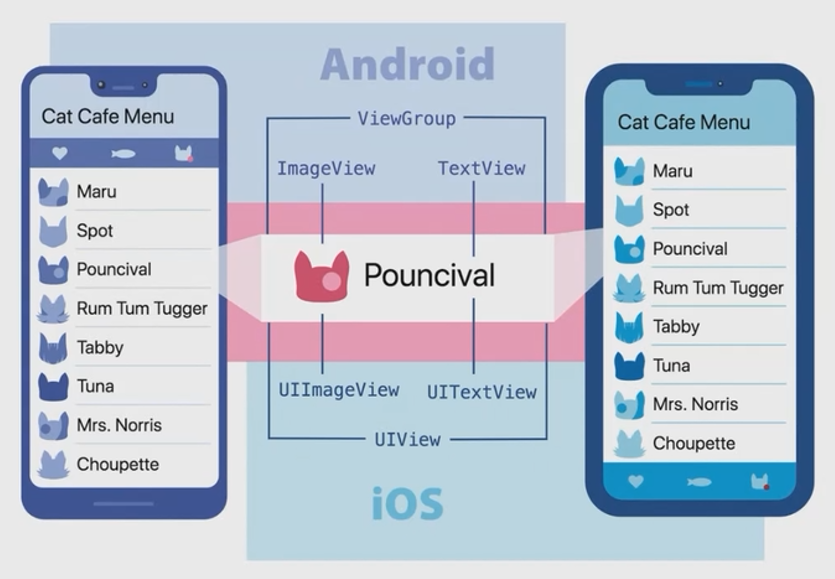

## React Native 入门与原理介绍

### 什么是 React Native

**问题**: 假如我开发了一款 iOS App, 火了. 我该如何照顾到 Android 用户呢?

**可能的答案**: 再学一遍 Android, 开发一个相同功能的应用

React 的语法

跨平台

Learn once, write everywhere

- 移动互联网趋势
- 多端代码同构
- 组件化

### React Native 的优势



### 开发环境配置

- Node.js LTS 12
- npm install -g expo-cli
- expo init xxx

### Android, iOS 环境配置

- 官方 [https://reactnative.dev/docs/next/environment-setup](https://reactnative.dev/docs/next/environment-setup)
- 中文 [https://reactnative.cn/docs/environment-setup](https://reactnative.cn/docs/environment-setup)
- Android 应用可以在 MacOS 和 windows 进行开发
- iOS 必须要有 MacOS

### React Native 组件应用

### React Native 样式处理

```jsx
import { StyleSheet } from 'react-native';

const styles = StyleSheet.create({
    root: {
        padding: 10
    },
    countContainer: {
        alignItems: "center",
        padding: 10
    },
    button: {
        alignItems: "center",
        backgroundColor: "#ddd",
        padding: 10
    }
});
```

```jsx
<View style={styles.root}></View>
<View style={[styles.container, styles.horizontal]}></View>
```

### React Native 布局


```tsx
import React from "react";

import {StyleSheet, View, Image, Text} from "react-native";

const styles = StyleSheet.create({
    root: {
        flex: 1,
        backgroundColor: "gray"
    },
    upper: {
        flex: 1,
        justifyContent: "center",
        alignItems: "center",
        backgroundColor: "beige"
    },
    bottom: {
        flex: 1,
        flexDirection: "row"
    },
    left: {
        flex: 1,
        justifyContent: "center",
        alignItems: "center",
        borderWidth: 1,
        borderColor: "aqua"
    },
    right: {
        flex: 1,
        justifyContent: "center",
        alignItems: "center",
        borderWidth: 1,
        borderColor: "orange"
    }
});

export const LayoutDemo: React.FC<{}> = (props) => {
    return (
        <View style={styles.root}>
            <View style={styles.upper}>
                <Image source={require("../assets/logo.png")} />
            </View>
            <View style={styles.bottom}>
                <View style={styles.left}>
                    <Text>left</Text>
                </View>
                <View style={styles.right}>
                    <Text>right</Text>
                </View>
            </View>
        </View>
    );
}
```

### React Native 变形

- 类比 css 中的 transform 属性

```tsx
import React from "react";
import {SafeAreaView, ScrollView, StyleSheet, Text, View} from "react-native";

export const TransformDemo = () => (
    <ScrollView contentContainerStyle={styles.scrollContentContainer}>
        <View style={styles.box}>
            <Text style={styles.text}>Original Object</Text>
        </View>

        <View
            style={[
                styles.box,
                {
                    transform: [{scale: 2}]
                }
            ]}
        >
            <Text style={styles.text}>Scale by 2</Text>
        </View>

        <View
            style={[
                styles.box,
                {
                    transform: [{scaleX: 2}]
                }
            ]}
        >
            <Text style={styles.text}>ScaleX by 2</Text>
        </View>

        <View
            style={[
                styles.box,
                {
                    transform: [{scaleY: 2}]
                }
            ]}
        >
            <Text style={styles.text}>ScaleY by 2</Text>
        </View>

        <View
            style={[
                styles.box,
                {
                    transform: [{rotate: "45deg"}]
                }
            ]}
        >
            <Text style={styles.text}>Rotate by 45 deg</Text>
        </View>

        <View
            style={[
                styles.box,
                {
                    transform: [{rotateX: "45deg"}, {rotateZ: "45deg"}]
                }
            ]}
        >
            <Text style={styles.text}>Rotate X&Z by 45 deg</Text>
        </View>

        <View
            style={[
                styles.box,
                {
                    transform: [{rotateY: "45deg"}, {rotateZ: "45deg"}]
                }
            ]}
        >
            <Text style={styles.text}>Rotate Y&Z by 45 deg</Text>
        </View>

        <View
            style={[
                styles.box,
                {
                    transform: [{skewX: "45deg"}]
                }
            ]}
        >
            <Text style={styles.text}>SkewX by 45 deg</Text>
        </View>

        <View
            style={[
                styles.box,
                {
                    transform: [{skewY: "45deg"}]
                }
            ]}
        >
            <Text style={styles.text}>SkewY by 45 deg</Text>
        </View>

        <View
            style={[
                styles.box,
                {
                    transform: [{skewX: "30deg"}, {skewY: "30deg"}]
                }
            ]}
        >
            <Text style={styles.text}>Skew X&Y by 30 deg</Text>
        </View>

        <View
            style={[
                styles.box,
                {
                    transform: [{translateX: -50}]
                }
            ]}
        >
            <Text style={styles.text}>TranslateX by -50</Text>
        </View>

        <View
            style={[
                styles.box,
                {
                    transform: [{translateY: -50}]
                }
            ]}
        >
            <Text style={styles.text}>TranslateY by -50</Text>
        </View>
    </ScrollView>
);

const styles = StyleSheet.create({
    container: {
        flex: 1,
    },
    scrollContentContainer: {
        alignItems: "center",
        paddingBottom: 60
    },
    box: {
        height: 100,
        width: 100,
        borderRadius: 5,
        marginVertical: 40,
        backgroundColor: "#61dafb",
        alignItems: "center",
        justifyContent: "center"
    },
    text: {
        fontSize: 14,
        fontWeight: "bold",
        margin: 8,
        color: "#000",
        textAlign: "center"
    }
});
```

### React Native 异形屏

```tsx
export const SafeAreaViewDemo = () => {
    return (
        <SafeAreaView style={styles.container}>
            <Text>Page Content</Text>
        </SafeAreaView>
    );
};
```

### React Native TextInput

- TextInput Demo

  ```tsx
  /* TextInputDemo.tsx */
  import React, {useState} from "react";
  
  import {StyleSheet, View, TextInput} from "react-native";
  
  const styles = StyleSheet.create({
      textInput: {
          height: 40,
          borderColor: "gray",
          borderWidth: 1
      }
  });
  
  export const TextInputDemo: React.FC<{}> = (props) => {
      const [inputValue, setInputValue] = useState<string>("");
      
      const onChangeText = (t: string) => setInputValue(t);
      
      return (
          <View>
              <TextInput
                  style={styles.textInput}
                  value={inputValue}
                  onChangeText={onChangeText}
              />
          </View>
      );
  };
  ```

  

- Platform specified code

  ```tsx
  /* TextInputDemo.ios.tsx */
  import React, {useState} from "react";
  
  import {
      StyleSheet,
      View,
      TextInput,
      InputAccessoryView,
      Button
  } from "react-native";
  
  const styles = StyleSheet.create({
      textInput: {
          height: 40,
          borderColor: "gray",
          borderWidth: 1
      }
  });
  
  export const TextInputDemo: React.FC<{}> = (props) => {
      const [inputValue, setInputValue] = useState<string>("");
  
      const onChangeText = (t: string) => setInputValue(t);
      const onClearText = () => setInputValue("");
  
      const uid: string = "uid";
  
      return (
          <View>
              <TextInput
                  style={styles.textInput}
                  value={inputValue}
                  onChangeText={onChangeText}
                  inputAccessoryViewID={uid}
              />
              <InputAccessoryView nativeID={uid}>
                  <Button onPress={onClearText} title="Reset"/>
              </InputAccessoryView>
          </View>
      );
  };
  ```

### React Native 触摸样式

- Button
- TouchableHighlight
- TouchableNativeFeedback(Android)
- TouchableOpacity

```tsx
import {
    StyleSheet,
    View,
    Text,
    Button,
    TouchableOpacity,
    TouchableHighlight,
    Platform,
    TouchableNativeFeedback
} from "react-native";
import React, {useState} from "react";

const styles = StyleSheet.create({
    root: {
        padding: 10
    },
    countContainer: {
        alignItems: "center",
        padding: 10
    },
    button: {
        alignItems: "center",
        backgroundColor: "#ddd",
        padding: 10
    }
});

const randomColor = () => {
    return "#000000".replace(/0/g, function () {
        return (~~Math.random() * 16).toString(16);
    });
};

export const Touchable: React.FC<{}> = (props) => {
    const [count, setCount] = useState(0);
    const onPress = () => {
        setCount((n) => n + 1);
    };
    const [rippleColor, setRippleColor] = useState(randomColor());
    const onPressWithRipple = () => {
        setCount((n) => n + 1);
        setRippleColor(randomColor());
    };

    return (
        <View style={styles.root}>
            <View style={styles.countContainer}>
                <Text>{count}</Text>
            </View>
            <Button onPress={onPress} title="button 点击" color="#841584"/>
            <TouchableOpacity style={styles.button} onPress={onPress}>
                <Text>opacity 点击</Text>
            </TouchableOpacity>
            <TouchableHighlight
                style={styles.button}
                onPress={onPress}
                underlayColor="#eee"
            >
                <Text>highlight 点击</Text>
            </TouchableHighlight>
            {Platform.OS === "android" ? (
                <TouchableNativeFeedback
                    style={styles.button}
                    background={TouchableNativeFeedback.Ripple(rippleColor, false)}
                    onPress={onPressWithRipple}
                >
                    <Text>点击</Text>
                </TouchableNativeFeedback>
            ) : null}
        </View>
    );
};
```

### React Native 图片

- 本地静态资源图片
- 通过网络动态资源图片
- 背景图片

```tsx
import React, {useState} from "react";
import {
    Button,
    Image,
    ImageProps,
    ImageBackground,
    PixelRatio,
    ScrollView,
    StyleSheet,
    Text,
    View
} from "react-native";

const styles = StyleSheet.create({
    root: {
        flex: 1
    },
    container: {
        flex: 1,
        padding: 10
    },
    img: {
        maxWidth: "100%"
    },
    bgImage: {
        flex: 1,
        height: 300,
        alignItems: "center"
    },
    caption: {
        color: "white",
        fontSize: 16
    }
});

export const ImageDemo: React.FC<{}> = (props) => {
    const [catOrDog, setCatOrDog] = useState<"cat" | "dog">("cat");
    const toggleCatOrDog = () => {
        setCatOrDog((current) => {
            if (current === "cat") {
                return "dog";
            }
            return "cat";
        });
    };

    const [resizeMode, setResizeMode] = useState<ImageProps["resizeMode"]>(
        "cover"
    );

    const toggleResizeMode = () => {
        setResizeMode((current) => {
            if (current === "cover") {
                return "contain";
            }
            return "cover";
        });
    };

    return (
        <ScrollView style={styles.root}>
            <View style={styles.container}>
                <Text>本地静态资源</Text>
                <View>
                    <Image style={styles.img} source={require("../assets/logo.png")}/>
                </View>
            </View>

            <View style={styles.container}>
                <View>
                    <Text>选择性渲染静态资源</Text>
                    <Button onPress={toggleCatOrDog} title="Cat or Dog?"/>
                    <Button onPress={toggleResizeMode} title="Resize Mode?"/>
                </View>
                <View>
                    {catOrDog === "cat" ? (
                        <Image
                            style={styles.img}
                            resizeMode={resizeMode}
                            source={require("../assets/cat.jpg")}
                            />
                    ) : (
                        <Image
                            style={[
                                styles.img,
                                {
                                    width: PixelRatio.getPixelSizeForLayoutSize(200),
                                    height: PixelRatio.getPixelSizeForLayoutSize(200)
                                }
                            ]}
                            resizeMode={resizeMode}
                            source={require("../assets/dog.jpg")}
                            />
                    )}
                </View>
            </View>

            <View style={styles.container}>
                <View>
                    <Text>网络图片</Text>
                </View>
                <View>
                    <Image
                        style={[
                            styles.img,
                            {
                                width: 50,
                                height: 50
                            }
                        ]}
                        source={
                            {
                                uri: "https://reactjs.org/logo-og.png",
                                    width: PixelRatio.getPixelSizeForLayoutSize(50),
                                        height: PixelRatio.getPixelSizeForLayoutSize(50)
                            }
                        }
                        />
                    <Text>{PixelRatio.get()}</Text>
                </View>
            </View>

            <View style={styles.container}>
                <View>
                    <Text>背景图片</Text>
                </View>
                <View>
                    <ImageBackground
                        style={styles.bgImage}
                        source={require("../assets/cat.jpg")}
                        >
                        <Text style={styles.caption}>Kitty</Text>
                    </ImageBackground>
                </View>
            </View>
        </ScrollView>
    );
};
```

### React Native 列表

- ScrollView

  ```tsx
  import {Image, ImageURISource, PixelRatio, ScrollView, StyleSheet, Text, View} from "react-native";
  import * as React from "react";
  
  const list: Array<string> = [];
  for (let i = 1; i <= 100; i++) {
      list.push(`Item ${i}`);
  }
  
  const logo: ImageURISource = {
      uri: "https://reactjs.org/logo-og.png",
      width: PixelRatio.getPixelSizeForLayoutSize(50),
      height: PixelRatio.getPixelSizeForLayoutSize(50)
  };
  
  const styles = StyleSheet.create({
      itemContainer: {
          flex: 1,
          flexDirection: "row",
          justifyContent: "space-between",
          padding: 10
      },
      itemText: {
          fontSize: 16
      }
  });
  
  export const ScrollViewDemo: React.FC<{}> = (props) => {
      return (
          <ScrollView>
              {list.map((item) => {
                  return (
                      <View key={item} style={styles.itemContainer}>
                          <Text style={styles.itemText}>{item}</Text>
                          <Image source={logo}/>
                      </View>
                  );
              })}
          </ScrollView>
      );
  }
  ```

- FlatList

  ```tsx
  import React, {useState} from "react";
  
  import {FlatList, StyleSheet, Text, View} from "react-native";
  
  const fruits: string[] = [
      "Apple",
      "Banana",
      "Blackberry",
      "Blueberry",
      "Cherry",
      "Grapes",
      "Lemon",
      "Lychee",
      "Mango",
      "Orange",
      "Peach",
      "Pear",
      "Pineapple",
      "Raspberry",
      "Strawberry",
      "Kiwi",
      "Watermelon"
  ];
  
  const styles = StyleSheet.create({
      root: {
          flex: 1
      },
      itemContainer: {
          padding: 16
      },
      text: {
          fontSize: 26
      },
      itemHeader: {
          padding: 2
      }
  });
  
  const delay = (ms: number) => new Promise((resolve) => setTimeout(resolve, ms));
  
  export const ListDemo: React.FC<{}> = (props) => {
      const [refreshing, setRefreshing] = useState(false);
  
      const fetchData = () => {
          setRefreshing(true);
          delay(2_000).then(() => {
              setRefreshing(false);
          });
      };
  
      return (
          <View style={styles.root}>
              <FlatList
                  data={fruits}
                  renderItem={({item}) => {
                      return (
                          <View style={styles.itemContainer}>
                              <Text style={styles.text}>{item}</Text>
                          </View>
                      );
                  }}
                  keyExtractor={(item) => item}
                  refreshing={refreshing}
                  onRefresh={fetchData}
              />
          </View>
      );
  };
  ```

- SectionList

  ```tsx
  import React from "react";
  
  import {SectionList, StyleSheet, Text, View} from "react-native";
  
  const styles = StyleSheet.create({
      root: {
          flex: 1
      },
      itemContainer: {
          padding: 16
      },
      text: {
          fontSize: 26
      },
      itemHeader: {
          padding: 2
      }
  });
  
  const sectionFruits: { title: string, data: string[] }[] = [
      {
          title: "A",
          data: ["Apple"]
      },
      {
          title: "B",
          data: ["Banana", "Blackberry", "Blueberry"]
      },
      {
          title: "C",
          data: ["Cherry"]
      },
      {
          title: "G",
          data: ["Grapes"]
      },
      {
          title: "L",
          data: ["Lemon", "Lychee"]
      },
      {
          title: "M",
          data: ["Mango"]
      },
      {
          title: "O",
          data: ["Orange"]
      },
      {
          title: "P",
          data: ["Peach", "Pear", "Pineapple"]
      },
      {
          title: "R",
          data: ["Raspberry"]
      },
      {
          title: "S",
          data: ["Strawberry"]
      },
      {
          title: "K",
          data: ["Kiwi"]
      },
      {
          title: "W",
          data: ["Watermelon"]
      }
  ];
  
  const delay = (ms: number) => new Promise((resolve) => setTimeout(resolve, ms));
  
  export const ListDemo: React.FC<{}> = (props) => {
      return (
          <View style={styles.root}>
              <SectionList
                  sections={sectionFruits}
                  renderSectionHeader={({section}) => {
                      return (
                          <View style={styles.itemHeader}>
                              <Text style={styles.text}>{section.title}</Text>
                          </View>
                      );
                  }}
                  keyExtractor={(item) => item}
              />
          </View>
      );
  };
  ```

### React Native 开关按钮

- Switch
- onValueChange
- value
- 设置颜色在不同平台有不同的渲染

```tsx
import React, {useState} from "react";
import {View, Switch, StyleSheet, Text} from "react-native";

export const SwitchDemo = () => {
    const [isEnabled, setIsEnabled] = useState(false);
    const toggleSwitch = () => setIsEnabled((previousState) => !previousState);

    return (
        <View style={styles.container}>
            <Text>开关</Text>
            <Switch
                trackColor={ {false: "#767577", true: "#81b0ff"} }
                thumbColor={isEnabled ? "#f5dd4b" : "#f4f3f4"}
                ios_backgroundColor="#3e3e3e"
                onValueChange={toggleSwitch}
                value={isEnabled}
            />
        </View>
    );
}

const styles = StyleSheet.create({
    container: {
        flex: 1,
        alignItems: "center",
        justifyContent: "center"
    }
});
```

### React Native 状态栏

- 系统最上面的状态栏
- 显示、隐藏
- 内容模式 default、light-content、dark-content

```tsx
import React, {useState} from "react";
import {Button, Text, StyleSheet, StatusBar, View} from "react-native";

import Constants from 'expo-constants';

export const StatusBarDemo = () => {
    const styleTypes = ["default", "dark-content", "light-content"] as const;
    const [visibleStatusBar, setVisibleStatusBar] = useState(false);
    const [styleStatusBar, setStyleStatusBar] = useState<typeof styleTypes[number]>(styleTypes[0]);

    const changeVisibilityStatusBar = () => {
        setVisibleStatusBar(!visibleStatusBar);
    };

    const changeStyleStatusBar = () => {
        const styleId = styleTypes.indexOf(styleStatusBar) + 1;

        if (styleId === styleTypes.length) {
            return setStyleStatusBar(styleTypes[0]);
        }
        return setStyleStatusBar(styleTypes[styleId]);
    };

    return (
        <View style={styles.container}>
            <View>
                <Text style={styles.textStyle}>StatusBar Style: {styleStatusBar}</Text>
                <Text style={styles.textStyle}>
                    StatusBar Visibility: {!visibleStatusBar ? "Visible" : "Hidden"}
                </Text>
            </View>
            <StatusBar
                backgroundColor="blue"
                barStyle={styleStatusBar}
                networkActivityIndicatorVisible={true}
            />
            <View>
                <StatusBar hidden={visibleStatusBar}/>
            </View>
            <View style={styles.buttonContainer}>
                <Button
                    title="Toggle StatusBar"
                    onPress={() => changeVisibilityStatusBar()}
                />
            </View>
            <View style={styles.buttonContainer}>
                <Button
                    title="Change StatusBar Style"
                    onPress={() => changeStyleStatusBar()}
                />
            </View>
        </View>
    );
}

const styles = StyleSheet.create({
    container: {},
    textStyle: {},
    buttonContainer: {}
});
```

### React Native 活动指示

- 表示正在处理的状态
- 具体的展示与平台相关


```tsx
import {ActivityIndicator, StyleSheet, View} from "react-native";
import React from "react";

const styles = StyleSheet.create({
    container: {
        flex: 1,
        justifyContent: "center"
    },
    horizontal: {
        flexDirection: "row",
        justifyContent: "space-around",
        padding: 10
    }
});

export const ActivityIndicatorDemo: React.FC<{}> = (props) => {
    return (
        <View style={[styles.container, styles.horizontal]}>
            <ActivityIndicator size="large" color="#0000ff"/>
            <ActivityIndicator size="small" color="#00ff00"/>
            <ActivityIndicator size="large" color="#0000ff"/>
            <ActivityIndicator size="small" color="#00ff00"/>
        </View>
    );
};
```

### React Native 网络请求

```tsx
import {
    ActivityIndicator,
    Button,
    FlatList,
    StyleSheet,
    Text,
    View
} from "react-native";
import React, {useCallback, useState} from "react";

const styles = StyleSheet.create({
    container: {
        flex: 1
    }
});

interface Movie {
    id: string;
    title: string;
    releaseYear: string;
}

const delay = (ms: number) => new Promise((resolve) => setTimeout(resolve, ms));

export const NetworkDemo: React.FC<{}> = (props) => {
    const [isLoading, setLoading] = useState(false);
    const [data, setData] = useState<Movie[]>([]);

    const onPress = useCallback(() => {
        setLoading(true);
        setData([]);
        fetch("https://reactnative.dev/movies.json")
            .then(response => response.json())
            .then(json => delay(2000).then(() => json))
            .then(json => setData(json.movies))
            .catch(error => console.error(error))
            .finally(() => setLoading(false));
    }, []);

    return (
        <View style={styles.container}>
            <Button onPress={onPress} title="Fetch"/>
            {isLoading ? (
                <ActivityIndicator/>
            ) : (
                <FlatList
                    data={data}
                    keyExtractor={({id}) => id}
                    renderItem={({item}) => (
                        <Text>
                            {item.title} - {item.releaseYear}
                        </Text>
                    )}
                />
            )}
        </View>
    );
}
```

### React Native API 应用

#### 告警窗口

- 弹出告警界面
- 可以设置标题、消息、自定义按钮


```tsx
import React from "react";
import {Alert, StyleSheet, View, Button} from "react-native";

const styles = StyleSheet.create({
    container: {
        flex: 1,
        justifyContent: "space-around",
        alignItems: "center"
    }
});

export const AlertDemo: React.FC<{}> = (props) => {
    const createTwoButtonAlert = () => {
        Alert.alert(
            "Alert Title",
            "My Alert Msg",
            [
                {
                    text: "Cancel",
                    onPress: () => console.log("Cancel Pressed"),
                    style: "cancel"
                },
                {
                    text: "OK",
                    onPress: () => console.log("OK Pressed")
                }
            ],
            {cancelable: false}
        );
    };

    const createThreeButtonAlert = () => {
        Alert.alert(
            "Alert Title",
            "My Alert Msg",
            [
                {
                    text: "Ask me later",
                    onPress: () => console.log("Ask me later pressed")
                },
                {
                    text: "Cancel",
                    onPress: () => console.log("Cancel Pressed"),
                    style: "cancel"
                },
                {
                    text: "OK",
                    onPress: () => console.log("OK Pressed")
                }
            ],
            {cancelable: false}
        );
    };

    return (
        <View style={styles.container}>
            <Button title="2-Button Alert" onPress={createTwoButtonAlert}/>
            <Button title="3-Button Alert" onPress={createThreeButtonAlert}/>
        </View>
    );
}
```

#### 模态框弹窗

- Modal
- 可见 visible
- 动画类型 none, fade, slide
- 透明背景

```tsx
import {useState} from "react";
import {Alert, Modal, StyleSheet, Text, TouchableHighlight, View} from "react-native";

export const ModalDemo = () => {
    const [modalVisible, setModalVisible] = useState(false);
    return (
        <View style={styles.centeredView}>
            <Modal
                animationType="slide"
                transparent={true}
                visible={modalVisible}
                onRequestClose={() => {
                    Alert.alert("Modal has been closed.")
                }}
            >
                <View style={styles.centeredView}>
                    <View style={styles.modalView}>
                        <Text style={styles.modalText}>Hello World!</Text>

                        <TouchableHighlight
                            style={ {...styles.openButton, backgroundColor: "#2196F3"} }
                            onPress={() => setModalVisible(!modalVisible)}
                        >
                            <Text style={styles.textStyle}>Hide Modal</Text>
                        </TouchableHighlight>
                    </View>
                </View>
            </Modal>

            <TouchableHighlight
                style={styles.openButton}
                onPress={() => setModalVisible(true)}
            >
                <Text style={styles.textStyle}>Show Modal</Text>
            </TouchableHighlight>
        </View>
    );
}

const styles = StyleSheet.create({
    centeredView: {},
    modalView: {},
    modalText: {},
    openButton: {},
    textStyle: {}
});
```

#### 动画

- 基于时间的变化
- 自带 View、Text、Image、ScrollView、FlatList、SectionList 支持动画

```tsx
import React, {useRef} from "react";

import {Animated, Button, StyleSheet, Text, View} from "react-native";

const styles = StyleSheet.create({
    container: {
        flex: 1,
        alignItems: "center",
        justifyContent: "center"
    },
    fadingContainer: {
        paddingVertical: 8,
        paddingHorizontal: 16,
        backgroundColor: "powderblue"
    },
    fadingText: {
        fontSize: 28,
        textAlign: "center",
        margin: 10
    },
    buttonRow: {
        flexDirection: "row",
        marginVertical: 16
    }
});

export const AnimatedDemo: React.FC<{}> = (props) => {
    const fadeAnim = useRef(new Animated.Value(0)).current;

    const fadeIn = () => {
        // 2 秒 0 => 1
        Animated.timing(fadeAnim, {
            useNativeDriver: false,
            toValue: 1,
            duration: 2000
        }).start();
    };

    const fadeOut = () => {
        // 2 秒 1 => 0
        Animated.timing(fadeAnim, {
            useNativeDriver: false,
            toValue: 0,
            duration: 2000
        }).start();
    };

    return (
        <View style={styles.container}>
            <Animated.View
                style={[
                    styles.fadingContainer,
                    {
                        opacity: fadeAnim
                    }
                ]}
            >
                <Text style={styles.fadingText}>Fading View!</Text>
            </Animated.View>
            <View style={styles.buttonRow}>
                <Button title="Fade In" onPress={fadeIn}/>
                <Button title="Fade Out" onPress={fadeOut}/>
            </View>
        </View>
    );
}
```

#### 响应手势

- View -> Responder
- PanResponder

#### 响应事件参数

```ts
onPanResponderMove: (event, gestureState) => {}
```

- `nativeEvent`
  - `changedTouches` - 在上一次事件之后, 所有发生变化的触摸事件的数组集合(即上一次事件后, 所有移动过的触摸点)
  - `identifier` - 触摸点的 ID
  - `locationX` - 触摸点相对于父元素的横坐标
  - `locationY` - 触摸点相对于父元素的纵坐标
  - `pageX` - 触摸点相对于根元素的横坐标
  - `pageY` - 触摸点相对于根元素的纵坐标
  - `target` - 触摸点所在的元素 ID
  - `timestamp` - 触摸事件的时间戳, 可用于移动速度的计算
  - `touches` - 当前屏幕上的所有触摸点的集合
- 一个 `gestureState` 对象有如下的字段:
  - `stateID` - 触摸状态的 ID. 在屏幕上有至少一个触摸点的情况下, 这个 ID 会一直有效
  - `moveX` - 最近一次移动时的屏幕横坐标
  - `moveY` - 最近一次移动时的屏幕纵坐标
  - `x0` - 当响应器产生时的屏幕坐标
  - `y0` - 当响应器产生时的屏幕坐标
  - `dx` - 从触摸操作开始时的累计横向路程
  - `dy` - 从触摸操作开始时的累计纵向路程
  - `vx` - 当前的横向移动速度
  - `vy` - 当前的纵向移动速度
  - `numberActiveTouches` - 当前在屏幕上的有效触摸点的数量

```tsx
import React, {useRef} from "react";

import {Animated, PanResponder, StyleSheet, Text, View} from "react-native";

const styles = StyleSheet.create({
    container: {
        flex: 1,
        alignItems: "center",
        justifyContent: "center"
    },
    titleText: {
        fontSize: 14,
        lineHeight: 24,
        fontWeight: "bold"
    },
    box: {
        height: 150,
        width: 150,
        backgroundColor: "blue",
        borderRadius: 5
    }
});

export const ResponderDemo: React.FC<{}> = (props) => {
    const pan = useRef(new Animated.ValueXY()).current;
    const panResponder = useRef(
        PanResponder.create({
            onMoveShouldSetPanResponder: () => true,
            onPanResponderMove: Animated.event([
                null,
                {
                    dx: pan.x,
                    dy: pan.y
                }
            ]),
            onPanResponderRelease: () => {
                Animated.spring(pan, {useNativeDriver: false, toValue: {x: 0, y: 0}}).start();
            }
        })
    ).current;

    return (
        <View style={styles.container}>
            <Text style={styles.titleText}>拖拽演示</Text>
            <Animated.View
                style={
                    {
                        transform: [
                            {
                                translateX: pan.x
                            },
                            {
                                translateY: pan.y
                            }
                        ]
                    }
                }
                {...panResponder.panHandlers}
                >
                <View style={styles.box}></View>
            </Animated.View>
        </View>
    );
}
```

#### 振动

- Vibration.vibrate(pattern, repeat)
- pattern 是 number 或者 number 的数组
- Vibration.cancel()

#### 获取 Window 长度宽度

```js
window = useWindowDimensions();
```

window.width

window.height

#### 分享

```tsx
import React, {useState} from "react";
import {Share, View, Button, Text} from "react-native";

export const ShareDemo = () => {
    const [shareStatus, setShareStatus] = useState("init");
    const onShare = async () => {
        try {
            const result = await Share.share({
                message: "React Native 分享演示",

                url: "https://www.baidu.com"
            });
            setShareStatus(result.action);
            if (result.action === Share.sharedAction) {
                // shared with activity type of result.activityType
                setShareStatus(`已分享 ${result.activityType}`);
            } else {
                // shared
                setShareStatus("");
            }
        } catch (e) {
            alert(e.message);
        }
    };

    return (
        <View style={ {marginTop: 50} }>
            <Button onPress={onShare} title="Share" />
            <Text>share status: {shareStatus}</Text>
        </View>
    );
}
```

