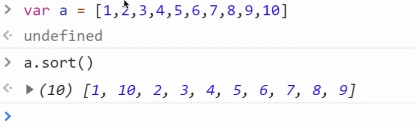
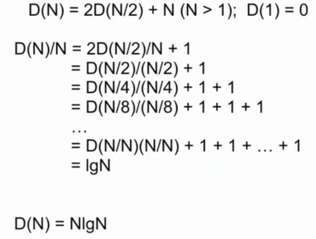

## 排序算法

### 排序在解决什么问题

- 例如, 大学中的学生, 每个人都有自己的个人信息, 成绩等信息

  需要根据某一种信息, 以某种方式(升序/降序)重新排列这组数据

  | 姓名 | 年龄 | 班级 | 评分 |
  | :--: | :--: | :--: | :--: |
  | 张三 |  20  | 一班 |  A   |
  | 李四 |  21  | 三班 |  B   |

- 以升序排列价格

  

- 对字符串进行排序

  

- 对文件夹进行排序

  

### 排序

**问题**: 需求具有相似性, 但是输入的数据格式完全不同. 有没有办法用同一种方式来解决重新排列的问题呢?

**答案**: 排序算法

**问题**: 排序算法如何处理全然不同的数据类型呢?

**答案**: 将比较的过程, 进行抽象. JavaScript 传入回调函数



10 在 1 和 2 之间?


手动传入 compare 回调后, 修复!

通过调用方传入比较方法, 将数据之间的比较与算法解耦, 使得算法能够处理任意的数据格式

### 全序关系

**全序关系**即集合***X***上的反对称的、传递的和<font color="red">完全</font>的二元关系(一般称其为≤).

若***X***满足全序关系, 则下列陈述对于***X***中的所有 a, b 和 c 成立:

- 反对称性: 若 a ≤ b 且 b ≤ a, 则 a = b
- 传递性: 若 a ≤ b 且 b ≤ c, 则 a ≤ c
- 完全性: a ≤ b 或 b ≤ a

满足全序关系的集合叫做**全序集合**、**线性序集合**、**简单序集合**或**链**. **链**还常用来描述偏序集合的全序子集.

全序关系的完全性可以如下这样描述: 集合中的任何一对元素都是**可相互比较**的.

注意完全性条件蕴含了自反性: a ≤ a, 因此全序关系也是(满足"完全性"条件的)偏序关系.

### Compare 回调函数

```js
function compare(a, b) {
    return a - b;
}
```

- 返回值 < 0, a < b
- 返回值 > 0, a > b
- 返回值 = 0, a = b

### Date 与 compare

```js
class Date {
    constructor(year, month, day) {
        this.year = year;
        this.month = month;
        this.day = day;
    }
    
    compareTo(other) {
        if (this.year < other.year) {
            return -1;
        }
        if (this.year > other.year) {
            return 1;
        }
        if (this.month < other.month) {
            return -1;
        }
        if (this.month > other.month) {
            return 1;
        }
        if (this.day < other.day) {
            return -1;
        }
        if (this.day > other.day) {
            return 1;
        }
        return 0;
    }
}
```

### 两个常用函数

`less(a, b)`

当 a < b 时, 返回 true, 否则 false

```js
function less(a, b) {
    return a - b < 0;
}
```

`swap(a, i, j)`

对数组 a, 在 i, j上的值进行交换

```js
function swap(a, i, j) {
    const temp = a[i];
    a[i] = a[j];
    a[j] = temp;
}
```

### 选择排序

#### 基本思想

遍历数组 a, 每次在当前的 index 上, 找到剩余数组中的最小值的索引, 为 min, 进行 swap a[index], a[min]

[https://visualgo.net/zh/sorting](https://visualgo.net/zh/sorting)

**指针右移**

```js
i++
```

**找到右边数组中的最小值**

```js
for (let j = i + 1; j < len; j++) {
    if (less(a[j], a[min])) {
        min = j;
    }
}
swap(a, i, min);
```

**交换**

```js
swap(a, i, min);
```

#### 结论

```js
function selectionSort(a) {
    const len = a.length;
    for (let i = 0; i < len - 1; i++) {
        let min = i;
        for (let j = i + 1; j < len; j++) {
            if (less(a[j], a[min])) {
                min = j;
            }
        }
        swap(a, i, min);
    }
}
```

#### 复杂度分析

选择排序, 一共经历 (N - 1) + (N - 2) + ... + 1 + 0 次 compare 和 N 次 swap.

(N - 1) + (N - 2) + ... + 1 + 0 ~ N<sup>2</sup>/2

O(N<sup>2</sup>)

结论: 时间主要消耗在 compare 上, swap 的用时可以忽略, 并且即使是已经排序完的数组需要花费同样的时间.

### 插入排序

#### 基本思想

遍历数组 a, 在当前的 index 上, 向前比较, 如果顺序不对就进行交换

[https://visualgo.net/zh/sorting](https://visualgo.net/zh/sorting)

**指针右移**

```js
i++
```

**向左边的值查看顺序, 不符合则交换, 直到符合**

```js
for (let j = i; j > 0; j--) {
    if (less(a[j], a[j - 1])) {
        swap(a, j, j - 1);
    } else {
        break;
    }
}
```

#### 结论

```js
function insertionSort(a) {
    const len = a.length;
    for (let i = 0; i < len; i++) {
        for (let j = i; j > 0; j--) {
            if (less(a[j], a[j - 1])) {
                swap(a, j, j - 1);
            } else {
                break;
            }
        }
    }
}
```

#### 复杂度分析

针对**随机**排序, 且**无重复值**的数组, 插入排序平均需要进行 ~ 1/4 N<sup>2</sup> compare 和 ~ 1/4 N<sup>2</sup> swap.

O(N<sup>2</sup>)

**Best Case**

已经排好序的数组, 进行插入排序

需要 N - 1 次 compare 和 0 次 swap

O(N)

**Worst Case**

数组排好序, 且逆序, 没有重复的值

插入排序需要 ~ 1/2 N<sup>2</sup> 次 compare 和 ~ 1/2 N<sup>2</sup> 次 swap

O(N<sup>2</sup>)

### 归并排序

#### 基本思想

将数组分为两部分, 递归地, 对两个数组分别排序, 然后合并两个部分

[https://visualgo.net/zh/sorting](https://visualgo.net/zh/sorting)

**归并**

```js
function _merge(a, aux, low, mid, high) {
    for (let k = low; k <= high; k++) {
        aux[k] = a[k];
    }
    let i = low, j = mid + 1;
    for (let k = low; k <= high; k++) {
        if (i > mid) {
            a[k] = aux[j++];
        } else if (j > high) {
            a[k] = aux[i++];
        } else if (less(aux[j], aux[i])) {
            a[k] = aux[j++];
        } else {
            a[k] = aux[i++];
        }
    }
}
```

#### 结论

```js
function mergeSort(a) {
    /**
     * 分治
     * @param a
     * @param aux
     * @param low
     * @param high
     * @private
     */
    function _sort(a, aux, low, high) {
        if (high <= low) {
            return;
        }
        let mid = low + Math.floor((high - low) / 2);
        _sort(a, aux, low, mid);
        _sort(a, aux, mid + 1, high);
        _merge(a, aux, low, mid, high);
    }

    /**
     * 归并
     * @param a
     * @param aux
     * @param low
     * @param mid
     * @param high
     * @private
     */
    function _merge(a, aux, low, mid, high) {
        for (let k = low; k <= high; k++) {
            aux[k] = a[k];
        }
        let i = low, j = mid + 1;
        for (let k = low; k <= high; k++) {
            if (i > mid) {
                a[k] = aux[j++];
            } else if (j > high) {
                a[k] = aux[i++];
            } else if (less(aux[j], aux[i])) {
                a[k] = aux[j++];
            } else {
                a[k] = aux[i++];
            }
        }
    }

    const aux = a.slice();
    _sort(a, aux, 0, a.length - 1);
}
```

#### 复杂度分析


O(NlgN)



#### 优化

1. 归并排序在当前数组长度较小时, 会分配很多小数组, 此时可以使用插入排序来替代小数组的排序.

   ```js
   const CUTOFF = 7;
   function _sort(a, aux, low, high) {
       if (high <= low) {
           return;
       }
       if (high <= low + CUTOFF -1) {
           return insertionSort(a, low, high);
       }
       let mid = low + (high - low) / 2;
       _sort(a, aux, low, mid);
       _sort(a, aux, mid + 1, high);
       _merge(a, aux, low, mid, high);
   }
   ```

2. 对于已经排序好的数组, 则不需要再进行归并排序.

   排序后, 比较前半数组的最后一个值与后半数组的第一个值.

   ```js
   function _sort(a, aux, low, high) {
       if (high <= low) {
           return;
       }
       let mid = low + (high - low) / 2;
       _sort(a, aux, low, mid);
       _sort(a, aux, mid + 1, high);
       if (!less(a[mid + 1], a[mid])) {
           return;
       }
       _merge(a, aux, low, mid, high);
   }
   ```

### 快速排序

#### 基本思想

基于某个值 a[i], 对数组分区成两个部分

对各自的分区进行整理, a[i] 左边数组的所有值都小于等于 a[i], a[i] 右边数组的所有值都大于等于 a[i]

递归

对整理后的两个数组, 递归调用上述方法

[https://visualgo.net/zh/sorting](https://visualgo.net/zh/sorting)

**分区过程**

重复下列过程, 直到 i 和 j 相交

从左向右找到下一个 i, 此时 a[i] ≥ a[lo]

从右向左找到下一个 j, 此时 a[j] ≤ a[lo]

交换 a[i], a[j]

最终, 交换 a[lo] 和 a[j]


```js
function partition(a, low, high) {
    let i = low;
    let j = high + 1;
    while(true) {
        while(less(a[++i], a[low])) {
            if (i == high) {
                break;
            }
        }
        while(less(a[low], a[--j])) {
            if (j == low) {
                break;
            }
        }
        if (i >= j) {
            break;
        }
        swap(a, i, j);
    }
    swap(a, low, j);
    return j;
}
```

确定 i

确定 j

处理完毕 跳出

交换 a[i] a[j]

交换 a[low] a[j]

#### 结论

```js
function quickSort(a) {
    sort(a, 0, a.length - 1);

    /**
     * 排序
     * @param a
     * @param low
     * @param high
     */
    function sort(a, low, high) {
        if (high <= low) {
            return;
        }
        let j = partition(a, low, high);
        sort(a, low, j - 1);
        sort(a, j + 1, high);
    }

    /**
     * 分区
     * @param a
     * @param low
     * @param high
     * @returns {*}
     */
    function partition(a, low, high) {
        let i = low;
        let j = high + 1;
        while(true) {
            while(less(a[++i], a[low])) {
                if (i == high) {
                    break;
                }
            }
            while(less(a[low], a[--j])) {
                if (j == low) {
                    break;
                }
            }
            if (i >= j) {
                break;
            }
            swap(a, i, j);
        }
        swap(a, low, j);
        return j;
    }
}
```

有一些快速排序的实现, 生成额外的数组, 这样可以更容易实现分区, 不过没有必要.

快速排序不需要申请额外的空间.

#### 复杂度分析

对长度为 N 的数组, 且无重复的 key, 快速排序需要进行 ~2NlgN 的 compare, 和 ~1/3 NlgN 的交换.

**Worst case**

退化成冒泡排序, N + (N - 1) + (N - 2) + ... + 1 ~1/2 N<sup>2</sup>

最差情况从 NlgN -> N<sup>2</sup>

[^解决方案]: 可以对数组在排序进行 shuffle 的操作

#### 优化

1. 在处理长度较小数组的时候, 使用插入排序替代.

   ```js
   const CUTOFF = 10;
   function sort(a, low, high) {
       if (high <= low + CUTOFF - 1) {
           return;
       }
       let j = partition(a, low, high);
       sort(a, low, j - 1);
       sort(a, j + 1, high);
   }
   ```
   
2. 更换选择 pivot 的算法, 最好的情况就是选择到了中位数. 所以解决方案就是要尽量推断出中位数.

   随机选择 3 个值, 取其中位数.

   ```js
   function sort(a, low, high) {
       if (high <= low) {
           return;
       }
       const m = medianOf3(a, low, low + (high - low) / 2, high);
       swap(a, low, m);
       
       let j = partition(a, low, high);
       sort(a, low, j - 1);
       sort(a, j + 1, high);
   }
   ```

#### 稳定度

快速排序是 非稳定排序

什么是稳定性

|  i   |  j   |  0   |  1   |  2   |  3   |
| :--: | :--: | :--: | :--: | :--: | :--: |
|      |      |  B1  |  C1  |  C2  |  A1  |
|  1   |  3   |  B1  |  C1  |  C2  |  A1  |
|  1   |  3   |  B1  |  A1  |  C2  |  C1  |
|  0   |  1   |  A1  |  B1  |  C2  |  C1  |

C1 C2 在排序后顺序转化成了 C2 C1


算法的复杂程度的减少, 远比电脑性能重要.

### 算法总结

| 排序方法 | 平均时间复杂度   | 最坏时间复杂度   | 空间复杂度 | 稳定性 |
| -------- | ---------------- | ---------------- | ---------- | ------ |
| 选择排序 | O(N<sup>2</sup>) | O(N<sup>2</sup>) | O(1)       | 不稳定 |
| 插入排序 | O(N<sup>2</sup>) | O(N<sup>2</sup>) | O(1)       | 稳定   |
| 归并排序 | O(NlgN)          | O(NlgN)          | O(N)       | 稳定   |
| 快速排序 | O(NlgN)          | O(N<sup>2</sup>) | O(1)       | 不稳定 |

