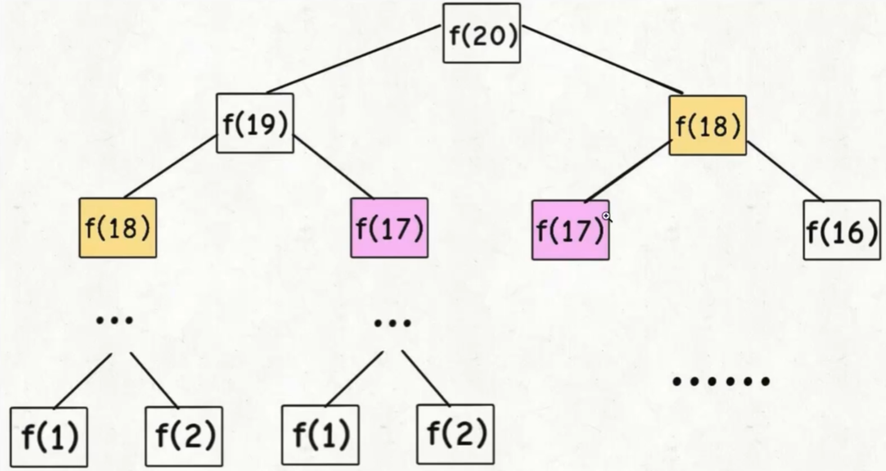
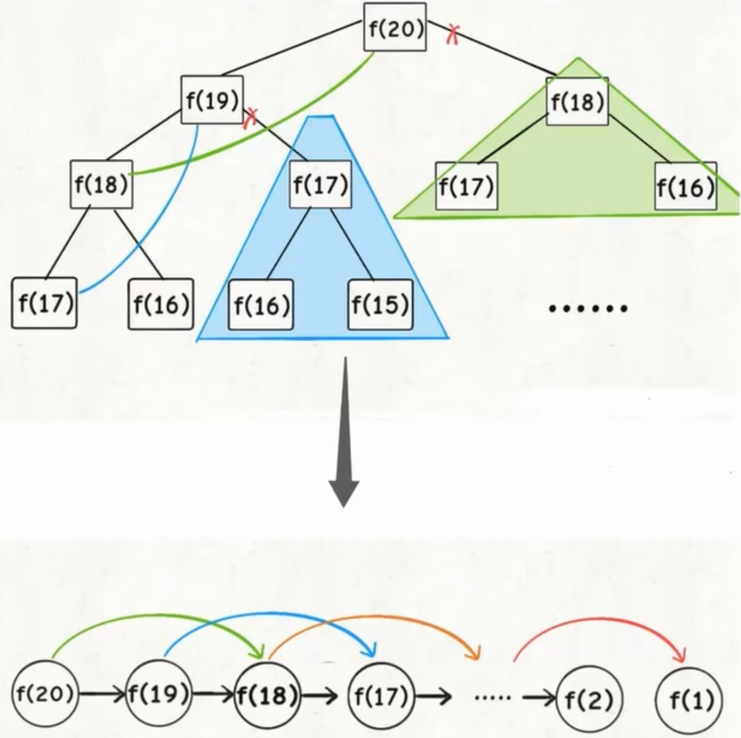

## 复杂算法详解

### 动态规划

Dynamic programing 简称 dp

是一种把原问题分解为相对简单的子问题的算法, 来求解复杂的算法.

#### 动态规划问题的特征

1. 动态规划问题一般都是求最值, 比如求最长公共子序列, 矩阵最小路径和, 最长递增序列, 最小编辑距离等等.
2. 求动态规划问题的基本操作是穷举, 因为要求最值, 所以几乎大部分情况都是要穷举的.
3. 三要素: 重叠子问题, 具备最优子结构, 无后效性.(只有具备这三个特征的问题, 才可以用 dp)
4. 动态规划算法的根本目的是解决冗余, 用空间换时间.
5. 动态规划最难的地方是 找状态转移方程.

**重叠子问题**

> 比如递归算法自顶向下对问题进行求解的时候, 每次产生的子问题并不总是新的问题, 可能某些子问题会被重复计算好多次.
>
> dp 算法是利用了这种子问题的重叠性质, 对每个子问题呢, 值计算一次, 然后将其计算的结果保存在一个表格中.
>
> 当再次遇到这个子问题的时候呢, 我们就可以去表格中直接拿结果, 降低了时间复杂度.

**最优子结构**

> 如果问题结果的最优解, 所包含的子问题的解也是最优的, 并且每个子问题间相互独立, 那么就认为这个问题具备最优子结构.

**无后效性**

> 以前的状态和以前的状态转移方程, 不会影响将来的状态变化, 将来的状态只能由当前状态直接影响.

**状态转移方程**

> 比如高中学过的, 斐波那契数列.
>
> 0 1 1 2 3 5 8 13 21 34
>
> F(n) 是指第几个位置的值.
>
> 递推公式: F(1) = 1, F(2) = 1, F(n) = F(n - 1) + F(n - 2)
>
> n 的状态是由 n - 1 和 n - 2 的状态相加转移过来的.
>
> 当我们知道了 n - 1 阶段的状态和结果时, 我们可以通过某种对应关系来得到下一阶段 n 的状态.

#### 解题思想

1. 明确 base case
2. 明确状态(理解为现在已知的变量)
3. 明确选择(前一阶段如何转换为后一阶段)
4. 定义 dp 数组的含义

```
dp[0][0] = 0;

for 状态1 in 状态1的所有值
	for 状态2 in 状态2的所有值
		dp[状态1][状态2] = 选择的结果
```

#### 重叠子问题举例 - 斐波那契数列

##### 普通递归

```js
function fib(n) {
    if (n === 0) {
        return 0;
    }
    if (n === 1 || n === 2) {
        return 1;
    }
    return fib(n - 1) + fib(n - 2);
}
```

这种写法非常的低效!!! 因为它进行了好多多余的计算.



##### 备忘录

维护一个数组, 记录已经计算出的结果, 我们一般称之为备忘录.

```js
function fib(n) {
    if (n === 0) {
        return 0;
    }
    // n 一般是从 1 开始的, 数组的索引是从 0 开始的, [0, 1 ...]
    let memoArr = new Array(n + 1).fill(0);
    return fibHelper(memoArr, n);
}

function fibHelper(memoArr, n) {
    if (n === 0 || n === 1) {
        return 1;
    }
    if (!memeArr[n]) {
        memoArr[n] = fibHelper(memoArr, n - 1) + fibHelper(memoArr, n - 2);
    }
    return memoArr[n];
}
```



这种解法是自顶向下的查找并计算的, 直到 f(1) 和 f(2).

动态规划, dp 表的解法一般是自底向上的, 也就是从 f(1) 和 f(2) 开始推导, 直到 f(20).

##### dp

```js
function fib(n) {
    if (n === 0) {
        return 0;
    }
    let dp = new Array(n + 1).fill(0);
    dp[1] = 1;
    dp[2] = 1;
    for (let i = 3; i <= n; i++) {
        dp[i] = dp[i - 1] + dp[i - 2];
    }
    return dp[n];
}
```


##### 状态压缩

```js
function fib(n) {
    if (n === 0) {
        return 0;
    }
    if (n === 1 || n === 2) {
        return 1;
    }
    let prev = 1;
    let current = 1;
    for (let i = 3; i <= n; i++) {
        const temp = prev + current;
        prev = current;
        current = temp;
    }
    return current;
}
```

#### 解题思路举例 - 零钱兑换问题

给定不同面额的硬币 coins, 和一个总金额 amount, 编写一个函数计算可以凑成总金额所需的最少硬币个数, 如果没有任何一种硬币组合能组成总金额, 返回 -1, 硬币数量无限.

1. coins = [1, 2, 5], amount = 11

   结果应该输出 3(11 = 5 + 5 +1)

2. coins = [2], amount = 3

   结果应该输出 -1

这是一个动态规划的问题, 因为它具备最优子结构.

比如想求 amount = 11 时的最少硬币数, 此时只需要知道 amount = 10 的最少硬币数.

1. 确定 base case

   dp[0] = 0; // dp[n] 代表凑出总金额为 n 所需要的硬币数

2. 确定状态

   状态就是原问题和子问题中会变化的量, 在此题中就是目标金额

   coins, 硬币数量无限

   唯一能变化的就是目标金额, 不断地向 base case 靠近

3. 确定选择

   选择是什么? 就是导致状态(目标金额)产生变化的行为

   amount = 10

   1 -> 9

   2 -> 8

   5 -> 5

4. 明确 dp 数组的定义

   一般呢 dp 数组的索引就是上面所提到的状态, dp 数组的每个值就是我们需要计算的数据
   
   dp[i] 的定义: 当目标金额为 i 的时候, 至少需要 dp[i] 个硬币凑出

```js
function coinChange(coins, amount) {
    // 因为索引存在 0, 所以我们声明了 amount + 1 长度的数组
    // 如果我们要凑出 amount 金额, 我们最多所需要的硬币数量是 amount
    let dp = new Array(amount + 1).fill(amount + 1); // amount + 1 作为一个无效的值
    dp[0] = 0;
    for (let i = 0; i < dp.length; i++) {
        for (let coin of coins) {
            if (i - coin < 0) {
                continue;
            }
            // 比如输入的是 [1, 2, 5], amount = 11
            // 选择 1, dp[11] = 1 个面额为 1 的硬币 + 剩余需要凑出 dp[11 - 1] 面额的最优解
            dp[i] = Math.min(dp[i], dp[i - coin] + 1);
        }
    }
    return dp[amount] === amount + 1 ? -1 : dp[amount];
}
```

#### 实战 - 最长公共子序列

给定两个字符串 text1 和 text2, 返回这两个字符串的最长公共子序列的长度.

一个字符串的子序列是指这样一个新的字符串: 它是由原字符串在不改变字符的相对顺序的情况下删除某些字符(也可以不删除任何字符)后组成的新字符串.

例如, "ace" 是 "abcde" 的子序列, 但 "aec" 不是 "abcde" 的子序列. 两个字符串的「公共子序列」是这两个字符串所共同拥有的子序列.

若这两个字符串没有公共子序列, 则返回 0.

**示例1**

> 输入: text1 = "abcde", text2 = "ace"
>
> 输出: 3
>
> 解释: 最长公共子序列是 "ace", 它的长度为 3

**示例2**

> 输入: text1 = "abc", text2 = "abc"
>
> 输出: 3
>
> 解释: 最长公共子序列是 "abc", 它的长度为 3

**示例3**

> 输入: text1 = "abc", text2 = "def"
>
> 输出: 0
>
> 解释: 两个字符串没有公共子序列, 返回 0

##### 开始

凑零钱是一维数组的动态规划

最长公共子序列, LCS, 典型的二维动态规划

##### 思路

1. 明确 dp 数组的含义

   对于两个字符串 s1 和 s2, 我们一般会构造这样一个二维的 dp 表

   

   `dp[i][j]` 的含义是, 对于 s1[1...i] 和 s2[1...j], 它们的 LCS 长度为 `dp[i][j]`.
   
2. 定义 base case

   咱们表里用了索引为 0 的行和列表示空字符串, 也就是说 `dp[0][j]` 和 `dp[i][0]` 都应该是 base case.

   比如 `dp[0][3] = 0` 的含义是 ""和"bab"的 LCS 长度为 0.

3. 确定状态转移方程

   对于 s1 和 s2 中的每个字符, 我们都有什么选择? 要么在 LCS 中, 要么不在

##### 解题

如果某个字符存在于 LCS 中, 那么这个字符一定同时存在于 s1 和 s2

s1[i] === s2[j], 这个字符一定存在于 LCS, 此时 LCS 的长度 + 1, `dp[i][j] = dp[i - 1][j - 1] + 1`

s1[i] !== s2[j], 说明这两个字符里至少有一个不存在于 LCS 中, 我们需要从两个之中选择一个最大的. `Math.max(dp[i][j - 1], dp[i - 1][j])`

##### 总结

```js
/**
 *
 * @param {string} text1
 * @param {string} text2
 * @return {number}
 */
function longestCommonSubsequence(text1, text2) {
    let n = text1.length;
    let m = text2.length;

    let dp = Array.from(new Array(n + 1), () => new Array(m + 1).fill(0));

    for (let i = 1; i <= n; i++) {
        for (let j = 1; j <= m; j++) {
            if (text1[i - 1] === text2[j - 1]) {
                dp[i][j] = dp[i - 1][j - 1] + 1;
            } else {
                dp[i][j] = Math.max(dp[i - 1][j], dp[i][j - 1]);
            }
        }
    }
    return dp[n][m];
}
```

#### 实战 - 最长回文子序列

我们对 dp 数组定义完后, 确定 base case 处于中间的对角线

`dp[i][j]` 需要从 `dp[i + 1][j]`, `dp[i][j - 1]`, `dp[i + 1][j + 1]` 转移而来.

我们最终要求的答案是 `dp[0][n - 1]`

这里看图一, 更清楚的弄明白题.

然后我们发现现在应该有两种正确的遍历方式, 这里再看图 2.

要么从左到右斜着遍历, 要么从下向上从左到右遍历, 这样才能保证每一步状态转移的过程中, `dp[i][j]` 的左边 下边 左下边都是经过计算过的.

```js
// 给定一个字符串 s, 找到其中最长的回文子序列, 并返回该序列的长度. 可以假设 s 的最大长度为 1000.

// 示例 1:
// 输入:

// "bbbab"
// 输出:

// 4
// One possible longest palindromic subsequence is "bbbb".

// 示例 2:
// 输入:
// "cbbd"
// 输出:

// 2
// One possible longest palindromic subsequence is "bb".

// 链接：https://leetcode-cn.com/problems/longest-palindromic-subsequence

/**
 * @param {string} s
 * @param s
 */
function longestPalindromeSubseq(s) {
    let length = s.length;
    
    // dp[i][j] 表示的是从 s[i] 到 s[j] 之间的最长回文子序列的长度
    let dp = Array.from(new Array(length), () => new Array(length).fill(0));
    for (let i = length - 1; i >= 0; i--) {
        // 每一个字符都是一个回文字符串, 因此对于 dp[i][i] 设置为 1
        dp[i][i] = 1;
        for (let j = i + 1; j <= length; j++) {
            // 状态转移方程为:
            // 当 s[i] 等于 s[j] 时, dp[i][j] = dp[i + 1][j - 1] + 2
            // 当 s[i] 不等于 s[j] 时, dp[i][j] = max(dp[i - 1][j], dp[i][j + 1])
            if (s[i] === s[j]) {
                dp[i][j] = dp[i + 1][j - 1] + 2;
            } else {
                dp[i][j] = Math.max(dp[i + 1][j], dp[i][j - 1]);
            }
        }
    }
    return dp[0][length - 1];
}
```

#### 实战 - 编辑距离

我们对 dp 数组定义完后, 确定 base case 是 `dp[x][0]` 和 `dp[0][y]`, 最终答案是 `dp[x][y]`;

我们通过状态转移方程知道 `dp[x][y]` 需要从 `dp[x - 1][y]` 和 `dp[x][y - 1]` 转移而来.

那么根据上面两条特点, 我们很容易想到应该使用正向遍历

因为只有这样, 在每一步状态转移的过程中, 才能保证左边 上边 左上边的状态都是经过计算过的.

#### 动态规划重点概念详解

##### 最优子结构到底是什么?

"最优子结构"使某些问题的一种特定的性质, 而不只是动态规划特有的.

1. 举例 最优子结构

   比如学校有 10 个班, 现在已知每个班的最高成绩, 要求计算出全校的最高成绩.

   是不是很简单, 直接在 10 个班的最高成绩中比较, 得出最大的即可.

   这个问题就具有最优子结构, 每个班的最高成绩就是子问题, 子问题最优可以保证全局问题最优(但是这个问题不具有重叠子问题的特性, 所以没有必要用动态规划, 简单的比较一下就可以了)

2. 举例 最优子结构 二叉树

   求一棵二叉树的最大值

   ```js
   function maxVal(root) {
       if (root === null) {
           return -1;
       }
       const leftMax = maxVal(root.left);
       const rightMax = maxVal(root.right);
       return Math.max(root.val, leftMax, rightMax);
   }
   ```

   这个问题也是符合最优子结构的, 问题的答案可以通过子树的最大值推导出来

3. 总结

   - 最优子结构并不是动态规划独有的, 能求最值的问题大部分都具有这个性质
   - 但是最优子结构使动态规划问题的必要条件

##### 为什么动态规划遍历 dp 数组的方式五花八门, 有的正向遍历, 有的倒着遍历, 有的斜着遍历

同学们或许对 dp 数组的遍历顺序摸不着头脑

- 正向遍历

  ```js
  let dp = new Array(m).fill(new Array(n)); // m 行 n 列
  for (let i = 0; i < m; i++) {
      for (let j = 0; j < n; j++) {
          // 计算具体的 dp[i][j]
      }
  }
  ```

- 反向遍历

  ```js
  for (let i = m - 1; i >= 0; i--) {
      for (let j = n - 1; j >= 0; j--) {
          // 计算具体的 dp[i][j]
      }
  }
  ```

- 斜着遍历

  ```js
  for (let l = 2; l <= n; l++) {
      for (let i = 0; i <= n - l; i++) {
          let j = l + i - 1;
          // 计算具体的 dp[i][j]
      }
  }
  ```

###### 原则

如果你仔细观察的话, 会发现两个重点, 也可以说是原则

1. 遍历过程中, 所需的状态必须是已经计算出来的
2. 遍历的终点必须是存储结果的位置

#### 总结一波

### 贪心算法

可以理解为是动态规划的一个特例, 贪心还需要满足一个特征"贪心选择性质"

- 贪心选择性质: 每一步做出的一个局部最优的选择, 最终的结果就是全局最优

> 斗地主 对手出了个 3
>
> 手上 3 4 5 6 7 8 9 2

#### 区间调度问题

有很多[start, end] 的闭区间, 请设计一个算法, 算出这些区间中, 最多有几个互不相交的区间!

[8, 12] [9, 11] [13, 14]

#### 贪心求解

1. 我们是否可以每次都选择区间中开始最早的那个?

   [0, 18] [1, 2] [2, 3] [3, 4]

2. 我们是否可以都选择持续时间最短的?

   [3, 6] [1, 3] [2, 4]

##### 正确思路

1. 从可选的区间里, 选择一个结束 end 最小的区间 x
2. 把所有和 x 相交的区间从 sum 中删除掉
3. 重复 1 和 2 的循环, 之前选出的各种区间 x 就是我们所求的结果


```js
/**
 * 有许多[start, end]的闭区间, 请设计一个算法, 算出这些区间中, 最多有几个互不相交的区间.
 * 比如 intvs = [[1, 3], [2, 4], [3, 6]]
 * 这些区间最多有两个区间互不相交, 即 [1, 3] 和 [3, 6], intervalSchedule 函数此时应该返回 2.
 * @param {Array<Array<number>>} intvs
 * @return {number}
 */
function intervalSchedule(intvs) {
    if (intvs.length === 0) {
        return 0;
    }
    intvs.sort((a, b) => a[1] - b[1]); // 根据 end 升序排序
    let xEnd = intvs[0][1];
    let count = 1; // 互不相交的区间
    for (const item of intvs) {
        if (item[0] >= xEnd) {
            count++;
            xEnd = item[1];
        }
    }
    return count;
}
```

#### 区间调度算法的应用

1. 无重叠区间

   给定一个区间的集合, 找到需要移除区间的最小数量, 使剩余区间互不重叠?

   [1, 2] [2, 3] 不算做重叠

   比如 输入 [[1, 2], [2, 3], [3, 4], [1, 3]]

   输出 1

   因为移除 [1, 3] 后, 剩下的区间互不重叠

   ```js
   function noOverlapInterval(intvs) {
       if (intvs.length === 0) {
           return 0;
       }
       intvs.sort((a, b) => a[1] - b[1]); // 根据 end 升序排序
       let xEnd = intvs[0][1];
       let count = 1; // 互不相交的区间
       for (const item of intvs) {
           if (item[0] >= xEnd) {
               count++;
               xEnd = item[1];
           }
       }
       return intvs.length - count;
   }
   ```

2. 用最少的箭头射爆气球

   在二维空间中有好多气球, 气球的直径

   [[10, 16], [2, 8], [1, 6], [7, 12]]

   这个题的最终思想就是找出有几个互不相交的区间
