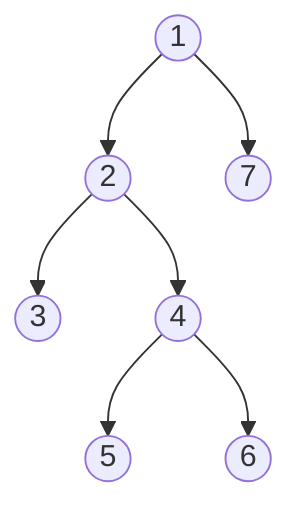
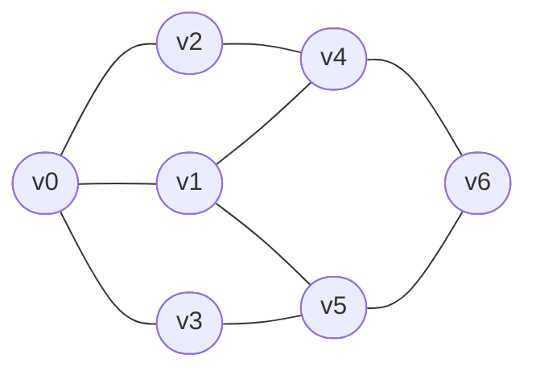

## 树/图类算法

树和图也是一种代码中的数据结构, 用来描述一些特定场景下的特定逻辑, 其中树的使用更为广泛, 树的经典算法也更为多样, 面试中经常会考察对于树形数据结构的算法.

### 树形数据结构

#### 树的定义

- 根(root): 树中的一个特定元素称为根
- 子树(subtree): 除了根之外, 树中的其他元素都称为该树根的子树
- 结点(node): 树中的元素
- 双亲(parent): 一个结点有子树, 子树的根为该节点的孩子
- 度(degree): 结点拥有的子树的个数
- 叶子(leaf): 度为 0 的结点
- 层次(level): 根结点的层次为 1, 其余结点的层次等于结点双亲的层次 + 1

#### 二叉树和森林

二叉树是每个结点最多有两个子树的树结构, 通常子树被称作"左子树"和"右子树".

一棵深度为 k, 且有 2<sup>k</sup> - 1 个结点的二叉树, 称为满二叉树. 这种树的特点是每一层上的结点数都是最大结点数. 而在一棵二叉树中, 除最后一层外, 若其余层都是满的, 并且或者最后一层是满的, 或者是在右边缺少连续若干结点, 则此二叉树被称为完全二叉树, 具有 n 个结点的完全二叉树的深度为 floor(log<sub>2</sub>n + 1). 深度为 k 的完全二叉树, 至少有 2<sup>k - 1</sup> 个叶子结点, 至多有 2<sup>k</sup> - 1 个结点.

#### 二叉树的性质

- 在二叉树的第 i 层上至多有 2<sup>i - 1</sup> 个结点(i >= 1)
- 深度为 k 的二叉树最多有 2<sup>k</sup> - 1 个结点(i >=1)
- 一棵二叉树的叶子结点数为 n<sub>0</sub>, 度为 2 的结点数为 n<sub>2</sub>, 则 n<sub>0</sub> = n<sub>2</sub> + 1
- 具有 n 个结点的完全二叉树的深度为 Math.floor(log<sub>2</sub>n) + 1
- 如果对一棵有 n 个结点的完全二叉树(其深度为 floor(log<sub>2</sub>n) + 1)的结点按层序编号, 则对任一结点 i(1 ≤ i ≤ n)有:
  - 如果 i = 1, 则结点 i 是二叉树的根, 无双亲; 如果 i ≥ 1, 则其双亲 parent(i) 是结点 floor(i / 2)
  - 如果 2i > n, 则结点 i 没有左子树, 否则其左孩子 lchild(i) 是结点 2i
  - 如果 2i + 1 > n, 则结点 i 无右孩子, 否则其右孩子 rchild(i) 是结点 2i + 1

#### 二叉树的常见算法

在 js 中, 我们可以通过这种结构定义一个数结点:

```js
function TreeNode(val) {
    this.val = val;
    this.left = this.right = null;
}
```



前序值: 1、2、3、4、5、6、7

中序值: 3、2、5、4、6、1、7

后序值: 3、5、6、4、2、7、1

#### 深度优先遍历 DFS

在深度遍历中, 每个结点都需要遍历三次, 那么我们可以在不同的阶段, 执行不同的操作, 根据我们处理结点位置的不同, 我们分为前序、中序、后序遍历.

##### 前序遍历

在 DFS 第一次遇到结点时进行处理.

```js
var preorderTraversal = (node, result = []) => {
    if (node) {
        // 先根结点
        result.push(node.val);
        // 然后遍历左子树
        preorderTraversal(node.left, result);
        // 然后遍历右子树
        preorderTraversal(node.right, result);
    }
    return result;
};
```

##### 中序遍历

在 DFS 第二次遇到结点时进行处理.

```js
var inorderTraversal = (node, result = []) => {
    if (node) {
        // 遍历左子树
        inorderTraversal(node.left, result);
        // 根结点
        result.push(node.val);
        // 再遍历右子树
        inorderTraversal(node.right, result);
    }
    return result;
};
```

##### 后序遍历

在 DFS 第三次遇到结点时进行处理.

```js
var postorderTraversal = (node, result = []) => {
    if (node) {
        // 遍历左子树
        postorderTraversal(node.left, result);
        // 遍历右子树
        postorderTraversal(node.right, result);
        // 根结点
        result.push(node.val);
    }
    return result;
};
```

#### 广度优先遍历 BFS

广度优先就简单一些, 水平进行树的遍历, 每一层横向处理, 最终遍历到结尾. 图中的二叉树, 处理的结果即为 1、2、7、3、4、5、6

```js
var levelOrder = function (root) {
    const ret = [];
    if (!root) return ret;
    
    const q = [];
    q.push(root);
    while (q.length != 0) {
        const currentLevelSize = q.length;
        ret.push([]);
        for (let i = 1; i <= currentLevelSize; ++i) {
            const node = q.shift();
            ret[ret.length - 1].push(node.val);
            if (node.left) q.push(node.left);
            if (node.right) q.push(node.right);
        }
    }
    return ret;
}
```

#### 计算树的高度

```js
var maxDepth = function (root) {
    if (!root) return 0;
    if (!root.left && !root.right) return 1;
    return Math.max(maxDepth(root.left), maxDepth(root.right)) + 1;
}
```

#### 左子叶之和

```js
var sumOfLeftLeaves = function (root) {
    var val = 0;
    if (!root) return 0;
    if (root.left && !root.left.left && !root.left.right) {
        val = root.left.val;
    }
    return val + sumOfLeftLeaves(root.left) + sumOfLeftLeaves(root.right);
}
```

#### 反转二叉树

```js
var inverTree = function (root) {
    if (!root || (!root.left && !root.right)) return root;
    root.left = inverTree(root.left);
    root.right = inverTree(root.right);
    return exchangeChildNode(root);
}

var exchangeChildTree = function (node) {
    var temp = new TreeNode();
    temp = node.left;
    node.left = node.right;
    node.right = temp;
    return node;
}
```

### 图类型数据结构

#### 图的定义

#### 图的遍历算法 DFS 与 BFS

BFS 和 DFS 算法解析图的遍历的定义: 从图的某个顶点触发访问遍图中的所有的顶点, 且每个顶点仅被访问一次.

#### BFS

广度优先搜索类似于树的层次遍历过程, 它需要借助一个队列来实现, 要想遍历从 v0 到 v6 的每一个顶点, 我们可以设 v0 为第一层, v1、v2、v3 为第二层, v4、v5 为第三层, v6 为第四层, 再逐个遍历每一层的每个顶点.

具体步骤



- 准备工作: 创建一个 visited 数组, 用来记录已被访问过的顶点; 创建一个队列, 用来存放每一层的顶点; 初始化图 G

- 从图中的 v0 开始访问, 将对应的 visited[v0] 数组的值设置为 true, 同时将 v0 入队列

- 只要队列不空, 则重复如下操作
  - 队头顶点 u 出队
  
  - 依次检查 u 的所有邻接顶点 w, 若 visited[w] 的值为 false, 则访问 w, 并将 visited[w] 置为 true, 同时将 w 入队
  
    ```mermaid
    graph LR
    0(v0) -- visited --- 2(v2) --- 4([v4]) --- 6([v6])
    0 -- visited --- 1(v1) --- 4
    0 -- visited --- 3(v3) --- 5([v5]) --- 6
    1 --- 5
    ```
    
  - v0 的全部邻接点均被访问完毕, 将队头元素 v2 出队, 开始访问 v2 的所有邻接点. 开始访问 v2 邻接点 v0, 判断 visited[0], 因为其值为 1, 不进行访问. 继续访问 v2 邻接点 v4, 因为其值为 0, 访问 v4.
  
    ```mermaid
    graph LR
    0(v0) -- visited --- 2(v2) -- visited --- 4(v4) --- 6([v6])
    0 -- visited --- 1(v1) --- 4
    0 -- visited --- 3(v3) --- 5([v5]) --- 6
    1 --- 5
    ```
  
  - v2 的全部邻接点均被访问完毕. 将队头元素 v1 出队, 开始访问 v1 的所有邻接点. 开始访问 v1 邻接点 v0, 因为 visited[0] 值为 1, 访问 v4, 因为 visited[4] 值为 1, 访问 v5.
  
    ```mermaid
    graph LR
    0(v0) -- visited --- 2(v2) -- visited --- 4(v4) -- visited --- 6(v6)
    0 -- visited --- 1(v1) -- visited --- 4
    0 -- visited --- 3(v3) -- visited --- 5(v5) -- visited --- 6
    1 -- visited --- 5
    ```

#### DFS

DFS 遍历类似于树的先序遍历, 是树的先序遍历的推广.

具体步骤: 准备工作: 创建一个 visited 数组, 用于记录所有被访问过的顶点.

1. 从图中 v0 出发, 访问 v0.
2. 找出 v0 的第一个未被访问的邻接点, 访问该顶点, 以该顶点为新顶点, 重复此步骤, 直至刚访问过的顶点没有未被访问的邻接点为止.
3. 返回前一个访问过的仍有未被访问邻接的顶点, 继续访问该顶点的下一个未被访问的邻接点.

### 实战

Vue.js + Iview UI + Egg 搭建一个企业级管理后台

#### 环境准备

- node 环境的准备, 如何用 nvm 管理 node 版本, 如何用 nrm 管理 npm 源
- vue-cli 3 的使用, 如何初始化项目
- 如何集成 UI 框架 Iview
- egg 框架如何初始化
- nginx 服务的搭建
- MongoDB 的搭建

#### 开发

- 后端如何配置跨域环境
- ES6 decorator 装饰路由, 简便路由的设置
- egg 的中间件的使用
- 后台是如何设计权限模块
- JWT 的验证

#### 运维

- 如何用 Jenkins 搭建 CI、CD
- 如何购买阿里云 ECS, 如何选择它的配置, 如何配置阿里云的安全组
- egg 如何进行线上性能监控
