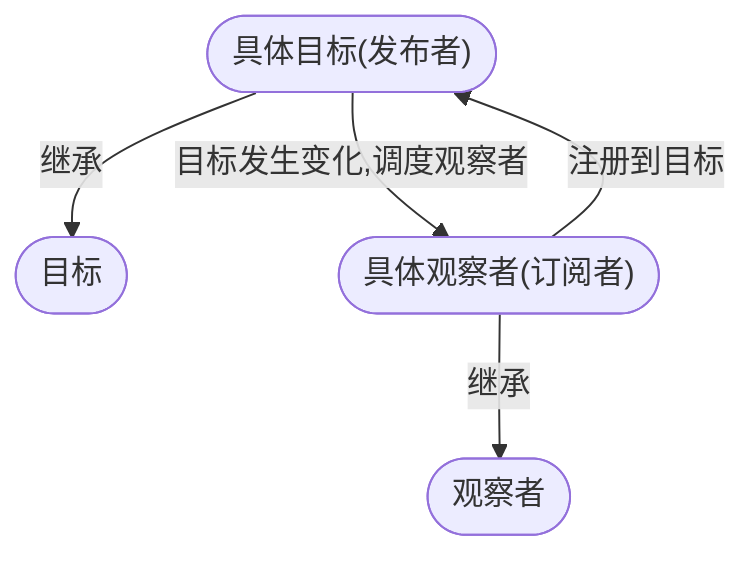
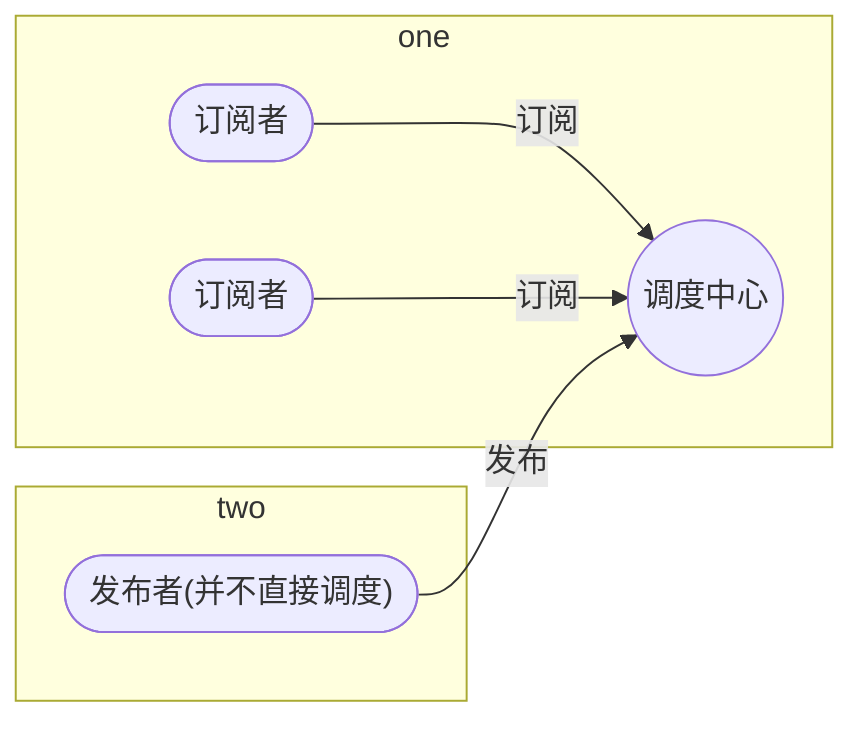

## 设计模式实战

### 单例模式

开发中常遇到的单例模式

#### 模块中的单例模式

```js
import reducer from "./reducer";
import {configureStore} from "redux;

const store = configureStore({reducer});

export {store}

// app-a.js
import {store} from "./store";
// app-b.js
import {store} from "./store";
```

上述代码是 react 中使用 redux 时常用的代码, 其中 a、b.js 中的 store 是同一个实例. 原因是在模块加载的时候 store 就已经生成了.

#### 类的单例模式

```js
class Eager {
    static instance = new Eager("eager");
	
	constructor(name) {
        console.log("Eager constructor", name);
        this.name = name;
    }
}

module.exports = {Eager};
```

上述代码是单例模式中的饿汉单例模式的实现, 顾名思义是模块引入时单例就已经实例化完成了.

```js
class Lazy {
    static instance = null;

	static getInstance() {
        if (!Lazy.instance) {
            Lazy.instance = new Lazy("lazy");
        }
        return Lazy.instance;
    }

	constructor(name) {
        console.log("lazy constructor", name);
        this.name = name;
    }
}

module.exports = {Lazy};
```

以上是单例模式的懒汉模式的实现, 其中 Lazy 类的单例并不会在模块引入时自动初始化. 需要用户手动调用 getInstance 来初始化单例, 并且多次调用 getInstance 返回的都是同一个实例.

```js
class LodashLoader {
    static instance = null;
	
	static getInstance() {
        if (!LodashLoader.instance) {
            LodashLoader.instance = new LodashLoader();
        }
        return LodashLoader.instance;
    }

	constructor() {
        loadScript("https://cdn.jsdelivr.net/npm/lodash@4.17.15/lodash.min.js");
    }
}

function loadScript(url) {
    const $script = document.createElement("script");
    $script.src = url;
    $script.onload = () => {
        console.log("loaded", url);
    };
    
    document.body.appendChild($script);
}
window.LodashLoader = LodashLoader;
```

以上是开发中对于 lodash 使用单例模式加载的示例.

### 发布订阅模式、观察者模式

观察者模式中, 目标和观察者是基类, 目标提供维护观察者的一系列方法, 观察者提供更新接口. 具体观察者和具体目标继承各自的基类, 然后具体观察者把自己注册到具体目标里, 在具体目标发生变化时候, 调度观察者的更新方法.



发布订阅模式中, 订阅者把自己像订阅的事件注册到调度中心, 当该事件触发时候, 发布者发布该事件到调度中心(顺带上下文), 由调度中心统一调度订阅者注册到调度中心的处理代码.



#### 实现一个基于观察者模式的 EventEmitter

```js
class EventEmitter {
    constructor() {
        this._event = {};
    }

    on(name, callback) {
        if (!this._event[name]) {
            this._event[name] = [];
        }
        this._event[name].push(callback);
    }

    emit(name, ...args) {
        if (!this._event[name]) {
            return;
        }
        for (const fn of this._event[name]) {
            fn.apply(null, args);
        }
    }

    off(name, callback) {
        if (!this._event[name]) {
            return;
        }
        const index = this._event[name].indexOf(callback);
        if (index >= 0) {
            this._event[name].splice(index, 1);
        }
    }
}
```

如何使用 EventEmitter 类呢?

- on 为指定事件注册一个监听器, 接收一个字符串 event 和一个回调函数.
- emit 按监听器的顺序执行每个监听器
- off 移除指定事件的某个监听回调

```js
const { EventEmitter } = require("./events");
const eventEmitter = new EventEmitter();

eventEmitter.on("data", (value) => {
    console.log("on data", value);
});

const callback = () => {
    console.log("cb");
};

eventEmitter.on("data", cb);
eventEmitter.emit("data", "hello");
eventEmitter.off("data", cb);
eventEmitter.emit("data", "hey");
```

#### 发布订阅模式的基本实现

```js
class Observable {
    constructor(subscriber) {
        this._subscriber = subscriber;
    }

    subscribe(observer) {
        if (typeof observer !== "object" || observer === null) {
            observer = {
                next: observer
            };
        }

        return new Subscription(observer, this._subscriber);
    }
}

class Subscription {
    constructor(observer, subscriber) {
        this._observer = observer;
        const subscriptionObserver = new SubscriptionObserver();
        subscriber.call(null, subscriptionObserver);
    }
}

class SubscriptionObserver {
    constructor(subscription) {
        this._subscription = subscription;
    }

    next(value) {
        notify(this._subscription, "next", value);
    }
}

function notify(subscription, type, ...args) {
    if (subscription._observer[type]) {
        subscription._observer[type].apply(null, args);
    }
}
```

#### vue 中的发布订阅模式

```html
<!DOCTYPE html>
<html lang="en">

<head>
    <meta charset="UTF-8">
    <meta http-equiv="X-UA-Compatible" content="IE=edge">
    <meta name="viewport" content="width=device-width, initial-scale=1.0">
    <title>MVVM</title>
</head>

<body>
    <div id="app">
        <input type="text" v-model="name" />
        <div style="margin: 20px 0 20px 0;" v-html="name"></div>
        <button v-html="name" @click="changeit"></button>
    </div>
</body>

</html>
<script>
    /*
    每一个指令, 解析出来都是一个对象, 拥有很多属性和方法
    {
        allVal: {}. // 根实例的 $data
        key: "", // 对应的属性名
        directive: [],
        node: {}, // dom 结点
        update: () => {}, // 更新的方法
    }
    */
    class Dep {
        constructor() {
            this.listeners = [];
        }

        add(obj) {
            this.listeners.push(obj);
        }

        notify() {
            this.listeners.forEach(item => item.update());
        }
    }

    class Watcher {
        constructor(options) {
            this.update = options.update;

            Dep.target = this;
            // 因为数据劫持过, 所以读取它, 就会触发它的 getter
            this.val = options.allVal[options.key];
            Dep.target = null;
        }
    }

    class Vue {
        constructor(options) {
            this.$options = options;
            this.$data = options.data();
            this.observeRoot();
            this.observeData(this.$data);
            this.createFragment();
            this.complie();
        }

        observeRoot() {
            Object.keys(this.$data).forEach(item => {
                // let _val = this[item];
                Object.defineProperty(this, item, {
                    enumerable: true,
                    configurable: false,
                    get() {
                        return this.$data[item];
                    },
                    set(newVal) {
                        this.$data[item] && (this.$data[item] = newVal);
                    }
                });
            });
        }

        observeData(obj) {
            if (!obj || typeof obj !== "object") {
                return;
            }
            Object.keys(obj).forEach(item => {
                let val = obj[item];
                if (typeof val === "object") {
                    this.observeData(item);
                } else {
                    let dep = new Dep();
                    Object.defineProperty(obj, item, {
                        enumerable: true,
                        configurable: false,
                        get() {
                            Dep.target && dep.add(Dep.target);
                            return val;
                        },
                        set(newVal) {
                            val = newVal;
                            dep.notify();
                        }
                    });
                }
            });
        }

        createFragment() {
            this.$el = document.querySelector(this.$options.el);
            this.$fragment = document.createDocumentFragment();

            while (this.$el.firstChild) {
                this.$fragment.appendChild(this.$el.firstChild);
            }
        }

        complie() {
            this._compileElement(this.$fragment);
            this.$el.appendChild(this.$fragment);
        }

        _compileElement(ele) {
            Array.from(ele.childNodes).forEach(item => {
                this._compileNode(item);
                if (item.childNodes) {
                    this._compileElement(item);
                }
            });
        }

        _compileNode(node) {
            // 编译结点, 获取指令信息
            let res = this._checkHasBind(node);
            // 分析处理指令
            this._resolveBind(node, res);
        }

        _checkHasBind(node) {
            let attributes = node.attributes;
            let dir_reg = /^v\-\w*$/;
            let event_reg = /^\@\w*$/;
            let content_reg = /\{\{[\s\S]*\}\}/;
            let result = {
                directives: [],
                events: [],
                content: ""
            };
            if (attributes) {
                Array.from(attributes).forEach(item => {
                    // 解析指令
                    if (dir_reg.test(item.name)) {
                        result.directives.push({
                            name: item.name,
                            value: item.value
                        });
                    }
                    // 解析事件
                    if (event_reg.test(item.name)) {
                        result.events.push({
                            name: item.name,
                            value: item.value
                        });
                    }
                });
            }
            return result;
        }

        _resolveBind(node, res) {
            let _this = this;
            let data = this.$data;
            let {directives, events} = res;

            // 处理所有指令和事件
            if (directives.length) {
                directives.forEach(item => {
                    let update = function () {
                        switch (item.name) {
                            case "v-model": {
                                node.oninput = (val) => {
                                    _this[item.value] = node.value;
                                };
                                node.value = data[item.value];
                                break;
                            }
                            case "v-html": {
                                node.innerHTML = data[item.value];
                                break;
                            }
                            default:
                                break;
                        }
                    };

                    let watch_options = {
                        allVal: this.$data,
                        key: item.value,
                        directive: item.name,
                        node: node,
                        update
                    };
                    new Watcher(watch_options);
                    update();
                });
            }

            if (events.length) {
                events.forEach(item => {
                    let method_name = item.value;
                    let target_event = item.name.slice(1, item.name.length);
                    node.addEventListener(target_event, () => {
                        this.$options.methods[method_name].call(this);
                    });
                });
            }
        }
    }
</script>
<script>
    let app = new Vue({
        el: "#app",
        data() {
            return {
                name: "xiaoming"
            };
        },
        methods: {
            changeit() {
                this.name = Math.random();
            }
        }
    });
</script>
```

### 代理模式

- 职责清晰, 真实的角色就是实现实际的业务逻辑, 不用关心其它非本职责的事务, 通过后期的代理完成一件事务, 附带的结果就是编程简洁清晰.
- 代理对象可以在客户端和目标对象之间起到中介的作用, 这样起到了中介的作用和保护了目标对象的作用.
- 高扩展性

#### 代理模式的基本实现

```js
const { Question } = require("./request");

let totalCount = 0;
const question = new Question();

const proxyQuestion = new Proxy(question, {
    get: function (target, key, receiver) {
        console.log("fetching...", totalCount);
        return Reflect.get(target, key, receiver);
    }
});

main();

async function main() {
    await proxyQuestion.all();
    await proxyQuestion.all();
    await proxyQuestion.all();
    console.log("totalCount", totalCount);
}
// 通过代理模式, 我们将代码很好的解耦. 有着很高的扩展性, 此处通过封装了一层 proxyQuestion, 在不改动 Question 模块的前提下新增了很多功能.
```

### 装饰器

通过装饰器可以在不修改类的前提下为类新增功能, 并且可以在装饰其中做很多其它操作.

以下是一个类似于装饰器思想的函数.

```js
const decorator = (obj) => {
    obj.send = function (method, ...args) {
        if (!this[method]) {
            return this.methodMissing.apply(this, [method, ...args]);
        }
    };
    obj.methodMissing = obj.methodMissing || function (...args) {
        console.log(...args);
    };
    return obj;
}

module.exports = { decorator };
```

#### ES6 中 decorator 的应用

```ts
import { Context } from "koa";
import * as assert from "assert";
import * as Router from "koa-router";

type Middleware = Router.TMiddleware;

export enum RequestMethod{
    GET = 'get',
    POST = 'post',
    PUT = 'put',
    DELETE = 'delete',
    All = 'all',
    HEAD = 'head',
    PATCH = 'patch',
}

const methodList = Object.keys(RequestMethod).map((key: any) => RequestMethod[key]);

type Method = 'get' | 'post' | 'put' | 'delete' | 'all' | 'head' | 'patch';

const rootRouter = new Router();

export function route(url: string | string[],
                      method?: Method,
                      middlewares: Middleware[] | Middleware = []): any {
    return (target: any, name: string, descriptor?: any) => {
        const midws = Array.isArray(middlewares) ? middlewares : [middlewares];
        /**
         * 装饰类
         */
        if (typeof target === 'function' && name === undefined && descriptor === undefined) {
            assert(!method, '@route 装饰 Class 时, 不能有 method 参数');
            /**
             * 我们将 router 绑定在原型上, 方便访问
             */
            if (!target.prototype.router) {
                target.prototype.router = new Router();
            }
            /**
             * 仅仅设置 Controller 前缀
             */
            target.prototype.router.prefix(url);
            if (midws.length > 0) {
                target.prototype.router.use(...midws);
            }
            return;
        }

        /**
         * 装饰方法
         */
        if (!target.router) {
            target.router = new Router();
        }

        if (!method) {
            method = 'get';
        }

        assert(!!target.router[method], `第二个参数只能是如下值之一 ${methodList}`);
        assert(typeof target[name] === 'function', `@route 只能装饰 Class 或者方法`);

        /**
         * 使用 router
         */
        target.router[method](url, ...midws, async (ctx: Context, next: Function) => {
            /**
             * 执行原型方法
             */
            const result = await descriptor.value(ctx, next);
            ctx.body = ctx.body || result;
        });

        /**
         * 将所有被装饰的路由挂载到 rootRouter, 为了暴露出去给 koa 使用
         */
        rootRouter.use(target.router.routes());
    };
}

// koa 中使用方法如下去简化路由的书写
import { route } from '@server/decorator/router';
@route('/api/monitor')
export default class {
    @route('/alive')
    monitor() {
        return {
            data: true,
            message: '成功'
        };
    }
}

```

